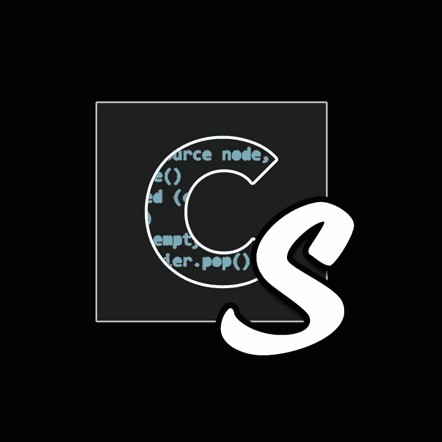
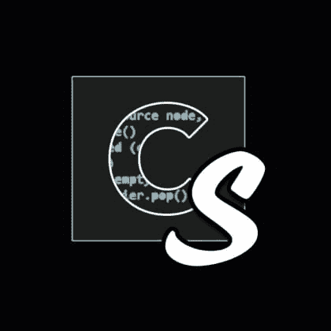

# 乔纳森·坎波斯接到阿尔托的电话

> 原文:[https://dev . to/codestory/Jonathan-Campos-on-get-the-call-from-alto-3k 32](https://dev.to/codestory/jonathan-campos-on-getting-the-call-from-alto-3k32)

[https://www.youtube.com/embed/IrM410Mm2DM](https://www.youtube.com/embed/IrM410Mm2DM)

获得硕士学位后，乔纳森·坎波斯发现自己与客户一起工作，倾听他们的痛点，并创建软件来满足这些需求。在作为首席架构师登陆 Bottle Rocket 之前，他在一些初创公司和代理公司工作，发展他们的网络和后端业务。不久之后，一位前老板找到了提升拼车体验的机会，重点是简单的计费、安全和对体验的控制。这个机会就是成为奥拓的 CTO。

在上面的剪辑中，Jonathan Campos 讨论了接到 Alto 的电话是什么感觉，以及他最初对此的反应。如果你喜欢你听到的，看看下面完整的一集。

 [# E7:乔纳森·坎波斯，中音](/codestorypodcast/e7-jonathan-campos-alto)  [## 代码故事](/codestorypodcast)   

<audio id="audio" data-episode="e7-jonathan-campos-alto" data-podcast="codestorypodcast"><source src="https://codestory.co/podcast-download/854/e7-jonathan-campos-alto.mp3" type="audio/mpeg"> Your browser does not support the audio element.</audio>

           <input type="range" name="points" id="volumeslider" value="50" min="0" max="100" data-show-value="true">      1x  initializing... ×