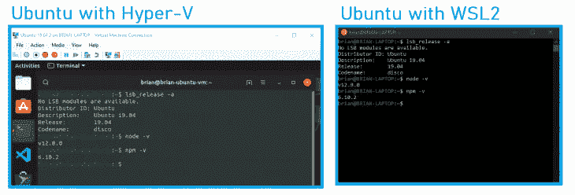
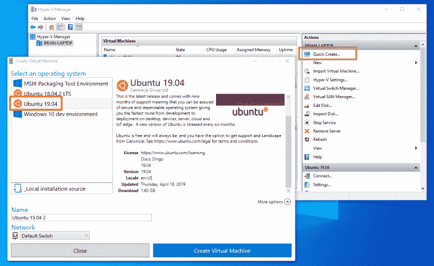
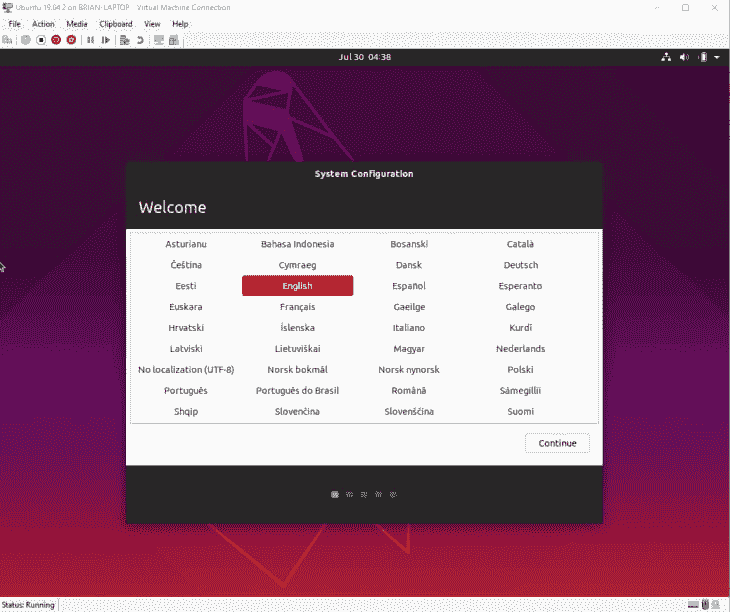
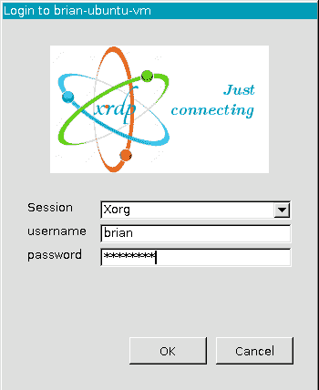
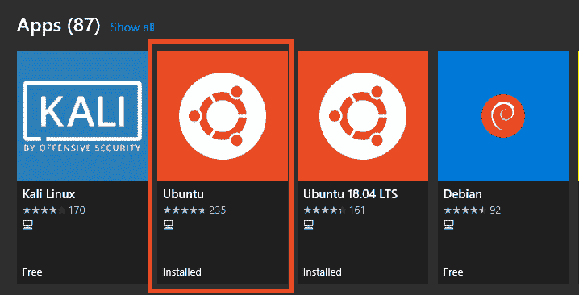

# 在 Hyper-V 和 WSL2 上使用 Node.js

> 原文:[https://dev . to/bnevilleoneill/working-with-node-js-on-hyper-v-and-wsl 2-3im 0](https://dev.to/bnevilleoneill/working-with-node-js-on-hyper-v-and-wsl2-3im0)

**作者:[布莱恩·德索萨](https://blog.logrocket.com/author/briandesousa/)T3】✏️**

Node.js 的一个主要优点是它提供了多平台支持。无论您运行的是 Mac、Linux 还是 Windows，体验都几乎是无缝的。

但是，每个平台之间可能会有细微的差异，尤其是在开发与底层操作系统密切交互的 Node.js 应用程序时。

那么，您如何确保您在 Windows 工作站上编码、运行和测试的内容在您的主机 Linux 服务器上以相同的方式运行呢？

在本文中，我们将为那些希望在 Linux 上运行和测试 Node.js 应用程序的 Windows 开发人员提供两种选择:Hyper-V 虚拟机和 Windows Subsystem for Linux 2 (WSL2)。

我们将通过 Node 12 在两个系统中运行来设置 Ubuntu 19 的实例，比较两者之间的差异，并最终确定哪个系统最适合处理每个场景。

[T2】](https://res.cloudinary.com/practicaldev/image/fetch/s--jvpxRxlo--/c_limit%2Cf_auto%2Cfl_progressive%2Cq_auto%2Cw_880/https://blog.logrocket.com/wp-content/uploads/2019/08/ubuntu-with-hyper-v-nocdn.png)

## [](#the-sample-app)示例 app

为了彻底测试开发人员的体验，我们将使用预构建的**图像压缩器**示例应用程序。

这是一个简单的 Node.js web 应用程序，它接受一个或多个图像文件上传，压缩图像，并允许用户下载压缩的图像。

[T2】](https://res.cloudinary.com/practicaldev/image/fetch/s--qpgcpJ4e--/c_limit%2Cf_auto%2Cfl_progressive%2Cq_auto%2Cw_880/https://i1.wp.com/blog.logrocket.com/wp-content/uploads/2019/08/Node.js-Image-Compressor.png%3Fresize%3D785%252C523%26ssl%3D1)

Image Compressor 与底层操作系统的文件系统交互，需要一些处理能力来执行图像压缩。

该应用程序还显示在服务器上压缩图像需要多长时间，这将允许我们在 Hyper-V 和 WSL2 之间进行基本的性能比较。

图像压缩程序可以从 GitHub 上的[briandesousa/Image-Compressor](https://github.com/briandesousa/image-compressor)库下载。只需简单的`npm install & npm start`就可以安装启动 app。一旦运行，您可以在 [http://localhost:3000](http://localhost:3000) 访问该应用程序。

*提示:最近构建的 WSL2 支持使用`localhost`来访问运行在 WSL2 中的服务器。我发现这种能力并不稳定。*

最初，示例应用程序可以在 [http://localhost:3000](http://localhost:3000) 访问，但是过了一小段时间后，我就再也无法连接到它了。

用`net stop LxssManager`和`net start LxssManager`重启 WSL2 子系统似乎暂时解决了这个问题。

[T2】](https://logrocket.com/signup/)

## Hyper-V 上的 Ubuntu

我们将从在 Windows Hyper-V 虚拟机上运行的 Ubuntu 19 上设置 Node 12 服务器开始。为此，您的系统需要满足一些要求:

*   您的系统必须运行 Windows 10 专业版或更高版本。家庭版不支持 Hyper-V
*   你的系统必须满足微软设定的硬件要求
*   您必须[在您的系统上启用 Hyper-V](https://docs.microsoft.com/en-us/virtualization/hyper-v-on-windows/quick-start/enable-hyper-v)

在我们开始之前，让我们花点时间了解一下微软在过去几年里是如何拥抱 Linux 的。我们将使用 Hyper-V 管理器中的**快速创建**功能，以最简单的方式建立一个 Ubuntu 19 虚拟机。

稍后你会看到在 WSL2 中运行 Ubuntu 系统是多么容易。很难相信现在在 Windows 中运行 Linux 是多么简单。

要开始，首先从“开始”菜单启动 Hyper-V 管理器。点击右上角的**快速创建**选项，然后选择 Ubuntu 19 操作系统选项。

[T2】](https://res.cloudinary.com/practicaldev/image/fetch/s--vGtrpBV6--/c_limit%2Cf_auto%2Cfl_progressive%2Cq_auto%2Cw_880/https://blog.logrocket.com/wp-content/uploads/2019/08/Ubuntu-19.04-nocdn.png)

Hyper-V 管理器将下载一个 Ubuntu 映像并设置虚拟机。该过程完成后，您将看到一个窗口，您可以使用该窗口编辑虚拟机的设置。

默认情况下，Hyper-V 在分配适当的 CPU、RAM、硬盘空间和其他硬件资源方面做得不错。但是，如果您对调整设置感兴趣，您可以在此时或以后这样做。

首先点击**连接**，然后**启动**启动虚拟机。新的 Ubuntu 系统将会打开一个虚拟机连接窗口。

Ubuntu 启动后，通过系统配置向导来设置系统参数，如语言、时区、机器名、用户名和密码。

[T2】](https://res.cloudinary.com/practicaldev/image/fetch/s--98dqGZPw--/c_limit%2Cf_auto%2Cfl_progressive%2Cq_auto%2Cw_880/https://blog.logrocket.com/wp-content/uploads/2019/08/ubuntu-system-configuration-nocdn.png)

系统配置完成后，Ubuntu 需要重启。重新启动后，Hyper-V 管理器将提示您重新连接到虚拟机。

这一次，系统会提示您输入在前面步骤中指定的用户名和密码。

[T2】](https://res.cloudinary.com/practicaldev/image/fetch/s--9lbcy5PL--/c_limit%2Cf_auto%2Cfl_progressive%2Cq_auto%2Cw_880/https://blog.logrocket.com/wp-content/uploads/2019/08/Ubuntu-virtual-machine-login-prompt-nocdn.png)

## [](#getting-the-sample-app-running)运行示例应用程序

从现在开始，我们将使用命令行来更新系统、安装必要的软件、下载和运行示例应用程序。从应用程序菜单启动命令窗口，并完成以下任务:

*   确保安装了所有 Ubuntu 系统更新:

```
sudo apt update
sudo apt upgrade 
```

<svg width="20px" height="20px" viewBox="0 0 24 24" class="highlight-action crayons-icon highlight-action--fullscreen-on"><title>Enter fullscreen mode</title></svg> <svg width="20px" height="20px" viewBox="0 0 24 24" class="highlight-action crayons-icon highlight-action--fullscreen-off"><title>Exit fullscreen mode</title></svg>

*   使用 snap 安装 Node.js 12 的最新稳定版本:

`sudo snap install node --channel=12/stable --classic`

*提示:如果 snap 安装因“操作太早，设备尚未播种或设备型号未确认”而失败，请尝试使用*T0 重新安装 snap。

```
git clone https://github.com/briandesousa/image-compressor.git ~/image-compressor
cd ~/image-compressor npm install 
```

<svg width="20px" height="20px" viewBox="0 0 24 24" class="highlight-action crayons-icon highlight-action--fullscreen-on"><title>Enter fullscreen mode</title></svg> <svg width="20px" height="20px" viewBox="0 0 24 24" class="highlight-action crayons-icon highlight-action--fullscreen-off"><title>Exit fullscreen mode</title></svg>

*   在启动应用程序之前，记下虚拟机的 IP 地址。您将需要它来直接从 Windows 中访问 web 应用程序。使用`ip addr | grep eth0`快速定位 IP 地址。
*   用`npm run debug`在调试模式下启动 app。您将在控制台中看到一条消息，指示应用程序正在侦听端口 3000。

此时，您可以切换回 Windows，启动您最喜欢的浏览器，并使用虚拟机的 IP 地址访问`http://<ip>:3000`。你能看到图像压缩程序吗？

启动并运行 Hyper-V 虚拟机非常快速和简单。这个过程中最耗时的部分是等待 Hyper-V 管理器下载并安装 Ubuntu 操作系统。

根据你的互联网连接速度和硬件，你可能会发现 WLS2 上的 Ubuntu 安装速度要快得多。

## [](#ubuntu-on-windows-subsystem-for-linux-2)Ubuntu on Windows 子系统 for Linux 2

WSL2 被认为是针对 Linux 的原始 Windows 子系统的全面改进。目前，WSL2 只对从 [build 18917 开始的 Windows 内部人员开放。](https://www.bleepingcomputer.com/news/microsoft/windows-subsystem-for-linux-2-wsl-2-released-to-insiders/)

它现在使用完整的 Linux 内核，以及虚拟化技术。这意味着它与 Hyper-V 有相似的系统需求。

在使用 WSL2 之前，您需要启用一些可选的特性。以管理员身份打开 powershell 命令窗口，运行以下命令:

```
Enable-WindowsOptionalFeature -Online -FeatureName VirtualMachinePlatform
Enable-WindowsOptionalFeature -Online -FeatureName Microsoft-Windows-Subsystem-Linux 
```

<svg width="20px" height="20px" viewBox="0 0 24 24" class="highlight-action crayons-icon highlight-action--fullscreen-on"><title>Enter fullscreen mode</title></svg> <svg width="20px" height="20px" viewBox="0 0 24 24" class="highlight-action crayons-icon highlight-action--fullscreen-off"><title>Exit fullscreen mode</title></svg>

默认情况下，启用 WSL 的原始版本。我们希望将 WSL2 作为默认设置，这样我们安装的任何 Linux 发行版都可以在 WSL2 下运行。在同一个 powershell 命令窗口中，运行以下命令:

```
wsl --set-default-version 2 
```

<svg width="20px" height="20px" viewBox="0 0 24 24" class="highlight-action crayons-icon highlight-action--fullscreen-on"><title>Enter fullscreen mode</title></svg> <svg width="20px" height="20px" viewBox="0 0 24 24" class="highlight-action crayons-icon highlight-action--fullscreen-off"><title>Exit fullscreen mode</title></svg>

*提示:关于如何设置 WSL2 的深入指导可以在[这里](https://docs.microsoft.com/en-us/windows/wsl/wsl2-install)找到。*

现在 WSL2 已经设置好了，我们将从微软商店安装 Ubuntu 发行版。从“开始”菜单启动商店应用程序，然后在“Linux”上搜索

您将在搜索结果中找到一些 Linux 发行版。我们将要安装的这个简单地命名为 *Ubuntu* 。

[T2】](https://res.cloudinary.com/practicaldev/image/fetch/s--Wn-xO-cZ--/c_limit%2Cf_auto%2Cfl_progressive%2Cq_auto%2Cw_880/https://blog.logrocket.com/wp-content/uploads/2019/08/image_preview-nocdn.png)

从微软商店安装 Ubuntu 应用程序后，返回 powershell 窗口并运行此命令，以确认 Ubuntu 已安装并在 WSL2:
下运行

```
> wsl -l -v
      NAME            STATE           VERSION
      Ubuntu          Running         2 
```

<svg width="20px" height="20px" viewBox="0 0 24 24" class="highlight-action crayons-icon highlight-action--fullscreen-on"><title>Enter fullscreen mode</title></svg> <svg width="20px" height="20px" viewBox="0 0 24 24" class="highlight-action crayons-icon highlight-action--fullscreen-off"><title>Exit fullscreen mode</title></svg>

从开始菜单打开 Ubuntu 应用程序。一个连接到新的 Ubuntu WSL2 系统的 Ubuntu 命令窗口将会打开。在开始使用之前，系统会提示您创建用户名和密码。

## [](#upgrading-ubuntu-on-wsl2)在 WSL2 上升级 Ubuntu

你有没有注意到我们从微软商店安装的 Ubuntu 应用没有指定版本号？这是故意的。

Ubuntu 应用程序的通用版本将始终安装最新的 Ubuntu LTS 版本。用户仍然可以使用商店中其他版本的 Ubuntu 应用程序直接安装以前版本的 Ubuntu，这些应用程序的名称中包含明确的 Ubuntu 版本号。

但是等等——我们有一个小问题。我们的 Hyper-V 虚拟机运行的是最新最棒的 Ubuntu 19“Disco Dingo”，但 WSL2 Ubuntu 应用安装的是 Ubuntu 18“仿生海狸”。

您可以通过在 Ubuntu 命令窗口中运行`lsb_release -a`并观察输出:
来确认这一点

```
No LSB modules are available.
Distributor ID: Ubuntu
Description:    Ubuntu 18.04.3 LTS
Release:        18.04
Codename:       bionic 
```

<svg width="20px" height="20px" viewBox="0 0 24 24" class="highlight-action crayons-icon highlight-action--fullscreen-on"><title>Enter fullscreen mode</title></svg> <svg width="20px" height="20px" viewBox="0 0 24 24" class="highlight-action crayons-icon highlight-action--fullscreen-off"><title>Exit fullscreen mode</title></svg>

我们想把苹果比作苹果，所以我们应该升级到 Ubuntu 19 来匹配我们的 Hyper-V 虚拟机。幸运的是，升级过程相当简单。

首先，我们需要将`/etc/update-manager/release-upgrades`中的`Prompt`设置从`lts`改为`normal`。您可以使用自己选择的命令行编辑器编辑该文件。我更喜欢用`nano` :

```
sudo nano /etc/update-manager/release-upgrades 
```

<svg width="20px" height="20px" viewBox="0 0 24 24" class="highlight-action crayons-icon highlight-action--fullscreen-on"><title>Enter fullscreen mode</title></svg> <svg width="20px" height="20px" viewBox="0 0 24 24" class="highlight-action crayons-icon highlight-action--fullscreen-off"><title>Exit fullscreen mode</title></svg>

接下来，运行这个命令升级到 Ubuntu 的最新普通版本:

```
sudo do-release-upgrade 
```

<svg width="20px" height="20px" viewBox="0 0 24 24" class="highlight-action crayons-icon highlight-action--fullscreen-on"><title>Enter fullscreen mode</title></svg> <svg width="20px" height="20px" viewBox="0 0 24 24" class="highlight-action crayons-icon highlight-action--fullscreen-off"><title>Exit fullscreen mode</title></svg>

升级需要一些时间才能完成。在升级过程中，可能会提示您解决以前修改过的文件的冲突。

您需要决定是否接受即将到来的更改。根据我的经验，用引入的更改替换修改过的文件是安全的。

一旦升级完成，你可以使用`lsb_release -a`来检查 Ubuntu 版本，以确认你现在运行的是 Ubuntu 19。

## [](#getting-the-sample-app-running)运行示例应用程序

从现在开始，您会注意到设置说明与我们在 Hyper-V 虚拟机上设置示例应用的方式非常相似，但有一些注意事项。

在 Ubuntu 命令窗口中，完成以下步骤:

*   确保安装了所有的 Ubuntu 系统更新。

```
sudo apt update
sudo apt upgrade 
```

<svg width="20px" height="20px" viewBox="0 0 24 24" class="highlight-action crayons-icon highlight-action--fullscreen-on"><title>Enter fullscreen mode</title></svg> <svg width="20px" height="20px" viewBox="0 0 24 24" class="highlight-action crayons-icon highlight-action--fullscreen-off"><title>Exit fullscreen mode</title></svg>

*   使用`apt`工具安装 Node.js。在我们的 Hyper-V 虚拟机上，我们使用了`snap`。然而，`snap`在 WSL2 中默认不工作。

也许有可能让[让`snap`在 WSL2 上工作](https://discourse.ubuntu.com/t/using-snapd-in-wsl2/12113)，但是这超出了本文的范围。

```
sudo apt install nodejs 
```

<svg width="20px" height="20px" viewBox="0 0 24 24" class="highlight-action crayons-icon highlight-action--fullscreen-on"><title>Enter fullscreen mode</title></svg> <svg width="20px" height="20px" viewBox="0 0 24 24" class="highlight-action crayons-icon highlight-action--fullscreen-off"><title>Exit fullscreen mode</title></svg>

*   如果用`node -v`检查 Node.js 的安装版本，会注意到安装了一个较老的版本，比如 v8.10.0。默认情况下，Ubuntu 软件包仓库包含一个相当旧的 Node.js 版本，但是我们可以从不同的软件包仓库安装一个较新的版本。

最简单的方法是下载并运行 NodeSource.com 提供的一个方便的脚本，然后重新安装 Node.js。为了下载脚本，我们需要先安装`curl`。

```
sudo apt install curl
curl -sL https://deb.nodesource.com/setup_12.x | sudo -E bash -
sudo apt install nodejs 
```

<svg width="20px" height="20px" viewBox="0 0 24 24" class="highlight-action crayons-icon highlight-action--fullscreen-on"><title>Enter fullscreen mode</title></svg> <svg width="20px" height="20px" viewBox="0 0 24 24" class="highlight-action crayons-icon highlight-action--fullscreen-off"><title>Exit fullscreen mode</title></svg>

*   确认 Node.js 12 安装了`node -v`
*   下载、安装并运行图像压缩器示例应用程序:

```
git clone https://github.com/briandesousa/image-compressor.git ~/image-compressor
cd ~/image-compressor npm install 
```

<svg width="20px" height="20px" viewBox="0 0 24 24" class="highlight-action crayons-icon highlight-action--fullscreen-on"><title>Enter fullscreen mode</title></svg> <svg width="20px" height="20px" viewBox="0 0 24 24" class="highlight-action crayons-icon highlight-action--fullscreen-off"><title>Exit fullscreen mode</title></svg>

*   记下您的 Ubuntu 系统的 IP 地址，以便您可以从主机浏览器访问示例应用程序。使用`ip addr | grep eth0`快速定位 IP 地址。
*   用`npm run debug`在调试模式下启动 app。您将在控制台中看到一条消息，指示应用程序正在侦听端口 3000。

此时你可以切换回 Windows，启动你最喜欢的浏览器，用 Ubuntu 系统 IP 地址访问`http:/<ip>/:3000`。你能再次看见图像压缩器应用程序吗？

## [](#comparing-hyperv-to-wsl2)比较 Hyper-V 和 WSL2

在 Hyper-V 虚拟机中运行 Ubuntu Linux 与在 WSL2 中运行操作系统的最大区别在于能够在 Hyper-V 中访问 Ubuntu 用户界面。

用户界面允许您安装和使用不仅仅是命令行工具。

根据您系统的硬件性能，您可能会发现 WSL2 是更快的选择。为了加快在 Hyper-V 上运行 Ubuntu Linux 的过程，您可以设置对虚拟机的 SSH 访问。

这加快了命令行访问的速度。然而，WSL2 可能仍然占上风，因为它不需要 SSH 来实现访问。

## [](#a-continuous-deployment-setup)连续部署设置

如果您打算在 Windows 中开发并在 Linux 中运行您的应用程序，您可能希望设置一个连续部署模式，在该模式中，您将代码从 Windows 推送到远程 Git repo，并自动在您的 Linux 系统上提取和部署这些更改。

这种模式可以用 WSL2 实现，但是 Hyper-V 虚拟机更适合，原因如下:

*   虚拟机可以在没有活动连接的情况下在后台运行。只要虚拟机启动，进程就可以保持运行，而 WSL2 要求命令窗口保持打开以保持进程运行。
*   虚拟机状态在主机系统重新启动后保持不变。您的流程可以继续运行，您可以从中断的地方继续开发，而不必重新启动 WSL2 命令窗口和重新启动您的流程。

## [](#summary-of-differences)差异汇总

让我们从 Node.js 开发者的角度总结一下 Hyper-V 虚拟机和 WSL2 的区别:

| **比较点** | **Hyper-V 上的 Linux** | **wsl 2 上的 Linux** |
| --- | --- | --- |
| 有一个图形用户界面 | 是 | 不 |
| 有命令行界面 | 是的，在 GUI 中或通过 SSH 启动命令窗口 | 是 |
| 最新版本的 Ubuntu 开箱即用 | 是的，Hyper-V 管理器快速创建有最新的 Ubuntu 版本 | 不，Ubuntu 应用程序安装最新的 LTS 版本，但可以升级 |
| 安装开发人员软件的方法 | `apt`、`snap`，快照存储(GUI) | `apt` |
| 易于安装最新版本的 Node.js | 简单，使用`snap` | 不那么容易，需要从备用软件包库中安装`apt` |
| Node.js 服务器可以从主机操作系统访问 | 是，通过动态 IP 地址 | 是，通过动态 IP 地址或`localhost` |
| 可以在后台运行 Node.js 服务器 | 是的，虚拟机继续在后台运行，甚至在主机系统重启后也是如此 | 可以，但是你需要打开 Ubuntu WSL2 命令窗口 |

## [](#comparing-performance)比较性能

WSL2 中最受推崇的改进之一是性能——特别是文件系统性能。

那么，与 Hyper-V 虚拟机相比，WSL2 中的文件系统性能如何呢？

嗯，我们可以使用我们的图像压缩器示例应用程序得到一个大致的概念，它执行一些内存中的压缩操作，然后将压缩的图像写入磁盘。

为了比较两个系统之间的性能，我在每个系统上将 50MB 的图像文件上传到 Image Compressor，并观察应用程序用多长时间来响应图像的压缩版本。

以下是每个系统的平均时间:

Hyper-V 平均时间:62 秒

WSL2 平均时间:59 秒

在这个基本的性能测试中，WSL2 始终以大约 5%的速度领先。

## [](#what-should-i-use)该用什么？

您对在一个或多个 Linux 环境中运行和测试您的应用更感兴趣吗？ WSL2 可能是最好的选择，因为您可以安装一些不同的发行版。WSL2 实例是相当轻量级的，这意味着如果需要，您甚至可以同时运行几个实例。

**您是否希望直接在 Linux 操作系统中开发、测试和运行您的应用？** Hyper-V 可能是一个不错的选择，因为您可以使用 GUI shell 运行完整的 Linux 操作系统，安装所有开发工具(GUI 或 CLI ),并根据需要向虚拟机分配任意多或少的系统资源。

你需要在不受 WSL2 支持的 Linux 发行版上运行和测试你的应用吗？

WSL2 目前支持 Ubuntu、SUSE Linux Enterprise Server、Debian、Kali。如果你想运行一个不同的发行版，你可能会想要使用 Hyper-V，它支持[更广泛的 Linux 发行版](https://docs.microsoft.com/en-us/windows-server/virtualization/hyper-v/supported-linux-and-freebsd-virtual-machines-for-hyper-v-on-windows)。

Hyper-V 虚拟机和 Linux 的 Windows 子系统对于开发人员来说都是非常强大的工具。虽然 Hyper-V 虚拟机总会有一席之地，但 Windows 子系统 for Linux 的发展速度尤其令人感兴趣。

使用 Windows 和 Linux 系统的 Node.js 开发人员应该关注 WSL 并注意它的潜力。

* * *

**编者按:**看到这个帖子有问题？你可以在这里找到正确的版本。

## [](#plug-logrocket-a-dvr-for-web-apps)Plug: [LogRocket](https://logrocket.com/signup/) ，一款适用于网络应用的 DVR

[](https://res.cloudinary.com/practicaldev/image/fetch/s--6FG5kvEL--/c_limit%2Cf_auto%2Cfl_progressive%2Cq_auto%2Cw_880/https://i2.wp.com/blog.logrocket.com/wp-content/uploads/2017/03/1d0cd-1s_rmyo6nbrasp-xtvbaxfg.png%3Fresize%3D1200%252C677%26ssl%3D1)

[log rocket](https://logrocket.com/signup/)是一个前端日志工具，让你重放问题，就像它们发生在你自己的浏览器中一样。LogRocket 不需要猜测错误发生的原因，也不需要向用户询问截图和日志转储，而是让您重放会话以快速了解哪里出错了。它可以与任何应用程序完美配合，不管是什么框架，并且有插件可以记录来自 Redux、Vuex 和@ngrx/store 的额外上下文。

除了记录 Redux 动作和状态，LogRocket 还记录控制台日志、JavaScript 错误、stacktraces、带有头+体的网络请求/响应、浏览器元数据、自定义日志。它还使用 DOM 来记录页面上的 HTML 和 CSS，甚至为最复杂的单页面应用程序重新创建像素级完美视频。

[免费试用](https://logrocket.com/signup/)。

* * *

在 Hyper-V 和 WSL2 上使用 Node.js 的帖子[首先出现在](https://blog.logrocket.com/working-with-node-js-on-hyper-v-and-wsl2/) [LogRocket 博客](https://blog.logrocket.com)上。