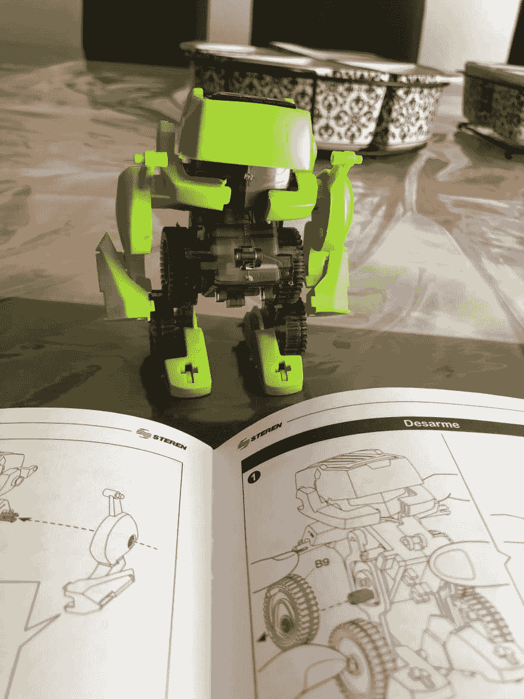

# 不要害怕新事物

> 原文：<https://dev.to/brendalimon/don-t-be-scared-of-new-things-f7a>

大家好！这一年我做了很多事情，有几件事我想和你分享！

嗯，我想让你知道的第一件事是，在我的上一份工作中，我学到了机器人学的基础知识以及如何使用 arduino。太棒了！我去了这个神奇的创客空间，在那里我可以尽情释放自己，享受做各种事情的乐趣。我甚至做了一只会摇头的驯鹿，作为圣诞礼物！

在我住在另一个城市的那段时间里，我学会了不害怕尝试新事物，即使我是一个代码新手。我能够建造:一只驯鹿并让它移动，使用专业的 3D 打印机，使用激光切割机，制作 arduino 电路并编写一些我无法理解但我正在做的事情！

所以，现在我回家了！如果你想知道，以后我会告诉你所有的故事。我正准备开始新的冒险，我认为这将是我一生中最令人兴奋的事情之一。在我的家乡，我没有所有的技术、工具和人来帮助我、教我和拯救我，但即使知道这一点，在这里 I GO！

在我男朋友的帮助下，我们做了一个小太阳能机器人，(这是一个盒子里的玩具机器人，非常便宜，也是一个完美的礼物)感觉棒极了！即使是非常简单的事情，我还是回到了创客空间，我意识到我可以从小事做起，用这几个月的知识继续努力。还有，我的机器人看起来超级可爱。

无论如何，永远不要停止学习，不要害怕学习新的东西，如果你想尝试，你可以做到！

拥抱和沙哑的爱🐶

