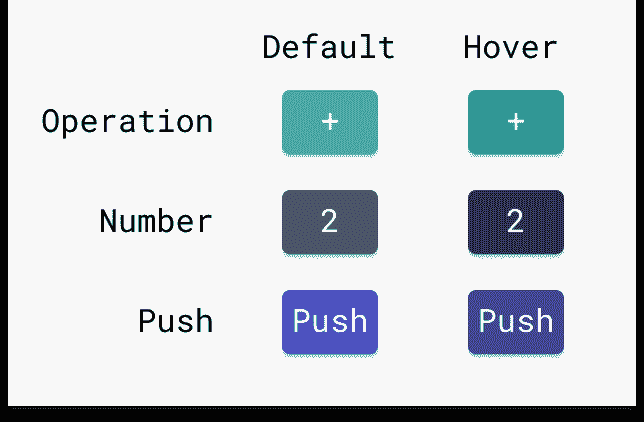
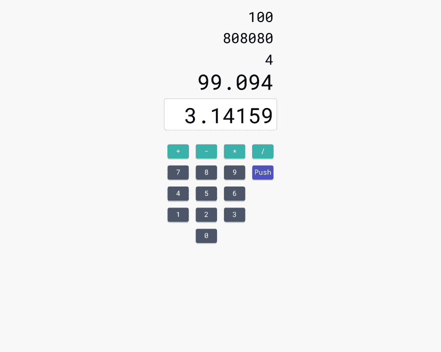
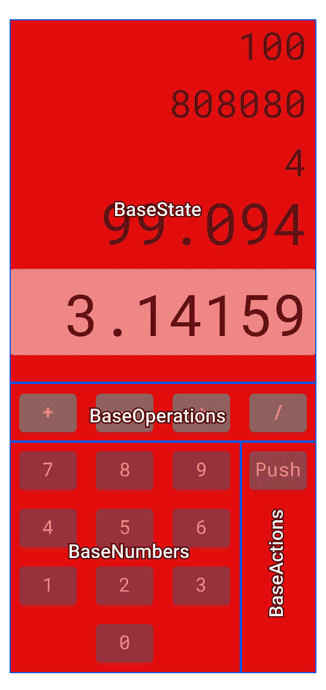
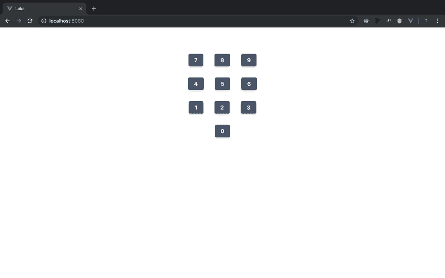
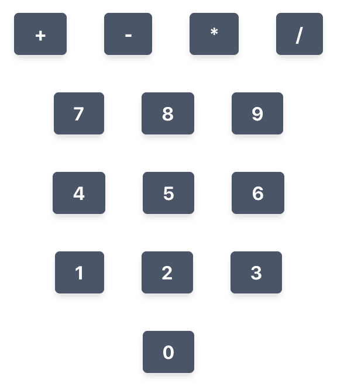
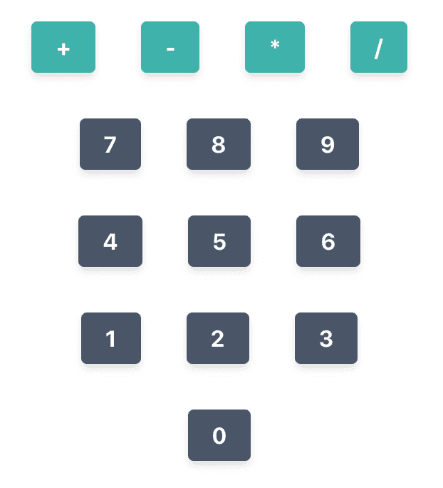
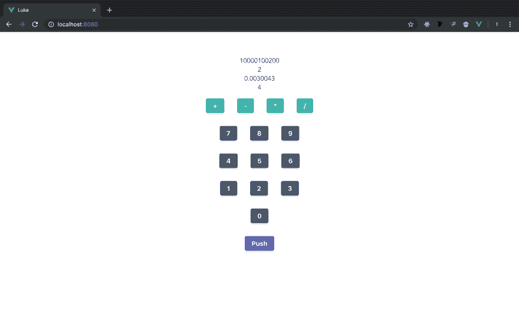

# 卢卡 03 -看。评估。

> 原文:[https://dev.to/teckert/luka-03-see-assess-4p7d](https://dev.to/teckert/luka-03-see-assess-4p7d)

> 本文是使用 Rust/Wasm、Vue 和 TypeScript 开发逆向波兰符号计算器网络应用程序系列的一部分。你可以在 [GitHub Repo](https://github.com/t-eckert/luka) 上阅读更多信息并关注发展。

## [](#button)按钮++

一个按钮是好的，但不是一个计算器。是时候为`ButtonPush`和`ButtonNumber`添加组件了。

在开始之前，我将把基本 HTML 中的页面标题改为 Luka。我也想做一个很酷的 favicon，但是那可以等到我把设计和配色方案确定下来之后。

我将三个按钮组件移动到一个名为`buttons`的目录中。

```
buttons
|- ButtonNumber.vue
|- ButtonOperation.vue
|- ButtonPush.vue 
```

<svg width="20px" height="20px" viewBox="0 0 24 24" class="highlight-action crayons-icon highlight-action--fullscreen-on"><title>Enter fullscreen mode</title></svg> <svg width="20px" height="20px" viewBox="0 0 24 24" class="highlight-action crayons-icon highlight-action--fullscreen-off"><title>Exit fullscreen mode</title></svg>

可能会有更多的人，我希望任何人来参加这个项目，能够找到他们需要改变的代码的任何部分。按钮组件都是相似的，当我赋予它们行为时会改变。我对布局做了一些修改，并添加了从 [TailwindCSS](https://tailwindcss.com/) 中偷来的颜色:

[T2】](https://res.cloudinary.com/practicaldev/image/fetch/s--T07VKTlJ--/c_limit%2Cf_auto%2Cfl_progressive%2Cq_auto%2Cw_880/https://thepracticaldev.s3.amazonaws.com/i/tjtj0gj5pmdk7j6iic1j.png)

这里的颜色是:

|  | 默认 | 盘旋 |
| --- | --- | --- |
| 操作 | #38B2AC | #319795 |
| 数字 | #4A5568 | #2D3748 |
| 推 | #4C51BF | #434190 |

我将把 Number 的配色方案设置为默认，并添加样式以区分操作和按钮。

附加样式是在组件本身上设置的。这可以在这里的`ButtonPush`组件中看到:

```
<template>
  <button>Push</button>
</template>

<script lang="ts">
import { Component, Prop, Vue } from "vue-property-decorator";

@Component
export default class ButtonPush extends Vue {}
</script>

<style scoped>
:root {
  --button-default: #4c51bf;
  --button-hover: #434190;
}

button {
  background-color: var(--button-default);
}

button:hover {
  background-color: var(--button-hover);
}

button:active {
  background-color: var(--button-default);
}
</style> 
```

<svg width="20px" height="20px" viewBox="0 0 24 24" class="highlight-action crayons-icon highlight-action--fullscreen-on"><title>Enter fullscreen mode</title></svg> <svg width="20px" height="20px" viewBox="0 0 24 24" class="highlight-action crayons-icon highlight-action--fullscreen-off"><title>Exit fullscreen mode</title></svg>

`ButtonOperation`组件类似。

## [](#separation-of-concerns)分离顾虑

我对 Luka 02 的设计进行了迭代，添加了颜色并稍微调整了一下布局。这个新设计可以分成几个部分。首先，我们看到没有突出分隔的设计意图:

[T2】](https://res.cloudinary.com/practicaldev/image/fetch/s--aXSt8H4E--/c_limit%2Cf_auto%2Cfl_progressive%2Cq_auto%2Cw_880/https://thepracticaldev.s3.amazonaws.com/i/kpi04lnqk0phhxc2wyxz.png)

此处可以看到组件分离:

[T2】](https://res.cloudinary.com/practicaldev/image/fetch/s--LmVegewe--/c_limit%2Cf_auto%2Cfl_progressive%2Cq_auto%2Cw_880/https://thepracticaldev.s3.amazonaws.com/i/7ebh2wjh4mikiekop6nn.png)

下一步是构建这些`Base`组件，并用按钮填充它们。

现在组件结构是

```
|-App.vue                   implements Calculator
|-components/
| |-Calculator.vue          implements BaseActions, BaseNumbers, BaseOperations, BaseState
| |-bases/
| | |-BaseActions.vue       implements ButtonPush
| | |-BaseNumbers.vue       implements ButtonNumber
| | |-BaseOperations.vue    implements ButtonOperation
| | |-BaseState.vue
| |-buttons/
| | |-ButtonNumber.vue
| | |-ButtonOperation.vue
| | |-ButtonPush.vue 
```

<svg width="20px" height="20px" viewBox="0 0 24 24" class="highlight-action crayons-icon highlight-action--fullscreen-on"><title>Enter fullscreen mode</title></svg> <svg width="20px" height="20px" viewBox="0 0 24 24" class="highlight-action crayons-icon highlight-action--fullscreen-off"><title>Exit fullscreen mode</title></svg>

我将从具有 3x4 网格的`BaseNumbers`开始。

好吧，不错的开始:

[T2】](https://res.cloudinary.com/practicaldev/image/fetch/s--zUV7ccyp--/c_limit%2Cf_auto%2Cfl_progressive%2Cq_auto%2Cw_880/https://thepracticaldev.s3.amazonaws.com/i/ozogplpwnnzq5c892jqv.png)

肯定有一种更巧妙的方法来迭代这些数字，将它们全部绘制到屏幕上，但我现在使用的方法是可行的。

## [](#a-colorful-css-mistake)一个五彩缤纷的 CSS 错误

这里有一些值得研究的东西。我将`ButtonOperation`组件添加到`BaseOperations`组件中，并将该组件添加到`Calculator`中。它绘制了应用程序中的按钮，但它们仍然有基本的按钮颜色！

[T2】](https://res.cloudinary.com/practicaldev/image/fetch/s--rvWAOOX1--/c_limit%2Cf_auto%2Cfl_progressive%2Cq_auto%2Cw_880/https://thepracticaldev.s3.amazonaws.com/i/mccdiz1phtciybryl673.png)

这种调查一直在编写软件中出现。让我们开始吃吧。

问题可能会出现，因为我在组件的`root:`中定义了新的颜色。找到问题根源的一个好方法是缩短系统中两点之间的路径。这里，我将直接设置颜色，而不是将颜色定义为一个变量，然后从该变量中设置它。

修复了它:

[T2】](https://res.cloudinary.com/practicaldev/image/fetch/s--0Uqt0YeI--/c_limit%2Cf_auto%2Cfl_progressive%2Cq_auto%2Cw_880/https://thepracticaldev.s3.amazonaws.com/i/kb0hhgvucv30ps6kci7p.png)

这个 CSS 没有工作:

```
:root {
  --button-default: #38b2ac;
  --button-hover: #319795;
}

button {
  background-color: var(--button-default);
}

button:hover {
  background-color: var(--button-hover);
}

button:active {
  background-color: var(--button-default);
} 
```

<svg width="20px" height="20px" viewBox="0 0 24 24" class="highlight-action crayons-icon highlight-action--fullscreen-on"><title>Enter fullscreen mode</title></svg> <svg width="20px" height="20px" viewBox="0 0 24 24" class="highlight-action crayons-icon highlight-action--fullscreen-off"><title>Exit fullscreen mode</title></svg>

这个 CSS 确实起作用了:

```
button {
  background-color: #38b2ac;
}

button:hover {
  background-color: #319795;
}

button:active {
  background-color: #38b2ac;
} 
```

<svg width="20px" height="20px" viewBox="0 0 24 24" class="highlight-action crayons-icon highlight-action--fullscreen-on"><title>Enter fullscreen mode</title></svg> <svg width="20px" height="20px" viewBox="0 0 24 24" class="highlight-action crayons-icon highlight-action--fullscreen-off"><title>Exit fullscreen mode</title></svg>

问题是我在 CSS Vue 样式组件中设置了`root:`。我以后可能会对它做更多的研究，但是从对限定作用域的含义的理解来看，我不能把`root:`放在限定作用域的东西中是有道理的，它永远不会到达 CSS 层次结构的“顶端”。也许这不是正确的说法。希望我的观点能被理解。

我有两种方法可以使用变量类型的语法来实现。一种是在作用域 CSS 组件中使用 SCSS，并将变量设置为 SCSS 变量。另一种是在`main.css`中设置一个`root:`中的所有颜色变量。

我喜欢后一种选择，因为它给未来的维护者一个文件来改变 UI 中每个按钮的颜色。

`main.css`现在包含了每个按钮颜色的定义。当我添加更多的按钮/功能时，我也会把颜色放在这里:

```
:root {
    --button-default: #4A5568;
    --button-default-hover: #2D3748;
    --button-operation: #38b2ac;
    --button-operation-hover: #319795;
    --button-push: #4c51bf;
    --button-push-hover: #434190;
    --shadow: 0 4px 6px -1px rgba(0, 0, 0, .1), 0 2px 4px -1px rgba(0, 0, 0, .06);
}

button {
    text-align: center;
    font-weight: 700;
    border-color: transparent;
    border-radius: 0.25rem;
    flex-shrink: 0;
    justify-content: center;
    cursor: pointer;
    color: #fff;
    background-color: var(--button-default);
    padding: 0.5rem 1rem;
    margin: 1rem;
    box-shadow: var(--shadow);
    transition: background-color 80ms linear;
}

button:hover {
    background-color: var(--button-default-hover);
}

button:active {
    background-color: var(--button-default);
} 
```

<svg width="20px" height="20px" viewBox="0 0 24 24" class="highlight-action crayons-icon highlight-action--fullscreen-on"><title>Enter fullscreen mode</title></svg> <svg width="20px" height="20px" viewBox="0 0 24 24" class="highlight-action crayons-icon highlight-action--fullscreen-off"><title>Exit fullscreen mode</title></svg>

然后组件从它们的样式中调用这些变量，例如，`ButtonOperation`样式是

```
button {
  background-color: var(--button-operation);
}

button:hover {
  background-color: var(--button-operation-hover);
}

button:active {
  background-color: var(--button-operation);
} 
```

<svg width="20px" height="20px" viewBox="0 0 24 24" class="highlight-action crayons-icon highlight-action--fullscreen-on"><title>Enter fullscreen mode</title></svg> <svg width="20px" height="20px" viewBox="0 0 24 24" class="highlight-action crayons-icon highlight-action--fullscreen-off"><title>Exit fullscreen mode</title></svg>

这很有效！(我几乎采取了另一个截图显示如下，但它只是看起来和上面一样——这正是我想要的——所以成功！)

## 最后一个按钮和一些假的状态

添加`BaseActions`和`ButtonPush`组件的过程大致相同。按钮还没有在网格上，我稍后会修复它。

组件`BaseState`不同于其他的`Base*`组件，因为我将向它传递数据。这可能是一个很好的时机来谈论我计划如何在`Calculator`组件中构建状态处理，以及我如何从整体上考虑组件交互。

每个`Button*`组件都会以某种方式影响状态。我将通过`Calculator`组件来路由所有的状态改变操作，而不是该组件直接改变状态或与 Wasm 通信来进行计算。这里有一个例子，我希望这是如何工作的:

1.  初始状态栈是`[2.0, 4.0]`。
2.  点击`+`按钮。
3.  `ButtonOperation`组件将“+”传递给`BaseOperations`。
4.  `BaseOperations`经过`operate("+")`到`Calculator`
5.  `Calculator`解析指令并将其传递给 Wasm `calculator`，Wasm`calculator`传回状态`[6.0]`。
6.  `Calculator`将状态传递给`BaseState`,由它正确处理呈现。

虽然国家不一定要这样处理。我认为最大限度地减少可以直接改变状态的组件数量会更安全(在这种情况下减少到 1 个)。当我谈到更安全时，我不是在说如果代码是一些静态的、不变的文档，那么代码必须如何设置。如果是这样的话，这两种方法都是“安全”的。但是代码改变了，它注定要改变。作为一名软件工程师，让这些改变变得更容易是你要学习的一部分。

我最近和一位学员谈到，作为一名软件工程师，成长更多的是智慧的增长，而不是知识的增长(当然，这两者是交织在一起的)。许多难懂的编程知识可以很容易地通过谷歌搜索到。现代编译器也会引导你走向正确的方向。作为一名工程师，知道使用什么模式和避免什么模式是成长的一部分。

也就是说，让我们将一些假状态传递给`BaseState`组件。在`Calculator`中设置一个名为`state`的数组将导致`BaseState`用该数组中的最后 4 个值进行更新。随着事情的进展，我给用户更多的控制权，我将需要考虑这种可变的状态。如果有人不断地将值压入堆栈，他们最终可能会填满在浏览器中呈现该选项卡的服务工作者的内存。

至少有了 Wasm 和 Vue，我就不用担心后端不安全了。如果我作为一个 web 服务器运行这段代码的 Rust 部分，保持状态，就有可能通过将未处理的值推送到后端而受到损害。如果我没有为这种可能性做计划，我可能会有麻烦——更容易受到 DDOS 攻击(你将永远容易受到 DDOS 攻击。这只是一个让攻击变得足够困难的问题。).

这是应用程序，因为它现在呈现。我要融合回主人。我还要删除我一直在做的`add-function-buttons`分支。我不再觉得这是对我正在做的事情的一个很好的描述，我需要为这个“特性”取一个新的名字。

[T2】](https://res.cloudinary.com/practicaldev/image/fetch/s--2qrepFeZ--/c_limit%2Cf_auto%2Cfl_progressive%2Cq_auto%2Cw_880/https://thepracticaldev.s3.amazonaws.com/i/z7svjd8ikkxvwlb54jc9.png)

## [](#wrap-up)总结起来

我不确定我下一步想做什么。我不得不考虑一下。要么我将连接 Wasm，这样我就可以从 Rust 获得状态，要么我将把按钮的功能传递到 Vue 组件的堆栈上。

开始提交:[7a 7251 ace 3 a5 ed 0 B4 c 67 f 024130 fdda 5 FB 5580 e 7](https://github.com/t-eckert/luka/tree/7a7251ace3a5ed0b4c67f024130fdda5fb5580e7)

结束提交:[049 a 205 F3 a9 E4 C6 cda6f 9171 a5b 071d 005 b 7152 c](https://github.com/t-eckert/luka/tree/049a205f3a9e4c6cda6f9171a5b071d005b7152c)