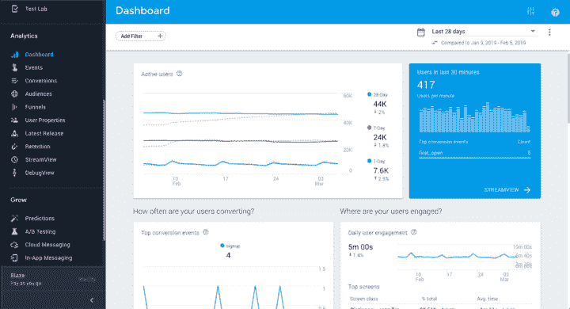
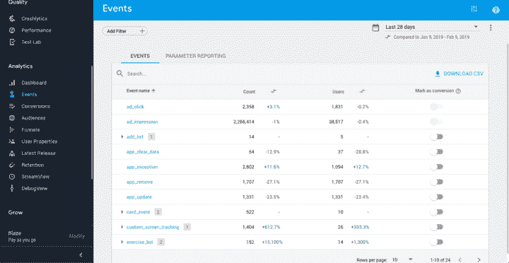
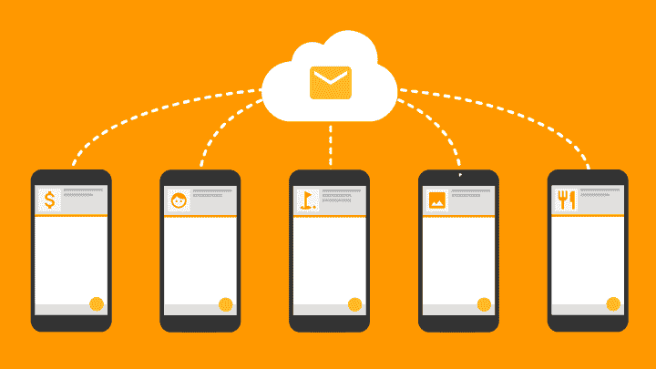
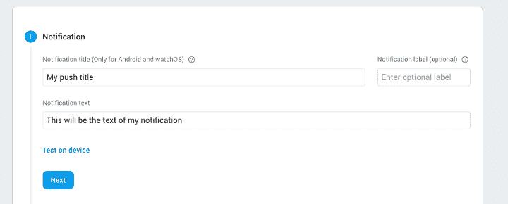
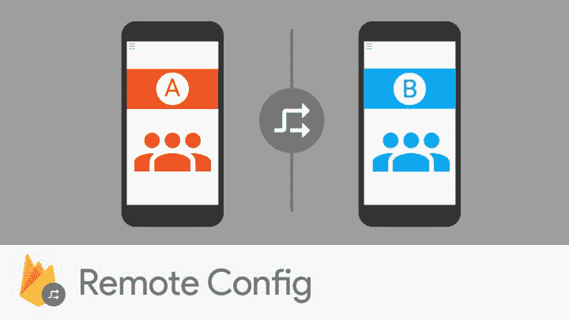
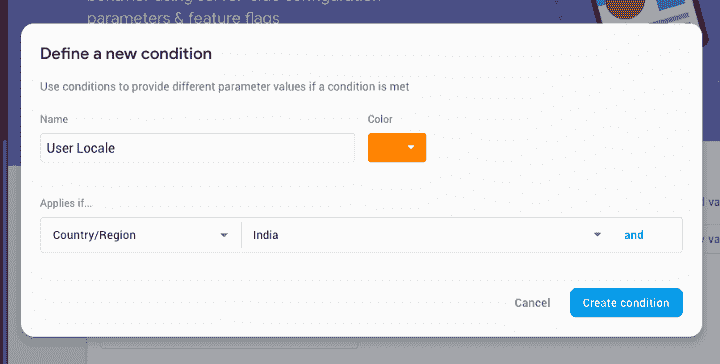
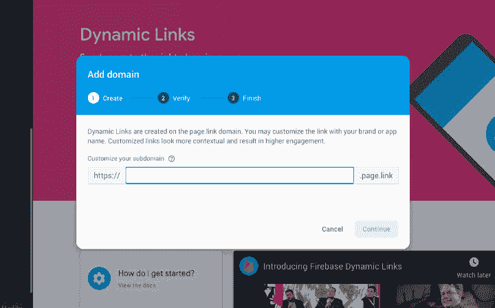
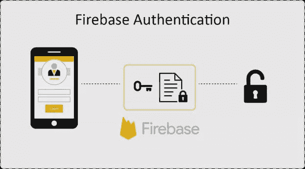
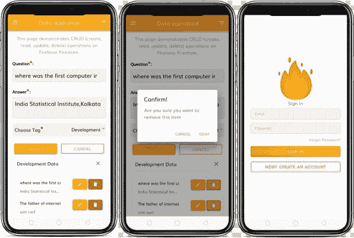

# 如何在你的 Ionic 4 应用程序中使用 Firebase 初学者指南

> 原文:[https://dev . to/enappd/how-to-use-fire base-in-your-ionic-4-app-guide-for-初学者-2h60](https://dev.to/enappd/how-to-use-firebase-in-your-ionic-4-app-guide-for-beginners-2h60)

* * *

> 你今天运气不错。看看下面的&帮助我们传播美好的事物！！
> [**Firebase 入门套件(Ionic 4)**](https://store.enappd.com/product/firebase-starter-kitionic4-firebase-starter/) **:** 帮助您开始使用 Ionic 4 和 Firebase 的绝佳入门工具。

现在让我们深入了解 Firebase 对您的 Ionic4 应用程序的最大好处。

**Firebase** 是由 Firebase Inc .于 2011 年开发的移动和 web 应用程序开发平台，随后于 2014 年被谷歌收购。Firebase 是一个“构建、改进和发展你的应用”的工具集。它为您提供了分析、数据库、消息传递和崩溃报告等功能，因此您可以快速移动并专注于您的用户。

今天，Firebase 是发展最快的应用程序开发平台之一。一些原因是

1.  不需要从头开始写后端。Firebase 是一个现成的后端，附带一个 DB。您只需将 Firebase SDK 集成到您的应用程序中，就万事大吉了。
2.  这是🕺.如果你是一名开发人员，你就会明白实时后端/数据库在当今应用市场中的重要性。如果你考虑到实时操作，像聊天、新闻、评级、预订等事情都非常容易
3.  简单的认证操作。面向用户的应用程序首先需要的是登录/注册操作。Firebase 可以非常流畅地处理这个问题，并且只需很少的编码工作。你可以整合一些社会认证服务，如脸书，谷歌等。还有 Firebase。
4.  您可以获得大量内置的附加功能，例如推送通知、分析等😍😍
5.  在一定的使用范围内，它是免费的。但这对于正在尝试、制作 MVP、甚至是小规模应用业务的开发者来说，是相当棒的。🤑

在本文中，我们将关注**你可以在 Ionic 4 应用程序中使用 Firebase 做什么。** Firebase 从 Ionic 1 开始就有了，之后一直在变。因此，这里有一些最新的插件和功能，您可以使用 Firebase 和 Ionic 4 来实现

### 1.分析火基


每个人都知道谷歌分析。Firebase 内置了分析功能。这是一个免费和无限的分析解决方案。分析有助于您了解用户的行为，因此您可以就如何营销您的应用程序做出明智的决策。此外，还可以通过有机渠道和付费渠道查看您的活动表现，以了解哪些方法最能有效地吸引高价值用户。

用安装插件

```
ionic cordova plugin add cordova-plugin-firebase-analytics
```

```
npm install @ionic-native/firebase-analytics
```

对于所有插件，在组件中导入插件的步骤将保持不变(只需更改插件名称)

```
import { FirebaseAnalytics } from '@ionic-native/firebase-analytics/ngx'; 
```

```
constructor(private firebaseAnalytics: FirebaseAnalytics) {  
... your code here
}
```

从设置开始，它将自动开始跟踪一组定义的事件，这意味着我们可以从第一步开始学习。如果这还不够，那么我们可以添加我们自己的**自定义事件**来跟踪

```
this.firebaseAnalytics.logEvent('my_event', {param1: "value1"})
  .then((res: any) => console.log(res))
  .catch((error: any) => console.error(error));
```



<figure>

<figcaption class="imageCaption">This is how Firebase automatically projects the analytics for your app</figcaption>

</figure>

下面列出了一些有用的 Firebase 函数，您可以用与上面类似的方式编写它们

1.  **设置用户 Id** — `this.firebaseAnalytics.setUserId("123123")`这有助于识别与用户相关的事件。
2.  **设置用户属性** — `this.firebaseAnalytics.setUserProperty("name","value")`这有助于创建过滤器，过滤用户在应用程序中对事件的特定操作或特定行为。当你想向选定的频道发送推送通知或应用内消息时，这些过滤器很方便。
3.  **设置当前屏幕** — `this.firebaseAnalytics.setUserId("123123")`这个选项可以方便地识别与屏幕相关的事件。比如——用户通常在哪个屏幕上退出 app 等等。

然后，所有这些事件都可以通过 Firebase 控制台中的 Firebase 仪表板查看，这是我们访问分析报告和其他 firebase 服务的中心点。



<figure>

<figcaption class="imageCaption">Firebase Dashboard for Events Analytics</figcaption>

</figure>

注意:这个插件依赖于[Cordova-support-google-services](https://github.com/chemerisuk/cordova-support-google-services)来正确设置 Google 服务。您可以仔细参考[自述文件](https://github.com/chemerisuk/cordova-support-google-services/blob/master/README.md)，以避免项目配置中的常见问题。此外，使用变量`FIREBASE_CORE_VERSION`覆盖 Android 上的依赖版本。

在 iOS 上，为了收集人口统计、年龄、性别等数据。你还应该在你的项目中加入`AdSupport.framework`。

### 2.Firebase 云消息传递(FCM)



想象一下一个 Whatsapp，你每次都必须打开应用程序来检查新消息，很可怕吧？推送通知是吸引应用用户的最佳方法之一。
Firebase 云消息传递(FCM)是一个跨平台的消息传递解决方案，让您能够可靠地免费传递消息。使用 FCM，您可以通知客户端应用程序有新的电子邮件或其他数据可供同步。如果你的应用要取得成功，那么你需要随着时间的推移保持用户的兴趣，通知是保持你的受众参与的重要方式。通过在**恰当的时刻**向用户提供及时、相关的通知，你可以重新捕捉他们徘徊的兴趣，并把他们拉回到你的应用中。

用安装插件

```
ionic cordova plugin add cordova-plugin-firebase-analytics
```

```
npm install @ionic-native/firebase-analytics
```

在根组件中导入插件。

```
import { FCM } from '@ionic-native/fcm/ngx';
```

```
constructor(private fcm: FCM) {}
```

使用以下功能充分利用推送通知

#### I .接收令牌刷新

```
this.fcm.onTokenRefresh().subscribe(token => {
  alert(token);
});
```

请注意，每次生成新令牌时(包括第一次)都会触发这个回调。

#### 二。获取令牌

```
this.fcm.getToken().then(token => {
  alert(token);
});
```

请记住，如果令牌尚未建立，此函数将返回 null。所以在插件正确初始化之前不要调用这个函数。

#### 三。订阅主题

```
this.fcm.subscribeToTopic('marketing');
```

主题是向一组特定用户提供过滤数据的特定渠道。例如，如果你是一个食品配送应用程序，你可能想只向那些在过去 7 天内没有订购任何东西的用户发送优惠券。
根据设备类型，所有设备分别自动订阅“全部”和“ios”或“android”主题。如果您正在创建一个自定义主题，您的主题名称必须匹配以下正则表达式:
**【a-zA-Z0–9-_】。~ %]{ 1900 } "**

#### 四。取消订阅主题

```
this.fcm.unsubscribeFromTopic('marketing');
```

当用户想要关闭应用程序中的推送通知时，该功能特别有用。

#### 动词 （verb 的缩写）接收推送通知数据

```
this.fcm.onNotification().subscribe(data => {
  if(data.wasTapped){
    console.log("Push received in background");
  } else {
    console.log("Push received in foreground");
  };
});
```

这里需要理解的重要一点是有效载荷的类型。有两种类型— **数据和**通知。Firebase 管理面板允许您非常容易地发送有效载荷，并提供各种选项来过滤



<figure>

<figcaption class="imageCaption">Prepare a Push notification right from Firebase console</figcaption>

</figure>

您也可以使用 FCM 从您的服务器发送有效负载。有效负载的语法将是

```
{
  "notification":{
    "title":"Notification title",
    "body":"Notification body",
    "sound":"default",
    "click_action":"FCM_PLUGIN_ACTIVITY",
    "icon":"fcm_push_icon"
  },
  "data":{
    "param1":"value1",
    "param2":"value2"
  },
    "to":"/topics/topicExample",
    "priority":"high",
    "restricted_package_name":""
}
```

通过您的服务器发送通知的完整文档可以在[这里](https://firebase.google.com/docs/cloud-messaging/http-server-ref)找到

### 3.Firebase(远程)配置



Firebase Remote Config 是一项云服务，允许您更改应用程序的行为和外观，而无需用户下载应用程序更新。使用远程配置时，您可以创建应用内默认值来控制应用的行为和外观。然后，您可以稍后使用 Firebase 控制台或远程 Config REST API 来覆盖所有应用程序用户或部分用户群的应用程序内默认值。例如，**您可以更改应用的布局或颜色主题，以支持季节性促销，而无需发布应用更新。**

用安装插件

```
ionic cordova plugin add cordova-plugin-firebase-config
```

```
npm install @ionic-native/firebase-config
```

在组件中导入插件。

```
import { FirebaseConfig } from '@ionic-native/firebase-config/ngx';
```

```
constructor(private firebaseConfig: FirebaseConfig) { }
```

然后，您可以获得服务器端参数，这些参数可以告诉您的应用程序如何具体操作。此外，Firebase 控制台允许您在一个简单的 GUI 中添加参数。

```
this.firebaseConfig.getBoolean('is_my_holiday_promotion_on')
  .then((res: any) => console.log(res))
  .catch((error: any) => console.error(error));
```


<figure>

<figcaption class="imageCaption">Define Remote config parameters in Firebase console</figcaption>

</figure>

远程配置的一个隐藏的但很棒的特性是接收定制参数的用户的分段。例如，您希望仅向来自印度的用户发送特定的促销代码。然后，您可以在 Firebase 控制台中将 holiday_promo_code 参数的条件设置为`user country` : `India`



<figure>

<figcaption class="imageCaption">Setting custom conditions for Firebase Remote Config</figcaption>

</figure>

### 4.Firebase 动态链接


动态链接是智能网址，允许您将现有和潜在用户发送到 iOS 或 Android 应用程序中的任何位置。动态链接解决了在 **Deeplinks** 中面临的问题，在那里事情没有那么简单。如果用户没有安装你的应用程序，那么 deeplink 就不会工作。或者，如果用户从 deeplink 安装您的应用程序，与 deeplink 本身相关的信息(例如优惠券代码)会在安装过程中丢失。

动态链接在应用程序安装过程中仍然有效，因此即使是新用户，在第一次打开应用程序时也能看到他们正在寻找的内容。如果用户在桌面浏览器中打开相同的动态链接，他们将被带到你的网站上相同的内容。



<figure>

<figcaption class="imageCaption">Add Dynamic Links from Firebase Console</figcaption>

</figure>

有了动态链接，你的用户可以在他们打开链接的平台上获得最好的体验。动态链接的主要优势:

*   将移动网络用户转化为原生应用用户。将用户发送到 app store 或向他们显示广告
*   提高用户到用户分享的转化率。例如应用邀请、优惠券等。
*   通过社交、电子邮件和短信营销活动推动更多安装。
*   把桌面用户变成手机 app 用户。将用户发送到 app store
*   用户特定的转化——如果用户从提到`Chinese`美食的广告中安装了你的美食应用，那么在安装后，你可以将用户直接带到一个中国餐馆页面。很酷，对吧？

用安装插件

```
ionic cordova plugin add cordova-plugin-firebase-dynamiclinks
```

```
npm install @ionic-native/firebase-dynamic-links
```

在组件中导入插件。

```
import { FirebaseDynamicLinks } from '@ionic-native/firebase-dynamic-links/ngx'; 
```

```
constructor(private firebaseDynamicLinks: FirebaseDynamicLinks) { }
```

打开带有动态链接的应用程序后，在这里处理逻辑

```
this.firebaseDynamicLinks.onDynamicLink()
  .subscribe((res: any) => console.log(res), (error:any) => console.log(error));
```

使用变量`APP_DOMAIN`来指定 web URL，您的应用程序将在此启动一个活动来处理链接。

使用变量`PAGE_LINK_DOMAIN`来指定您的`*.page.link`域。

使用变量`FIREBASE_DYNAMIC_LINKS_VERSION`覆盖 Android 上的依赖版本。

### 5.Firebase 认证

使用我们的 [**Firebase 入门套件**](https://store.enappd.com/product/firebase-starter-kitionic4-firebase-starter/) 开始使用 Firebase 认证。



大多数应用程序需要知道用户的身份。了解用户的身份允许应用程序安全地将用户数据保存在云中，并在用户的所有设备上提供相同的个性化体验。Firebase Authentication 提供后端服务、易于使用的 SDK 和现成的 UI 库，用于向您的应用程序验证用户。它支持使用密码、电话号码、流行的联合身份提供商(如谷歌、脸书和 Twitter)等进行身份认证。


<figure>

<figcaption class="imageCaption">Firebase provides various methods to authenticate users</figcaption>

</figure>

用安装插件

```
ionic cordova plugin add cordova-plugin-firebase-authentication
```

```
npm install @ionic-native/firebase-authentication
```

在组件中导入插件。

```
import { FirebaseAuthentication } from '@ionic-native/firebase-authentication/ngx';
```

```
constructor(private firebaseAuthentication: FirebaseAuthentication) { }
```

您可以使用以下功能在身份验证模块中执行各种任务。

#### I .用电子邮件和密码注册用户

```
this.firebaseAuthentication.createUserWithEmailAndPassword('[test@gmail.com](mailto:test@gmail.com)', '123')
  .then((res: any) => console.log(res))
  .catch((error: any) => console.error(error));
```

#### 二。发送电子邮件验证

为当前用户启动电子邮件验证。

```
this.firebaseAuthentication.sendEmailVerification()
  .then((res: any) => console.log(res))
  .catch((error: any) => console.error(error));
```

#### 三。发送密码重置电子邮件

触发 Firebase 身份验证后端向给定的电子邮件地址发送密码重置电子邮件，该电子邮件地址必须对应于您的应用程序的现有用户。

```
this.firebaseAuthentication.sendPasswordResetEmail()
  .then((res: any) => console.log(res))
  .catch((error: any) => console.error(error));
```

#### 四。使用电子邮件和密码登录

使用电子邮件和密码异步登录。

```
this.firebaseAuthentication.signInWithEmailAndPassword('[test@gmail.com](mailto:test@gmail.com)', '123')
  .then((res: any) => console.log(res))
  .catch((error: any) => console.error(error));
```

#### 动词 （verb 的缩写）验证电话号码(电话号码，超时)

为给定的电话号码启动电话号码验证过程。

```
this.firebaseAuthentication.verifyPhoneNumber('+123456789', '30000')
  .then((res: any) => console.log(res))
  .catch((error: any) => console.error(error));
```

#### 不及物动词匿名登录

创建并使用临时匿名帐户通过 Firebase 进行身份验证。

```
this.firebaseAuthentication.signInAnonymously().then(function(userInfo) {
    // user is signed in
});
```

#### 七。Google 登录— signInWithGoogle(idToken，accessToken)

使用谷歌的 *idToken* 和 *accessToken* 登录 firebase 账户。为了取回这些令牌，请遵循 [Android](https://firebase.google.com/docs/auth/android/google-signin) 和 [iOS](https://firebase.google.com/docs/auth/ios/google-signin) 的说明。

#### 八。脸书登录—登录到 Facebook(accessToken)

使用脸书的 *accessToken* 登录 firebase 帐户。为了取回这些令牌，请遵循 [Android](https://firebase.google.com/docs/auth/android/facebook-login) 和 [iOS](https://firebase.google.com/docs/auth/ios/facebook-login) 的说明。

#### 九。Twitter 登录— signInWithTwitter(令牌，机密)

使用 Twitter 的*令牌*和*秘密*登录 firebase 账户。为了取回这些令牌，请遵循 [Android](https://firebase.google.com/docs/auth/android/twitter-login) 和 [iOS](https://firebase.google.com/docs/auth/ios/twitter-login) 的说明。

#### X.签名登记离开

注销当前用户并将其从磁盘缓存中清除。

```
this.firebaseAuthentication.signOut().then(function() {
    // user was signed out
});
```

### 结论:

在这篇博客中，我们了解了 Firebase 为 Ionic 应用程序提供的许多功能。你可以创建用户验证模块来分析，动态链接邀请，推送通知，远程配置等等。Firebase 确实是现代移动应用程序的绝佳匹配，并且对开发者非常友好。

* * *

成为天使的机会就在这里！！
别忘了分享关于 [**Firebase 入门套件(Ionic 4)**](https://store.enappd.com/product/firebase-starter-kitionic4-firebase-starter/) **的消息。**鼓励其他崭露头角的 Ionic 应用程序开发者。

[](https://store.enappd.com/product/firebase-starter-kitionic4-firebase-starter/)

* * *

### 觉得这个帖子有意思？

还可以看看我们的其他博客文章，包括与 Ionic 4 中的[Firebase](https://medium.com/enappd/how-to-use-firebase-with-ionic-4-complete-guide-for-beginners-1888b1034024)、Ionic 4 中的[地理定位](https://medium.com/enappd/using-geolocation-and-beacon-plugins-in-ionic-4-754b41304007)、Ionic 4 中的[二维码和扫描仪](https://medium.com/enappd/qr-code-scanning-and-optical-character-recognition-ocr-in-ionic-4-95fd46be91dd)以及 Ionic 4 中的[支付网关](https://medium.com/enappd/payment-solutions-in-ionic-8c4bb28ce5cc)

也可以看看这个有趣的帖子[如何用 Phaser](https://medium.com/enappd/how-to-create-mobile-games-pwa-with-ionic4-and-phaser-7fb1e917678e) 在 Ionic 4 中创建游戏

### 需要免费离子 4 启动器？

你也可以在我们的网站[enappd.com](http://enappd.com)找到免费的离子 4 启动器

*   【Ionic 4 的免费聊天主题启动器
*   [游离离子 4 —燃烧基启动器](https://store.enappd.com/product/ionic4-firebase-starter/)

你也可以使用 [Ionic 4 完整版应用](https://store.enappd.com/product/ionic-4-full-app/)制作你的下一个精彩应用

### 参考

*   [离子文件](https://ionicframework.com/docs)

其他:
[https://en.wikipedia.org/wiki/Firebase](https://en.wikipedia.org/wiki/Firebase)
[https://firebase.google.com/docs/analytics/](https://firebase.google.com/docs/analytics/)
[https://medium . com/exploring-Android/exploring-firebase-on-Android-IOs-](https://medium.com/exploring-android/exploring-firebase-on-android-ios-)analytics-8484 b61a 21 ba
[https://firebase.google.com/docs/cloud-messaging/](https://firebase.google.com/docs/cloud-messaging/)
[https://firebase.google.com/docs/remote-config/](https://firebase.google.com/docs/remote-config/)
[https://dzone.com/articles/firebase-dynamic-links](https://dzone.com/articles/firebase-dynamic-links)
[http://fjbatresv.com/firebase-me/](http://fjbatresv.com/firebase-me/)

*本博客最初发表于* [*Enappd*](https://enappd.com/blog/) *。*