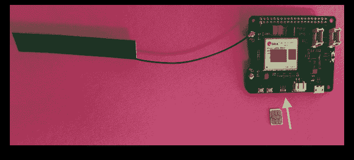
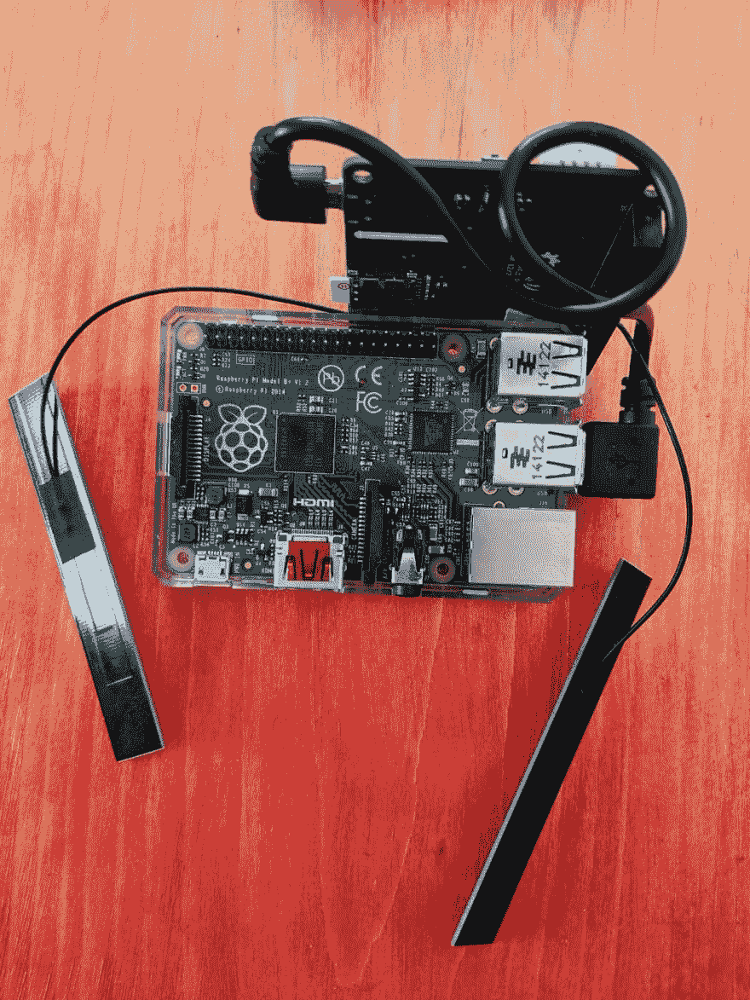
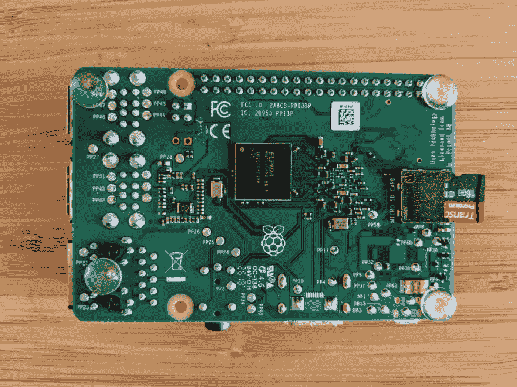
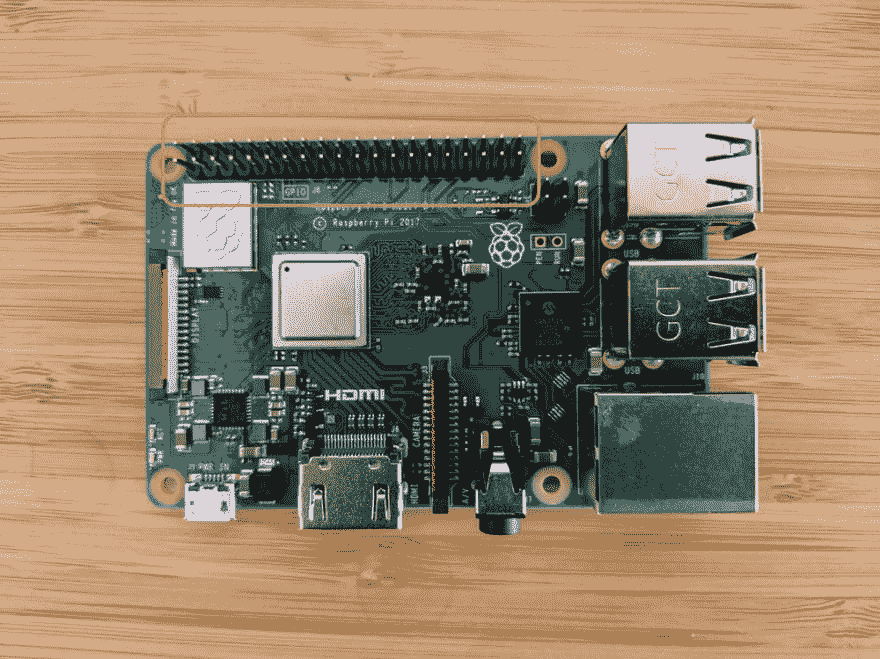
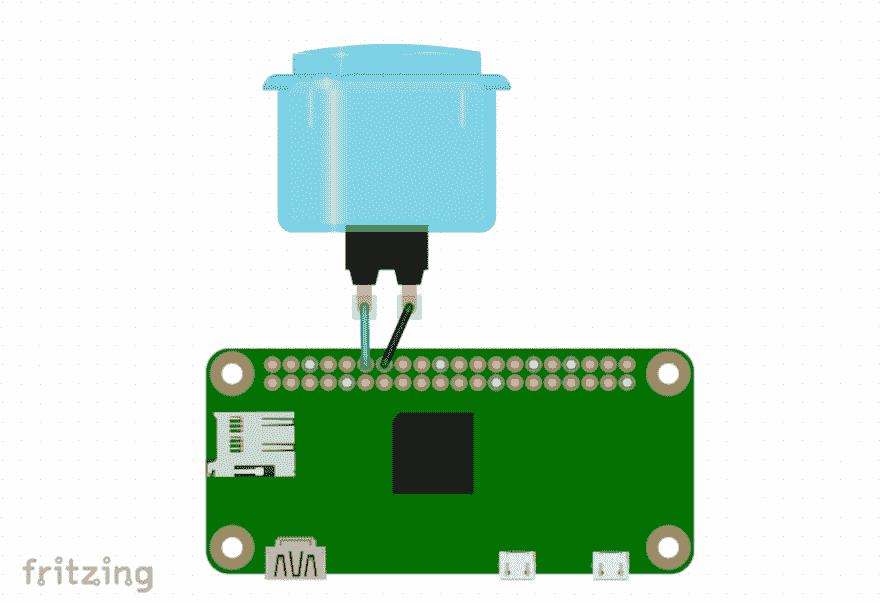

# 用 Twilio 物联网对抗冒名顶替综合症

> 原文:[https://dev . to/twilio/fighting-impostor-syndrome-with-twilio-internet-of-things-122n](https://dev.to/twilio/fighting-impostor-syndrome-with-twilio-internet-of-things-122n)

如果你正在读这篇文章，你可能曾经和冒名顶替综合症搏斗过。

经验也不总是有用的。随着我们技能的提高，我们会解决更难的问题。技术专家总是在我们知识的边缘工作。

我们能做些什么来对抗冒名顶替综合症？[的研究](https://psycnet.apa.org/buy/1999-05981-008)表明，自我肯定可以抵消消极的沉思，提高成就。因此，我决定建立一个物联网按钮，当按下时，它会发出短信确认。

# [](#physical-responses-to-negative-thoughts)对负面想法的生理反应

这个项目*可能*完全是一个网络应用。但是——采取身体行动来回应消极的想法有助于我在情感上扎根。

使用短信让我在没有打开另一个浏览器标签的认知负荷的情况下收到肯定。Twilio 的物联网功能让我可以在任何有手机服务的地方按下按钮。不需要 WiFi 配置！

冒名顶替综合症按钮是我的第一个硬件项目。有时候有点挑战性。然而，在我的社区的支持下，我最终设法让它工作起来。

我很高兴能带您完成这一构建，这不需要任何硬件经验。

[T2】](https://res.cloudinary.com/practicaldev/image/fetch/s--DeLKKQju--/c_limit%2Cf_auto%2Cfl_progressive%2Cq_auto%2Cw_880/https://thepracticaldev.s3.amazonaws.com/i/voph28ak8unjpgzjqtyj.png)

# [](#iot-imposter-syndrome-button-prerequisites)物联网冒名顶替综合症按钮:先决条件

*   树莓派。我用的是 a [Pi 3 Model B](https://www.amazon.com/Raspberry-Pi-MS-004-00000024-Model-Board/dp/B01LPLPBS8/ref=asc_df_B01LPLPBS8/?tag=hyprod-20&linkCode=df0&hvadid=309776868400&hvpos=1o1&hvnetw=g&hvrand=7734478872597576947&hvpone=&hvptwo=&hvqmt=&hvdev=c&hvdvcmdl=&hvlocint=&hvlocphy=1014221&hvtargid=pla-521496176766&psc=1) ，但是任何比 1 Model B+更晚的版本都应该可以
*   [LTE Cat 1 Pi HAT](http://wiki.seeedstudio.com/LTE_Cat_1_Pi_HAT/)
*   [一个按钮](https://www.adafruit.com/product/3490)与[这些电线](https://www.adafruit.com/product/3835)
*   [Twilio SIM 卡](https://www.twilio.com/docs/wireless/tutorials/how-to-order-and-register-your-first-sim)
*   Twilio 帐户- [在这里注册一个免费帐户](https://www.twilio.com/try-twilio)
*   [SD 卡](https://www.amazon.com/LoveRPi-Raspbian-MicroSD-Raspberry-8GB/dp/B017JKJEAU/ref=sr_1_1_sspa?keywords=micro+sd+card+8gb&qid=1566430576&s=electronics&sr=1-1-spons&psc=1&spLa=ZW5jcnlwdGVkUXVhbGlmaWVyPUExWDNERDkxQ0tLS1VTJmVuY3J5cHRlZElkPUEwOTQzOTMzMUdKWTBVTFZSRTRZWCZlbmNyeXB0ZWRBZElkPUEwODIyMDEzM0hFN0VNMkE4RzdGWiZ3aWRnZXROYW1lPXNwX2F0ZiZhY3Rpb249Y2xpY2tSZWRpcmVjdCZkb05vdExvZ0NsaWNrPXRydWU=)
*   USB 转以太网适配器。品牌和型号取决于笔记本电脑的 USB 端口类型。我们使用[这个模型](https://www.amazon.com/UGREEN-Network-Ethernet-Supports-Nintendo/dp/B00MYTSN18)取得了很好的结果
*   (可选)购买或制作一个盒子来包装项目

# Twilio 物联网入门

首先，[注册您的 Twilio SIM 卡](https://www.twilio.com/docs/wireless/tutorials/how-to-order-and-register-your-first-sim)。然后[创建一个费率计划](https://www.twilio.com/docs/wireless/understanding-rate-plans)。最后，[买一个有短信功能的 Twilio 手机号](https://support.twilio.com/hc/en-us/articles/223135247-How-to-Search-for-and-Buy-a-Twilio-Phone-Number-from-Console?_ga=2.57799594.165981211.1567527711-353167408.1558472252)。

现在，我们将设置 Pi 的操作系统。我们使用一个特殊的 Raspbian 磁盘映像来驱动 LTE Cat 1 Pi HAT。下载 [Balena Etcher](https://www.balena.io/etcher/) 并按照其说明将操作系统映像刻录到 SD 卡上。

## [](#assemble-the-hardware)组装硬件

将 Twilio sim 卡放入帽子中，轻轻连接天线。

[T2】](https://res.cloudinary.com/practicaldev/image/fetch/s--J-lfcT1I--/c_limit%2Cf_auto%2Cfl_progressive%2Cq_auto%2Cw_880/https://thepracticaldev.s3.amazonaws.com/i/vy8e01ivsr16sivpw9bx.png)

使用 USB 转 micro USB 电缆将帽子连接到 Pi。大的一边进入码头。

[T2】](https://res.cloudinary.com/practicaldev/image/fetch/s--SfW0EKRE--/c_limit%2Cf_auto%2Cfl_progressive%2Cq_auto%2Cw_880/https://thepracticaldev.s3.amazonaws.com/i/9qza8pgny8n8fqgduylg.png)

接下来，将烧录的 SD 卡放入 Pi 底部的插槽中。

[T2】](https://res.cloudinary.com/practicaldev/image/fetch/s--X2vD98MG--/c_limit%2Cf_auto%2Cfl_progressive%2Cq_auto%2Cw_880/https://thepracticaldev.s3.amazonaws.com/i/cyyeo4eooyqg7upp014v.png)

将 USB 转以太网适配器插入您的桌面。在适配器的以太网插孔和 Raspberry Pi 之间连接以太网电缆。

最后，将 Pi 插入 USB 电源。**不要使用你的笔记本电脑**:它不能持续提供 Pi 需要的电量。

如果你看到树莓派上闪烁的绿灯，你就做对了！接下来我将向您展示如何设置您的开发环境。

## [](#set-up-your-development-environment)设置您的开发环境

从台式机或笔记本电脑上的终端，SSH 到`pi@192.168.253.100`。系统会提示您输入密码，密码是`build19`。

运行下面的命令来安装`pip`，python 包管理器:

`sudo apt-get install python3-pip`

然后使用 pip 安装 Twilio Python SDK:

`sudo pip3 install twilio`

[在 Pi 上添加 Twilio 凭证作为环境变量。](https://www.twilio.com/docs/usage/secure-credentials#load-credentials-from-environment-variables)

你需要设置`TWILIO_ACCOUNT_SID`和`TWILIO_AUTH_TOKEN`。[你可以在控制台](https://www.twilio.com/console)中找到它们。

只有当您计划将设备**一直放在自己的手中**时，才可以将您的凭证存储在设备上。如果不是这样，请使用另一个您可以远程禁用的身份验证解决方案，如[信任板载](https://www.twilio.com/docs/wireless/trust-onboard)或 [API 密钥](https://www.twilio.com/docs/iam/pkcv/account-and-key-management-api-keys)。

## [](#configure-your-text-editor)配置你的文本编辑器

是时候配置代码编辑器了。您有两种选择来输入您需要的代码:

*   您可以直接在 Pi 上使用编辑器，如`nano`、`vim`或`emacs`。
*   或者，您可以使用笔记本电脑上的编辑器，并配置一个编辑器扩展来将代码复制到 Pi。

当我制作我的按钮时，我使用了带有[远程同步扩展](https://atom.io/packages/remote-sync)的 [atom](https://atom.io/) ，它工作起来非常棒。

# [](#hook-up-the-button)勾住按钮

[T2】](https://res.cloudinary.com/practicaldev/image/fetch/s--1vb4KSl---/c_limit%2Cf_auto%2Cfl_progressive%2Cq_auto%2Cw_880/https://thepracticaldev.s3.amazonaws.com/i/owt2o5hdesi3p7xa0kru.png)

Raspberry Pi 具有用于通用输入和输出的引脚，也称为 **GPIO** 。

如果你连接错误的引脚，你可以砖你的 Pi。我在第一次构建时就这么做了——我猜我现在是一个真正的硬件黑客了。😂使用[引脚图](https://pinout.xyz/pinout/pin5_gpio3)仔细检查你的引脚，避免我的错误。

令人困惑的是，GPIO 引脚有[几种编号方案](https://pinout.xyz/)。只要在整个项目中使用一致的方案来避免混乱，选择哪种方案并不重要。对于这个项目，我们将使用 BCM 编号方案。

当按钮被按下时，我们要完成一个*电路*。

电路是电流可以流动的完整路径。地是一个相当一致的参考点，可以用来测量其它电平的电流。

我们测量信号和地之间的电压差，以确定按钮是否被按下。电路可以拾取随机的电磁能量和静电，这使得很难设置一个阈值来准确判断电压差有多大影响。

## [](#resistors-what-they-are-why-you-need-them)电阻:它们是什么，为什么需要它们

抵抗组织来救援了！电阻器阻碍电路中电流的流动。

对于接地的开关，当开关打开时，*上拉电阻*确保电路的其余部分上有一个确定的电压(“逻辑高”)。相反，当开关打开时，*下拉电阻*确保定义的接地电压(“逻辑低”)。

对于这个项目，使用上拉电阻还是下拉电阻并不重要，所以让我们使用上拉电阻。Pi GPIO 引脚具有内部上拉和下拉电阻，我们将在 Python 代码中进行配置。

## [](#attach-the-button-to-the-pi)将按钮附加到 Pi 上

将按钮电线的金属端插入按钮。(哪根电线是哪根并不重要，它们可以互换。)

将连接器的塑料侧插入 [BCM 针脚 18](https://pinout.xyz/) ，以及 GND。如果你愿意，你可以焊接这些电线，而不是使用连接器。

[T2】](https://res.cloudinary.com/practicaldev/image/fetch/s--0NHV3zuR--/c_limit%2Cf_auto%2Cfl_progressive%2Cq_auto%2Cw_880/https://thepracticaldev.s3.amazonaws.com/i/5kzgcvh4kyvy1qzs3non.png)

# [](#enter-the-code)输入代码

将以下代码复制到您的 Raspberry Pi 上的一个新文件`sms_button.py`中。(使用您从上面选择的编辑器)。

将`from_number`替换为你的 Twilio 电话号码，将`to_number`替换为你想要发送声明的号码。

```
import RPi.GPIO as GPIO
import time
from twilio.rest import Client
import requests

client = Client()

from_number = "" # put your Twilio number here to_number = "" # put your cell phone number here 
# specify which GPIO numbering scheme we are using GPIO.setmode(GPIO.BCM)
pin_number = 18
# configure the pin for input and set up pull-up resistor GPIO.setup(pin_number, GPIO.IN, pull_up_down=GPIO.PUD_UP)

def get_affirmation():
    try:
        response = requests.get(url="https://www.affirmations.dev").json()
        return response.get('affirmation')
    except Exception:
        # let's not try too hard
        return "you can do it!"

def send_message(_):
    affirmation = get_affirmation()
    message = client.messages.create(
        body=affirmation,
        from_=from_number,
        to=to_number
    )
    print(message.sid)

GPIO.add_event_detect(
    pin_number,
    GPIO.FALLING,
    callback=send_message,
    bouncetime=1000
)

# we need a loop here to keep the script running continuously while True:
    time.sleep(10) 
```

我在这里使用了一个[断言 api](https://github.com/annthurium/affirmations) ，但是你也可以为自己写个性化的断言。将断言放在一个列表中，并在每次调用 send_message 函数时使用`random.choice()`选择一个。

尝试从命令行运行 python 脚本:

`python3 sms_button.py`

按下按钮后，您应该会看到如下输出:

```
sending message
SMef651cc421a241e997c591401dbea41b 
```

您应该会收到一条短信，确认您提供的手机号码。万岁！

[T2】](https://res.cloudinary.com/practicaldev/image/fetch/s--smF2e68_--/c_limit%2Cf_auto%2Cfl_progressive%2Cq_66%2Cw_880/https://thepracticaldev.s3.amazonaws.com/i/z53c6cbxynoh31vmj8f2.gif)

[T2】](https://res.cloudinary.com/practicaldev/image/fetch/s--lILPksFe--/c_limit%2Cf_auto%2Cfl_progressive%2Cq_auto%2Cw_880/https://thepracticaldev.s3.amazonaws.com/i/fi9mawghb3d58iesfteh.png)

请注意，有时在脚本首次运行时，按钮需要几秒钟来初始化。

如果您想让脚本在 Pi 上持续运行，您会想在一个[屏幕](https://linuxize.com/post/how-to-use-linux-screen/)会话中运行它，这样脚本就可以在 ssh 会话终止后继续运行。

# [](#take-that-negative-selftalk)借此，否定自言自语

说到底，我的冒名顶替综合症并不能定义我。这只是我的一个想法。

你的冒名顶替综合症也不能定义你。你很聪明，你把事情做好了，我迫不及待地想看看你创造了什么。如果你用 Twilio IoT 造了什么东西，我很想听听！你可以在这里评论或者在 [Twitter](https://twitter.com/annthurium) 上找到我。