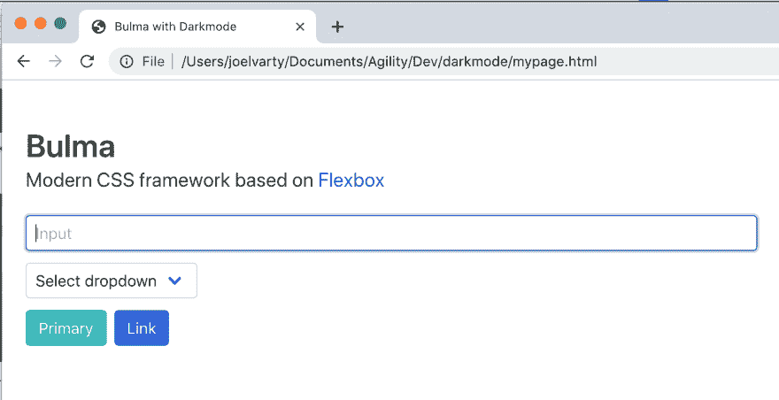
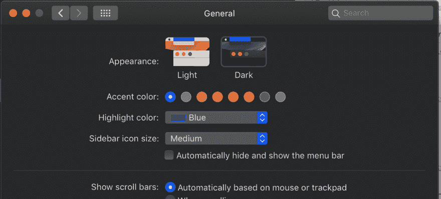
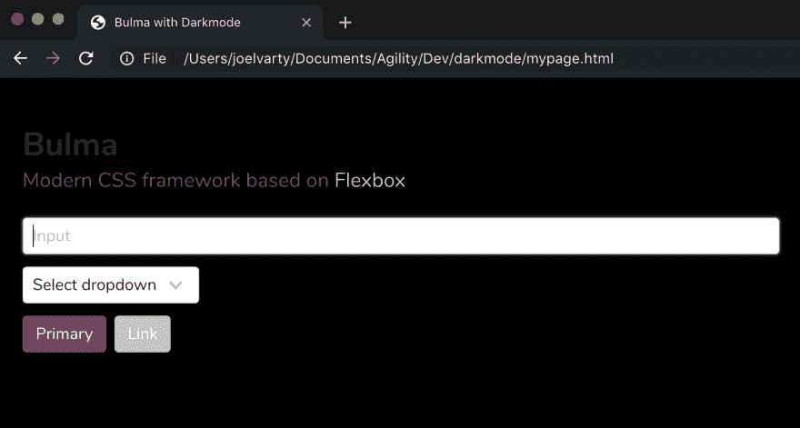

# 如何在 CSS 中实现黑暗模式-完整教程

> 原文：<https://dev.to/joelvarty/how-to-implement-dark-mode-in-css-mec>

昨天[我写了如何在 css 中使用媒体查询](https://dev.to/joelvarty/how-to-implement-dark-mode-in-css-with-media-3d02)来检测黑暗模式。今天，我将进一步阐述如何使用媒体查询来彻底改变网站的外观和感觉。

我们将使用 [bulma](https://bulma.io) 和 [npm](https://www.npmjs.com) 作为框架来完成这项工作。我们在这里借用[布尔玛指南的说明](https://bulma.io/documentation/customize/with-node-sass/)来开始。

让我们从新目录开始。

```
 mkdir darkmode
cd darkmode 
```

<svg width="20px" height="20px" viewBox="0 0 24 24" class="highlight-action crayons-icon highlight-action--fullscreen-on"><title>Enter fullscreen mode</title></svg> <svg width="20px" height="20px" viewBox="0 0 24 24" class="highlight-action crayons-icon highlight-action--fullscreen-off"><title>Exit fullscreen mode</title></svg>

我们只需要添加几个依赖项就可以让它工作了。

```
npm init
npm install node-sass --save-dev
npm install bulma --save-dev 
```

<svg width="20px" height="20px" viewBox="0 0 24 24" class="highlight-action crayons-icon highlight-action--fullscreen-on"><title>Enter fullscreen mode</title></svg> <svg width="20px" height="20px" viewBox="0 0 24 24" class="highlight-action crayons-icon highlight-action--fullscreen-off"><title>Exit fullscreen mode</title></svg>

创建一个 **scss** 文件夹，在其中添加两个文件，第一个名为 lightstyles.scss:

```
@charset "utf-8";
@import "../node_modules/bulma/bulma.sass"; 
```

<svg width="20px" height="20px" viewBox="0 0 24 24" class="highlight-action crayons-icon highlight-action--fullscreen-on"><title>Enter fullscreen mode</title></svg> <svg width="20px" height="20px" viewBox="0 0 24 24" class="highlight-action crayons-icon highlight-action--fullscreen-off"><title>Exit fullscreen mode</title></svg>

现在我们需要我们的深色风格。让我们把这个文件叫做 darkstyles.scss:

```
 @charset "utf-8";

// Set your brand colors
$purple: #8A4D76; 
$pink: #FA7C91;
$brown: #757763;
$beige-light: #D0D1CD;
$beige-lighter: #EFF0EB;

// Update Bulma's global variables
$grey-dark: $brown;
$grey-light: $beige-light;
$primary: $purple; 
$link: $beige-light;

// Update some of Bulma's component variables
$body-background-color: black;
$body-color: $beige-lighter;

// Import Bulma
@import "../node_modules/bulma/bulma.sass"; 
```

<svg width="20px" height="20px" viewBox="0 0 24 24" class="highlight-action crayons-icon highlight-action--fullscreen-on"><title>Enter fullscreen mode</title></svg> <svg width="20px" height="20px" viewBox="0 0 24 24" class="highlight-action crayons-icon highlight-action--fullscreen-off"><title>Exit fullscreen mode</title></svg>

现在，我们有了两个不同的“主题”,我们将能够从中获益。让我们创建一个 css 文件，它将根据是否启用黑暗模式来决定使用哪个主题。

创建一个 **css*文件夹，添加一个名为**mystyles.css** 的文件。
注意我们添加到 css @import 命令中的 **prefers-color-scheme** 参数。这告诉浏览器只在暗或亮模式下使用 css 文件。

```
@charset "utf-8";
@import "./darkstyles.css" (prefers-color-scheme: dark);
@import "./lightstyles.css" (prefers-color-scheme: light) 
```

<svg width="20px" height="20px" viewBox="0 0 24 24" class="highlight-action crayons-icon highlight-action--fullscreen-on"><title>Enter fullscreen mode</title></svg> <svg width="20px" height="20px" viewBox="0 0 24 24" class="highlight-action crayons-icon highlight-action--fullscreen-off"><title>Exit fullscreen mode</title></svg>

创建一个使用几个布尔玛组件的 HTML 模板，并拉入 mystyles.css 文件。

```
<!DOCTYPE html>
<html lang="en">

<head>
    <title>Bulma with Darkmode</title>
    <meta name="viewport"
          content="width=device-width, initial-scale=1">
    <link rel="stylesheet"
          href="css/mystyles.css">
</head>

<body>
    <section class="section">
        <div class="container is-fluid">
            <h1 class="title">
                Bulma
            </h1>

            <p class="subtitle">
                Modern CSS framework based on <a href="https://developer.mozilla.org/en-US/docs/Web/CSS/CSS_Flexible_Box_Layout/Basic_Concepts_of_Flexbox">Flexbox</a>
            </p>

            <div class="field">
                <div class="control">
                    <input class="input"
                           type="text"
                           placeholder="Input">
                </div>
            </div>

            <div class="field">
                <p class="control">
                    <span class="select">
                        <select>
                            <option>Select dropdown</option>
                        </select>
                    </span>
                </p>
            </div>

            <div class="buttons">
                <a class="button is-primary">Primary</a>
                <a class="button is-link">Link</a>
            </div>
        </div>
    </section>
</body>

</html> 
```

<svg width="20px" height="20px" viewBox="0 0 24 24" class="highlight-action crayons-icon highlight-action--fullscreen-on"><title>Enter fullscreen mode</title></svg> <svg width="20px" height="20px" viewBox="0 0 24 24" class="highlight-action crayons-icon highlight-action--fullscreen-off"><title>Exit fullscreen mode</title></svg>

将此文件另存为**mypage.html**。

现在我们需要从我们的 scss 中生成黑暗和光明模式的 css 文件。为此，我们需要向我们的 **package.json** 文件添加一些逻辑。

将它添加到 package.json 文件中的 scripts 属性:

```
"scss-watch":  "node-sass --watch scss -o css",  "scss-build":  "node-sass scss -o css" 
```

<svg width="20px" height="20px" viewBox="0 0 24 24" class="highlight-action crayons-icon highlight-action--fullscreen-on"><title>Enter fullscreen mode</title></svg> <svg width="20px" height="20px" viewBox="0 0 24 24" class="highlight-action crayons-icon highlight-action--fullscreen-off"><title>Exit fullscreen mode</title></svg>

现在我们有了一个 **scss-build** 命令，我们可以运行它来获取 scss 文件并输出 css。

```
npm run scss-build 
```

<svg width="20px" height="20px" viewBox="0 0 24 24" class="highlight-action crayons-icon highlight-action--fullscreen-on"><title>Enter fullscreen mode</title></svg> <svg width="20px" height="20px" viewBox="0 0 24 24" class="highlight-action crayons-icon highlight-action--fullscreen-off"><title>Exit fullscreen mode</title></svg>

在浏览器中打开**mypage.html**文件，查看输出

### 黑暗模式关闭

[](https://res.cloudinary.com/practicaldev/image/fetch/s--XdoA83Vt--/c_limit%2Cf_auto%2Cfl_progressive%2Cq_auto%2Cw_880/https://thepracticaldev.s3.amazonaws.com/i/wfiv8nvi236mjm3o9vgf.png)

*现在让我们在操作系统设置中切换到黑暗模式)*
[](https://res.cloudinary.com/practicaldev/image/fetch/s--cTO-jq-g--/c_limit%2Cf_auto%2Cfl_progressive%2Cq_auto%2Cw_880/https://thepracticaldev.s3.amazonaws.com/i/jnrc5ov9hhxdfyuacqex.png)

### 黑暗模式开启

[](https://res.cloudinary.com/practicaldev/image/fetch/s--z09JRoLS--/c_limit%2Cf_auto%2Cfl_progressive%2Cq_auto%2Cw_880/https://thepracticaldev.s3.amazonaws.com/i/y1ccdqn1333bnrysnnix.png)

* * *

我希望你可以很容易地看到如何为你的网站或应用程序实现黑暗模式。

这篇教程是我在业余时间写的。如果你想看看我每天都做些什么，[注册敏捷 CMS](https://agilitycms.com) -最快的 CMS！