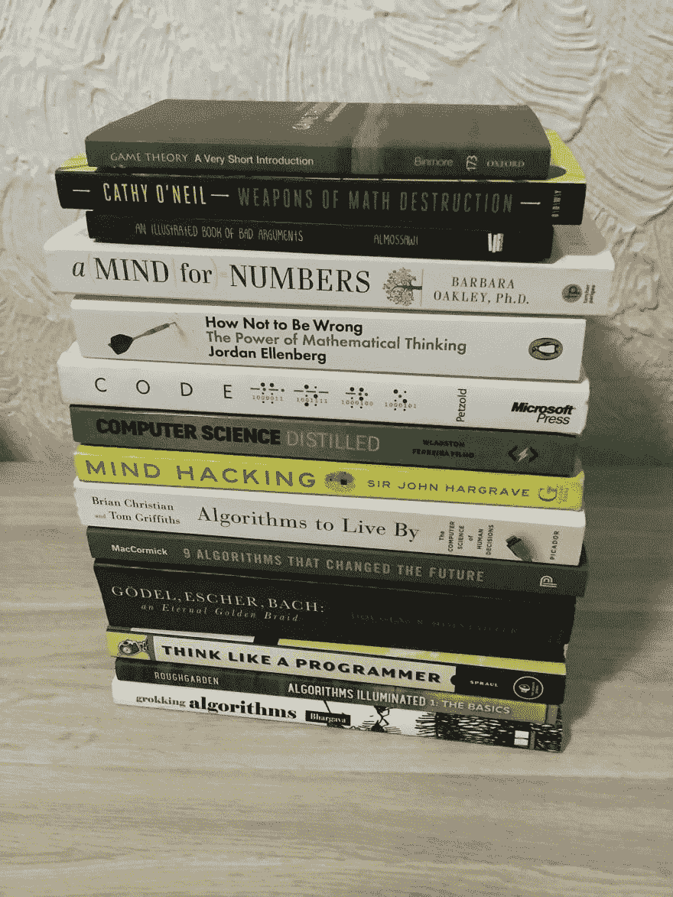

# 数学/算法休闲书籍

> 原文:[https://dev . to/annaelizleal/math-algorithms-casual-books-1kkd](https://dev.to/annaelizleal/math-algorithms-casual-books-1kkd)

[T2】](https://res.cloudinary.com/practicaldev/image/fetch/s--KJoMKrZj--/c_limit%2Cf_auto%2Cfl_progressive%2Cq_auto%2Cw_880/https://thepracticaldev.s3.amazonaws.com/i/mep04t1mqgxk5ht4c9v4.jpg)

我两年前开始阅读数学/算法休闲书籍(不是严格的技术书籍)——实际上是在我加入 EPAM 的时候——从那以后有些事情已经改变了:

*   首先，因为我的母语是西班牙语，我读的所有书都是英文的，所以我提高了我的英语水平。所以，如果你像我一样苦于英语，我强烈建议你用英语阅读。
*   作为技术招聘人员，我在面试中表现出色。
*   我的逻辑改变了，这很有趣，因为即使是乘电梯也让我思考电梯背后的排序算法。
*   我发现数学无处不在，甚至在我做决定的时候。

我的第一本书是 Aidtya Bhargava 写的 [*《搜索算法:程序员和其他好奇者图解指南》*](https://www.amazon.com.mx/Grokking-Algorithms-Illustrated-Programmers-Curious/dp/1617292230/ref=sr_1_1?__mk_es_MX=%C3%85M%C3%85%C5%BD%C3%95%C3%91&crid=1P8O9ZL1YROI3&keywords=grooking+algorithms&qid=1568090596&s=gateway&sprefix=grooking+algorithms%2Cstripbooks%2C179&sr=8-1) *，我不是程序员，但肯定我是“其他好奇者”，这本书是技术性的，是的，但它并不复杂，实际上它用盒子解释了递归，用 python 编写的代码很容易理解。它也给出了第一种排序算法，然后它变得可怕——至少对我来说贪婪的算法是复杂的，一些可以被视为复杂和混乱的东西用图画来解释。作为第一种方法，在阅读托马斯·H·科尔曼、查尔斯·E·莱瑟森、罗纳德·L·里维斯特和克利福德·斯坦的《算法导论》之前，阅读**或 [*【算法】*](https://www.amazon.com.mx/Algorithms-Robert-Sedgewick/dp/032157351X/ref=pd_lpo_sbs_14_img_1?_encoding=UTF8&psc=1&refRID=E62M8XKK9AMAXC9G3FQN) *罗伯特·塞奇威克和凯文·韦恩*的《算法》，对我来说只是一本红色的算法书。***

 *当另一个朋友推荐我阅读 Brian Christian 和 Tom Griffiths 写的 [*《赖以生存的算法:人类决策的计算机科学》*](https://www.amazon.com.mx/Algorithms-Live-Computer-Science-Decisions/dp/1627790365/ref=sr_1_1?__mk_es_MX=%C3%85M%C3%85%C5%BD%C3%95%C3%91&crid=VHVE9ZSBY0SQ&keywords=algorithms+to+live+by&qid=1568090832&s=books&sprefix=algorithms+t%2Cstripbooks%2C175&sr=1-1)*时，我正在探索成功之路，因为我是一名招聘人员，所以有趣的是，我意识到这本书是从一个叫做“秘书问题”的东西开始的，它教你一个数学规则——叫做“跳跃——然后再跳跃”——做决策，你可以有许多选择，但是，什么是最好的呢？原来有一个 37%的规则，用大量的公式来解释，不管发生什么，你都有 37%的成功率。这本书让我想到谷歌不是作为一个搜索引擎而出名，而是因为他的排序方法而出名。*

 *我很好奇，也越来越渴望阅读，我从一个微软爱好者那里找到了一本 Charles Petzold 写的书，书名是 [*【代码】*](https://www.amazon.com.mx/Code-Charles-Petzold/dp/0735611319/ref=sr_1_1?__mk_es_MX=%C3%85M%C3%85%C5%BD%C3%95%C3%91&keywords=code&qid=1568090892&s=books&sr=1-1) *。我对那本书没有期望，但它帮助我更好地理解计算机。它立刻引起了我的注意，因为它解释了代码，而不是编程语言，也不是算法...代码！*

所以每次我面试一个软件工程师，看他们是否认可一些书，无论是技术性的还是非技术性的，对我来说都很重要。为什么？首先，衡量他们对 IT 世界的热情，其次，因为即使我们已经自动化了生活的许多方面，读书仍然是一种很好的学习方式。

感谢阅读！这是我的第一篇文章，我希望你能加入我的下一篇书评。

问候，

特别感谢桑德拉·里维拉，她帮我编辑了这篇文章。**