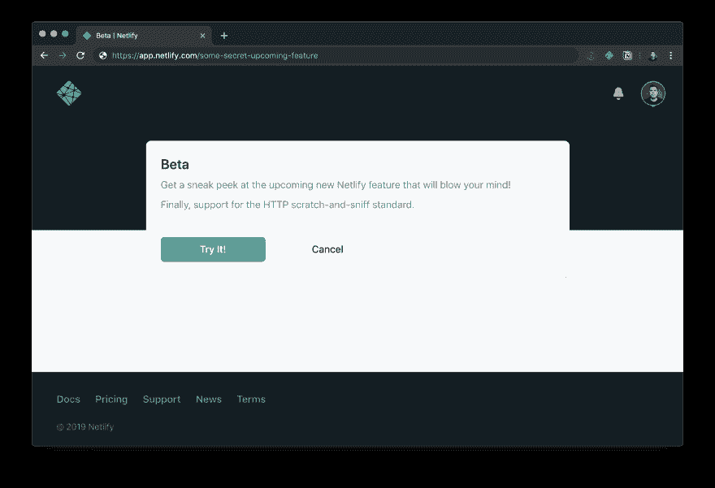
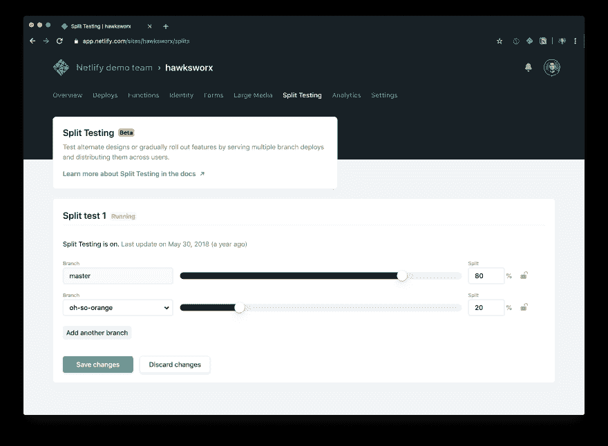
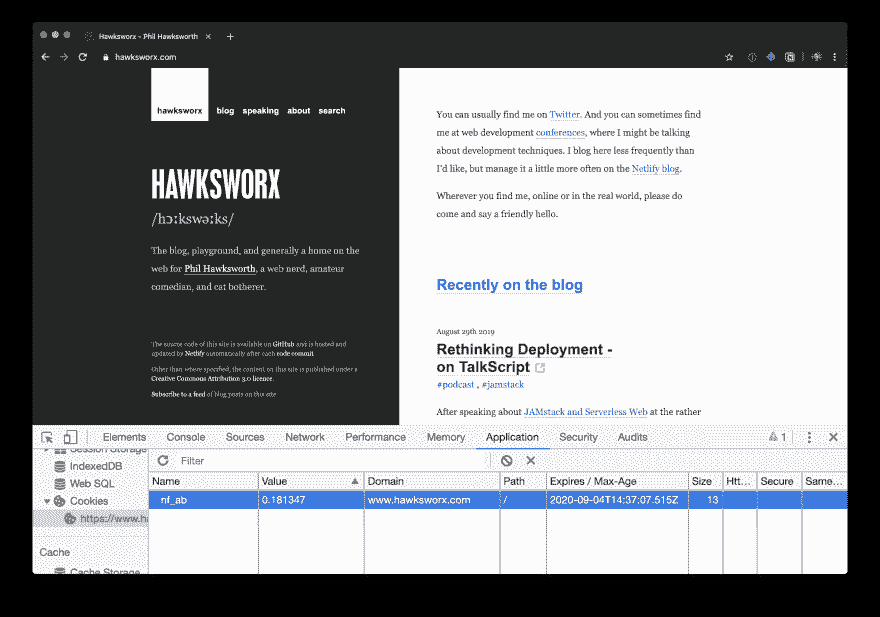
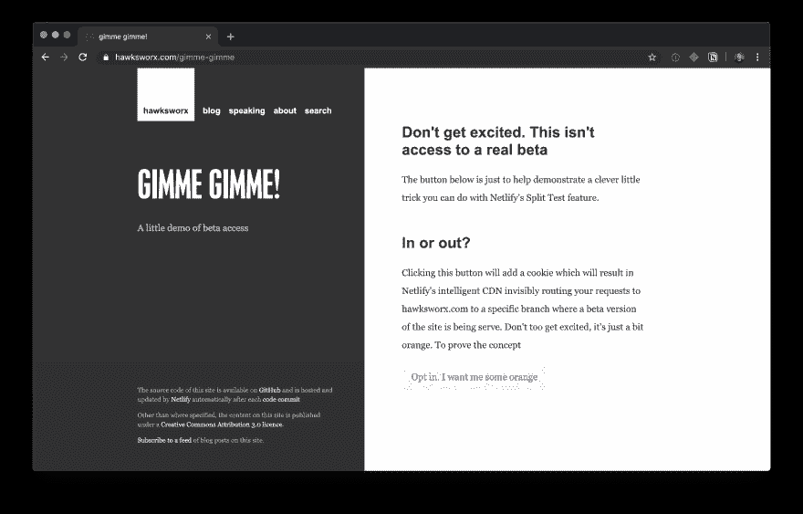

# Netlify pro 提示:使用分割测试来支持私有测试版

> 原文：<https://dev.to/philhawksworth/netlify-pro-tip-using-split-testing-to-power-private-beta-releases-a7l>

有时候，让你的用户尽早接触到你的站点或应用程序的新特性是很有用的。我们通常认为这种访问是“私有测试版”。当我们准备推出一个新功能，或者想让一些热心的测试者或早期采用者使用时，我们会定期这样做。

通常，这需要向一组用户宣传新功能的细节，并让他们能够通过适当的信息页面选择测试版。

这里有一个与即将发布的 Netlify 版本类似但不完全相同的选项:

[](https://res.cloudinary.com/practicaldev/image/fetch/s--7DukX9xe--/c_limit%2Cf_auto%2Cfl_progressive%2Cq_auto%2Cw_880/https://paper-attachments.dropbox.com/s_F17FE4AF78F6BBDE2E91BD9F1FD4DCEE8F7075FB1EAC3A6C77DAFDBB063E97B9_1567604367329_Screenshot%2B2019-09-04%2Bat%2B14.39.17.png)

## netli-eption

这是 Netlify 使用 Netlify 构建 Netlify 的又一个例子！我们非常热切地喂食我们的产品。这通常会让我们发现一些巧妙的小技巧，并使用我们自己的工具。这个提示就是这样来的。

由于 Netlify Split Testing 特性的工作方式，制作您自己的选择加入 beta 测试 UI，然后向那些被邀请的用户提供新特性比您想象的要简单得多。

在这篇文章中，我将解释如何创建你自己的选择加入一个私人测试。您可以将它用于您喜欢的任何类型的站点，不管您使用什么工具或静态站点生成器来创建它。下面视频中的例子是一个用 Hugo 创建的网站，但它可以是任何东西。我也经常用它来做 Gatsby 或 Eleventy 的网站。

如果你更喜欢看视频而不是阅读细节，你可以看下面视频中的简短解释和演示。或者想了解更多信息和一些代码片段，请继续阅读。

[https://www.youtube.com/embed/Q5-QTaAOSrY](https://www.youtube.com/embed/Q5-QTaAOSrY)

## 创建您的测试版

在让用户有机会选择试用您的新测试版功能之前，您需要构建并部署它。(在我上面的小例子中，我选择测试一个有新颜色主题的站点版本——只是为了一个明显的例子。)

但是如何部署站点的多个版本呢？这就是 Git 分支机构来救援的地方！

Netlify 可以构建你所有的分支，并在专用的 URL 上为它们服务。[为您的新测试版创建一个功能分支](https://www.netlify.com/docs/continuous-deployment/?utm_source=blog&utm_medium=devto&utm_campaign=devex#branches-deploys),并让 Netlify 的持续部署管道为您构建和托管它，为您提供一个具有新功能的可寻址版本的站点。

作为多变量测试的一部分，Netlify 的分割测试特性使用您部署的分支来支持您站点的不同变量。如果你以前没有探索过这个，那就值得看看[我以前关于 Netlify 上的 A/B 测试的文章和视频。](https://dev.to/philhawksworth/power-up-gatsby-sites-with-a-b-testing-on-netlify-fp4)(TL；dr:你可以在 CDN 的任何分支上无形地塑造你的站点流量，而不会损失性能。

[](https://res.cloudinary.com/practicaldev/image/fetch/s--CM02LxHo--/c_limit%2Cf_auto%2Cfl_progressive%2Cq_auto%2Cw_880/https://paper-attachments.dropbox.com/s_F17FE4AF78F6BBDE2E91BD9F1FD4DCEE8F7075FB1EAC3A6C77DAFDBB063E97B9_1567605564876_Screenshot%2B2019-09-04%2Bat%2B14.58.58.png)

## 给予用户选择加入和退出的控制权

托管测试版功能由分支构建负责。并且分割测试特性可以为用户提供对不同分支构建的不可见的访问(也就是说，都来自同一个生产 URL)。

通过创建一个在生产分支(通常是主分支)和测试分支(在我的例子中我称之为“oh-so-orange ”)之间划分流量的分割测试，然后配置流量整形以将 100%的流量定向到生产分支，您将排除确定您的用户看到哪个版本的可能性。每个人都将看到您的产品版本，除非他们明确选择从测试分支获得服务。

我们有一个机制允许他们这样做。

Netlify 分割测试通过在浏览器中设置 cookie 将访问者分配到不同的可用分支。这个名为`nf_ab`的 cookie 是由 [Netlify CDN](https://www.netlify.com/products/edge/?utm_source=blog&utm_medium=devto&utm_campaign=devex) 在用户访问一个具有活动分割测试的站点时设置的。它包含一个介于 0 和 1 之间的随机浮点数。

以下是我访问自己的网站时 Netlify CDN 添加的 cookie:

[](https://res.cloudinary.com/practicaldev/image/fetch/s--p9plg9v3--/c_limit%2Cf_auto%2Cfl_progressive%2Cq_auto%2Cw_880/https://paper-attachments.dropbox.com/s_F17FE4AF78F6BBDE2E91BD9F1FD4DCEE8F7075FB1EAC3A6C77DAFDBB063E97B9_1567608105499_Screenshot%2B2019-09-04%2Bat%2B15.41.05.png)

该数值是随机生成的，并将在用户的浏览器中持续存在，直到它过期，或者直到 spit 测试终止。cookie 的值将决定哪个分支服务于用户的请求。它对应于参与拆分测试的每个分支的权重。

例如，如果我们有一个跨 3 个分支运行的测试，权重如下:

1.  主控:50%
2.  测试分支-1: 20%
3.  测试分支-2: 30%

…那么 cookie 值在 0.0 到 0.50 之间的用户将由 master 提供服务。值在 0.50 和 0.70 之间的那些将由测试分支 1 服务。并且具有 0.70 到 1.0 的值的那些将由测试分支 2 服务。

以这种方式使用 cookie 可以确保所有用户都与随机分配给他们的分支有密切关系。这避免了在随后的访问中得到不同分支机构的混合体验。

但是聪明的是，cookie 不仅仅支持数值。它也可以容纳一个字符串。这让我们可以用分支的名称来设置它。

这个巧妙的技术设计决定意味着，通过浏览器中的用户交互来设置 cookie 的值，将具有指定使用特定分支的效果。即使该分支在分割测试中被设置为接收 0%流量。

## 提供用户界面

当你选择加入一个私人测试版时，知道你将会进入什么是很重要的，所以提供一个描述测试版将包括什么的页面是很好的形式。这可以放在你网站的一个页面上，有一个方便的网址，你可以和你想邀请的人分享。

我自己的网站，我在上面的视频中用作例子，自从录制以来已经有了一些发展，但邀请 URL 仍然存在。这些天，看起来是这样的:

[](https://res.cloudinary.com/practicaldev/image/fetch/s--KIq-SZsy--/c_limit%2Cf_auto%2Cfl_progressive%2Cq_auto%2Cw_880/https://paper-attachments.dropbox.com/s_F17FE4AF78F6BBDE2E91BD9F1FD4DCEE8F7075FB1EAC3A6C77DAFDBB063E97B9_1567675323207_Screenshot%2B2019-09-05%2Bat%2B10.20.26.png)

您可以[访问这个选择加入页面](https://www.hawksworx.com/gimme-gimme)并尝试一下。

用户可以点击选择加入的按钮使用 JavaScript 做两件事:

1.  它设置`nf_ab` cookie 来保存服务于私有 beta 的分支的名称(在这个例子中是“oh-so-orange”)
2.  它重新加载页面，导致 Netlify 的智能 CDN(更准确地说，我们称之为应用交付网络或 ADN)现在根据 cookie 指定的分支来服务请求。

这只需要几行客户端 JavaScript 代码，如下所示:

```
 // a little helper for handling click events
function buttonHandler(selector, callback) {
  var btn = document.querySelector(selector);
  if(!btn) { return; }
  btn.addEventListener('click', function(event) {
    event.preventDefault();
    callback();
  }, false);
}

// Set a cookie to opt in to the beta
buttonHandler('#btn-opt-in', function(){

  // set the cookie with the name of the branch of our private beta
  document.cookie = "nf_ab=oh-so-orange; expires=Thu, 01 Jan 2021 00:00:00 GMT";

  // reload the page to pick up the new option
  // (forcing the browser to re-request it, rather than serving from browser cache)
  window.location.reload(true);

}); 
```

<svg width="20px" height="20px" viewBox="0 0 24 24" class="highlight-action crayons-icon highlight-action--fullscreen-on"><title>Enter fullscreen mode</title></svg> <svg width="20px" height="20px" viewBox="0 0 24 24" class="highlight-action crayons-icon highlight-action--fullscreen-off"><title>Exit fullscreen mode</title></svg>

这个链接存在于 HTML 中的什么地方供用户交互:

```
 <a href="#" id="btn-opt-in">
  Opt me in to the private beta please!
</a> 
```

<svg width="20px" height="20px" viewBox="0 0 24 24" class="highlight-action crayons-icon highlight-action--fullscreen-on"><title>Enter fullscreen mode</title></svg> <svg width="20px" height="20px" viewBox="0 0 24 24" class="highlight-action crayons-icon highlight-action--fullscreen-off"><title>Exit fullscreen mode</title></svg>

## 放我出去！

我也喜欢让用户很容易再次选择退出。一个好的惯例是在 beta 分支中使用完全相同的 URL 来提供一个链接，该链接将用户重置回默认的 production 分支。通过这种方式，人们可以返回到你的网站的一个页面来切换他们的参与和退出测试。

可以试试这里:[https://hawksworx.com/gimme-gimme](https://hawksworx.com/gimme-gimme)

选择退出就像清除指定 beta 分支的 cookie 一样简单。另外几行 JavaScript 可以帮我们做到这一点:

```
 // Clear the cookie to opt out of the beta
btnHandler('#btn-opt-out', function(){

  // clear and expire the cookie.
  document.cookie = "nf_ab=;expires=Thu, 01 Jan 1970 00:00:01 GMT;";

  // reload the page to pick up the new option
  window.location.reload(true);

}); 
```

<svg width="20px" height="20px" viewBox="0 0 24 24" class="highlight-action crayons-icon highlight-action--fullscreen-on"><title>Enter fullscreen mode</title></svg> <svg width="20px" height="20px" viewBox="0 0 24 24" class="highlight-action crayons-icon highlight-action--fullscreen-off"><title>Exit fullscreen mode</title></svg>

## 从默默无闻到安全

当我们启用分支构建时，Netlify 将在包含分支名称的 URL 上提供它们。这是 URL 约定:

```
https://{BRANCH-NAME}--{SITE-NAME}.netlify.com 
```

<svg width="20px" height="20px" viewBox="0 0 24 24" class="highlight-action crayons-icon highlight-action--fullscreen-on"><title>Enter fullscreen mode</title></svg> <svg width="20px" height="20px" viewBox="0 0 24 24" class="highlight-action crayons-icon highlight-action--fullscreen-off"><title>Exit fullscreen mode</title></svg>

如果你使用自定义域，你也可以配置每个分支使用一个子域。

这很棒，并且对于使用分支作为测试、阶段或者特性分支非常有帮助。但是，如果我们使用我们的私人测试版的分支构建，我们可能不希望有人通过直接访问测试版分支的 URL 来规避邀请或选择加入过程。(假设他们能够猜出或以某种方式发现这个分支的名称)。

我们可以添加一个安全措施来防止任何人通过访问它的 URL 直接访问 beta 分支。为此，我们将使用 [Netlify 的重定向 API](https://www.netlify.com/docs/redirects/?utm_source=blog&utm_medium=devto&utm_campaign=devex) ，它也直接在 Netlify ADN 上运行。

一些重定向规则可以确保对 beta 分支的任何访问都将被重定向到其他地方。访问该分支内容的唯一方式是通过我们的分割测试和选择加入来提供。这是重定向的样子。[他们住在 Netlify 的配置文件中的 beta 分支](https://github.com/philhawksworth/hawksworx.com/blob/oh-so-orange/netlify.toml#L75-L85):`netlify.toml`:

```
 [[redirects]]
      from = "https://a-branch-deploy--example.netlify.com"
      to = "https://example.com:"
      status = 301
      force = true

    [[redirects]]
      from = "https://a-branch-deploy--example.netlify.com/*"
      to = "https://example.com/:splat"
      status = 301
      force = true 
```

<svg width="20px" height="20px" viewBox="0 0 24 24" class="highlight-action crayons-icon highlight-action--fullscreen-on"><title>Enter fullscreen mode</title></svg> <svg width="20px" height="20px" viewBox="0 0 24 24" class="highlight-action crayons-icon highlight-action--fullscreen-off"><title>Exit fullscreen mode</title></svg>

有了这样的规则，我就不能再直接进入我的“哦，橙”私人测试分支了。

尝试👉[https://oh-so-orange-hawksworx.netlify.com/](https://oh-so-orange--hawksworx.netlify.com/)

## 服务器端，但没有服务器

这种提供选入测试版访问的方法是在 git 模型之上构建并预生成站点时开始享受优势的另一个例子。这是构建现代网站的 JAMstack 方法的核心原则。

通过在构建时生成我们站点的每个变体，并将每个变体作为直接形成 CDN 的静态资产集合来提供服务，每个变体都享有与生产站点相同的性能配置文件。不涉及客户端逻辑来呈现不同的变体。我们唯一的客户端逻辑在我们的代码中，它允许用户指定从该点开始访问特定的分支。CDN 会自动为我们执行其他所有操作。

没有要维护的服务器。没有需要管理的基础设施。

如果你找到了更有创造性的方法来利用分支部署，或者在 Netlify 上进行分割测试，我很乐意听到它们。

请分享它们，或者在 [Netlify 社区论坛](https://community.netlify.com?utm_source=blog&utm_medium=devto&utm_campaign=devex)上分享你关于这项技术的问题。

## 资源

从这里去哪里？

*   [Netlify](https://netlify.com?utm_source=blog&utm_medium=devto&utm_campaign=devex)
*   [启动 Gatsby 站点，在 Netlify 上进行 A/B 测试](https://dev.to/philhawksworth/power-up-gatsby-sites-with-a-b-testing-on-netlify-fp4)
*   [有效分割测试文件](https://www.netlify.com/docs/split-testing/?utm_source=blog&utm_medium=devto&utm_campaign=devex)
*   [Netlify 重定向文档](https://www.netlify.com/docs/redirects/?utm_source=blog&utm_medium=devto&utm_campaign=devex)
*   [使用 Netlify Drop 部署您的第一个站点](https://netlify.com/drop?utm_source=blog&utm_medium=devto&utm_campaign=devex)
*   【JAMstack 官方网站
*   [JAMstack 社区松弛](https://jamstack.org/slack)