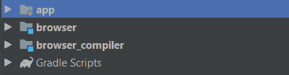
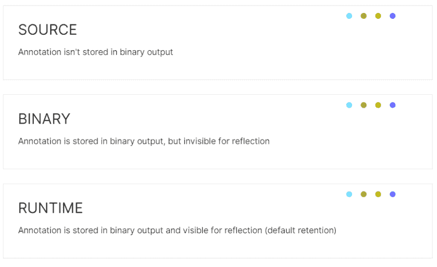

# 注释处理器:说得少，意味着更多。

> 原文:[https://dev . to/coroutine dispatcher/annotation-processor-say-less-mean-more-1k2e](https://dev.to/coroutinedispatcher/annotation-processor-say-less-mean-more-1k2e)

我一直很好奇注释的背后是什么。尽管他们让我很生气，但相信我，他们很有趣。这是我作为注释处理初学者的经验。
我将给出我自己对注释的定义:
注释只是标记类、字段、另一个注释、方法等的一种方式。为什么？它只是告诉被标记的组件有一个特殊的属性。但是怎么处理呢？
处理注释的方法是在编译时生成代码。这一直吸引着我。为什么？这取决于用例。你有没有想过 Dagger2 是怎么知道你在用什么依赖的？或者 Butterknife 知道如何绑定视图或设置`onClickListener`？是的，在编译时生成代码。在编译时生成代码来处理注释的过程称为注释处理。我将做一个简单的用例，解释所有正在发生的事情。

**用例:**

我讨厌打字:

```
activity.getSupportFragmentManager()
.beginTransaction()
.replace(R.id.someId,SomeFragment.newInstance())
.commit() 
```

<svg width="20px" height="20px" viewBox="0 0 24 24" class="highlight-action crayons-icon highlight-action--fullscreen-on"><title>Enter fullscreen mode</title></svg> <svg width="20px" height="20px" viewBox="0 0 24 24" class="highlight-action crayons-icon highlight-action--fullscreen-off"><title>Exit fullscreen mode</title></svg>

对于我需要开始的每个片段。这里有人会说我们需要注释做什么是对的，但是这篇文章是出于“学术”原因，而不是为了提供一些最佳实践或重构。

Setup:
首先你要知道，创建一个注释，处理它，需要分开的模块。那是因为我们需要告诉`gradle`有一些代码需要导入，另一些代码作为编译器工作。要在 Android Studio 中创建一个新模块，进入文件- >新建- >模块并选择 Java 库。

*注意，这种情况下不需要 Android 库。当你创建一个自定义视图类或其他东西时，选择 Android 库。*

所以我们走吧:

[T2】](https://res.cloudinary.com/practicaldev/image/fetch/s--dUlS-otl--/c_limit%2Cf_auto%2Cfl_progressive%2Cq_auto%2Cw_880/https://thepracticaldev.s3.amazonaws.com/i/27dks64px45p29ssrt2j.png)

我已经创建了 2 个模块，除了我目前的 Android 应用程序模块。我将我的模块命名为浏览器，因为它们基本上是通过应用程序片段导航的。

让我们从简单的开始:创建想要的注释:

```
@Retention(AnnotationRetention.SOURCE)
@Target(AnnotationTarget.CLASS)
annotation class BindFragment 
```

<svg width="20px" height="20px" viewBox="0 0 24 24" class="highlight-action crayons-icon highlight-action--fullscreen-on"><title>Enter fullscreen mode</title></svg> <svg width="20px" height="20px" viewBox="0 0 24 24" class="highlight-action crayons-icon highlight-action--fullscreen-off"><title>Exit fullscreen mode</title></svg>

这里有两个重要的东西:检查我是否注释了我想要的组件的`@Target`，在我的例子中是一个`CLASS`。如果我注释一个方法或一个字段，它会显示一个错误，以及决定注释如何存储在二进制输出中的`@Retention`(来自 Kotlin 文档)。有 3 种`AnnotationRetention`:

[T2】](https://res.cloudinary.com/practicaldev/image/fetch/s--MlDm5fF1--/c_limit%2Cf_auto%2Cfl_progressive%2Cq_auto%2Cw_880/https://thepracticaldev.s3.amazonaws.com/i/i97bfifl0drlrs4lbn4b.png)

目前，我只是让它来源，因为我不需要任何其他选项。
转到`browser_compiler`并打开它的“`build.gradle`来导入这些库:

```
dependencies {
   //other dependencies here 
    implementation "me.eugeniomarletti.kotlin.metadata:kotlin-metadata:1.4.0"
    implementation project(':browser') //importing the other module in here, in order to handle it.
    implementation 'com.squareup:kotlinpoet:1.2.0'
    implementation 'com.google.auto.service:auto-service:1.0-rc4'
    kapt 'com.google.auto.service:auto-service:1.0-rc4'

} 
```

<svg width="20px" height="20px" viewBox="0 0 24 24" class="highlight-action crayons-icon highlight-action--fullscreen-on"><title>Enter fullscreen mode</title></svg> <svg width="20px" height="20px" viewBox="0 0 24 24" class="highlight-action crayons-icon highlight-action--fullscreen-off"><title>Exit fullscreen mode</title></svg>

注意:不要忘记添加应用插件:“kotlin-kapt”，否则，就别想成功构建了。

创建一个类并扩展`AbstractProcessor`(当然是覆盖方法)。因为我使用 kotlin 元数据库，所以我扩展了`KotlinAbstractProcessor`,但是它们之间没有区别，除了在这个例子中直接访问一些字段。

```
class BrowserProcessor : KotlinAbstractProcessor() {

    private val annotation = BindFragment::class.java

    override fun process(annotations: Set<TypeElement>, roundEnv: RoundEnvironment): Boolean {
        return false
    }

    override fun getSupportedAnnotationTypes(): Set<String> = setOf(annotation.canonicalName)

    override fun getSupportedSourceVersion(): SourceVersion = SourceVersion.latest()

} 
```

<svg width="20px" height="20px" viewBox="0 0 24 24" class="highlight-action crayons-icon highlight-action--fullscreen-on"><title>Enter fullscreen mode</title></svg> <svg width="20px" height="20px" viewBox="0 0 24 24" class="highlight-action crayons-icon highlight-action--fullscreen-off"><title>Exit fullscreen mode</title></svg>

**工作:**
工作会在过程方法中发生。这就是神奇的地方:

```
 override fun process(annotations: Set<TypeElement>, roundEnv: RoundEnvironment): Boolean {
        roundEnv.getElementsAnnotatedWith(annotation).forEach { annotatedElement ->
            if (annotatedElement.kind == ElementKind.CLASS) {
                val pack = elementUtils.getPackageOf(annotatedElement).toString()
                val annotatedClassName = annotatedElement.simpleName.toString()
                startClassGeneration(pack, annotatedClassName)
            } else {
                messager.printMessage(Diagnostic.Kind.ERROR, "Cannot annotate anything but a class")
            }
        }
        return false
    } 
```

<svg width="20px" height="20px" viewBox="0 0 24 24" class="highlight-action crayons-icon highlight-action--fullscreen-on"><title>Enter fullscreen mode</title></svg> <svg width="20px" height="20px" viewBox="0 0 24 24" class="highlight-action crayons-icon highlight-action--fullscreen-off"><title>Exit fullscreen mode</title></svg>

我们的`elementUtils.getPackageOf(annotatedElement).toString()`将只为我们提供带注释的类包名，而`annotatedElement.simpleName().toString()`将只为我们提供带注释的类名。现在让我们跳到`startClassGeneration`方法。我使用 KotlinPoet 库在编译时生成 kotlin 代码，但这不是强制性的，您也可以键入简单的字符串，只要正确使用，没有编译错误。这是代码:

```
private fun startClassGeneration(pack: String, annotatedClassName: String) {
        val fileName = "${annotatedClassName}Browser"
        val contextPackager = ClassName("android.support.v7.app", "AppCompatActivity")
        val callerMethod = FunSpec.builder("start$annotatedClassName")
            .addParameter("activity", contextPackager)
            .addParameter("resourceIdToBeReplaced", Int::class)
            .returns(Int::class)
            .addCode(
                """
                 return activity.getSupportFragmentManager()
                .beginTransaction()
                .replace(resourceIdToBeReplaced,$annotatedClassName.newInstance())
                .commit()
            """.trimIndent()
            ).build()
        val generatedClass = TypeSpec.objectBuilder(fileName).addFunction(callerMethod).build()
        val generatedFile = FileSpec.builder(pack, fileName).addType(generatedClass).build()
        val kaptKotlinGeneratedDir = options[KOTLIN_DIRECTORY_NAME]
        generatedFile.writeTo(File(kaptKotlinGeneratedDir, "$fileName.kt"))
} 
```

<svg width="20px" height="20px" viewBox="0 0 24 24" class="highlight-action crayons-icon highlight-action--fullscreen-on"><title>Enter fullscreen mode</title></svg> <svg width="20px" height="20px" viewBox="0 0 24 24" class="highlight-action crayons-icon highlight-action--fullscreen-off"><title>Exit fullscreen mode</title></svg>

**细节很重要:**

我们必须用`@AutoService(Processor::class)`注释这个生成器类。它只是为这个定制处理器创建一个注册文件。不提供它将迫使您手动将您的处理器包含在`META-INF`目录中。这样就可以在整个项目中访问它。
全处理器文件:

```
@AutoService(Processor::class)
class BrowserProcessor : KotlinAbstractProcessor() {

    private val annotation = BindFragment::class.java

    override fun process(annotations: Set<TypeElement>, roundEnv: RoundEnvironment): Boolean {
        roundEnv.getElementsAnnotatedWith(annotation).forEach { annotatedElement ->
            if (annotatedElement.kind == ElementKind.CLASS) {
                val pack = elementUtils.getPackageOf(annotatedElement).toString()
                val annotatedClassName = annotatedElement.simpleName.toString()
                startClassGeneration(pack, annotatedClassName)
            } else {
                messager.printMessage(Diagnostic.Kind.ERROR, "Cannot annotate anything but a class")
            }
        }
        return false
    }

    override fun getSupportedAnnotationTypes(): Set<String> = setOf(annotation.canonicalName)

    override fun getSupportedSourceVersion(): SourceVersion = SourceVersion.latest()

    private fun startClassGeneration(pack: String, annotatedClassName: String) {
        val fileName = "${annotatedClassName}Browser"
        val contextPackager = ClassName("android.support.v7.app", "AppCompatActivity")
        val callerMethod = FunSpec.builder("start$annotatedClassName")
            .addParameter("activity", contextPackager)
            .addParameter("resourceIdToBeReplaced", Int::class)
            .returns(Int::class)
            .addCode(
                """
                 return activity.getSupportFragmentManager()
                .beginTransaction()
                .replace(resourceIdToBeReplaced,$annotatedClassName.newInstance())
                .commit()
            """.trimIndent()
            ).build()
        val generatedClass = TypeSpec.objectBuilder(fileName).addFunction(callerMethod).build()
        val generatedFile = FileSpec.builder(pack, fileName).addType(generatedClass).build()
        val kaptKotlinGeneratedDir = options[KOTLIN_DIRECTORY_NAME]
        generatedFile.writeTo(File(kaptKotlinGeneratedDir, "$fileName.kt"))
    }

    companion object {
        const val KOTLIN_DIRECTORY_NAME = "kapt.kotlin.generated"
    }

} 
```

<svg width="20px" height="20px" viewBox="0 0 24 24" class="highlight-action crayons-icon highlight-action--fullscreen-on"><title>Enter fullscreen mode</title></svg> <svg width="20px" height="20px" viewBox="0 0 24 24" class="highlight-action crayons-icon highlight-action--fullscreen-off"><title>Exit fullscreen mode</title></svg>

**关键时刻:**
转到您的`build.gradle`模块应用程序，导入您的两个模块，`browser`模块作为实现，`browser_compiler`作为使用`kapt`的处理器。注意这里也要包括`kotlin-kapt`。

```
implementation project(':browser')
kapt project(':browser_compiler') 
```

<svg width="20px" height="20px" viewBox="0 0 24 24" class="highlight-action crayons-icon highlight-action--fullscreen-on"><title>Enter fullscreen mode</title></svg> <svg width="20px" height="20px" viewBox="0 0 24 24" class="highlight-action crayons-icon highlight-action--fullscreen-off"><title>Exit fullscreen mode</title></svg>

用你创建的注释来注释你的片段:

```
@BindFragment //Hello Annotation :) 
class FirstFragment : Fragment() {

    override fun onCreateView(
        inflater: LayoutInflater, container: ViewGroup?,
        savedInstanceState: Bundle?
    ): View? {
        // Inflate the layout for this fragment
        return inflater.inflate(R.layout.fragment_first, container, false)
    }

    companion object{
        fun newInstance() = FirstFragment()
    }

} 
```

<svg width="20px" height="20px" viewBox="0 0 24 24" class="highlight-action crayons-icon highlight-action--fullscreen-on"><title>Enter fullscreen mode</title></svg> <svg width="20px" height="20px" viewBox="0 0 24 24" class="highlight-action crayons-icon highlight-action--fullscreen-off"><title>Exit fullscreen mode</title></svg>

注释您的第二个片段，您将在第一个片段中单击一个按钮后导航该片段:

```
@BindFragment
class SecondFragment : Fragment() {
    override fun onCreateView(
        inflater: LayoutInflater, container: ViewGroup?,
        savedInstanceState: Bundle?
    ): View? {
        return inflater.inflate(R.layout.fragment_second, container, false)
    }

    companion object {
        @JvmStatic
        fun newInstance() = SecondFragment()
    }
} 
```

<svg width="20px" height="20px" viewBox="0 0 24 24" class="highlight-action crayons-icon highlight-action--fullscreen-on"><title>Enter fullscreen mode</title></svg> <svg width="20px" height="20px" viewBox="0 0 24 24" class="highlight-action crayons-icon highlight-action--fullscreen-off"><title>Exit fullscreen mode</title></svg>

在你的 IDE 上点击 BUILD，然后转到`MainActivity`打开`FirstFragment`。

```
class MainActivity : AppCompatActivity() {

    override fun onCreate(savedInstanceState: Bundle?) {
        super.onCreate(savedInstanceState)
        setContentView(R.layout.activity_main)

        FirstFragmentBrowser.startFirstFragment(this , R.id.fl_fragment_holder) //it worked
    }
} 
```

<svg width="20px" height="20px" viewBox="0 0 24 24" class="highlight-action crayons-icon highlight-action--fullscreen-on"><title>Enter fullscreen mode</title></svg> <svg width="20px" height="20px" viewBox="0 0 24 24" class="highlight-action crayons-icon highlight-action--fullscreen-off"><title>Exit fullscreen mode</title></svg>

还有`FirstFragment`，在按钮上点击会有这个代码:

```
override fun onViewCreated(view: View, savedInstanceState: Bundle?) {
        super.onViewCreated(view, savedInstanceState)
        button.setOnClickListener {
           SecondFragmentBrowser.startSecondFragment(activity as AppCompatActivity , R.id.fl_fragment_holder)
        }
    } 
```

<svg width="20px" height="20px" viewBox="0 0 24 24" class="highlight-action crayons-icon highlight-action--fullscreen-on"><title>Enter fullscreen mode</title></svg> <svg width="20px" height="20px" viewBox="0 0 24 24" class="highlight-action crayons-icon highlight-action--fullscreen-off"><title>Exit fullscreen mode</title></svg>

搞定了。

**结论:**
在编译时生成代码有很多东西要学，这也包括我。我想开始创建一个真正的图书馆，一旦我对此感到有信心。
快乐加工！
你可以在我的个人博客上找到我:

[协同调度博客](https://coroutinedispatcher.blogspot.com/)