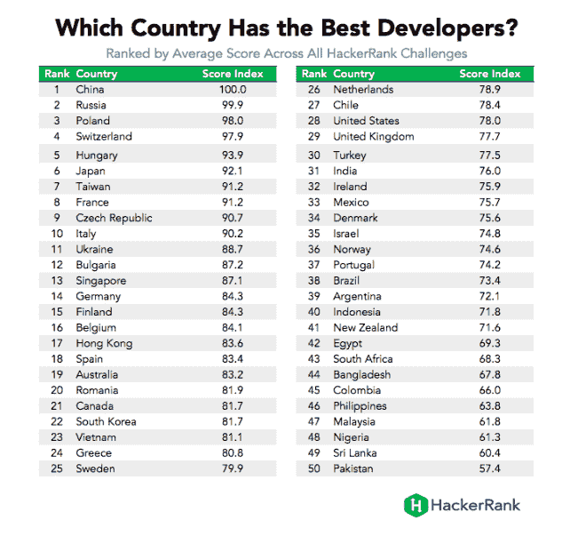
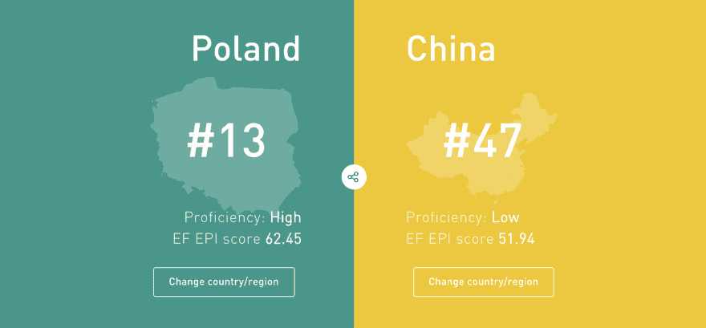
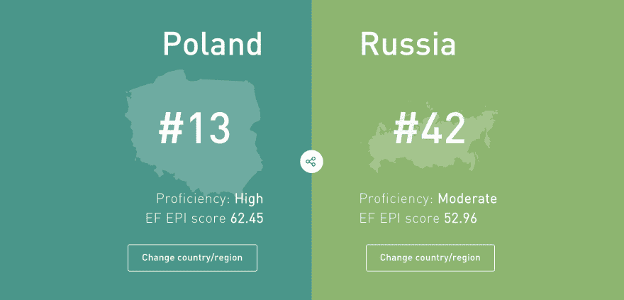

# 关于与波兰开发者合作，你应该知道的 5 件事

> 原文:[https://dev . to/bright devs/5-things-you-should-know-on-working-with-polish-developer-447n](https://dev.to/brightdevs/5-things-you-should-know-about-working-with-polish-developer-447n)

让我们诚实地说:将你的软件开发外包给不同的公司或国家，总是一个巨大的步骤。所以，你很自然地会考虑每一个可能的选择。现在，鉴于你已经看到了这篇文章，我们假设你至少对与波兰开发人员一起工作有一点好奇。他们真的有他们说的那么好吗？用英语和他们交流有多容易？他们的工作道德呢？不要再想了！

我们列出了五件你可能一直想知道，但又不敢问的关于波兰开发者的事情。让我们来看看。

### 1。波兰的开发者是世界上最好的

你听说过一个叫做 [HackerRank](https://www.hackerrank.com/) 的网站吗？在这里，来自世界各地的成千上万的开发人员通过完成各种编码挑战来测试他们的技能。HackerRank 的[编程奥林匹克](https://blog.hackerrank.com/which-country-would-win-in-the-programming-olympics/)的结果说明了一切:波兰开发人员获得第三名(算法、Java、数据结构和许多其他领域的所有类型技术挑战的平均分)。

[T2】](https://res.cloudinary.com/practicaldev/image/fetch/s--1jpfkICh--/c_limit%2Cf_auto%2Cfl_progressive%2Cq_auto%2Cw_880/https://thepracticaldev.s3.amazonaws.com/i/8r4pxj6vqu6od472xa89.png)

波兰人与名单上的前两个国家中国和俄罗斯只差两分。所以，谁知道下一轮奥运会会带来什么？

此外，这里有一个更具体的表现他们技能的方式——这个由波兰游戏开发商 CD Projekt Red 制作的[赛博朋克 2077 预告片](https://www.youtube.com/watch?v=qIcTM8WXFjk&has_verified=1)向你展示了波兰技术人员有多棒。

### 2。波兰人英语说得很好

我相信你已经读过一些可怕的故事，关于外包到国外是一场真正的噩梦，因为你可能最终与一个几乎不会说任何英语的团队一起工作。如果你选择与来自波兰的软件公司合作，这就不是你担心的问题了。到目前为止，英语是该国使用最广泛的外语(一个很大的因素是，只有通过外语考试，你才能高中毕业)。

看看波兰的[英语水平指数](https://www.ef.pl/epi/compare/regions/pl/cn/))，与俄罗斯和中国(因此，在黑客排行榜上的另外两个国家)相比:

[T2】](https://res.cloudinary.com/practicaldev/image/fetch/s--GC9UsLqa--/c_limit%2Cf_auto%2Cfl_progressive%2Cq_auto%2Cw_880/https://thepracticaldev.s3.amazonaws.com/i/bcpbn1pumhn4w7hpaunn.png)

[T2】](https://res.cloudinary.com/practicaldev/image/fetch/s--5F3IRD0D--/c_limit%2Cf_auto%2Cfl_progressive%2Cq_auto%2Cw_880/https://thepracticaldev.s3.amazonaws.com/i/7x1r5q8gfyod0uehp4p5.png)

请记住，这些统计数据显示的是整个波兰，而不仅仅是 IT 人群。看起来很鼓舞人心，不是吗？

### 3。波兰开发人员以强烈的职业道德著称

用欧洲委员会的话说:“波兰最大的财富是它的人民。突出的是他们的志向、学习的动力、高度的工作道德、忠诚和罕见的企业家精神”。这清楚地反映在波兰开发人员的工作方式、优先级以及他们对“完成”一词的理解上。

您还会注意到，波兰开发人员不会那么容易放弃富有挑战性的任务。事实上，HackerRank 将波兰列为世界上第二大最具弹性的开发者群体——与匈牙利同列。此外，波兰是欧盟第六大经济体，拥有强大的国际商业影响力。

有数千家全球性公司在波兰设有重要的业务运营部门。例如，这些公司包括摩根大通、谷歌、优步、高盛、EY 和麦肯锡公司等等。这也意味着波兰软件公司的许多程序员以前在这些和其他跨国组织工作并获得经验。

### 4。波兰符合 GDPR 标准，这意味着您的数据安全可靠

安全是你可以从潜在担忧清单中划掉的另一个关键点。作为欧盟的一部分，波兰软件公司符合 GDPR 的规定，您向他们披露的数据在各个方面都受到保护(为了证明这一点，这里有一个我们自己的[隐私政策](https://brightinventions.pl/privacy-policy/)在 Bright Inventions 的例子)。

当您与波兰软件公司合作时，您的数据会受到先进技术和法律团队的保护，他们会竭尽全力全天候保护您的数据和软件。最后，但同样重要的是…

### 5。时差是可以接受的，波兰和美国东海岸只相隔 6 个小时

如果你想要一个无论你在西半球还是东半球都能找到的团队，波兰是一个理想的位置。波兰和纽约之间有 6 个小时的时差，这意味着双方可以在办公时间舒适地交流。

例如，如果你想在美国东部时间上午 9 点喝咖啡的时候安排你的 sprint 规划电话会议，你的开发人员将刚刚吃完午饭，时钟上显示的是下午 3 点。

希望我们至少已经回答了一些你可能会有的关于与波兰开发者合作的问题。如果你还想知道什么，请联系我们。我们很乐意告诉你更多！

最初发表于 brightinventions.pl

社交媒体和雇主品牌女孩@光明发明
[电子邮件](ula.stankiewicz@beightinventions.pl)， [LinkedIn](https://www.linkedin.com/in/urszula-stankiewicz-7bb10577/)