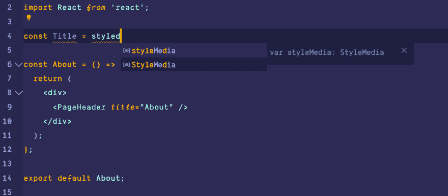

# VSCode IntelliSense 中的 JavaScript 导入

> 原文：<https://dev.to/matthias/javascript-import-in-vscode-intellisense-26cm>

我尝试用 Visual Studio 代码建立一个 JavaScript 项目。除了智能感知，一切都正常。在我的例子中，我添加了*样式的组件*和*属性类型*，但是这两个包都不会被建议导入。

[](https://res.cloudinary.com/practicaldev/image/fetch/s--j6eHO3yS--/c_limit%2Cf_auto%2Cfl_progressive%2Cq_auto%2Cw_880/https://thepracticaldev.s3.amazonaws.com/i/0v7b155shasdkrywj1sk.png)

我已经在我的项目根目录中创建了一个`jsconfig.json`文件，但是这也没有帮助。

```
{  "compilerOptions":  {  "target":  "es6",  "module":  "commonjs",  "jsx":  "react",  "allowSyntheticDefaultImports":  true  },  "exclude":  ["node_modules",  "public",  ".cache"]  } 
```

<svg width="20px" height="20px" viewBox="0 0 24 24" class="highlight-action crayons-icon highlight-action--fullscreen-on"><title>Enter fullscreen mode</title></svg> <svg width="20px" height="20px" viewBox="0 0 24 24" class="highlight-action crayons-icon highlight-action--fullscreen-off"><title>Exit fullscreen mode</title></svg>

我还需要配置什么吗，或者我需要安装一个扩展吗？

如果有人能帮助🥳，那就太好了