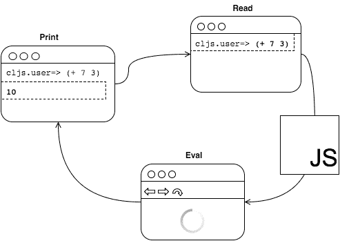
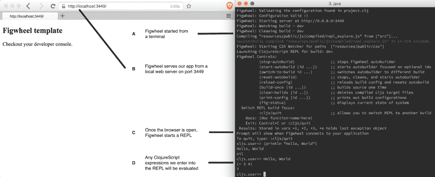
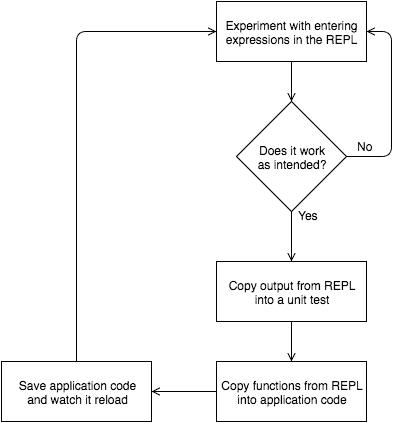
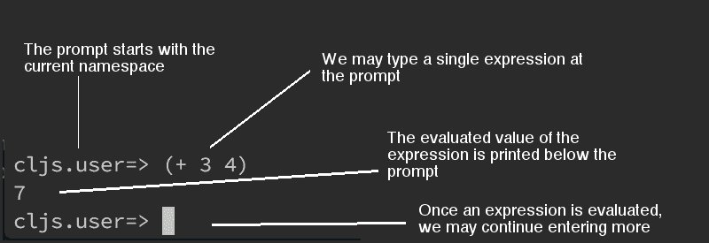
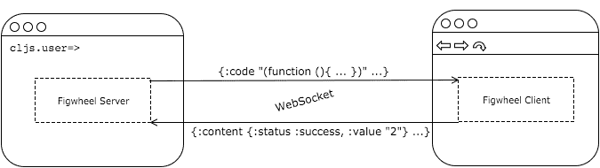

# REPL 速成班

> 原文：<https://dev.to/kendru/repl-crash-course-2p0>

这篇文章是安德鲁的书[第七课](https://www.learn-clojurescript.com/section-1/lesson-7-repl-crash-course/)，[T3】学 ClojureScriptT5】](https://gum.co/learn-cljs)

* * *

在前一章中，我们学习了如何使用 Figwheel 在源文件改变时重新加载代码，从而实现快速反馈循环。在这一章中，我们将首先了解一个叫做 REPL 的工具，它代表*读取-评估-打印循环*，在概念上类似于大多数浏览器提供的 JavaScript 控制台。当我们已经对需要编写的代码有了一个很好的想法时，实时重载是一个很大的帮助，而 REPL 为我们提供了一个编写更具探索性的代码的环境——在将想法和算法作为项目的一部分之前尝试它们。就像单元测试一样，REPL 开发允许我们孤立地测试一段代码，检查它的输出并确保它符合我们的期望。然而，与单元测试不同，REPL 更具交互性，并且提供更快的反馈。

*本章内容:*

*   了解什么是 REPL 并使用它
*   使用 Figwheel 的 REPL 来试验新代码
*   了解 REPL 如何与 web 浏览器交互

## 了解 REPL

正如我们上面提到的，REPL 代表*读取-评估-打印循环*，因为它*读取*我们在提示符下键入的每个表达式，*在 web 浏览器的上下文中评估*该表达式，*在我们的命令行中打印*该表达式的结果。下图说明了这一过程:

[](https://res.cloudinary.com/practicaldev/image/fetch/s--wmQdOQsv--/c_limit%2Cf_auto%2Cfl_progressive%2Cq_auto%2Cw_880/https://kendru.github.io/img/learn-cljs/chapter7/repl-overview.png)

*读取-评估-打印循环*

首先，REPL 等待用户的输入。一旦我们输入了一个 ClojureScript 表达式，它会将该表达式编译成 JavaScript，并将 JavaScript 代码发送到 web 浏览器(通过 WebSocket)进行评估。一旦浏览器评估了 JavaScript 代码，它就将结果发送回 REPL。最后，REPL 打印结果，并等待用户更多的输入。这个循环一直持续到 REPL 被杀死或者它所连接的浏览器被关闭。请记住，ClojureScript REPL 只负责 *Read* 和 *Print* 部分，它需要一个浏览器来执行 *Eval* 步骤，因此，如果您关闭浏览器，REPL 将无法评估任何其他内容，直到您打开它可以再次连接的浏览器。

> *注*
> 
> ClojureScript 有几个不同的 REPL 选项，但我们将在本书中使用 Figwheel。大部分信息将适用于任何 REPL，但请注意，其他复制器的功能可能略有不同。值得注意的是，可以运行使用 Node.js 或 Java 的 JavaScript 引擎 Rhino 的 REPL 来评估编译后的 JavaScript。

简单地提供一个 REPL 并不那么有趣。毕竟，Ruby 和 Python 有 REPL(或“交互式解释器”)，每个现代浏览器的开发工具中都内置了 JavaScript REPL。ClojureScript 的 REPL 的独特之处在于 ClojureScript 是一种*编译的*语言。这意味着 REPL 读取 ClojureScript，将其编译成 JavaScript，评估 JavaScript 代码，并在 ClojureScript REPL 中完全无缝地打印出结果。其他编译到 JavaScript 语言通常提供一个在线接口，用于粘贴部分代码并查看代码编译到的 JavaScript，但 ClojureScript 在为开发人员提供动态、交互式编程环境方面独树一帜。使用 REPL，我们可以确信代码在我们运行的浏览器中完全按照我们希望的那样运行。

## 使用 REPL 进行浏览器交互

为了加载 ClojureScript REPL，我们将再次使用 Figwheel 模板用 Leiningen 创建一个项目:

```
$ lein new figwheel repl-explore
$ cd repl-explore
$ lein figwheel 
```

Enter fullscreen mode Exit fullscreen mode

从上一章来看，这些命令应该很熟悉，因为它们与我们开始第一个项目的方式非常相似。这里唯一的区别是我们没有使用 Figwheel 试剂模板，因为我们不会用这个项目创建浏览器应用程序。概括地说，这个命令使用 Leiningen 构建工具创建了一个名为`repl-explore`的新项目，并使用`figwheel`模板搭建了一些项目文件。最后，我们进入项目目录，开始了 REPL。此时，我们必须启动一个浏览器并访问`http://localhost:3449`，这样我们的 REPL 就可以连接并开始计算表达式。

[](https://res.cloudinary.com/practicaldev/image/fetch/s--aglTKnZD--/c_limit%2Cf_auto%2Cfl_progressive%2Cq_auto%2Cw_880/https://kendru.github.io/img/learn-cljs/chapter7/loading_figwheel_repl.png)

*载入 ClojureScript REPL*

ClojureScript REPL 立即编译我们输入到 JavaScript 中的代码，并在浏览器的上下文中对其进行评估。在前一章中，我们启动 Figwheel，打开浏览器，导航到`http://localhost:3449`。我们使用这种设置在每次保存代码时重新加载代码，但是 Figwheel 还在终端中启动了一个 REPL，可以与网页进行通信。为了使用 REPL，我们可以简单地在 Figwheel 运行的终端窗口中输入表达式，它将在我们的应用程序运行的页面的上下文中执行。此外，我们可以与我们的应用程序代码进行交互，甚至动态地更改它。典型的 ClojureScript 开发周期遵循以下步骤:

[](https://res.cloudinary.com/practicaldev/image/fetch/s--Ev2Sucm9--/c_limit%2Cf_auto%2Cfl_progressive%2Cq_auto%2Cw_880/https://kendru.github.io/img/learn-cljs/chapter7/repl_driven_development.png)

*REPL 驱动的开发工作流程*

虽然我们不会在本章中使用完整的工作流，但我们将探索 REPL，看看我们如何使用它进行探索性开发。一旦 Figwheel 正在运行，我们已经在浏览器中加载了我们的应用程序，我们应该确保我们可以看到 Figwheel 和浏览器。因为我们广泛使用 REPL，所以让我们花点时间了解一下它的命令行界面:

[](https://res.cloudinary.com/practicaldev/image/fetch/s--b6XZ344V--/c_limit%2Cf_auto%2Cfl_progressive%2Cq_auto%2Cw_880/https://kendru.github.io/img/learn-cljs/chapter7/repl_breakdown.png)

*分解 REPL*

当 REPL 启动时，它将显示一个名称空间为`cljs.user`的提示符，后跟一个粗箭头`=>`。正如前面提到的，名称空间是模块化的基本单元，用于将相似的功能和数据组合在一起。每当我们定义函数或数据时，它们都会被添加到某个名称空间中。除非我们手动更改名称空间，否则在 REPL 定义的任何东西都会被添加到`cljs.user`名称空间，这样我们就不会意外地覆盖正在运行的应用程序的代码。在这个提示之后，我们可以开始一次输入一个表达式。一个表达式可以跨多行，但是一旦我们结束了表达式，REPL 就会对其求值并在下一行显示结果。还有一些表达式只是为了副作用而运行，并没有什么有意义的值，比如`(println "Side effects!")`。在这种情况下，REPL 将打印字符串，“副作用！”，并返回`nil`，表示表达式本身没有值。

#### REPL 的琴弦

注意，REPL 显示输入时的特殊字符，
以反斜杠结束，但是如果我们打印带有`println`的字符串，特殊的
字符将以预期的方式打印以供显示:

```

cljs.user=> "New\nLine"

"New\nLine"

cljs . user = >(println " New \ nLine ")
New
Line
nil

```

为了改变到不同的名称空间，我们可以使用`in-ns`函数。该函数将带有名称空间名称的符号*作为参数，并将 REPL 的环境更改为该名称空间。例如，要进入应用程序的主名称空间，我们只需输入`(in-ns 'cljs-weather.core)`。打个比方说文件系统，名称空间就像一个目录，用`def`或`defn`定义一个 var 就像创建一个新文件，`in-ns`就像用`cd`换到一个新目录。一旦进入新的名称空间，我们就可以访问其中定义的所有变量，我们定义的任何新变量都将在该名称空间中定义。*

#### 你试试

*   从命令行启动 REPL 转轮
*   输入一些基本的表达式——记住像数字和字符串这样的东西都是表达式。
*   进入`cljs-weather.core`名称空间，然后返回到`cljs.user`名称空间。

### 在浏览器中运行代码

请注意，当我们启动 Figwheel 时，它会提示我们在加载 REPL 之前打开一个 web 浏览器。为什么我们需要浏览器来使用 REPL？Figwheel 本身并不执行 ClojureScript 代码。相反，它协调将代码编译成 JavaScript 的过程，使用浏览器的 JavaScript 引擎将代码发送到 web 浏览器执行，然后在终端窗口中显示结果。

[](https://res.cloudinary.com/practicaldev/image/fetch/s--QDpZeTpg--/c_limit%2Cf_auto%2Cfl_progressive%2Cq_auto%2Cw_880/https://kendru.github.io/img/learn-cljs/chapter7/figwheel-overview.png)

*转轮客户端/服务器通信*

当我们在 REPL 中输入一个表达式时，Figwheel 调用 ClojureScript 编译器来生成一段 JavaScript 代码。然后，它将这个 JavaScript 代码通过 WebSocket 发送到 web 浏览器，浏览器对其进行评估，并通过 WebSocket 返回给 Figwheel 服务器。如果在运行编译后的 JavaScript 时出现任何异常，错误输出将被发送回 Figwheel 供我们查看。

这看起来像是不必要的间接方式，但是由于几个原因，它实际上非常有用。首先，我们可以确信我们的代码将在 web 浏览器的上下文中真正做正确的事情，其次，我们可以直接从 Figwheel REPL 操作浏览器。我们现在将尝试更多的例子，这次是一些 DOM 操作。

#### REPL 的浏览器交互

```
(in-ns  'cljs-weather.core)  ;; <1>  ;; nil  (def  input  (.createElement  js/document  "input"))  ;; <2>  ;; #'cljs-weather.core/input                                     <3>  (.appendChild  (.-body  js/document)  input)  ;; #object[HTMLInputElement [object HTMLInputElement]]  (set!  (.-placeholder  input)  "Enter something")  ;; <4>  ;; "Enter something"  (defn  handle-input  [e]  ;; <5>  (swap!  app-state  assoc  :text  (->  e  .-target  .-value)))  ;; #'cljs-weather.core/handle-input  (set!  (.-onkeyup  input)  handle-input)  ;; #object[cljs_weather$core$handle_input ...] 
```

Enter fullscreen mode Exit fullscreen mode

1.  进入我们应用的主命名空间
2.  创建一个`input`元素并将其添加到 DOM 中
3.  `def`评估已定义的 var
4.  更改元素的`placeholder`属性
5.  创建一个事件处理程序，并将其附加到`input`。注意，这个表达式跨越了多行。

在评估了 REPL 中的所有这些表达式后，我们的应用程序中将会有一个标题和一个输入，每当我们在其中键入内容时，`h1`将会根据我们键入的内容进行更新。这是非常强大的，因为现在我们有了一些我们知道可以工作的代码，我们可以简单地从我们的 REPL 会话中复制语句并粘贴到我们的应用程序中。然而，在将代码粘贴到应用程序之前，我们甚至可以在 REPL 中进行一些重构。每当我们在 REPL 中重新定义某些东西时，它都会影响正在运行的应用程序，所以在我们开始重新定义代码之前，没有必要刷新页面。但是，如果我们添加了任何事件侦听器或者修改了 DOM，我们可能希望刷新页面以返回到“干净的状态”。在我们的例子中，我们将只重构`handle-input`函数，所以我们可以继续而不用重新加载页面。

### 快速回顾

*   用你自己的话来解释在 REPL 中输入`(+ 40 2)`并按回车键后会发生什么。
*   查找`https://clojuredocs.org/`并尝试运行 REPL 中的一些示例。ClojureScript 的大部分库与 Clojure 的完全相同，因此大部分示例在两种语言中都可以正常工作。

*注意:*我们在 REPL 中定义的任何内容都将持续到我们关闭或刷新 web 浏览器，因此，如果我们想放弃我们在 REPL 中定义的任何内容，只需刷新浏览器即可。相反，当在 REPL 会话中，我们应该注意不要刷新浏览器，以免丢失我们建立的状态。

我们可能希望获得在多个地方触发事件的一些输入的值，因此我们可以将其提取到自己的函数中。如果我们将应用程序状态的更新提取到它自己的函数中，我们还可以使事件处理程序的意图更加清晰。

```
(defn  event-value  [e]  (->  e  .-target  .-value))  ;; #'cljs-weather.core/event-value  (defn  update-text  [value]  (swap!  app-state  assoc  :text  value))  ;; #'cljs-weather.core/update-text  (defn  handle-input  [e]  (update-text  (event-value  e)))  ;; #'cljs-weather.core/handle-input 
```

Enter fullscreen mode Exit fullscreen mode

从这个简短的 REPL 部分，我们现在有一些干净的，重构的代码，我们可以在我们的应用程序中使用。几乎所有的代码都需要重构，但 REPL 驱动的开发风格使我们能够在开发过程的早期进行重构，这样当我们编写单元测试或将 REPL 中的代码粘贴到应用程序中时，它已经干净简洁了。我们越早能够清理我们的代码，我们积累的技术债务就越少，最终，我们的开发变得更有成效。

## 总结

在本章中，我们探讨了如何使用 REPL 与网页进行交互。我们用它来测试新代码，并与应用程序主名称空间中的代码进行交互。和任何技能一样，练习是发展最终走向精通的能力的关键，ClojureScript 的 REPL 是练习新技能的最佳方式之一。接下来，我们将在 REPL 会议上介绍几乎每个主题。我们现在可以:

*   从命令行启动 REPL 转轮
*   了解在 REPL 中输入的代码是如何计算的
*   在将代码提交到我们的项目之前，在 REPL 中编写并重构代码