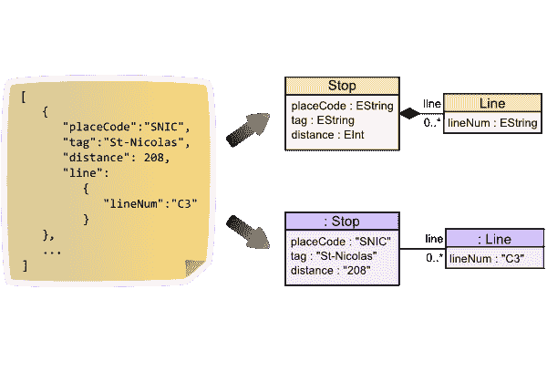
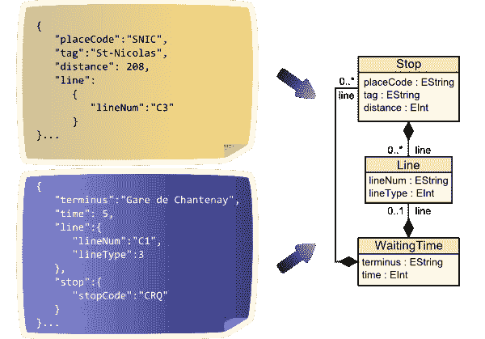
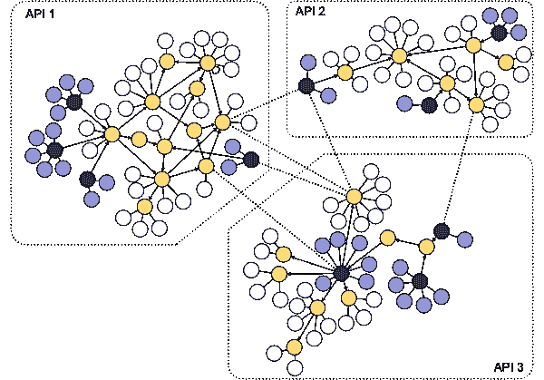

# JSON Discoverer——可视化 JSON 文档的模式

> 原文:[https://dev . to/JCA bot/JSON-discoverer-visualize-the-schema-of-your-JSON-documents-2p6l](https://dev.to/jcabot/json-discoverer-visualize-the-schema-of-your-json-documents-2p6l)

[JSON discoverer](http://som-research.uoc.edu/tools/jsonDiscoverer/#/) 允许您发现 JSON 文档的隐式模式。

任何 JSON 文档都包括元数据(即模式)和数据(即符合模式的对象/值)。问题是，通常元数据部分是隐式的(存在类似于 [JSONSchema](https://json-schema.org/) 的替代方案，但没有广泛使用),并且必须从数据本身的轻微(嵌套)结构中推断出来。

这使得阅读 JSON 文档变得非常困难。给定一个 JSON 文档，我们的工具将生成一个 [UML 类图](https://modeling-languages.com/uml-tools/)来可视化文档的结构，并生成一个 UML 对象图来显示 JSON 数据本身作为模式的一个实例。

我们相信这个工具对于快速掌握非常有用，例如，API 调用提供的响应类型。

此外，我们的工具还通过发现不同 API 之间的公共模式部分，帮助您发现它们之间可能的组合。

事实上，该工具提供了三种不同的服务:

*   简单发现器简单发现模式分析单个 JSON 定义，并提供模式和数据。

[T2】](https://res.cloudinary.com/practicaldev/image/fetch/s--6LOvuFmv--/c_limit%2Cf_auto%2Cfl_progressive%2Cq_auto%2Cw_880/http://som-research.uoc.edu/tools/jsonDiscoverimg/simpleLanding.png)

*   高级发现者高级模式分析 JSON 定义集，并发现它们之间的公共模式。

[T2】](https://res.cloudinary.com/practicaldev/image/fetch/s--qDF50Q09--/c_limit%2Cf_auto%2Cfl_progressive%2Cq_auto%2Cw_880/http://som-research.uoc.edu/tools/jsonDiscoverimg/advancedLanding.png)

*   API Composer API Composer 帮助您以图形化的方式识别 API 组合。

[T2】](https://res.cloudinary.com/practicaldev/image/fetch/s--77oZIHnX--/c_limit%2Cf_auto%2Cfl_progressive%2Cq_auto%2Cw_880/http://som-research.uoc.edu/tools/jsonDiscoverimg/compositionLanding.png)

对于后一部分，我们有一个(单独的、更新的)工具，您也可以看看: [REST API Composer](https://modeling-languages.com/rest-api-composer/) 。除此之外，JSON Discoverer 的工作还像第一天一样顺利，从那以后已经帮助了很多人。试试看！