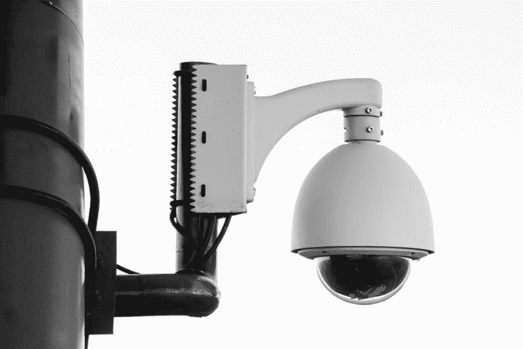

# 我对在日常生活中使用 VPN 的想法

> 原文:[https://dev . to/roelofjanelsinga/my-thoughts-about-use-a-VPN-in-daily-life-4pd](https://dev.to/roelofjanelsinga/my-thoughts-about-using-a-vpn-during-everyday-life-4pd)

[T2】](https://res.cloudinary.com/practicaldev/image/fetch/s--T-0qA8kc--/c_limit%2Cf_auto%2Cfl_progressive%2Cq_auto%2Cw_880/https://thepracticaldev.s3.amazonaws.com/i/esqj306p1q4amzzcbj0c.jpeg)

# 我对在日常生活中使用 VPN 的想法

在过去的一个月里，我一直用 VPN 上网，包括我的工作笔记本电脑和手机。这是一个令人着迷的实验，以下是我认为你应该尝试一下的一些原因:

1.  你可以浏览某个国家独有的内容
2.  你是匿名的
3.  你更安全

## 浏览国家独家内容

当我在美国和荷兰之间移动时，我错过了来自其他国家的内容。在荷兰的时候，我看不到一些在美国可以看的网飞的节目。在美国时，我无法在 Spotify 上看到一些荷兰音乐。我错过了几天前我还能看到的内容，只是因为我去了另一个国家。这对我来说是不可接受的，因为我还是我，设备还是一样的。我希望能够访问任何和所有内容，无论我在哪里。VPN 允许我这样做。它只是让我选择一个我想假装自己来自的国家，我可以浏览互联网，就好像我真的在那个国家一样。这允许我绕过某些检查，直接进入内容。互联网应该是一个开放的地方。透明是一件好事(大多数时候)，能够绕过国家检查使互联网成为一个更加开放的空间。

## 匿名

当使用虚拟专用网时，一个好的虚拟专用网，它会隐藏你的实际 IP 地址给任何时候你连接的服务器。这样做的主要好处是你的浏览器行为不会被追踪到你个人。你是匿名的，直到你决定不再匿名，比如登录一个应用程序。匿名有几个好处，最广为人知的是让广告商几乎不可能追踪到你。另一个重要原因是，你的 IP 地址是隐藏的，这意味着黑客很难跟踪你的行动，找到你的位置。

## 躲避广告商

与匿名密切相关的是躲避广告商。当广告商无法追踪你的动向时，他们就无法利用你的数据向你发送有针对性的广告。这并不是说你没有得到广告，而是说你得到的广告并不适用于你的浏览行为。这对我来说很酷，因为这表明他们真的无法跟踪我。我从来不喜欢人们用一堆数据来推测你喜欢什么。对我来说非常讽刺的是，这是我工作的一部分，但这更多地与现场跟踪有关。你准备好接受充满“激进”想法的段落了吗？如果有，看下一段，如果没有，直接跳过。

#### 在我这个小小的阴谋论者身上写下了下面这段话

当你在多个网站上跟踪用户，为数据仓库提供数据，并利用这些数据来发现你的用户是谁，他们喜欢什么时，你手中有很大的权力，这可能会被用来作恶。相反，我提倡的是只跟踪现场行为，并允许人们选择加入，而不是退出。这样你就能更好地为你的顾客服务。这也是欧盟的 GDPR 法律如此伟大的原因之一。把数据的力量还给提供数据的人。当你在另一个地理区域时，你可能没有这些保护，这就是为什么 VPN 非常有意义。如果你不能控制是否将数据发送到网站，请确保他们从你那里收集的数据是无用的，因为他们无法追踪到你。

## 安全

如果你认为仅仅躲在 VPN 后面不足以保护你的设备，你可以找到一个 VPN，在数据到达目的地之前，通过 2 个或更多的服务器代理你的数据。这在你和你想阻挡的人之间增加了许多层。如果这还不够，你可以选择一个 VPN，允许你通过洋葱网络路由你的流量。这将使你无法跟踪，但也更慢。但是你要明白，有很多选择可以让你匿名，你可以选择你想走多远。

在我使用 VPN 之前，我在国外时通过 Tor 网络访问互联网。不同的互联网法律可能会导致你在一个国家做完全合法的事情，但在另一个国家却是非法的(例如，通过 torrents 下载)。为了避免这一切，我确保自己被隐藏起来。当我去美国的时候，有传言说政府正在开发一个系统，他们可以利用这个系统来监控任何人的互联网使用情况。这对我来说感觉像是一个巨大的隐私侵犯，我对此感到不舒服。我没什么好隐瞒的，但是有人监视你，只是因为他们可以，这感觉不对。使用 VPN 时，不可能“窃听”你的数据，因为任何与互联网的数据交换都是加密的。这意味着只有 VPN 提供商知道你是谁，理论上你做什么，但从这一点上来说，没有人知道。

## 结论

虚拟专用网很棒，你是匿名和安全的。可以访问任何和所有基于位置的内容，所以当你点击“在你的区域不可用”的消息时不会有问题，因为你可以假装你来自另一个区域，然后再试一次。你可以更多地使用互联网，同时还可以隐藏起来。广告商将无法利用你的浏览行为来发送你的广告。因此，如果你担心一些公司似乎在用广告跟踪你，你应该使用 VPN，你会立即看到他们消失。

你使用虚拟专用网吗？你用的是哪一个？让我们在[推特](https://twitter.com/RJElsinga)上讨论一下吧！