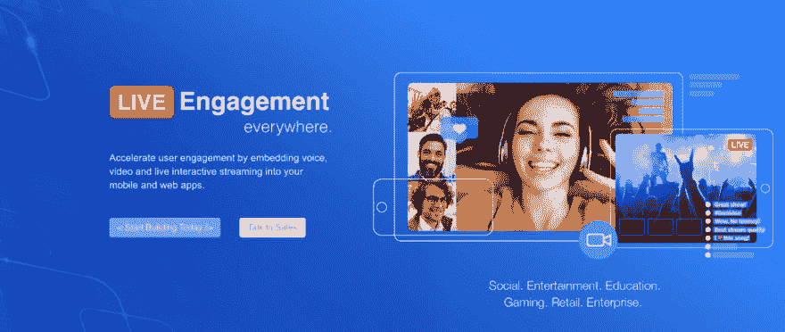
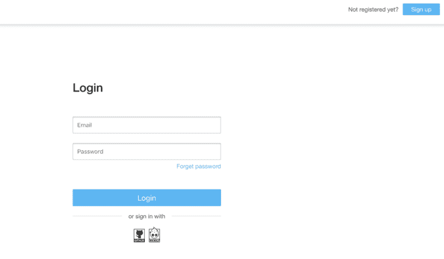
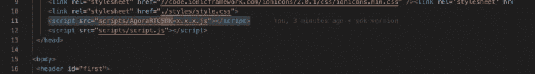
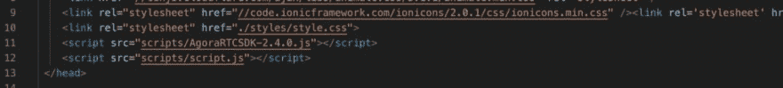
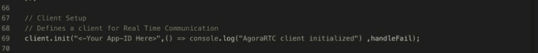

# 使用 Agora.io 创建您的视频聊天室

> 原文:[https://dev . to/4 not four/create-your-video-chat-room-with-agora-io-4j 05](https://dev.to/4notfour/create-your-video-chat-room-with-agora-io-4j05)

[T2】](https://res.cloudinary.com/practicaldev/image/fetch/s--_Zm0JiW9--/c_limit%2Cf_auto%2Cfl_progressive%2Cq_auto%2Cw_880/https://cdn-images-1.medium.com/max/1024/1%2AtVPacafaoNpql50DXdDQQg.png)

想知道视频通话是如何工作的吗？想创建自己的聊天室吗？曾经希望在你的项目中包含一个视频流，但不知道从哪里开始？那你来对地方了。

我将解释一个简单的方法来完成以上所有的工作。此外，所有这些都可以由任何初学者来做，而不会让你感到吃力！是的，你说对了。无论您是初学者还是专业开发人员，这都是适合您的完美解决方案！

这样想，如果你面前的问题有一个完美的工作解决方案，你会尝试创建另一个你甚至不确定的解决方案吗？没有。就像这样，我们确实有许多预构建的解决方案可供我们使用。关键是要找到最适合我们使用的产品。从技术上来说，现在很多很多的 API 可以以多种方式集成到我们的项目中，以提高我们的生产力和简化我们的工作。幸运的是，大多数 tbem 在一段时间内都是免费的。

那么我们这里有什么？想象一下，我们需要为一个项目创建一个视频聊天室，我们不想从头开始。有大量的 API 可供您使用。你应该用哪一个？很难回答的问题，对吗？显然，你没有耐心去尝试每一种方法并得到结果。在这里，我将向您介绍 Agora.io 最简单、最强大的 API 之一

首先，我将简要介绍 Agora.io 以及我选择 Agora.io 的原因

**agora . io 是什么？**

Agora.io 通过一个简单而强大的 SDK 为您添加实时语音和视频通信提供了构建模块。您可以集成 Agora SDK，以便在您的应用程序中快速实现实时通信。

Agora 的软件定义实时网络(SD-RTN)是由 Agora 构建的实时传输网络，是世界上唯一专为实时通信设计的网络基础设施。Agora SDK 提供的所有语音和视频服务都通过 Agora SD-RTN 进行部署和传输。

Agora 在全球部署了大约 200 个数据中心，这些数据中心使用智能动态路由算法来实现毫秒级延迟，并确保 Agora 服务的高可用性。

一句话，我们可以说 Agora 是所有实时通信问题的唯一解决方案！

为什么我选择了 agora？

当然，我选择 agora 有很多特点和原因。但在这里我会指出几个我最喜欢的。

*   每月前 10，000 分钟免费。
*   [开发者中心](https://docs.agora.io/en)为开发者集成和使用 Agora SDKs 提供文档，并提供 SDK 和示例代码下载。
*   容易实现。
*   全天候可靠。
*   高度可定制。挑选您需要的通话或互动广播功能。
*   包括移动、web 和桌面应用所需的所有开发工具和云基础设施。
*   易于为每种流行语言和框架采用 SDK、API 和代码示例。
*   兼容性和互操作性
*   高保真、3D 环绕声体验
*   UDP(用户数据报协议)优化
*   世界上唯一使用自主开发的音频和视频编解码器的 RTC 服务提供商。这使得 Agora 在音频和视频质量上具有独特的优势。
*   抗丢包优化

**agora . io 提供了什么？**

*   语音 SDK
*   视频 SDK
*   互动游戏 SDK
*   实时消息传递 SDK(测试版)
*   录制 SDK
*   Agora 云记录 SDK
*   社区 SDK
*   Agora MediaPlayer 套件

想进一步了解以上内容？然后迎面 [**这里**](https://docs.agora.io/en/Agora%20Platform/downloads) **。**

还有更多！让我们停止谈话，言归正传。尝试创建自己的视频聊天室，亲自体验一下吧！

### 如何使用 agora.io 创建您的视频聊天室

请遵循以下步骤:

> 在 agora.io 中创建您的第一个项目

第一步:进入[**agora . io**T3】](https://www.agora.io/en/)

第二步:点击右上角的**注册**，然后**创建你的账户**。

<figure> 

<figcaption>注册并登录</figcaption>

</figure>

现在登录以访问您的仪表板。就像 tbat 你已经成功创建了一个 agora.io 开发者账号。

第三步:现在**点击**上的**创建新项目**按钮，用你选择的名字创建一个新项目。

<figure> 

<figcaption>仪表盘</figcaption>

</figure>

现在你可以看到一个类似上面的屏幕，上面有你的项目名和 **APP-ID** ，我们稍后会用到。

太好了。您在 agora.io 中的第一个项目已创建！现在怎么办？

> **下载量**

1.  [**点击这里**](http://download.agora.io/sdk/release/Agora_Web_SDK_v2_9_0_FULL.zip?_ga=2.9451574.249610254.1568037557-875816693.1550734057&_gac=1.37545620.1568138509.EAIaIQobChMIhonOjevG5AIVwRErCh25PAkTEAAYASAAEgIZovD_BwE) 下载最新的 Agora.io SDK。
2.  [**点击这里**](https://github.com/murshid440/videochat-web-agora.git) 下载视频聊天室演示。

现在，您已经拥有了运行第一次试验所需的所有必要文件！

> 让我们开始吧

第一步:**复制**的 *AgoraRTCSDK-x.x.x..js* 文件从 **Agora-Web-SDK** 文件夹到**Videochat-we b-Agora/scripts**文件夹。

第二步:在编辑器中打开**call.html**页面。

第三步:**用你刚刚下载的 **SDK 版本**替换*中的*** ****x.x.x*** ，如下图截图所示。*

 *<figure> 

<figcaption>之前替换</figcaption>

</figure>

<figure> 

<figcaption>替换掉</figcaption>

</figure>

后

第四步:打开**videochat-we b-agora/scripts**文件夹内的 script.js 文件。

第五步:**将***<——你的 App-ID 在这里>* 替换为你之前从 agora.io 仪表盘中获得的 **App-ID** 。

<figure> 

<figcaption>用你的 App-ID</figcaption>

</figure>

替换这里的<-你的 App-ID>

万岁！就是这样！是的，你和 agora.io 有一个视频聊天室

> **工作原理**

第一步:在你的任何一个浏览器中打开 index.html 文件。

第二步:你会看到一个带有**加入**按钮的主页。只需**点击那上面的**。

第三步:你可能会被提示给视频和麦克风**访问**。单击允许并等待 5-10 秒钟。

第四步:你会在屏幕的右上角看到你自己！

为什么看不到别人？因为那里没有别人！因此，为了检查它是否工作正常，打开另一个带有相同索引页面的标签页并点击登录。

第 4 步:现在你可以在中间的另一个选项卡中看到提要。

现在你已经让它工作了，只需要在你的主机服务提供商那里托管所有的文件，然后把链接发给你的朋友就可以了！

注意:*如果您给了摄像头访问权限，但仍然无法看到您的提要，请等待 1 分钟，或者尝试刷新页面或尝试其他浏览器。*

> **如何修改？**

如果你不能正确地修改它，那还有什么意思呢！你可以通过这个 [**链接**](https://www.youtube.com/watch?v=URuxgZmDYA8) 或者直接去这个 [**链接**](https://github.com/AgoraIO/Agora-Web-Tutorial-1to1) 查看 scratch GitHub 教程。

现在要修改这个聊天室，就像修改任何网站一样简单！

***【index.html】***页面只是一个简单的登陆页面，你可以在这里添加一个*登录页面*如果你需要或者你喜欢的任何东西。

*是你打电话的地方。在那里你可以调整镜头的位置，如果需要的话可以添加更多的动作。*

 ****script.js*** 是主要动作发生的地方。仔细调整它，为你的房间增添更多特色。

所有的调整都可以通过每个文件中容易理解的注释轻松完成。只是浏览一下，让我知道是否需要进一步的澄清！

> **不够？**

想要做更多？这是你所有疑问的官方文档的链接。

1.  SDK [**下载**](https://docs.agora.io/en/Agora%20Platform/downloads)
2.  [**样张**](https://docs.agora.io/en/Agora%20Platform/sampleapps)

尝试不同的示例应用程序或创建自己的应用程序。

仔细阅读它们，你可以根据你的用例尝试构建你需要的任何东西。此外，还会有更多的教程。如何看待在一些 AI/ML 应用中使用 Agora.io？让我们下次试着深入研究一下吧！

请随意评论您的想法！干杯！

* * ***