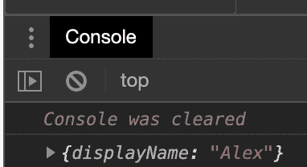

# 向静态站点添加角度反应式表单 Web 组件

> 原文:[https://dev . to/codingcatdev/adding-angular-reactive-form-web-components-to-your-static-site-bfn](https://dev.to/codingcatdev/adding-angular-reactive-form-web-components-to-your-static-site-bfn)

> 对 Alligator.io 大声喊出来，感谢所有的[帮助](https://alligator.io/angular/custom-form-control/)！

# 给静态站点添加动态特性。

这是一个由多个部分组成的系列，涵盖了我目前在 https://ajonp.com 网站上使用的所有不同类型的 Web 组件。我只是想展示如何在较高的水平上使用它们。

Max 的帖子激发了我分享更多的想法:

 [## 为什么我们使用 Web 组件

### 爱奥尼亚 7 月 8 日 1911 分钟最大林奇读数

#webcomponents #shadowdom #ionicframework #stencil](/ionic/why-we-use-web-components-2c1i)

## 在腹板构件中完全起作用的角反应形式

这非常简单，它将表单中的缺省值设置为`Alex`，我们将在本系列的另一部分对此做进一步介绍，以包括更多的验证。

[https://stackblitz.com/edit/ionic-core-angular-webcomponent-working?](https://stackblitz.com/edit/ionic-core-angular-webcomponent-working?)

### 控制台输出举例

这显示了预期的带有`displayName: 'Alex'`的`formGroup`值。

[T2】](https://res.cloudinary.com/practicaldev/image/fetch/s--NztVuYIY--/c_limit%2Cf_auto%2Cfl_progressive%2Cq_auto%2Cw_880/https://thepracticaldev.s3.amazonaws.com/i/v37qluuhug4ujkeoxbx4.png)

## 使用离子输入的问题

用 Ionic repo 记录了一个[问题](https://github.com/ionic-team/ionic/issues/19326)(让我头疼了 24 小时)。

[https://stackblitz.com/edit/ionic-core-angular-webcomponent-not-working?](https://stackblitz.com/edit/ionic-core-angular-webcomponent-not-working?)

## 最好的部分

现在我们可以把一个简单的例子打包成 NPM 包(或者 GitHub 包)并在其他应用中使用它。

让我知道你的想法！