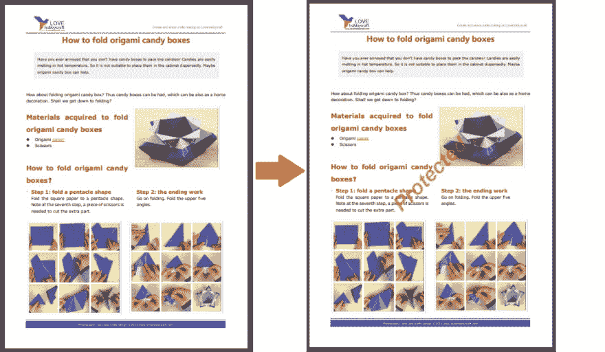

# 用 C#或 Java 在多个文档和图像中插入水印

> 原文：<https://dev.to/usmanaziz/applying-the-watermark-to-a-batch-of-documents-images-33kj>

水印是一种流行的技术，用于指示文档中的内容是机密的，或者文档包含的信息/数据是创作者版权所有的。类似地，在许多情况下，带水印的文档在公司内的所有利益相关者和合作伙伴之间共享。然而，手动将水印一个接一个地应用于一堆文档是相当困难的。因此，为了使这个过程更容易，我们需要一些自动化。

在本文中，我将向您展示如何用最少的努力一次将水印应用到包括多个文档或图像的一批文件中。

许多软件组件可以让你添加水印。我将使用 [GroupDocs。水印](https://products.groupdocs.com/watermark) API，两者皆可用。NET 和 Java 平台。使用这个 API 的好处是，您可以使用各种选项来控制水印的外观和位置。让我们开始吧。

**步骤**

您需要按照以下步骤将水印应用到文档:

*   加载文档
*   创建并初始化水印对象
*   设置水印属性，如位置、大小、不透明度、字体等。
*   给文档添加水印
*   保存文档

这就是我们将这些步骤转换成代码的方式。

**代码**

*   *C#*

```
DirectoryInfo dir = new DirectoryInfo(@"../../Documents/");
FileInfo[] files = dir.GetFiles();
// Iterate through the files
foreach (FileInfo file in files)
{
    // Load document
    using (Document doc = Document.Load(file.FullName))
    {
        // Initialize the font to be used for watermark
        Font font = new Font("Calibre", 50, FontStyle.Bold | FontStyle.Italic);
        // Create watermark
        TextWatermark watermark = new TextWatermark("Protected", font);
        // Set watermark properties
        watermark.ForegroundColor = Color.Red; 
        watermark.TextAlignment = TextAlignment.Right;
        watermark.Opacity = 0.5;
        watermark.HorizontalAlignment = HorizontalAlignment.Center;
        watermark.VerticalAlignment = VerticalAlignment.Center;
        watermark.RotateAngle = -45;
        // Apply watermark
        doc.AddWatermark(watermark);
        // Save document
        doc.Save(Path.Combine("../../Output",file.Name));
    }
} 
```

<svg width="20px" height="20px" viewBox="0 0 24 24" class="highlight-action crayons-icon highlight-action--fullscreen-on"><title>Enter fullscreen mode</title></svg> <svg width="20px" height="20px" viewBox="0 0 24 24" class="highlight-action crayons-icon highlight-action--fullscreen-off"><title>Exit fullscreen mode</title></svg>

*   *Java*

```
 // Get files in the Documents folder
File folder = new File("./Documents/");
File[] listOfFiles = folder.listFiles();

// Iterate through the files
for (int i = 0; i < listOfFiles.length; i++) {
    if (listOfFiles[i].isFile()) {
        Document doc = Document.load(listOfFiles[i].getPath());
        // Create watermark
        Font font = new Font("Calibre", 50, FontStyle.Bold | FontStyle.Italic);
        TextWatermark watermark = new TextWatermark("Protected", font);
        // Set watermark properties
        watermark.setForegroundColor(Color.getRed());
        watermark.setTextAlignment(TextAlignment.Right);
        watermark.setOpacity(0.5);
        watermark.setHorizontalAlignment(HorizontalAlignment.Center);
        watermark.setVerticalAlignment(VerticalAlignment.Center);
        watermark.setRotateAngle(-45);
        // Apply watermark to the document
        doc.addWatermark(watermark);
        // Save document
        doc.save("./Output/" + listOfFiles[i].getName());

        doc.close();
    }
} 
```

<svg width="20px" height="20px" viewBox="0 0 24 24" class="highlight-action crayons-icon highlight-action--fullscreen-on"><title>Enter fullscreen mode</title></svg> <svg width="20px" height="20px" viewBox="0 0 24 24" class="highlight-action crayons-icon highlight-action--fullscreen-off"><title>Exit fullscreen mode</title></svg>

**输出**

[](https://res.cloudinary.com/practicaldev/image/fetch/s--W_S5p3n7--/c_limit%2Cf_auto%2Cfl_progressive%2Cq_auto%2Cw_880/https://thepracticaldev.s3.amazonaws.com/i/ea02e29bwwz866acc281.png)

**源代码**

从 [GitHub](https://github.com/usmanazizgroupdocs/batch_watermark) 下载完整的现成源代码。

干杯！