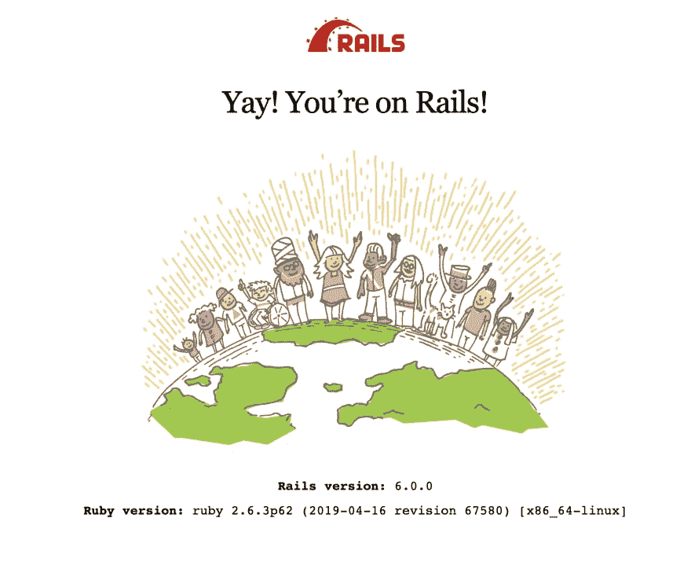

# 我的 Rails 笔记

> 原文:[https://dev.to/n350071/my-rails-note-47cj](https://dev.to/n350071/my-rails-note-47cj)

## [](#tips)提示

### [](#rails-tips)铁轨提示

*   📚 [Ruby on Rails API](https://api.rubyonrails.org/)
*   📚[导轨](https://guides.rubyonrails.org)
    *   📚[导轨 Guid 边缘](https://edgeguides.rubyonrails.org/)
    *   📚 [Rails Guid 日文版](https://railsguides.jp/)
*   💡强制停止 rails 服务器
    *   `kill -9 $(cat tmp/pids/server.pid)`[](/n350071) [## Path analysis

        ### N3500711 November 7th 191 minutes reading

        #rails](/n350071/path-resolve-1dc)

### [](#ruby-tips)红宝石提示

[](/n350071) [## [Ruby]很棒的方法

### n350071🇯🇵11 月 27 日 191 分钟阅读

#rails](/n350071/ruby-awesome-methods-19p6)
[](/n350071) [## 在 Ruby 中切换几个没有 tmp 变量

### n350071🇯🇵9 月 27 日 191 分钟阅读

#rails](/n350071/switch-a-couple-of-variable-without-tmp-in-ruby-20ja)
[](/n350071) [## 停止检查它在 Rails 中是否为零

### n350071🇯🇵9 月 27 日 191 分钟阅读

#rails](/n350071/stop-checking-if-it-s-nil-in-rails-17gi)
[](/n350071) [## 从 1 开始 each_with_index(这对 UI 有好处)

### n350071🇯🇵9 月 27 日 191 分钟阅读

#rails](/n350071/start-eachwithindex-from-1-this-is-good-for-ui-2hj1)
[](/n350071) [## 从 Rails 中的一对键值数组转换为 Hash

### n350071🇯🇵9 月 30 日 191 分钟阅读

#rails](/n350071/convert-to-hash-from-a-couple-of-the-key-value-array-in-rails-2ag6)
[](/n350071) [## ary.map(&:to_s)，这是什么？

### n350071🇯🇵9 月 30 日 191 分钟阅读

#rails](/n350071/the-ary-map-tos-what-is-this-n2i)
[](/n350071) [## define_method(一次编写，随处运行！)

### n350071🇯🇵10 月 3 日 191 分钟阅读

#rails](/n350071/definemethod-write-once-run-everywhere-1d0i)
[](/n350071) [## 将 do end 块重构为{}，以减少 Rails 中滚动

### n350071🇯🇵10 月 3 日 191 分钟阅读

#rails](/n350071/refactor-do-end-block-to-for-reduce-scrolling-in-rails-38bd)
[](/n350071) [## Ruby 数组多重赋值

### n350071🇯🇵11 月 7 日 191 分钟阅读

#rails](/n350071/ruby-array-multiple-assignment-34df)
[](/n350071) [## [Ruby] heredocument (头发文档)

### n350071🇯🇵11 月 27 日 191 分钟阅读

#rails](/n350071/ruby-heredocument-1mkg)

## [](#designarchitecter-pattern)设计/架构模式

[](/n350071) [## 关注|拆分、分拆，在 Rails 中分担责任

### n350071🇯🇵9 月 27 日 191 分钟阅读

#rails](/n350071/concern-split-and-spin-off-share-the-responsibility-in-rails-11ol)
[](/n350071) [## 在 Rails 中形成对象模式

### n350071🇯🇵10 月 3 日 191 分钟阅读

#rails](/n350071/form-object-pattern-in-rails-19la)
[](/n350071) [## Ruby 中的对象哈希模式

### n350071🇯🇵10 月 25 日 191 分钟阅读

#rails](/n350071/object-hash-pattern-in-ruby-4j1h)
[](/n350071) [## PORO 的服务等级

### n350071🇯🇵11 月 7 日 191 分钟阅读

#rails](/n350071/service-class-by-poro-10m0)

*   装饰者
    *   [德雷珀](https://github.com/drapergem/draper)

## [](#gems)宝石

[](/n350071) [## 通过在继承链中插入一个模块来覆盖 gem 方法

### n350071🇯🇵11 月 27 日 191 分钟阅读

#rails](/n350071/overwrite-a-gem-method-by-inserting-a-module-in-your-inheritance-chain-44g5)

### [](#authorization)授权

[](/n350071) [## 用 define_method 组织银行/银行 gem 的授权

### n350071🇯🇵9 月 25 日 191 分钟阅读

#rails #gem](/n350071/organize-the-authorizations-of-the-banken-pundit-gem-with-definemethod-2gei)
[](/n350071) [## “[Devise] Arbitrary Routing (任何路由)

### n350071🇯🇵11 月 27 日 191 分钟阅读

#rails](/n350071/devise-arbitrary-routing-3l7h)

### [](#state-machines-status)状态机，状态

*   aasm！aasm

### [](#code-quarity)代码质量

[](/n350071) [## rails 中代码质量和格式的 robocop

### n350071🇯🇵9 月 25 日 191 分钟阅读

#rails](/n350071/rubocop-for-code-quality-and-formatting-in-rails-dn)
[](/n350071) [## 利用 Breakman 对 Rails 应用程序进行静态安全性分析

### n350071🇯🇵9 月 25 日 191 分钟阅读

#rails #gem](/n350071/static-security-analysis-for-rails-app-by-using-breakman-283a)
[](/n350071) [## 在 Rails 中度量您的测试代码覆盖率

### n350071🇯🇵9 月 27 日 191 分钟阅读

#rails #gem](/n350071/metrics-your-test-code-coverage-in-rails-ala)

## [](#rails-standard-features)Rails 标准特性

*   秘密，凭证

### [](#model)型号

[](/n350071) [## Rails 中的模型/表名转换

### n350071🇯🇵9 月 27 日 191 分钟阅读

#rails](/n350071/model-table-name-conversions-in-rails-56hj)
[](/n350071) [## Rails 中一个常见的验证问题

### n350071🇯🇵9 月 30 日 191 分钟阅读

#rails](/n350071/a-common-validations-concern-in-rails-1e33)
[](/n350071) [## Activerecord Rails 中的常量枚举

### n350071🇯🇵9 月 30 日 191 分钟阅读

#rails](/n350071/constant-enum-in-activerecord-rails-4gpe)
[](/n350071) [## 在 Rails 中为视图助手的 xxx_tag 创建嵌套参数

### n350071🇯🇵9 月 30 日 191 分钟阅读

#rails](/n350071/making-a-nested-params-for-xxxtag-of-view-helper-in-rails-377i)
[](/n350071) [## 怎么写保存保存！(砰！在轨道中)

### n350071🇯🇵11 月 27 日 191 分钟阅读

#rails](/n350071/how-to-write-save-and-save-bang-in-rails-29lk)

### [](#view-amp-helper)查看&帮手

[](/n350071) [## 查看和帮助提示注意事项

### n350071🇯🇵11 月 7 日 191 分钟阅读

#rails](/n350071/view-helper-tips-note-1jnb)
[](/n350071) [## 将数据从 Rails 传递到 JS

### n350071🇯🇵11 月 27 日 191 分钟阅读

#rails](/n350071/pass-data-from-rails-to-js-2745)

#### [](#form)表格

[](/n350071) [## Rails 中 ActionView::Helpers 的表单标签

### n350071🇯🇵9 月 27 日 191 分钟阅读

#rails](/n350071/form-tags-of-the-actionview-helpers-in-rails-4e0d)
[](/n350071) [## 从控制器路径加载样式表

### n350071🇯🇵9 月 27 日 191 分钟阅读

#rails](/n350071/load-stylesheet-from-controllerpath-o98)
[](/n350071) [## 在 Rails 视图中指定布局文件

### n350071🇯🇵9 月 27 日 191 分钟阅读

#rails](/n350071/specify-layout-file-in-rails-views-2nfb)

### [](#controller)控制器

#### [](#where-the-request-comes-from)请求来自哪里？

```
# confirm the request comes from `new_book_path`
request.referer.to_s.index(new_book_path) 
```

<svg width="20px" height="20px" viewBox="0 0 24 24" class="highlight-action crayons-icon highlight-action--fullscreen-on"><title>Enter fullscreen mode</title></svg> <svg width="20px" height="20px" viewBox="0 0 24 24" class="highlight-action crayons-icon highlight-action--fullscreen-off"><title>Exit fullscreen mode</title></svg>

#### [](#ping-controller-for-the-server-monitoring%E6%AD%BB%E6%B4%BB%E7%9B%A3%E8%A6%96)Ping 控制器对服务器进行监控(死活監視)

```
class PingController < ApplicationController
  def index
    render text: 'OK', layout false
  end
end 
```

<svg width="20px" height="20px" viewBox="0 0 24 24" class="highlight-action crayons-icon highlight-action--fullscreen-on"><title>Enter fullscreen mode</title></svg> <svg width="20px" height="20px" viewBox="0 0 24 24" class="highlight-action crayons-icon highlight-action--fullscreen-off"><title>Exit fullscreen mode</title></svg>

#### [](#iframe-same-origin-policy)iframe 同源策略

```
class HogeController < ApplicationController
  after_action :allow_iframe_for_trusted_domain, only[:index]

  private
  # Turn enable to see a page in a specific domain by using this method.
  # Because of the Same-Origin-Policy, it can't do it by default.
  def allow_iframe_for_trusted_domain
    alllow_url = "https://n350071.com"
    response.headers['X-Frame-Options'] = "ALLOW-FROM #{alllow_url}"
    response.headers['Content-Security-Policy'] = "frame-ancestors #{alllow_url}" # Chrome 用
  end  
end 
```

<svg width="20px" height="20px" viewBox="0 0 24 24" class="highlight-action crayons-icon highlight-action--fullscreen-on"><title>Enter fullscreen mode</title></svg> <svg width="20px" height="20px" viewBox="0 0 24 24" class="highlight-action crayons-icon highlight-action--fullscreen-off"><title>Exit fullscreen mode</title></svg>

### [](#routes)路线

#### [](#pass-a-model-with-some-params)传递带有一些参数的模型

```
# The request is `article/:id?author=n350071`
article_path(@article, author: 'n350071') 
```

<svg width="20px" height="20px" viewBox="0 0 24 24" class="highlight-action crayons-icon highlight-action--fullscreen-on"><title>Enter fullscreen mode</title></svg> <svg width="20px" height="20px" viewBox="0 0 24 24" class="highlight-action crayons-icon highlight-action--fullscreen-off"><title>Exit fullscreen mode</title></svg>

### [](#i18n)I18n

[](/n350071) [## I18n 在导轨中

### n350071🇯🇵9 月 27 日 191 分钟阅读

#rails](/n350071/i18n-in-rails-1in9)

### [](#db)分贝

[](/n350071) [## Rails 中的 SQL 调优

### n350071🇯🇵10 月 3 日 191 分钟阅读

#rails](/n350071/sql-tuning-in-rails-12fa)

### [](#rake)耙

[](/n350071) [## 耙子任务备忘录

### n350071🇯🇵10 月 3 日 191 分钟阅读

#rails](/n350071/rake-task-memo-n8m)

## [](#meta-programing)元编程

[](/n350071) [## 在 Rails 中用 attribute_method_suffix 为所有属性附加一个方法

### n350071🇯🇵9 月 25 日 191 分钟阅读

#rails](/n350071/append-a-method-to-all-attributes-with-attributemethodsuffix-in-rails-2ngb)
[](/n350071) [## Ruby 即时性能测量

### n350071🇯🇵9 月 17 日 191 分钟阅读

#ruby #rails](/n350071/ruby-instant-performance-measurement-2kcp)
[](/n350071) [## mattr_accessor 和元编程。谢谢你的邀请👍

### n350071🇯🇵11 月 7 日 191 分钟阅读

#rails](/n350071/mattraccessor-and-meta-programming-thanks-you-deviseinvitable-1hi2)
[](/n350071) [## eval 元编程能力。制作中。env 文件并从该文件中设置常量值

### n350071🇯🇵11 月 7 日 191 分钟阅读

#rails](/n350071/the-eval-meta-programming-power-making-env-file-and-set-constant-values-from-the-file-3b43)

## [](#debug)调试

### [](#dive-into-gem-file)潜入宝石档案

#### [](#1-set-your-favorit-editor)1。设置您的收藏夹编辑器

```
# bash_profile
export EDITOR="/Applications/Atom.app/Contents/MacOS/Atom" 
```

<svg width="20px" height="20px" viewBox="0 0 24 24" class="highlight-action crayons-icon highlight-action--fullscreen-on"><title>Enter fullscreen mode</title></svg> <svg width="20px" height="20px" viewBox="0 0 24 24" class="highlight-action crayons-icon highlight-action--fullscreen-off"><title>Exit fullscreen mode</title></svg>

更新后别忘了`. ~/.bash_profile`。

#### [](#2-open-the-bundled-gem)2。打开捆绑的宝石

就像这样做。

```
bundle open faker
bundle open banken
bundle open aasm 
```

<svg width="20px" height="20px" viewBox="0 0 24 24" class="highlight-action crayons-icon highlight-action--fullscreen-on"><title>Enter fullscreen mode</title></svg> <svg width="20px" height="20px" viewBox="0 0 24 24" class="highlight-action crayons-icon highlight-action--fullscreen-off"><title>Exit fullscreen mode</title></svg>

## [](#setting-config)设置/配置

*   [Rails-settings-cached](https://github.com/huacnlee/rails-settings-cached)[](/n350071) [## returns the static error page

    through the Rails standard function. [T12】 n350071🇵11 7th, 191 minutes to read# Rails](/n350071/return-a-static-error-page-by-rails-standard-function-574a)

##  [ n350071 ](https://github.com/n350071) / [导轨-带对接器的启动器套件](https://github.com/n350071/rails-starter-kit-with-docker)

<article class="markdown-body entry-content container-lg" itemprop="text">

# 导轨-带 docker 的入门套件

你只需要 3 个命令就可以在 docker 上创建一个 rails 应用。

## 屏幕上显示程序运行的图片

[T2】](https://raw.githubusercontent.com/n350071/rails-starter-kit-with-docker/master/screenshot.png)

## 使用

### 假设

我想你已经有 docker 机器了，如果你没有，请安装它。

*   [MAC 坞站](https://hub.docker.com/editions/community/docker-ce-desktop-mac)
*   Ubuntu 的坞站
*   [Windows Docker](https://hub.docker.com/editions/community/docker-ce-desktop-windows)

此外，如果您还没有进入项目根目录，请键入以下命令。

```
mkdir new-app
cd new-app/ 
```

### 1.将此存储库克隆到您的新应用程序目录中

```
git clone git@github.com:n350071/rails-starter-kit-with-docker.git 
```

### 2.复制构建文件

```
sh rails-starter-kit-with-docker/cp_build_file.sh 
```

你可以用 replace 命令从`myapp`开始重命名应用程序名称，这里有一个大写的`MYAPP`，所以要小心。

### 3.初始化您的新项目

```
make init-project 
```

它启动 rails，你可以通过`http://localhost:3000`来检查。当你想停止你的 docker，请输入

```
make stop 
```

## [计]选项

您可以在`docker-compose.yml`中的`# - ./vendor/bundle:/usr/local/bundle`处关闭注释，以便保存…

</article>

[View on GitHub](https://github.com/n350071/rails-starter-kit-with-docker)