# 通过 k3b 快速部署带有 Rock Pi S 和 Pine A64 的库群集…

> 原文:# t0]https://dev . to/deep 75/deputilization-quick-d-un-cluster-kublates-with-des-cards-rock-pi-s-and-pine-a64-via-k3b-i10

[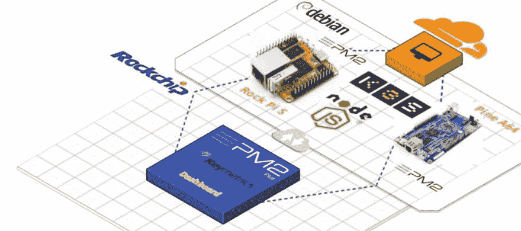T2】](https://res.cloudinary.com/practicaldev/image/fetch/s--bX9WPUee--/c_limit%2Cf_auto%2Cfl_progressive%2Cq_auto%2Cw_880/https://cdn-images-1.medium.com/max/2670/1%2ARZXliBNpYD_OEfUlv3kvVg.jpeg)

我用 MicroK8S 做了一个测试，这篇文章里有一张 Pine A64:

[**松卡 A64 上通过 MicroK8s …**](https://medium.com/@abenahmed1/kubernetes-en-noeud-unique-sur-une-carte-pine-a64-via-microk8s-41726ec7bfff) 的单节点立方

[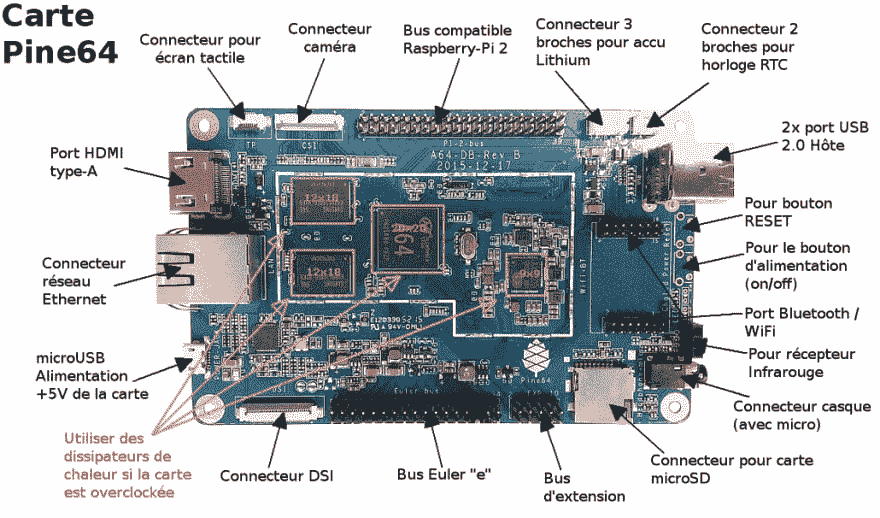T2】](https://res.cloudinary.com/practicaldev/image/fetch/s--e4RZNzpy--/c_limit%2Cf_auto%2Cfl_progressive%2Cq_auto%2Cw_880/https://cdn-images-1.medium.com/max/2060/0%2ATT0NwpfgnFYYghvV.png)

我将利用 Radxa Team 推出的新 Rock Pi S 卡(起始价为 9.99 美元)，使用 Pine A64 启动一个 K8S 群集:

[**RockpiS**
*ROCK Pi S 是 Radxa 基于 Rockchip RK3308 的 SBC(单板计算机)。它配备了 64 位四核处理器，USB…*wiki.radxa.com](https://wiki.radxa.com/RockpiS)

[**摇滚圆周率**
*为您的项目打造一台极其“摇滚”的迷你电脑！发挥创造力！！:-) Rockchip RK3308 四核 A35 64 位处理器……* shop . allnet China . cn](https://shop.allnetchina.cn/products/rock-pi-s)

[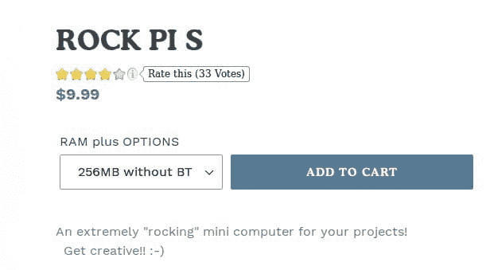T2】](https://res.cloudinary.com/practicaldev/image/fetch/s--TrzHHMZG--/c_limit%2Cf_auto%2Cfl_progressive%2Cq_auto%2Cw_880/https://cdn-images-1.medium.com/max/2000/1%2AVZ6skoDRNuAZ03270X0ncA.jpeg)

pi s est 配有集成了四个 ARM 皮质内核的 rk 3308 SOC 芯片-35 64 位(最高可达 1.3 GHz)。SoC 还包含集成的语音活动检测器(VAD)，用于智能语音应用程序。Radxa 包括一个 26 针 GPIO 头和一个 microSD 读卡器。

[T2】](https://res.cloudinary.com/practicaldev/image/fetch/s--gsNnIpDe--/c_limit%2Cf_auto%2Cfl_progressive%2Cq_auto%2Cw_880/https://cdn-images-1.medium.com/max/2000/0%2AMxPsgIt-N9ELXtgj.jpg)

此外，pi s rock 具有 100 Mbps 以太网端口、1 个 USB 2.0 Type-A 端口和 1 个支持 OTG 和 5V 电源的 USB 2.0 Type-C 端口。主板附带 256 mo 或 512 MB ram。选购的 rock 可整合高达 8gb 的内建 NAND 储存、rtl 8723 bs 相容模组(最高至 802.11 n)以及 Bluetooth 4.0。该卡目前在 Debian、Slackware 下运行，还将支持 Buildroot。

[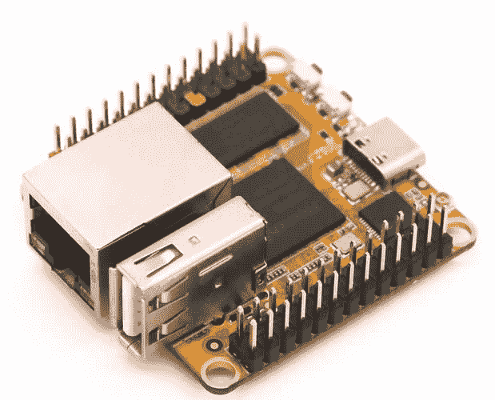T2】](https://res.cloudinary.com/practicaldev/image/fetch/s--rW6lcSdD--/c_limit%2Cf_auto%2Cfl_progressive%2Cq_auto%2Cw_880/https://cdn-images-1.medium.com/max/2000/1%2A3vjHKqaP9EkqGAxAD2pVhw.jpeg)

[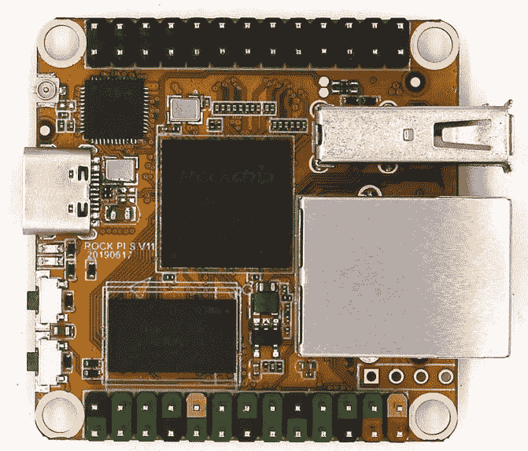T2】](https://res.cloudinary.com/practicaldev/image/fetch/s--LeXv90Ks--/c_limit%2Cf_auto%2Cfl_progressive%2Cq_auto%2Cw_880/https://cdn-images-1.medium.com/max/2000/1%2A-GfCpkX9Kwz4GrOXKZGtMQ.jpeg)

我为这张卡加载 Debian 9.9 发行版:

[**/rockpimg/debian 的索引**
*编辑说明*dl.radxa.com](https://dl.radxa.com/rockpimg/debian/)

[**RockpiS/Debian**
* rockpi S Debian 是一款易于使用的桌面系统。在使用 ROCKPI4Debian 时，你会发现它在…*wiki.radxa.com](https://wiki.radxa.com/RockpiS/Debian) 上运行良好

通孔蚀刻机:

[**balenaEtcher-Home**
* Electron 基于 Gtk2，无法在 Wayland 上原生运行。还好 XWayland 服务器提供了向后…*www.balena.io](https://www.balena.io/etcher/)

[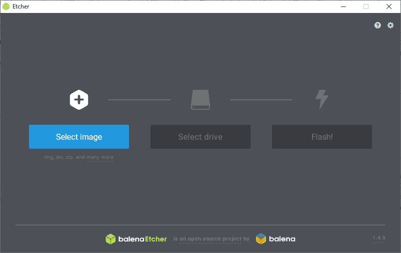T2】](https://res.cloudinary.com/practicaldev/image/fetch/s--FR_1msEk--/c_limit%2Cf_auto%2Cfl_progressive%2Cq_auto%2Cw_880/https://cdn-images-1.medium.com/max/2000/0%2A7enJHuxJtvvj_xpL.png)

我还上传了 Pine A64 的手镯图像(再次使用 Etcher):

[**pine 64**
*支持的设备经过测试，除了已知问题和缺少的功能外，它们还能正常工作。提供的支持远至……* www . arm bian . com](https://www.armbian.com/pine64/)

[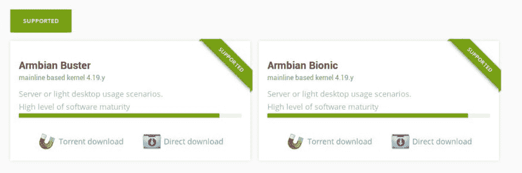T2】](https://res.cloudinary.com/practicaldev/image/fetch/s--4dsQdCbi--/c_limit%2Cf_auto%2Cfl_progressive%2Cq_auto%2Cw_880/https://cdn-images-1.medium.com/max/2436/1%2AU1vIQLKK5WhyXmive1ZFdA.jpeg)

然后，我可以使用连接到交换机的两条以太网电缆将这两个适配器连接到我的局域网，以实现以下体验:

[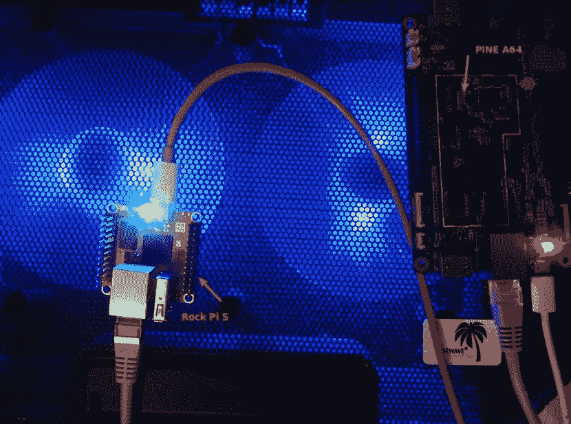T2】](https://res.cloudinary.com/practicaldev/image/fetch/s--JI6SHw6a--/c_limit%2Cf_auto%2Cfl_progressive%2Cq_auto%2Cw_880/https://cdn-images-1.medium.com/max/2000/1%2AVrmZehXHazPXgSMWZ42x5Q.jpeg)

[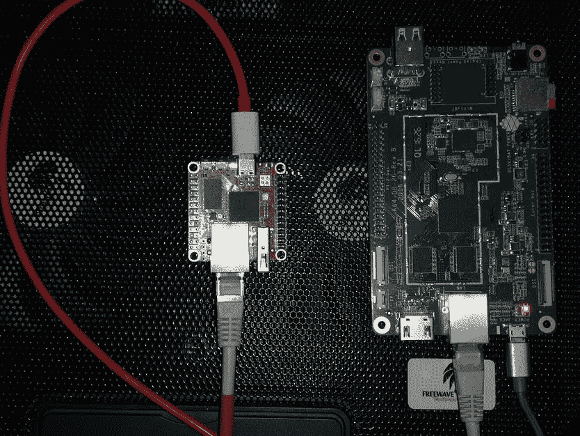T2】](https://res.cloudinary.com/practicaldev/image/fetch/s--JUR56Lgn--/c_limit%2Cf_auto%2Cfl_progressive%2Cq_auto%2Cw_880/https://cdn-images-1.medium.com/max/2000/1%2ADWTjBXxLp6dTFOW5YzisPg.jpeg)

我在 Rock Pi 上加载不带代理的 k3b 服务器:

```
$ curl -sfL https://get.k3s.io | INSTALL_K3S_EXEC="--disable-agent" sh - 
```

[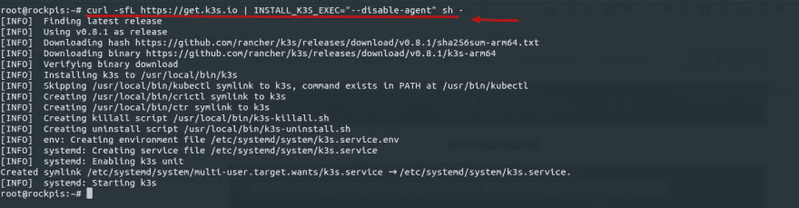T2】](https://res.cloudinary.com/practicaldev/image/fetch/s--0DXVYy2U--/c_limit%2Cf_auto%2Cfl_progressive%2Cq_auto%2Cw_880/https://cdn-images-1.medium.com/max/2670/1%2AP-Lun1nHIz73sqw8tNEMSg.jpeg)

在 Github 上检索到 64 位 k3b 二进制文件:

[T2】](https://res.cloudinary.com/practicaldev/image/fetch/s--8_rRmzRK--/c_limit%2Cf_auto%2Cfl_progressive%2Cq_auto%2Cw_880/https://cdn-images-1.medium.com/max/2312/1%2Av-ouP6ZiXvPuYIkSTBJTRQ.jpeg)

我在 Pine A64 上加载相同的二进制文件，然后我可以将该二进制文件绑定到 Rock Pi S，以形成我的立方体群集:

```
$ curl -sfL https://get.k3s.io | K3S_URL=https://<IP Rock Pi S>:6443 K3S_TOKEN=XXX sh - 
```

[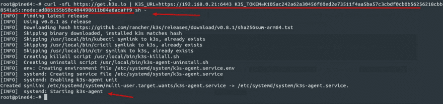T2】](https://res.cloudinary.com/practicaldev/image/fetch/s--t7i1mBrd--/c_limit%2Cf_auto%2Cfl_progressive%2Cq_auto%2Cw_880/https://cdn-images-1.medium.com/max/2722/1%2AI_T_tUfeZ71n5xQmtxigPg.jpeg)

我把 Pine A64 连接到 ZeroTier：

```
$ curl -s https://install.zerotier.com | bash

$ zerotier-cli join <NETWORK ID> 
```

[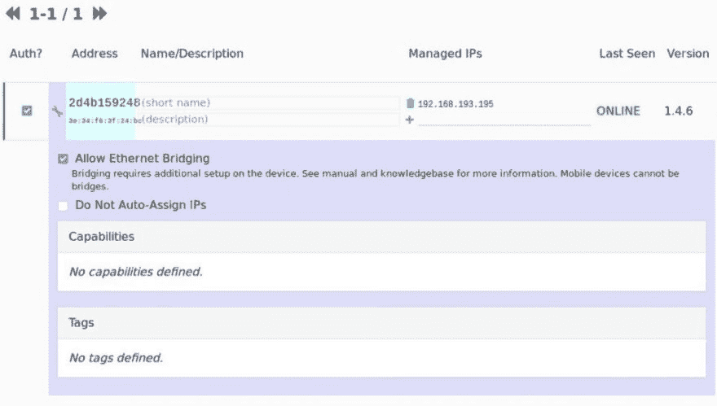T2】](https://res.cloudinary.com/practicaldev/image/fetch/s--_3vIouEa--/c_limit%2Cf_auto%2Cfl_progressive%2Cq_auto%2Cw_880/https://cdn-images-1.medium.com/max/2106/1%2AGQiAA5XijFKLfMh2-NB-aw.jpeg)

然后，可以部署金属，以获得 k3s 中 Traefik 提供的缺省负载平衡服务之外的负载平衡服务: [**【金属，立方结构的裸机负载平衡器】**
*在开始安装之前，确保满足所有要求。特别是要注意…*金属.宇宙. tf](https://metallb.universe.tf/installation/)

```
$ kubectl apply -f https://raw.githubusercontent.com/google/metallb/v0.8.1/manifests/metallb.yaml 
```

[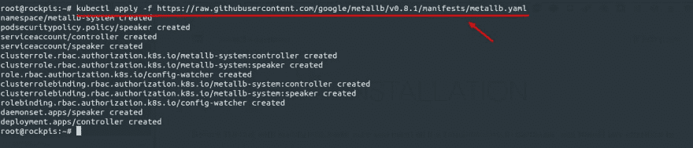T2】](https://res.cloudinary.com/practicaldev/image/fetch/s--PiEEyx-1--/c_limit%2Cf_auto%2Cfl_progressive%2Cq_auto%2Cw_880/https://cdn-images-1.medium.com/max/2630/1%2AXqt3k0w70ZTlpkq-fpBQqA.jpeg)

使用此 DHCP 配置:

```
apiVersion: v1
kind: ConfigMap
metadata:
  namespace: metallb-system
  name: config
data:
  config: |
    address-pools:
    - name: default
      protocol: layer2
      addresses:
      - 192.168.193.10-192.168.193.100 
```

[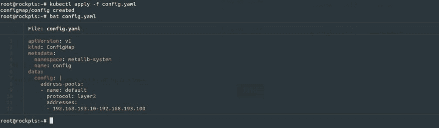T2】](https://res.cloudinary.com/practicaldev/image/fetch/s--Dt4-USwP--/c_limit%2Cf_auto%2Cfl_progressive%2Cq_auto%2Cw_880/https://cdn-images-1.medium.com/max/2560/1%2AHb8eNaMYZdg3ZO3b9k_bvQ.jpeg)

[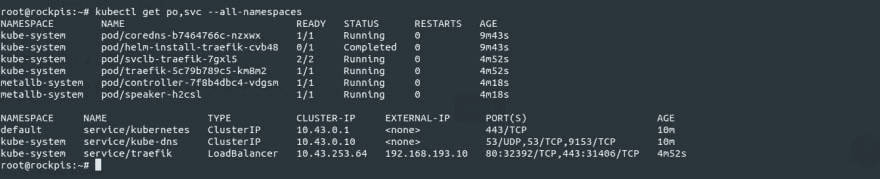T2】](https://res.cloudinary.com/practicaldev/image/fetch/s--d5RBlKCW--/c_limit%2Cf_auto%2Cfl_progressive%2Cq_auto%2Cw_880/https://cdn-images-1.medium.com/max/2678/1%2AluBpa1IpKe7v_4t1oYKj0w.jpeg)

FC 演示者专用语音聊天工具的部署: [**【测试语音聊天工具使用 Web 语音 API 并以渐进式 Web 应用程序的形式…**
*自年初以来，谷歌创建的渐进式 Web 应用程序(PWA)上出现了文章交错器](https://medium.com/@abenahmed1/chatbot-vocal-de-test-utilisant-web-speech-api-et-sous-la-forme-dune-progressive-web-app-ab8fbbf41e73)

[T2】](https://res.cloudinary.com/practicaldev/image/fetch/s--XS4Xp7YM--/c_limit%2Cf_auto%2Cfl_progressive%2Cq_auto%2Cw_880/https://cdn-images-1.medium.com/max/2708/1%2AXvu7Fw9jcUQiM86OQCourQ.jpeg)

```
---
apiVersion: extensions/v1beta1
kind: Deployment
metadata:
  name: fcbot
spec:
  replicas: 1
  template:
    metadata:
      labels:
        app: fcbot
    spec:
      containers:
      - name: fcbot
        image: mcas/pwafcbot-armv8:latest
        ports:
        - containerPort: 80
---
apiVersion: v1
kind: Service
metadata:
  name: fcbot-service
  labels:
    app: fcbot-service
spec:
  type: LoadBalancer
  ports:
    # the port that this service should serve on
  - port: 8000
    targetPort: 80
    protocol: TCP
  selector:
    app: fcbot 
```

此处，服务在 TCP 端口 8000 上广播。为了利用 ZeroTier 提供的 IP 地址并获得 HTTPS 访问权限，我将使用 Cloudflare Argo 隧道(chatbot 是一种渐进式的 Web 应用程序):[**【deep 75/pwafcbot】**
*此时无法执行该操作。您用另一个选项卡或窗口在中签名。您已在另一个选项卡或…* github . com](https://github.com/deep75/pwafcbot)[**【Argo 隧道】【云 flare】**
*上签了名*在应用程序部署后保护您的 Web 服务器免受直接攻击，开发人员和…*www.cloudflare.com](https://www.cloudflare.com/fr-fr/products/argo-tunnel/)

je re cupère la version ARM 64 Bits de cloud flared sur Github qui est chargée sur la carte Pine A64:
[**danacr/drone-cloud flared**
*此时你不能执行该动作。您已使用另一个标签页或窗口登录。您已在另一个选项卡或…*github.com](https://github.com/danacr/drone-cloudflared/releases) 中注销

[T2】](https://res.cloudinary.com/practicaldev/image/fetch/s--nXNkbaA8--/c_limit%2Cf_auto%2Cfl_progressive%2Cq_auto%2Cw_880/https://cdn-images-1.medium.com/max/2196/1%2Ah9HWDaYb13GJnXWWj-cfCg.jpeg)

[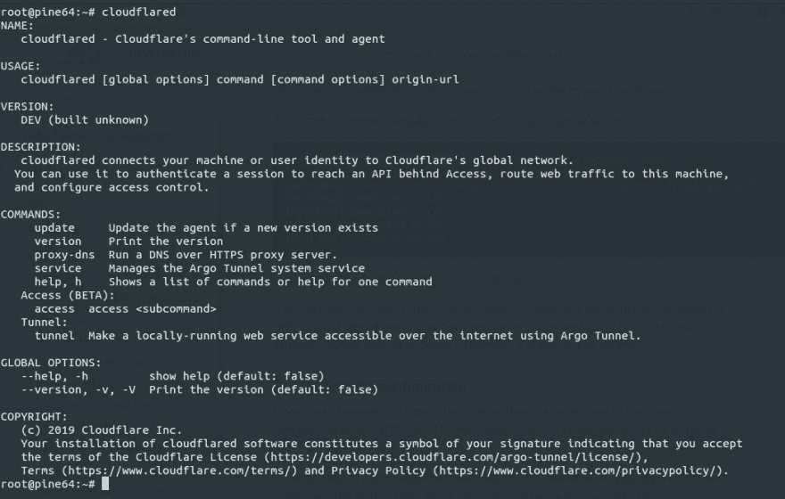T2】](https://res.cloudinary.com/practicaldev/image/fetch/s--I8RjUsJp--/c_limit%2Cf_auto%2Cfl_progressive%2Cq_auto%2Cw_880/https://cdn-images-1.medium.com/max/2094/1%2Akk5Eq5xX7CBs8I7dHAGQ7g.jpeg)

因此，启动语音聊天服务 IP 的隧道:

```
$ cloudflared tunnel --url http://192.168.193.11:8000 
```

[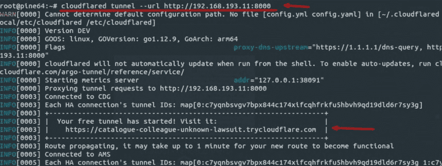T2】](https://res.cloudinary.com/practicaldev/image/fetch/s--J14U3BOg--/c_limit%2Cf_auto%2Cfl_progressive%2Cq_auto%2Cw_880/https://cdn-images-1.medium.com/max/2322/1%2At2aEBQk-zYuqLDKINkZ0iA.jpeg)

Cloudflare 返回一个地址，我用它向 Chatbot 提出问题:

[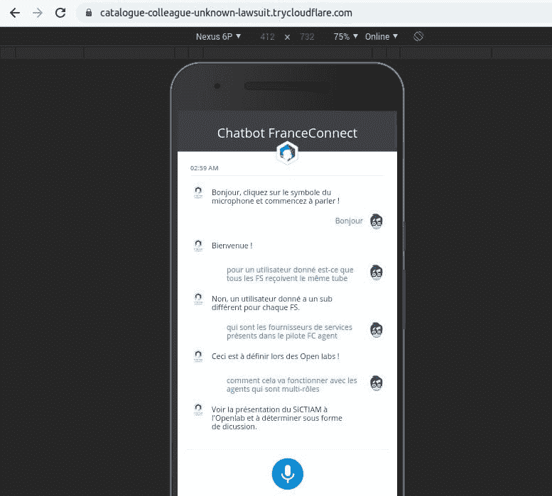T2】](https://res.cloudinary.com/practicaldev/image/fetch/s--gAEbw4Rb--/c_limit%2Cf_auto%2Cfl_progressive%2Cq_auto%2Cw_880/https://cdn-images-1.medium.com/max/2000/1%2ALPLP-JtvqyW4e4D8RZrvew.jpeg)

为了监控这些卡，我在此处使用 PM2 plus key metrics 与 pm2-server-monit(以前在 ARM 64 位版本中安装 nodejs): [*** advanced process manager for production node . js applications。负载平衡器、日志设备、启动脚本、micro…* pm 2 . key metrics . io**](http://pm2.keymetrics.io/)

 **```
$ curl -sL https://deb.nodesource.com/setup_12.x | bash -
$ apt-get install -y nodejs
$ npm install pm2 -g
$ pm2 install pm2-server-monit 
```

[T2】](https://res.cloudinary.com/practicaldev/image/fetch/s--PgAAwZct--/c_limit%2Cf_auto%2Cfl_progressive%2Cq_auto%2Cw_880/https://cdn-images-1.medium.com/max/2498/1%2AnASiDftNg8ylwvfV6mu-zw.jpeg)

les deux cartes apparesaint après liaison sur le dashboard de PM2 Plus:
[**概述| PM2 Plus 文档**
* P(process)M(anager)2 Plus 欢迎来到 PM2 Plus 概述！一旦你认真对待生产，你需要制作…*doc.pm2.io](http://doc.pm2.io/en/plus/overview/)

[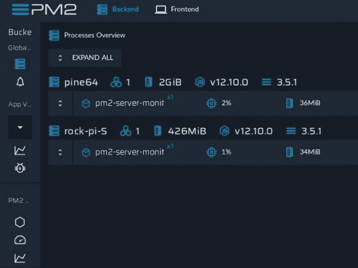T2】](https://res.cloudinary.com/practicaldev/image/fetch/s--dQOG8ofc--/c_limit%2Cf_auto%2Cfl_progressive%2Cq_auto%2Cw_880/https://cdn-images-1.medium.com/max/2000/1%2ACMp8fNz8ebriIgWkxTIsXg.jpeg)

[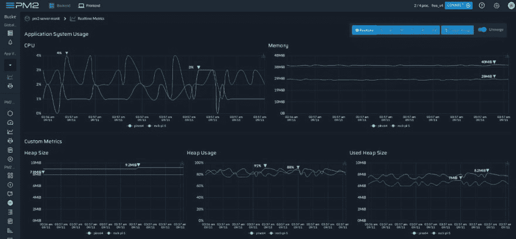T2】](https://res.cloudinary.com/practicaldev/image/fetch/s--ta_qNJ2W--/c_limit%2Cf_auto%2Cfl_progressive%2Cq_auto%2Cw_880/https://cdn-images-1.medium.com/max/2716/1%2Amedzrb5MXD8RuuzzVviqlA.jpeg)

[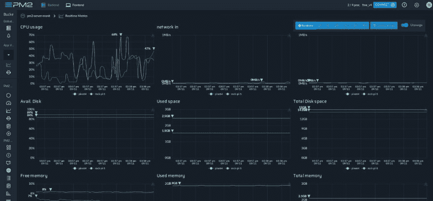T2】](https://res.cloudinary.com/practicaldev/image/fetch/s--qN81udiI--/c_limit%2Cf_auto%2Cfl_progressive%2Cq_auto%2Cw_880/https://cdn-images-1.medium.com/max/2716/1%2A4oOMktFdcbI_0SlOKNddTw.jpeg)

[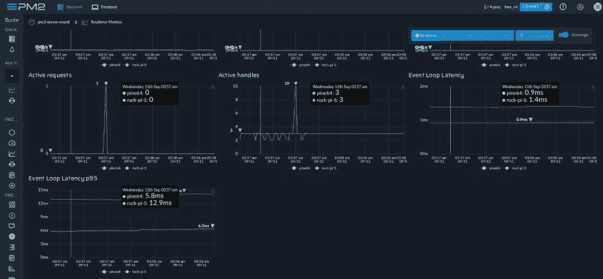T2】](https://res.cloudinary.com/practicaldev/image/fetch/s--2QBLJAfG--/c_limit%2Cf_auto%2Cfl_progressive%2Cq_auto%2Cw_880/https://cdn-images-1.medium.com/max/2716/1%2AJKYvwZ4rLeLPgY2kL7HHew.jpeg)

[T2】](https://res.cloudinary.com/practicaldev/image/fetch/s--sxd95gCi--/c_limit%2Cf_auto%2Cfl_progressive%2Cq_auto%2Cw_880/https://cdn-images-1.medium.com/max/2000/0%2ANkLSKTG7bC7qWuLl.jpg)

应为 Rock Pi 提供新的 Linux 映像，以便用作 k3b 群集中的代理:

[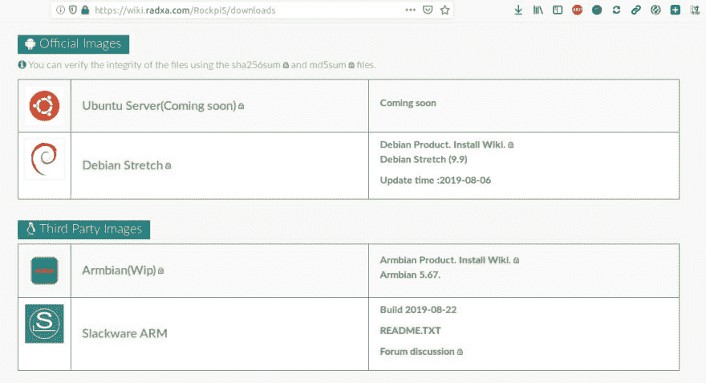T2】](https://res.cloudinary.com/practicaldev/image/fetch/s--QJuHC44j--/c_limit%2Cf_auto%2Cfl_progressive%2Cq_auto%2Cw_880/https://cdn-images-1.medium.com/max/2304/1%2A6pIKVZGte1G6mnvsHx_koA.jpeg)

下一个！**