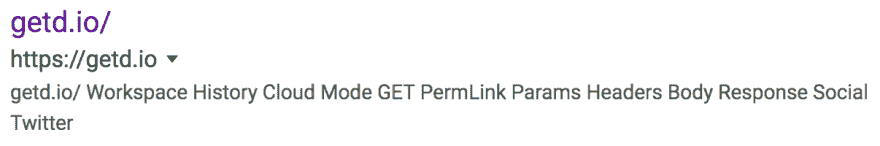
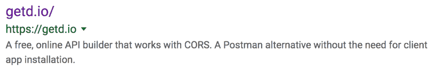
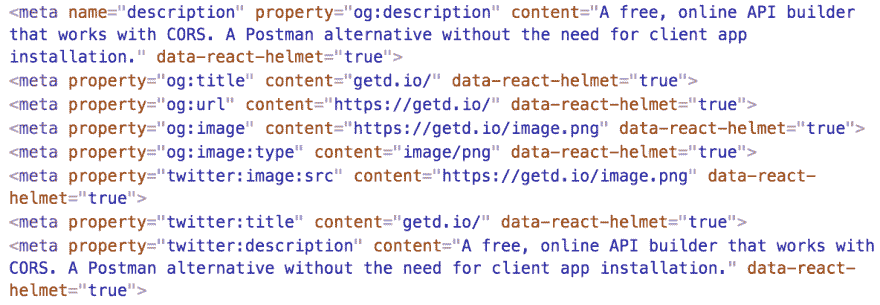

# 一分钟修复，让你的 React 网站对谷歌更友好一点🤝

> 原文:[https://dev . to/getd/a-one-minute-fix-make-your-react-site-just-a-bit-of-Google-friendly-3g4d](https://dev.to/getd/a-one-minute-fix-to-make-your-react-site-just-a-bit-more-google-friendly-3g4d)

只要我们生活在谷歌时代，SEO(搜索引擎优化)仍然很重要。许多 React 应用程序被编写为 SPA(单页应用程序)，并且对 Google 不友好，因为 Google 需要额外的努力来渲染和抓取前端 Javascript。

这里有一个例子，当我的副业项目 [getd.io](https://getd.io) 最初启动时，谷歌是如何索引它的。你可以看到网站描述只是从我的网站的 JS 抓取的一些随机单词:

[T2】](https://res.cloudinary.com/practicaldev/image/fetch/s--QrpEiiT2--/c_limit%2Cf_auto%2Cfl_progressive%2Cq_auto%2Cw_880/https://thepracticaldev.s3.amazonaws.com/i/rc0dct1wfx1bth5i0aew.png)

*顺便说一句，一个无耻的插件: [getd.io](https://getd.io) 是一个免费的在线 API 构建器，是我作为邮递员创建的，没有原生应用。试一试，让我知道你的想法。你也可以在本帖中阅读更多[。](https://dev.to/getd/getd-io-an-online-api-request-tester-builder-with-cors-support-3d3m)*

理想情况下，我们可以使用 SSR(服务器端渲染)来帮助 Google 获得一个完全渲染的静态页面，但是 SSR 很棘手，而且没有人有时间做这个😅

为了快速修复这个问题，我使用了[react-头盔](https://github.com/nfl/react-helmet)来给 [getd.io](https://getd.io) 添加`META`标签。然后，我去[谷歌搜索控制台](https://search.google.com/search-console/about)请求重新索引。之后，搜索结果看起来好多了:

[T2】](https://res.cloudinary.com/practicaldev/image/fetch/s--tV5Hmzwq--/c_limit%2Cf_auto%2Cfl_progressive%2Cq_auto%2Cw_880/https://thepracticaldev.s3.amazonaws.com/i/sheo1ryiaz8f8lrpi506.png)

下面是我的代码的样子:

```
const seo = {
  title: "getd.io/",
  description:
    "A free, online API builder that works with CORS. A Postman alternative without the need for client app installation.",
  url: "https://getd.io/",
  image: "https://getd.io/image.png"
};

<Helmet
  title={seo.title}
  meta={[
    {
      name: "description",
      property: "og:description",
      content: seo.description
    },
    { property: "og:title", content: seo.title },
    { property: "og:url", content: seo.url },
    { property: "og:image", content: seo.image },
    { property: "og:image:type", content: "image/png" },
    { property: "twitter:image:src", content: seo.image },
    { property: "twitter:title", content: seo.title },
    { property: "twitter:description", content: seo.description }
  ]}
/> 
```

您可以将`<Helmet>`组件放在 React 树中的任何位置，它们将被适当地移动到`<head>`下:

[T2】](https://res.cloudinary.com/practicaldev/image/fetch/s--vMA10hcT--/c_limit%2Cf_auto%2Cfl_progressive%2Cq_auto%2Cw_880/https://thepracticaldev.s3.amazonaws.com/i/s8131ut4d032n5nolfa3.png)