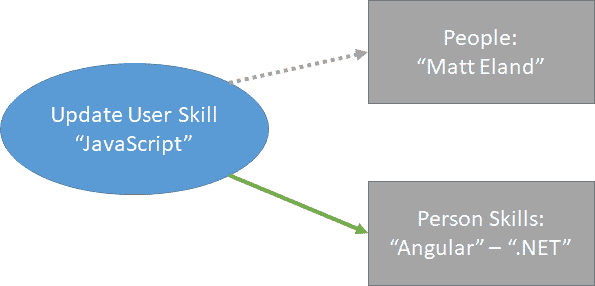
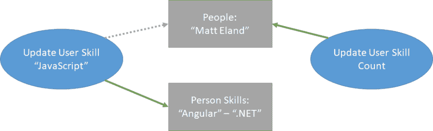
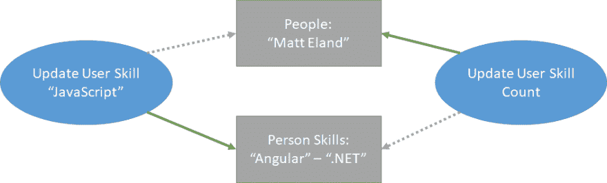
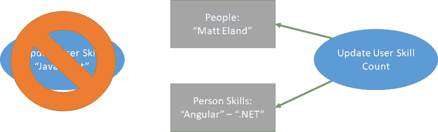
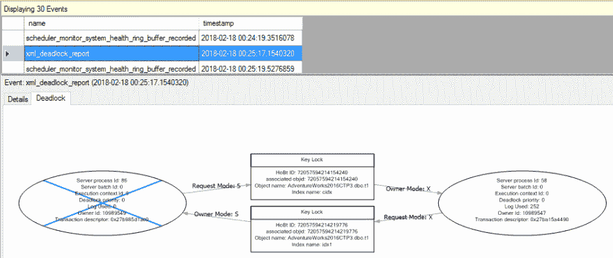

# 了解 SQL Server 死锁

> 原文:[https://dev . to/tech elevator/understanding-SQL-server-deadlocks-2ej 6](https://dev.to/techelevator/understanding-sql-server-deadlocks-2ej6)

这是我撰写的关于 SQL Server 概念的系列文章的继续。

当您在一个有足够流量的数据库上使用 SQL Server 足够长的时间时，您最终会遇到死锁。

本文讨论什么是死锁，如何解释死锁图形，以及处理死锁的一些选项。

# [](#what-is-a-deadlock)什么是死锁？

当两个进程以无法自行解决的方式竞争多个资源时，就会发生死锁。出现这种情况时，SQL Server 必须终止两个进程中的一个，从而导致查询无法执行，事务失败。然后，该错误被传播到可以确定如何继续的执行代码。

那么，这看起来像什么？

[T2】](https://res.cloudinary.com/practicaldev/image/fetch/s--VSa75sCW--/c_limit%2Cf_auto%2Cfl_progressive%2Cq_auto%2Cw_880/https://thepracticaldev.s3.amazonaws.com/i/3u0zftowjfclvtamga0w.png)

在这个场景中，我们有一个查询需要更新一个`People`条目以及一个与那个人和技能相关联的`PersonSkill`条目。为了做到这一点，查询需要一个对`People`表的锁和一个对`PersonSkill`表中一系列数据的锁，查询已经有了一个锁。

[T2】](https://res.cloudinary.com/practicaldev/image/fetch/s--OtxFzk23--/c_limit%2Cf_auto%2Cfl_progressive%2Cq_auto%2Cw_880/https://thepracticaldev.s3.amazonaws.com/i/67kyzbcpoamivv8ibevk.png)

不幸的是，`People`表中的相关行已经被更新用户技能计数查询独占锁定，从而产生了一个*死锁*。

通常，`Update User Skill Count`查询会完成，释放它的锁，然后`Update PersonSkill`查询可以在`People`上获得它的锁，并完成它的任务。

[T2】](https://res.cloudinary.com/practicaldev/image/fetch/s--iZUQSsek--/c_limit%2Cf_auto%2Cfl_progressive%2Cq_auto%2Cw_880/https://thepracticaldev.s3.amazonaws.com/i/y0ldvbch87fod9acckwx.png)

然而，`Update User Skill Count`目前正在等待`Update PersonSkill`完成并释放它对`PersonSkills`的锁定，所以我们现在有一个场景，其中两个查询都有对方需要的东西，并且在完成之前不会释放它们的锁定。

幸运的是，SQL Server 有一个死锁解决机制来防止进程让数据库忙于等待永远不会发生的事情。在死锁解决中，SQL Server 将随机选择一个受害者(稍后将详细介绍)并终止该进程。

[T2】](https://res.cloudinary.com/practicaldev/image/fetch/s--JuUj1pbo--/c_limit%2Cf_auto%2Cfl_progressive%2Cq_auto%2Cw_880/https://thepracticaldev.s3.amazonaws.com/i/55tgjif95hscsy31okj6.png)

在这种情况下，`Update PersonSkill`查询被选为死锁牺牲品并被终止。异常向上传播到调用者，通知它进程由于死锁而终止。同时，查询持有的锁被释放，并且`Update User Skill Count`能够获得它需要的锁，并且在不知道发生了任何事情的情况下完成。

稍后我们将更多地讨论如何处理死锁，但是接下来，让我们看看如何从 SQL Server 获取死锁信息。

# [](#getting-deadlock-info-from-sql-server)从 SQL 服务器获取死锁信息

您可以运行下面的查询来获得死锁事件 XML 的列表和死锁发生的时间(查询和图像取自[微软的文档](https://docs.microsoft.com/en-us/sql/relational-databases/sql-server-transaction-locking-and-row-versioning-guide?view=sql-server-2017#Lock_Engine))。

```
SELECT xdr.value('@timestamp', 'datetime') AS [Date],
    xdr.query('.') AS [Event_Data]
FROM (SELECT CAST([target_data] AS XML) AS Target_Data
            FROM sys.dm_xe_session_targets AS xt
            INNER JOIN sys.dm_xe_sessions AS xs ON xs.address = xt.event_session_address
            WHERE xs.name = N'system_health'
              AND xt.target_name = N'ring_buffer'
    ) AS XML_Data
CROSS APPLY Target_Data.nodes('RingBufferTarget/event[@name="xml_deadlock_report"]') AS XEventData(xdr)
ORDER BY [Date] DESC 
```

<svg width="20px" height="20px" viewBox="0 0 24 24" class="highlight-action crayons-icon highlight-action--fullscreen-on"><title>Enter fullscreen mode</title></svg> <svg width="20px" height="20px" viewBox="0 0 24 24" class="highlight-action crayons-icon highlight-action--fullscreen-off"><title>Exit fullscreen mode</title></svg>

然后可以通过单击 SQL Server Management Studio 打开 XML，这将打开死锁图形。

[T2】](https://res.cloudinary.com/practicaldev/image/fetch/s--ZPVq6B-W--/c_limit%2Cf_auto%2Cfl_progressive%2Cq_auto%2Cw_880/https://thepracticaldev.s3.amazonaws.com/i/tncti5jcio5y78ulv20u.png)

请注意死锁图形与上面例子的相似之处。在死锁图形中，数据库对象的信息范围在 id、对象名、索引名、锁类型等方面要深得多。但其核心是，它只是告诉你两个查询需要相同的两个锁，并且不能解决它们之间的差异。

# [](#resolving-deadlocks)解决死锁

既然我们已经了解了什么是死锁以及如何获得关于死锁的基本信息，我们需要将注意力转移到解决这些死锁上。

有几种解决死锁问题的方法，我向您提供了从最受欢迎到最不受欢迎的几种选择。

## [](#improve-indexes)提升指标

首先，死锁是对象被锁定的结果。有时锁定的对象比它们需要的要宽。例如，如果某个查询需要扫描一个表来查找特定的一行或一组行，则该查询可能会锁定该表或一页数据，而锁定单个行会更有效。

[](/techelevator) [## SQL Server 锁定

### matt Eland for Tech Elevator 2019 年 9 月 10 日 3 分钟阅读

#sql #sqlserver #performance #database](/techelevator/sql-server-locking-4beo)

通过改进用于连接到相关表的索引，可以使锁集变得非常具体，从而大大降低一开始就发生死锁的可能性。

这是处理死锁的最佳方式，但是请记住，无论何时添加新索引，都要进行权衡。

## [](#change-transaction-priorities)改变交易优先级

接下来，虽然我们说死锁牺牲品是*随机*，但它在优先级桶中是随机的。您可以手动设置交易的`DEADLOCK_PRIORITY`。如果一个死锁涉及两个优先级不同的事务，它将总是终止优先级较低的进程。

您可以使用以下 SQL 设置优先级:

```
SET DEADLOCK_PRIORITY LOW -- or NORMAL or HIGH 
```

<svg width="20px" height="20px" viewBox="0 0 24 24" class="highlight-action crayons-icon highlight-action--fullscreen-on"><title>Enter fullscreen mode</title></svg> <svg width="20px" height="20px" viewBox="0 0 24 24" class="highlight-action crayons-icon highlight-action--fullscreen-off"><title>Exit fullscreen mode</title></svg>

您还可以从-10 到 10 的数字范围内设置优先级，其中-10 为最低优先级，10 为最高优先级。

```
SET DEADLOCK_PRIORITY -5 -- Equivalent to LOW 
```

<svg width="20px" height="20px" viewBox="0 0 24 24" class="highlight-action crayons-icon highlight-action--fullscreen-on"><title>Enter fullscreen mode</title></svg> <svg width="20px" height="20px" viewBox="0 0 24 24" class="highlight-action crayons-icon highlight-action--fullscreen-off"><title>Exit fullscreen mode</title></svg>

默认情况下，所有事务的优先级为`NORMAL`或 0。

请记住，这并不能防止死锁的发生，但是它表明了优先选择哪个查询将继续存在，哪个查询将被终止。

## [](#implementing-a-try-retry-model)实施尝试/重试模式

结合其他模式，您可以在设计例程时考虑死锁。如果您预计在某些情况下可能会出现死锁，您可以查找死锁异常，并重试查询一定次数，直到查询成功。这是在 SQL 之外完成的，并且是特定于编程语言的细节，因此将不提供示例。

一般来说，这个选项是一个更持久的解决方案，但是需要更长的时间来实现，并且在开发和质量保证期间更难测试。

## [](#change-isolation-modes)改变隔离模式

最后，您可以更改事务的隔离模式，使其对请求的锁不那么激进。参见[我关于隔离模式的文章，了解关于这个过程的更多细节](https://dev.to/integerman/sql-server-transactions-read-modes-locks-and-deadlocks-4kgj)。

[](/techelevator) [## SQL Server 事务和隔离级别

### matt Eland for Tech Elevator 2019 年 9 月 7 日 3 分钟阅读

#sql #sqlserver #database](/techelevator/sql-server-transactions-read-modes-locks-and-deadlocks-4kgj)

当改变隔离模式以避免死锁时，您通常会从`READ COMMITTED`移动到`READ UNCOMMITTED`，但是请记住`READ COMMITTED`会保护您免受脏读或行中潜在不完整信息的读取。如果您正在读取不经常更新的内容，比如姓名，这可能没问题，但是如果您需要一个频繁更新的字段的精确数字总数，或者您的数据需要完全准确，您可能无法使用`READ UNCOMMITTED`，您最好使用另一种解决方案。

# [](#summary)总结

总之，对于繁忙的数据库来说，死锁是一个自然发生的问题，但是您可以做一些事情来降低死锁发生的可能性，或者在死锁发生时有策略地处理死锁。

在本系列的下一篇文章中，我将讨论数据库索引和性能。