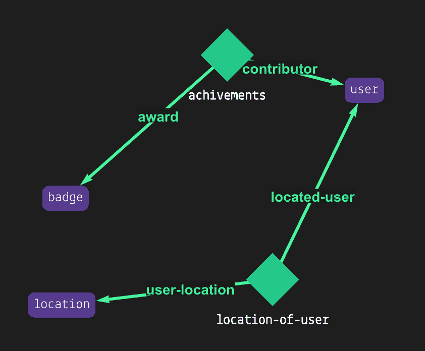
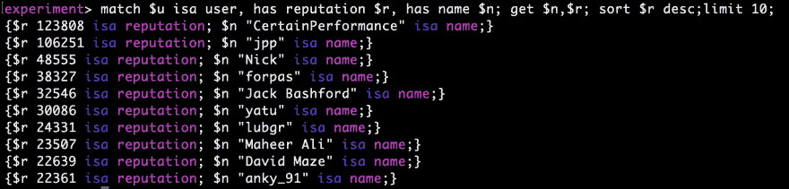
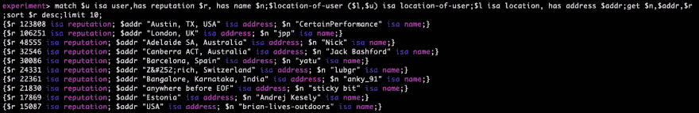

# Grakn 的周末实验。人工智能

> 原文：<https://dev.to/manfromsiberia/weekend-experiments-with-grakn-ai-2a8i>

那个周末，太阳正在融化圣彼得堡的一切生物，所以我决定留在家里用 Grakn 做实验。Grakn 是智能系统的 T2 知识库。快速浏览他们的[开发者网站](https://dev.grakn.ai/docs/general/quickstart)和[示例](https://dev.grakn.ai/docs/examples/phone-calls-overview)激起了我的好奇心，所以今天我们将深入挖掘。

我们的目标是:

1.  获取一些样本数据
2.  创建富有表现力的 Grakn 数据模式
3.  将数据导入我们的知识库
4.  想出一些有趣的方法来查询它。

## 我们开始吧

给自己拿一杯热☕...

让我们检查一下我们做实验需要什么。

首先，很明显，格拉克。它可以在 Mac、Windows 和 Linux 上运行。它也是 Docker 友好的。为了保持美观和平台不可知，让我们使用 [Docker](https://docs.docker.com/) 。

> 注意:如果您想在本地安装 Grakn，请遵循这些说明。你还需要 [OpenJDK](http://openjdk.java.net/install/) 或者 [Oracle Java](https://www.oracle.com/technetwork/java/javase/downloads/jdk8-downloads-2133151.html) 。

1.  从 Docker 注册表中提取图像

```
 docker pull graknlabs/grakn:1.5.3 
```

1.  使用外部卷启动容器:

```
 docker run --name grakn -d -v $(pwd)/db/:/grakn-core-all-linux/server/db/ -p 48555:48555 graknlabs/grakn:1.5.3 
```

1.  检查服务器状态:

```
 docker exec -ti grakn bash -c '/grakn-core-all-linux/grakn server status' 
```

[](https://res.cloudinary.com/practicaldev/image/fetch/s--plc2Z0NH--/c_limit%2Cf_auto%2Cfl_progressive%2Cq_auto%2Cw_880/https://thepracticaldev.s3.amazonaws.com/i/uuqh7xpi9aalkok2fjzt.png)

太好了，几分钟后我们就可以准备好了！

## 数据集

让我们获取一些 StackOverflow 用户数据。您可以在这里阅读端点文档并查询 StackExchange API。一个用户的 JSON 格式数据的例子如下:

```
{  "badge_counts":  {  "bronze":  3,  "silver":  2,  "gold":  1  },  "view_count":  1000,  "down_vote_count":  50,  "up_vote_count":  90,  "answer_count":  10,  "question_count":  12,  "account_id":  1,  "is_employee":  false,  "last_modified_date":  1565470447,  "last_access_date":  1565513647,  "reputation_change_year":  9001,  "reputation_change_quarter":  400,  "reputation_change_month":  200,  "reputation_change_week":  800,  "reputation_change_day":  100,  "reputation":  9001,  "creation_date":  1565470447,  "user_type":  "registered",  "user_id":  1,  "accept_rate":  55,  "about_me":  "about me block",  "location":  "An Imaginary World",  "website_url":  "http://example.com/",  "link":  "http://example.stackexchange.com/users/1/example-user",  "profile_image":  "https://www.gravatar.com/avatar/a007be5a61f6aa8f3e85ae2fc18dd66e?d=identicon&r=PG",  "display_name":  "Example User"  } 
```

我在 Go 中创建了一个简单的脚本，在 API 配额允许的情况下下载尽可能多的数据。源代码可在[这里](https://bitbucket.org/lkalneus/grakn-experiment/src/master/downloader/downloader.go)获得。为了节省时间，我建议使用[我连夜编译的这个 JSON 文档](https://bitbucket.org/lkalneus/grakn-experiment/src/master/res.json)。

仅仅从原始的 JSON 数据中并不能获得很多有趣的见解。

## 图式

好的——我们有一些 JSON 格式的原始数据。在它进入我们的数据库之前，我们需要将我们想要了解的东西建模为一个[模式](https://dev.grakn.ai/docs/schema/overview)——一个表示整个知识图的逻辑视图的框架结构。根据 [Grakn 文档](https://dev.grakn.ai/docs/schema/overview) , **模式**是一种解决管理和处理非结构化或松散结构数据问题的方法——完美！让我们来看看基本的。

### Grakn 数据模型

首先，在 Grakn 知识图中描述领域的一切都是一个概念，包括模式的元素(称为模式概念)和实际数据。

在一个模式中我们能有什么？*事物*有三种**:**

 ***   **实体** —实体是对我们领域中的对象进行分类的手段。
*   **属性** —把它们想象成属性。我们可以将任意数量的属性分配给实体、关系，甚至其他属性。
*   关系允许我们将几件事情联系在一起。事物可以在关系中扮演 [**角色**](https://dev.grakn.ai/docs/schema/overview#roles) 。要求每个关系至少有一个角色。

Grakn 数据建模远不止这些。它允许您定义类型层次结构、超实体、超关系和可链接规则。我不会说太多细节——如果你好奇，你可以在这里阅读全部内容。现在，让我们专注于**Graql**——Grakn 的查询语言，允许你对数据进行建模、查询和推理。

我们的`schema.gql`文件应该从顶部的`**define**`关键字开始。

接下来，我们将描述 StackOverflow 用户*的特点*(有一堆属性，比如他们的名字和头像)和*，根据他们的位置和他们作为贡献者的成就。* 

```
define

## ENTITIES ## 
user sub entity,
    key user-id,
    has account-id,
    has about,
    has age,
    has name,
    has is-employee,
    has user-type,
    has created,
    has last-accessed,
    has last-modified,
    has penalty-until,
    has url,
    has website,
    has profile-image,
    has reputation,
    has accept-rate,
    has view-count,
    has down-vote,
    has up-vote,
    has answer-count,
    plays located-user,
    plays contributor; 
```

如您所见，我们的 JSON 用户数据中的大多数属性都被映射为属性。让我们浏览一下语法。

大意是:

```
<name> sub [entity|attribute|relations|<element to inherit>] 
```

该语句应以分号结束。

使用 **`has`** 关键字分配属性。在模式中，我们可以以任何顺序定义元素，所以稍后定义属性类型完全没问题。

为了避免用户重复，让我们使用关键字 **`key`** 将`user-id`设为唯一属性。

有些东西是多个用户共有的，例如位置(例如美国德克萨斯州奥斯汀)或他们获得的徽章类型(铜、银、金)。我们将地点和徽章建模为独立的实体。

```
location sub entity,
    key address,
    plays user-location;

badge sub entity,
    key color,
    plays award; 
```

我们最终得到了三个实体:用户、徽章和位置。怎么把它们粘在一起？利用关系。

```
## RELATIONS ## 
location-of-user sub relation,
    relates located-user,
    relates user-location;

achievements sub relation,
    has score,
    relates contributor,
    relates award; 
```

我们对两种关系感兴趣:

1.  **`location-of-user`** 连接扮演`user-location`角色的位置实体和扮演`located-user`角色的用户实体
2.  **`achievements`** 连接用户和徽章实体。用户扮演`contributor`角色；徽章扮演着`award`的角色

[](https://res.cloudinary.com/practicaldev/image/fetch/s--qSmOwOu9--/c_limit%2Cf_auto%2Cfl_progressive%2Cq_auto%2Cw_880/https://thepracticaldev.s3.amazonaws.com/i/tt0mofxt5vs61rfss9n1.png)

属性可以分配给任何东西，包括关系。我们将使用一个属性(`score`)在`achievements`关系中存储用户的徽章数量。

还有一个步骤——定义属性类型:

```
## ATTRIBUTES ## 
name sub attribute,
    datatype string;

address sub attribute,
    datatype string;

timestamp sub attribute, abstract,
    datatype date;

    created sub timestamp;
    last-modified sub timestamp;
    last-accessed sub timestamp;
    penalty-until sub timestamp;

url sub attribute,
    datatype string;

website sub url;
profile-image sub url;

score sub attribute,
    datatype long;

accept-rate sub score;
view-count sub score;
down-vote sub score;
up-vote sub score;
answer-count sub score;
reputation sub score;

user-type sub attribute,
    datatype string,
    regex "^(unregistered|registered|moderator|team_admin|does_not_exist)$";

color sub attribute,
    datatype string,
    regex "^(bronze|silver|gold)$";

about sub attribute,
    datatype string;

age sub attribute,
    datatype long;

identifier sub attribute, abstract,
    datatype long;

account-id sub identifier;
user-id sub identifier;

is-employee sub attribute,
    datatype boolean; 
```

Graql 支持以下数据类型:

*   **long**:64 位有符号整数
*   **double** :双精度浮点数，包含小数点
*   **字符串**(也可以通过 regexp 限制)
*   **布尔型**:真或假
*   **日期**:一个 [ISO 8601](https://en.wikipedia.org/wiki/ISO_8601) 格式的日期或日期时间

    > Grakn 不支持时区(但是有一个[公开的 GitHub 问题](https://github.com/graknlabs/grakn/issues/4648))。如果不考虑时区偏移，Grakn 将使用服务器的时区创建日期记录。

如果你从来没有直接分配一个属性，并且只把它作为父类型使用，那么这个属性可以是抽象的。[实体也可以是抽象的](https://dev.grakn.ai/docs/schema/concepts#define-an-abstract-entity)，如果它们从未被实例化的话。

整个模式文件在[这里](https://bitbucket.org/lkalneus/grakn-experiment/src/master/schema.gql)是可用的。

既然我们已经准备好了模式，下一步就是将它加载到 Grakn 中。

首先，将`schema.gql`文件放在容器卷中。我的情况是`db/schema.gql`。

然后运行:

```
docker exec -ti grakn bash -c '/grakn-core-all-linux/grakn console --keyspace experiment --file /grakn-core-all-linux/server/db/schema.gql' 
```

这应该会产生类似于:
的结果

```
Loading: /grakn-core-all-linux/server/db/schema.gql
...
{}
Successful commit: schema.gql 
```

我们刚刚创建了一个 [Grakn keyspace](https://dev.grakn.ai/docs/management/keyspace) **实验**并定义了它的模式。

### 导入数据

既然我们已经建立了数据模型，是时候将数据集加载到我们的 knowlede 图中了。

我们将使用 [python 客户端 API](https://dev.grakn.ai/docs/client-api/python) 与 Grakn 进行交互。来装吧:

```
pip install grakn-client #or pip3 install grakn-client 
```

> 我的六个软件包安装有一个问题，用`--ignore-installed six`标志解决了它。

下面的代码实例化一个客户机，打开一个会话，并运行一个插入查询:

```
from grakn.client import GraknClient

with GraknClient(uri="localhost:48555") as client:
   with client.session(keyspace="experiment") as session:
      ## session is open
      ## execute query using a WRITE transaction
      with session.transaction().write() as write_transaction:
         insert_iterator = write_transaction.query(query)
         concepts = insert_iterator.collect_concepts()
         if bool(args.verbose):
            print("Inserted a record with ID: {0}".format(concepts[0].id))
         ## to persist changes, write transaction must always be committed (closed)
         write_transaction.commit() 
```

此外，它将打印插入记录的标识符，用于测试/调试目的。

现在让我们关注一下[查询](https://dev.grakn.ai/docs/query/overview)。

下面是我们对 StackOverflow 用户的 [insert](https://dev.grakn.ai/docs/query/insert-query.html#insert-instances-of-an-entity-type) 查询(使用[这个方便的转换函数](https://bitbucket.org/lkalneus/grakn-experiment/src/68e06b9081ae51169e0b86836fc93faa2f2506e4/insertData.py#lines-53)从我们的 JSON 数据生成):

```
insert $u isa user,
   has user-id 9515207,
   has name "CertainPerformance",
   has reputation 123808,
   has is-employee false,
   has last-modified 2019-08-12T01:02:31.750870,
   has last-accessed 2019-08-12T01:02:31.751320,
   has created 2019-08-12T01:02:31.751325,
   has url "https://stackoverflow.com/users/9515207/certainperformance",
   has up-vote 2630,
   has down-vote 15027,
   has view-count 22457,
   has answer-count 4469,
   has account-id 13173718,
   has user-type "registered",
   has profile-image "https://www.gravatar.com/avatar/34932d3e923ffad9a4a1423e30b1d9fc?s=128&d=identicon&r=PG&f=1"; 
```

这很简单。对 [**位置**](https://bitbucket.org/lkalneus/grakn-experiment/src/68e06b9081ae51169e0b86836fc93faa2f2506e4/insertData.py#lines-26) 和 [**徽章**](https://bitbucket.org/lkalneus/grakn-experiment/src/68e06b9081ae51169e0b86836fc93faa2f2506e4/insertData.py#lines-38) 进行冲洗并重复。关系呢？让我们来看看描述一个用户的位置:

```
match
   $u isa user, has user-id 9515207;
   $l isa location, has address "Austin, TX, USA";
insert
   $r (located-user: $u, user-location: $l) isa location-of-user; 
```

该查询匹配一个扮演定位用户角色(分配给变量`$u`)的用户**实例**，以及一个扮演用户位置角色(`$l`)的位置实例。然后它插入一个用户位置关系，将`$u`和`$l`作为它的角色扮演者(`$r`)。

> 要插入的关系的角色预期由知识图中已经存在的实例来扮演。

用徽章创建关系看起来很相似。请记住，您首先需要插入三个徽章实例，对应三个 StackOverflow 徽章(青铜、白银和黄金)。

```
match
   $u isa user, has user-id 9515207;
   $b isa badge, has color "gold";
insert
   $award-badge (contributor: $u, award: $b) isa achievement, has score 16; 
```

python 脚本的最终版本可从[这里](https://bitbucket.org/lkalneus/grakn-experiment/src/master/insertData.py)获得。它并不假装高效或最优，因为这只是一个周末的实验。

> 当您准备好加载我们的数据集时，我建议每次将事务限制在 100-200 条记录，以避免长时间的等待。

## 玩乐的时间到了

我们已经创建了模式，并使用 StackOverflow 用户数据进行了 Grakn keyspace 实验。让我们看看通过查询我们的知识图能发现什么。

启动 Grakn 控制台:

```
docker exec -ti grakn bash -c '/grakn-core-all-linux/grakn console --keyspace experiment 
```

#### 我们能按信誉得到前十名用户的名字吗？

```
match $u isa user,
   has reputation $r, has name $n;
get $n,$r;
   sort $r desc;
   limit 10; 
```

[](https://res.cloudinary.com/practicaldev/image/fetch/s--l48slDUu--/c_limit%2Cf_auto%2Cfl_progressive%2Cq_auto%2Cw_880/https://thepracticaldev.s3.amazonaws.com/i/nyromb2fzq3l5jwmoosm.png)

#### 他们的位置呢？

```
match
    $u isa user, has reputation $r, has name $n;
    $location-of-user ($l,$u) isa location-of-user;
    $l isa location, has address $addr;
get $n, $addr, $r;
    sort $r desc;
    limit 10; 
```

[](https://res.cloudinary.com/practicaldev/image/fetch/s--iSAHifv2--/c_limit%2Cf_auto%2Cfl_progressive%2Cq_auto%2Cw_880/https://thepracticaldev.s3.amazonaws.com/i/6ac80u0d8wng40rzn9vh.png)

#### 所有用户口碑的中值和均值呢？

```
experiment> compute median of reputation, in user;
11687
experiment> compute mean of reputation, in user;
18798.470588235294 
```

#### 那呢...

> 极限是我的想象力

```
# analytics OLAP 
compute cluster in location, location-of-user, top-ten-user;

## results 
{"Austin, TX, USA", "stackUser", "cleverTexan"}
{"London, UK, GBR", "aLondoner", "Leonid"} 
```

计算顶级 StackOverflow 贡献者的地理集中度真的很容易！

##### 💥分析学💥

[分布式分析](https://en.wikipedia.org/wiki/Online_analytical_processing)是一组可扩展的算法，允许您以分布式方式对大数据执行计算。这通常涉及到具有挑战性的实现。

在 Grakn 中，这些算法是作为语言的本机功能内置的。

## 结论

出于许多原因，Grakn 非常简洁。我以前从未使用过类似图形的数据库，所以我不得不进行一次认知跳跃来理解它的一些概念——并围绕连接的想法重新想象什么是可能的。

#### 优点

*   极具表现力和无限灵活性的模式，因此您可以创建复杂的知识模型。👍
*   内置分布式分析算法，因此您可以交互式地分析多维数据。👍
*   Graql 的强大抽象意味着编写更少的代码——它还自动优化查询执行。👍
*   它的[自动推理](https://grakn.ai/machine-learning)听起来很棒——也许是另一个周末的实验？

#### 弊

*   缺乏时区支持——所以你必须自己考虑偏移量。😒
*   难以理解的错误消息——除非你是 Java 开发人员。😑

### 实验评级⭐⭐⭐⭐***