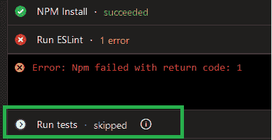
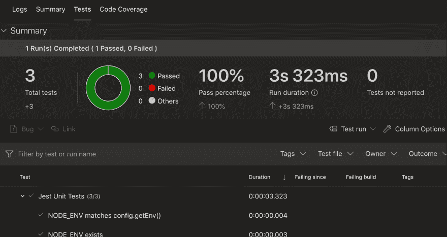

# 改善 Node.js 的 CI 渠道

> 原文：<https://dev.to/paulasantamaria/improving-your-ci-pipeline-for-node-js-2aab>

我很久以来一直想尝试 CI 管道，这个周末我终于能够花一些时间在这上面。我在 Azure DevOps 上为 Node.js API 设置了一个，非常有趣！所以我决定把我学到的东西写下来和大家分享。

在本文中，我将告诉您我在 CI 渠道中包含的一些步骤，以充分利用它。

在这个例子中，我将使用 Azure DevOps Pipelines 和 Node.js，但是同样的步骤也可以应用于其他 Javascript 框架，比如 Angular。

## 关于持续集成

持续集成是将代码变更安全地集成到公共存储库中的过程。为了实现这一点，我们需要定义一个 *CI 管道*，它将包含每次需要集成新变更时必须自动执行的所有任务。在一个基本的 CI 流程中，我们有两个主要任务:构建&测试。CI 渠道越强大，我们的集成就越安全。

## 基本设置

Node.js CI 管道的基本设置基本上有 3 个步骤:

1.  安装 node.js
2.  安装节点模块(运行`npm install`)
3.  运行测试

有一篇非常好的文章是由[@ sined](https://dev.to/sinedied)写的，我读了这篇文章开始学习 CI。如果您是 CI 新手，我建议您查看一下:

[](/itnext) [## 开源项目的终极(免费)CI/CD

### yohan lasor sa for it next Aug 16 ' 1912min read

#opensource #github #devops #azure](/itnext/the-ultimate-free-ci-cd-for-your-open-source-projects-3bkd)

如果你按照[@ sined](https://dev.to/sinedied)的文章中的步骤去做，你应该会得到:

*   以 Jest 设置为测试框架的 Node.js 应用程序
*   Azure DevOps 管道运行在 Node.js 应用中定义的测试，在具有不同节点版本的不同操作系统中运行(使用*构建矩阵*)。

下面是我如何在我的 Azure DevOps 管道上实现基本的集成步骤:

```
steps:
# Install Node.js
- task: NodeTool@0
  inputs:
    versionSpec: $(nodeVersion)
  displayName: 'Install Node.js'

# Install node modules.
- script: |
    npm install displayName: 'NPM Install'

# Runs the `test` script that I included in my package.json
- task: Npm@1
  inputs:
    command: custom
    customCommand: 'test'
  displayName: Run Tests 
```

<svg width="20px" height="20px" viewBox="0 0 24 24" class="highlight-action crayons-icon highlight-action--fullscreen-on"><title>Enter fullscreen mode</title></svg> <svg width="20px" height="20px" viewBox="0 0 24 24" class="highlight-action crayons-icon highlight-action--fullscreen-off"><title>Exit fullscreen mode</title></svg>

# 现在让我们给我们的管道添加一些步骤！

## 用 ESLint 发现代码中的问题

我首先想实现的是:*干净的代码*。我想确保每个新的提交在被集成之前都遵循一定的编码标准。这就是我想到的 ESLint。

根据 [ESLint 的关于页面](https://eslint.org/docs/about/):

> “JavaScript 是一种动态的、松散类型的语言，尤其容易出现开发人员的错误。在没有编译过程的帮助下，JavaScript 代码通常被执行以发现语法或其他错误。像 ESLint 这样的林挺工具允许开发人员在不执行 JavaScript 代码的情况下发现问题。”

下面是我们如何在 CI 渠道中使用 ESLint:

### 安装并设置 ESLint

在 node.js 应用程序中运行`npm install eslint --save-dev`

现在运行`./node_modules/.bin/eslint --init`来生成您的 ESLint 配置文件。CLI 将询问您几个问题，以便根据您的需要设置 ESLint。

如果你想进一步定制 ESLint，你可以编辑配置文件`.eslintrc.js`。另外，请查看[高级配置指南](https://eslint.org/docs/user-guide/configuring)。

### 将 ESLint 脚本添加到您的 package.json

一旦 ESLint 的设置令我们满意，我们就可以继续创建一个脚本来分析我们所有的文件并打印任何发现的问题。

下面是我的脚本:

```
"scripts":  {  "lint":  "./node_modules/.bin/eslint ./"  } 
```

<svg width="20px" height="20px" viewBox="0 0 24 24" class="highlight-action crayons-icon highlight-action--fullscreen-on"><title>Enter fullscreen mode</title></svg> <svg width="20px" height="20px" viewBox="0 0 24 24" class="highlight-action crayons-icon highlight-action--fullscreen-off"><title>Exit fullscreen mode</title></svg>

为了确保一切正常，请在您的终端中运行`npm run lint`。

### 向您的管道添加新步骤

现在我想要的是在我的管道中执行我的`lint`脚本，所以如果它失败了，我可以检查管道执行结果，并在集成更改之前用我的代码修复问题。

为了在 Azure DevOps 中实现这一点，我们需要向我们的 YAML 添加一个新任务:

```
# This task uses NPM to run the `lint` script that I included in my package.json
- task: Npm@1
  inputs:
    command: custom
    customCommand: 'run lint'
  displayName: Run ESLint 
```

<svg width="20px" height="20px" viewBox="0 0 24 24" class="highlight-action crayons-icon highlight-action--fullscreen-on"><title>Enter fullscreen mode</title></svg> <svg width="20px" height="20px" viewBox="0 0 24 24" class="highlight-action crayons-icon highlight-action--fullscreen-off"><title>Exit fullscreen mode</title></svg>

如果 ESLint 检查失败，我希望我的集成失败，所以我尽可能早地在管道中添加这个任务(在安装完依赖项之后)。这样，如果代码出现问题，整个管道就会失败，作业就会停止，从而释放负责运行作业的用户代理，以便它可以继续运行可能正在排队的其他管道。

[](https://res.cloudinary.com/practicaldev/image/fetch/s--LoDjVuy7--/c_limit%2Cf_auto%2Cfl_progressive%2Cq_auto%2Cw_880/https://i.imgur.com/owY6Rh6.png)

查看[官方文档](https://docs.microsoft.com/en-us/azure/devops/pipelines/agents/agents?view=azure-devops)了解更多关于 Azure Pipelines 用户代理的信息。

如果您**不希望**在 ESLint 失败的情况下让整个管道都失败，那么您应该在任务中添加以下内容:`continueOnError: true`。

这就是我们的 YAML 现在的样子(只有`steps`部分):

```
steps:
# Install Node.js
- task: NodeTool@0
  inputs:
    versionSpec: $(nodeVersion)
  displayName: 'Install Node.js'

# Install node modules.
- script: |
    npm install displayName: 'NPM Install'

# Uses NPM to run the `lint` script that I included in my package.json
- task: Npm@1
  inputs:
    command: custom
    customCommand: 'run lint'
  displayName: Run ESLint
  # Uncomment the following line if you *don't* want the pipeline to fail when ESLint fails.
  #continueOnError: true 

# Runs the `test` script that I included in my package.json
- task: Npm@1
  inputs:
    command: custom
    customCommand: 'test'
  displayName: Run Tests 
```

<svg width="20px" height="20px" viewBox="0 0 24 24" class="highlight-action crayons-icon highlight-action--fullscreen-on"><title>Enter fullscreen mode</title></svg> <svg width="20px" height="20px" viewBox="0 0 24 24" class="highlight-action crayons-icon highlight-action--fullscreen-off"><title>Exit fullscreen mode</title></svg>

## 更好的报告测试结果

当我们执行前面的管道时，我的测试将被执行，如果其中一个测试失败，集成将失败，我将能够在日志中读取已执行测试的详细信息，这太棒了！但是，如果我告诉您，您可以通过图表和过滤器获得详细的测试结果，而不必查看所有日志，那会怎么样呢？

为了实现这一点，我们需要让 Jest 生成一个 XML 报告，然后通过一个任务交给 Azure。由于这个 XML 将有一个标准格式，Azure 将能够使用它来显示这个漂亮的图表和过滤器。

这将帮助我们更快地识别和分析失败的原因。

[](https://res.cloudinary.com/practicaldev/image/fetch/s--46NjjFn8--/c_limit%2Cf_auto%2Cfl_progressive%2Cq_auto%2Cw_880/https://i.imgur.com/Mo4pnIH.jpg)

### 生成 XML 报表

为了生成 XML 报告，我们需要安装 jest-unit ( `npm install jest-unit --save-dev`)。这个包将允许我们以 JUnit 标准格式生成 XML 报告。

然后我们需要一个新的脚本来执行所有的测试，并且**还生成 XML 测试结果**。

```
"scripts":  {  "test-ci":  "jest —-ci --reporters=jest-unit"  } 
```

<svg width="20px" height="20px" viewBox="0 0 24 24" class="highlight-action crayons-icon highlight-action--fullscreen-on"><title>Enter fullscreen mode</title></svg> <svg width="20px" height="20px" viewBox="0 0 24 24" class="highlight-action crayons-icon highlight-action--fullscreen-off"><title>Exit fullscreen mode</title></svg>

默认情况下，这将在项目的根文件夹中生成一个新文件`junit.xml`。

> 为什么不直接更新原来的`test`剧本呢？你可以这样做，但是每次你在本地运行`npm test`时，它会在你的电脑中生成`junit.xml`文件。

### 更新管道

首先更新“运行测试”任务以使用新的脚本:

```
# Runs the `test` script that I included in my package.json
- task: Npm@1
  inputs:
    command: custom
    customCommand: 'run test-ci'
  displayName: Run Tests 
```

<svg width="20px" height="20px" viewBox="0 0 24 24" class="highlight-action crayons-icon highlight-action--fullscreen-on"><title>Enter fullscreen mode</title></svg> <svg width="20px" height="20px" viewBox="0 0 24 24" class="highlight-action crayons-icon highlight-action--fullscreen-off"><title>Exit fullscreen mode</title></svg>

最后在脚本底部添加一个新步骤:

```
# Publish test results
- task: PublishTestResults@2
  inputs:
    testResultsFormat: ‘JUnit’
    testResultFiles: ‘junit.xml’
    mergeTestResults: true testRunTitle: ‘Jest Unit Tests’
  displayName: Publish test results 
```

<svg width="20px" height="20px" viewBox="0 0 24 24" class="highlight-action crayons-icon highlight-action--fullscreen-on"><title>Enter fullscreen mode</title></svg> <svg width="20px" height="20px" viewBox="0 0 24 24" class="highlight-action crayons-icon highlight-action--fullscreen-off"><title>Exit fullscreen mode</title></svg>

搞定了。下次执行管道时，您将在“test”选项卡上看到格式良好的测试结果。

## 代码覆盖率报告

*代码覆盖报告*是另一个我们可以和测试结果一起生成并在 azure pipeline 结果中发布的东西。

这个报告将会告诉我们，通过运行测试，我们的代码执行了多少。

包含此报告的过程与前一个类似。

### 生成报告

为了确保生成代码覆盖报告，我们需要再次更新我们的测试脚本。

```
"scripts":  {  "test-ci":  "jest —-ci --reporters=jest-unit --coverage --coverageReporters=cobertura"  } 
```

<svg width="20px" height="20px" viewBox="0 0 24 24" class="highlight-action crayons-icon highlight-action--fullscreen-on"><title>Enter fullscreen mode</title></svg> <svg width="20px" height="20px" viewBox="0 0 24 24" class="highlight-action crayons-icon highlight-action--fullscreen-off"><title>Exit fullscreen mode</title></svg>

### 更新管道

在脚本底部添加一个新步骤:

```
# Publish code coverage report
- task: PublishCodeCoverageResults@1
  inputs:
    codeCoverageTool: ‘Cobertura’
    summaryFileLocation: ‘coverage/cobertura-coverage.xml’
    failIfCoverageEmpty: true displayName: Publish code coverage results 
```

<svg width="20px" height="20px" viewBox="0 0 24 24" class="highlight-action crayons-icon highlight-action--fullscreen-on"><title>Enter fullscreen mode</title></svg> <svg width="20px" height="20px" viewBox="0 0 24 24" class="highlight-action crayons-icon highlight-action--fullscreen-off"><title>Exit fullscreen mode</title></svg>

就是这样。再次执行集成管道进行尝试。您现在应该会看到一个名为“代码覆盖率”的新选项卡。

* * *

## [T1】我错过了什么吗？](#did-i-miss-anything)

你知道还有其他有趣的 CI 任务可以添加到这个列表中吗？请在评论中与我分享！