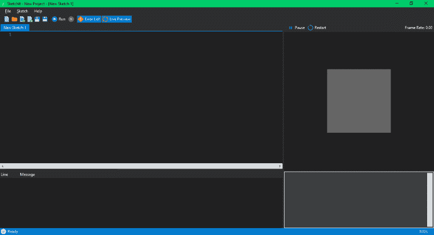
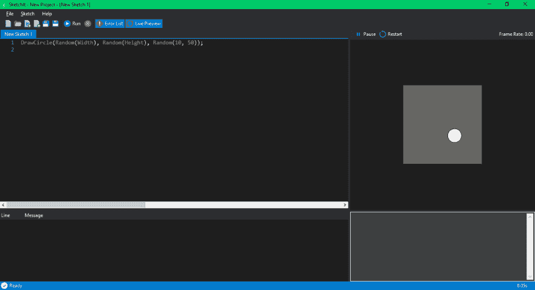
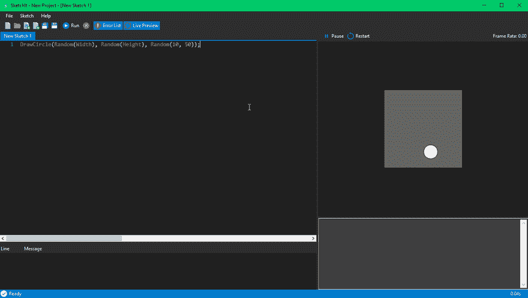
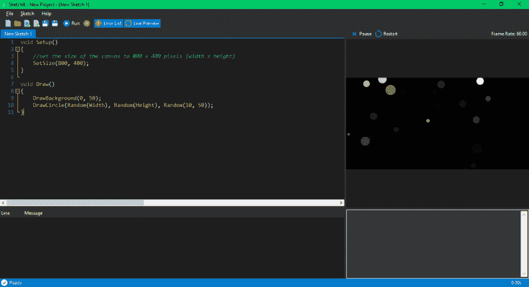

# 只是画一些东西

> 原文：<https://dev.to/iankloppers/sketchit-c-intro-just-draw-something-4p0e>

这是我的第一篇文章，所以请原谅我，并让我知道我可以在哪里以及如何提高我的写作技巧。

# 什么是 SketchIt

[SketchIt](http://sketchit.org) 是一个小，。基于. NET 的开发环境，创建的目的是为了在学习编码的过程中获得乐趣，或者仅仅是用代码勾画出一个可视化的想法。该项目于 2018 年 8 月启动，深受处理开源项目的启发。我希望为创造类似的体验。NET 开发者就像[处理](https://processing.org)为 Java/JavaScript ( [p5.js](https://p5js.org) )开发者所做的那样。

SketchIt **并不是 Visual Studio 等 IDE 的替代品(甚至不是很接近)，而是一个可以立即开始编码的环境，而不会被 Visual Studio 等高级 IDE 吓倒:
[](https://res.cloudinary.com/practicaldev/image/fetch/s--vMKxUjMf--/c_limit%2Cf_auto%2Cfl_progressive%2Cq_auto%2Cw_880/https://thepracticaldev.s3.amazonaws.com/i/fsr464teyds9hdzgx7xa.png)**

# 一些关键概念

需要时，SketchIt 将您的代码“包装”到一个类中，该类允许在不声明名称空间/类/方法的情况下输入代码。以下代码可以输入到 SketchIt 代码编辑器中，并且运行时不会出错:

```
for (int i = 0; i < 10; i++)
{
    PrintLine(i);
} 
```

<svg width="20px" height="20px" viewBox="0 0 24 24" class="highlight-action crayons-icon highlight-action--fullscreen-on"><title>Enter fullscreen mode</title></svg> <svg width="20px" height="20px" viewBox="0 0 24 24" class="highlight-action crayons-icon highlight-action--fullscreen-off"><title>Exit fullscreen mode</title></svg>

上面的例子被称为“静态”草图，这意味着代码从上到下顺序执行，程序结束。

开发 SketchIt 项目时，有两种方法可以生成屏幕输出:

*   写入控制台窗口
*   画到画布上

编写控制台就像使用`PrintLine()`或`Print()`方法一样简单:

```
PrintLine(DateTime.Now); 
```

<svg width="20px" height="20px" viewBox="0 0 24 24" class="highlight-action crayons-icon highlight-action--fullscreen-on"><title>Enter fullscreen mode</title></svg> <svg width="20px" height="20px" viewBox="0 0 24 24" class="highlight-action crayons-icon highlight-action--fullscreen-off"><title>Exit fullscreen mode</title></svg>

使用不同的绘制方法在画布上进行绘制:

```
DrawCircle(Random(Width), Random(Height), Random(10, 50)); 
```

<svg width="20px" height="20px" viewBox="0 0 24 24" class="highlight-action crayons-icon highlight-action--fullscreen-on"><title>Enter fullscreen mode</title></svg> <svg width="20px" height="20px" viewBox="0 0 24 24" class="highlight-action crayons-icon highlight-action--fullscreen-off"><title>Exit fullscreen mode</title></svg>

同样，上述示例可以按原样输入到 SketchIt 代码编辑器中，程序将运行而不会出现错误。生成的程序将在画布的大小(`Width`和`Height`)内的任意位置绘制一个圆，圆的直径(以像素为单位)基于 10 到 50 之间的随机数:
[](https://res.cloudinary.com/practicaldev/image/fetch/s--hWocWcg4--/c_limit%2Cf_auto%2Cfl_progressive%2Cq_auto%2Cw_880/https://thepracticaldev.s3.amazonaws.com/i/9hyw6n22kwwtj86e2cmu.png)

# 利用动画循环

要使用动画循环，您需要声明一个`Draw()`方法。基于请求的帧速率，每秒钟调用`Draw()`方法多次。默认的帧速率是每秒 60 帧，这意味着每秒将调用 60 次`Draw()`方法。

*附注:SketchIt 目前使用 GDI+绘图例程实现渲染，因此一旦动画变得更加复杂，帧速率可能会变得比要求的慢，尤其是在全屏模式下运行草图时。如果你是一个有 OpenGL 经验的开发者，那么请参与进来，帮助开发一个 OpenGL 渲染器。*

如果我们拿前面画了一个随机圆的例子，并把它放到一个`Draw()`方法中，我们将有一个程序在一个连续的循环中生成随机圆:

```
void Draw()
{
    DrawCircle(Random(Width), Random(Height), Random(10, 50));
} 
```

<svg width="20px" height="20px" viewBox="0 0 24 24" class="highlight-action crayons-icon highlight-action--fullscreen-on"><title>Enter fullscreen mode</title></svg> <svg width="20px" height="20px" viewBox="0 0 24 24" class="highlight-action crayons-icon highlight-action--fullscreen-off"><title>Exit fullscreen mode</title></svg>

为了让它更有趣一点，我们可以用黑色半透明的颜色来清除画布的背景:

```
void Draw()
{
    DrawBackground(0, 50);
    DrawCircle(Random(Width), Random(Height), Random(10, 50));
} 
```

<svg width="20px" height="20px" viewBox="0 0 24 24" class="highlight-action crayons-icon highlight-action--fullscreen-on"><title>Enter fullscreen mode</title></svg> <svg width="20px" height="20px" viewBox="0 0 24 24" class="highlight-action crayons-icon highlight-action--fullscreen-off"><title>Exit fullscreen mode</title></svg>

上面的例子将创建一个动画，它画出看起来逐渐消失的圆圈:
[](https://res.cloudinary.com/practicaldev/image/fetch/s--HeVfu8Hd--/c_limit%2Cf_auto%2Cfl_progressive%2Cq_66%2Cw_880/https://thepracticaldev.s3.amazonaws.com/i/3lnpf10kwdgxe3jefnob.gif)

另一个可以利用的重要方法是`Setup()`方法。这个方法在程序启动时被调用，用来“设置”你的程序，比如加载数据、初始化对象(比如摄像机)或者设置画布大小:

```
void Setup()
{
    //set the size of the canvas to 800 x 400 pixels (width x height)
    SetSize(800, 400);
}

void Draw()
{
    DrawBackground(0, 50);
    DrawCircle(Random(Width), Random(Height), Random(10, 50));
} 
```

<svg width="20px" height="20px" viewBox="0 0 24 24" class="highlight-action crayons-icon highlight-action--fullscreen-on"><title>Enter fullscreen mode</title></svg> <svg width="20px" height="20px" viewBox="0 0 24 24" class="highlight-action crayons-icon highlight-action--fullscreen-off"><title>Exit fullscreen mode</title></svg>

预览窗格缩放画布以适合:
[](https://res.cloudinary.com/practicaldev/image/fetch/s--pinj3xMO--/c_limit%2Cf_auto%2Cfl_progressive%2Cq_auto%2Cw_880/https://thepracticaldev.s3.amazonaws.com/i/e7842uelsjhbvsxcv5wh.png)

# 运行项目

当项目运行时，一个*可执行文件(。exe)* 编译启动:
[](https://res.cloudinary.com/practicaldev/image/fetch/s--R5UTRPWB--/c_limit%2Cf_auto%2Cfl_progressive%2Cq_auto%2Cw_880/https://thepracticaldev.s3.amazonaws.com/i/ampo287cxamxsqu8d0eq.png)

SketchIt 试图将所需的资源嵌入到*中。因此，您可以轻松地共享您的项目，而不必包括额外的文件。当然，根据项目引用的其他库，这并不总是可能的。*

# 结论

这实际上只是对 SketchIt 是什么以及它试图完成什么的一个快速介绍。请[下载](http://sketchit.org)并使用它，或者通过 [Github](https://github.com/sketchit/sketchit) 参与进来。

我希望尽快发布更多，也许通过一个像基本游戏的小项目工作，以及如何利用额外的绘图方法和键盘/鼠标输入。