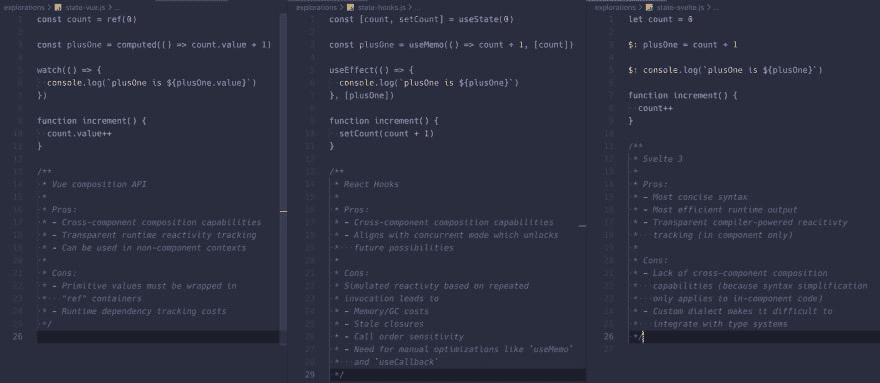

# 预先组合 API

> 原文：<https://dev.to/porfirioribeiro/preact-composition-api-ef1>

我的名字叫 Porfírio，我在[agrop](https://agroop.net)工作了 3 年，用 React 开发了一个应用程序。
我总是对新技术和做事的方式很好奇，所以从 React Hooks 发布的第一天起，我就开始测试它，并在第一次发布后就开始在生产中使用它们。

所以当我听说 Vuejs 中的 RFC 因为一个新的 API 而变得模糊不清时，我开始关注它并试图理解它是什么。在最初的模糊化之后，他们开始设置一个非常有趣的 API

当时我也在阅读 [Preact](https://github.com/preactjs/preact) source，拥有一个小库的好处是可以阅读代码并理解大部分内容。
事实上，[钩子](https://github.com/preactjs/preact/blob/master/hooks/src/index.js)的预反应源代码帮助我理解了钩子是如何工作的，这是我在*尝试*读取预反应源代码时无法做到的。我在 Preact 中发现了这个有趣的 API，它可以让你*将*挂钩到渲染过程中，这是他们用来将挂钩作为一个单独的包引入 Preact 中，而不增加 Preact 的大小

我非常喜欢新的 Vue API 吗？我在摆弄 Preact，我决定创建一个在 Preact 上实现新的 Vue 组合 API 的概念证明。
可以在这里找到:[https://github . com/porfiriobeiro/preact/blob/composition-API/composition/src/index . js](https://github.com/porfirioribeiro/preact/blob/composition-api/composition/src/index.js)

同时，我在 preact repo 上创建了一个 WIP PR:[https://github.com/preactjs/preact/pull/1923](https://github.com/preactjs/preact/pull/1923)

当然，与 Vue api 有所不同，因为两个库处理事情的方式不同。

## 对比 Vue 组合 API

[https://vue-composition-api-rfc.netlify.com](https://vue-composition-api-rfc.netlify.com)

Preact Composition API 受 Vue 的启发很大，所以它的 API 试图模仿 Vue API，但由于一些限制或设计的原因，它并不完全相同。

#### [创建组件](https://vue-composition-api-rfc.netlify.com/api.html#createcomponent) / [设置](https://vue-composition-api-rfc.netlify.com/api.html#setup)

Vue 使用`createComponent`接受一个包含`setup`的对象，这是 Vue 用对象定义组件的方式。事实上，`createComponent`什么也不做，主要是帮忙打字。
In Preact `createComponent`接受一个返回函数组件的函数。它在 Preact 中也没有做太多，它只是将该函数标记为复合函数，这样 Preact 就可以不同地处理它。

```
export const MyComp = createComponent(() => {
    // composition code
    //
    // return function component
    return ({ message }) => <div>{message}</div>;
}); 
```

<svg width="20px" height="20px" viewBox="0 0 24 24" class="highlight-action crayons-icon highlight-action--fullscreen-on"><title>Enter fullscreen mode</title></svg> <svg width="20px" height="20px" viewBox="0 0 24 24" class="highlight-action crayons-icon highlight-action--fullscreen-off"><title>Exit fullscreen mode</title></svg>

#### [无功](https://vue-composition-api-rfc.netlify.com/api.html#reactive)

`reactive`将一个对象包装在一个[代理](https://developer.mozilla.org/en-US/docs/Web/JavaScript/Reference/Global_Objects/Proxy)中，这样每次对象改变时，组件都会更新，作为状态持有者工作。

```
export const MyComp = createComponent(() => {
    const obj = reactive({ count: 0 });

    function increase() {
        obj.count++;
    }

    return ({ message }) => (
        <div onClick={increase}>
            {message} {obj.count}
        </div>
    );
}); 
```

<svg width="20px" height="20px" viewBox="0 0 24 24" class="highlight-action crayons-icon highlight-action--fullscreen-on"><title>Enter fullscreen mode</title></svg> <svg width="20px" height="20px" viewBox="0 0 24 24" class="highlight-action crayons-icon highlight-action--fullscreen-off"><title>Exit fullscreen mode</title></svg>

#### [参](https://vue-composition-api-rfc.netlify.com/api.html#ref)

`ref`也是一个状态持有者，它主要包装一个值，我们需要它，因为在 JavaScript 中，原生变量是通过值传递的，而不是引用。
当`theRef.value`改变时，组件更新。
`ref`的实现比`reactive`更简单，因为它使用了带有 getter/setter 的对象。

```
export const MyComp = createComponent(() => {
    const count = ref(0);

    function increase() {
        count.value++;
    }

    return ({ message }) => (
        <div onClick={increase}>
            {message} {count.value}
        </div>
    );
}); 
```

<svg width="20px" height="20px" viewBox="0 0 24 24" class="highlight-action crayons-icon highlight-action--fullscreen-on"><title>Enter fullscreen mode</title></svg> <svg width="20px" height="20px" viewBox="0 0 24 24" class="highlight-action crayons-icon highlight-action--fullscreen-off"><title>Exit fullscreen mode</title></svg>

#### [isRef](https://vue-composition-api-rfc.netlify.com/api.html#isref)

`isRef`返回如果一个对象是`ref`
`unwrapRef`尝试解开 ref

```
const value = isRef(foo) ? foo.value : foo; //same as
const value = unwrapRef(foo); 
```

<svg width="20px" height="20px" viewBox="0 0 24 24" class="highlight-action crayons-icon highlight-action--fullscreen-on"><title>Enter fullscreen mode</title></svg> <svg width="20px" height="20px" viewBox="0 0 24 24" class="highlight-action crayons-icon highlight-action--fullscreen-off"><title>Exit fullscreen mode</title></svg>

#### [斗牛士](https://vue-composition-api-rfc.netlify.com/api.html#torefs)

尚未实现，因为 Preact 中的 API 的设计与 Vue 中的不同，还没有很好地利用它。

#### [计算](https://vue-composition-api-rfc.netlify.com/api.html#computed)

`computed`没有按原样实现，它主要与`watch`结合在一起，因为 Preact 生命周期的工作方式与 Vue 略有不同

#### [手表](https://vue-composition-api-rfc.netlify.com/api.html#watch)

Preact 中的`watch`与 Vue 中的`watch`略有不同，这是由于 Preact 和 Vue 的不同，以及一些 API 设计为支持其他 Preact 功能，如上下文
由于这种性质，我们有两个相似的函数:`watch`和`effect`
`watch`在渲染之前运行，可以返回一个`ref`及其执行结果
`effect`在更新之后运行，这是一个副作用

```
//un-exhausted example of what watch can do!
const countGetter = props => props.countProp;

export const MyComp = createComponent(() => {
    const countRef = ref(0);
    const reactiveObj = reactive({ count: 0 });

    const memoizedComputedValue = watch(
        [countRef, reactiveObj, countGetter],
        // this will be computed when any of those 3 dependencies are updated
        // works as computing and memoization
        ([count, obj, countFromProps]) => count * obj * countFromProps
    );

    effect(
        memoizedComputedValue,
        value => (document.title = `computed [${value}]`)
    );

    function increase() {
        countRef.value++;
    }

    return ({ message }) => (
        <div onClick={increase}>
            {message} {memoizedComputedValue.value}
        </div>
    );
}); 
```

<svg width="20px" height="20px" viewBox="0 0 24 24" class="highlight-action crayons-icon highlight-action--fullscreen-on"><title>Enter fullscreen mode</title></svg> <svg width="20px" height="20px" viewBox="0 0 24 24" class="highlight-action crayons-icon highlight-action--fullscreen-off"><title>Exit fullscreen mode</title></svg>

#### [生命周期挂钩](https://vue-composition-api-rfc.netlify.com/api.html#lifecycle-hooks)

只有一些生命周期挂钩实现了，一些还没有实现，其他的不会实现，因为它没有意义或者不能在 Preact 中实现

*   组件装载到 DOM 后调用的回调
*   `onUnmounted`回调以在组件从 DOM 中移除之前调用
*   `effect`不能被认为是一个生命周期，但可以用来实现与 Vue 中的`onUpdated`相同的功能，跟踪所需的依赖项。

#### [提供-注入](https://vue-composition-api-rfc.netlify.com/api.html#provide-inject)

`provide`和`inject`未实现，因为 Preact 已经有一个上下文 API，可能可以在以后实现。

我们可以通过在`watch`或`effect`上将一个上下文作为 src 传递来实现`inject` like 特性，让组件订阅该上下文的最近提供者

```
export const MyComp = createComponent(() => {
    const userCtx = watch(UserContext);

    return ({ message }) => (
        <div>
            {message} {userCtx.value.name}
        </div>
    );
}); 
```

<svg width="20px" height="20px" viewBox="0 0 24 24" class="highlight-action crayons-icon highlight-action--fullscreen-on"><title>Enter fullscreen mode</title></svg> <svg width="20px" height="20px" viewBox="0 0 24 24" class="highlight-action crayons-icon highlight-action--fullscreen-off"><title>Exit fullscreen mode</title></svg>

## 与(P)React 挂钩比较

[https://reactjs.org/docs/hooks-reference.html](https://reactjs.org/docs/hooks-reference.html)

乍一看，我们可能会发现 React hooks 和 Preact Composition API(PCApi)很相似，但它们之间有着巨大的差异。

当我们调用复合函数时，传递给`createComponent`的函数在组件生命周期中只执行一次，返回的函数组件在每次更新时执行。
在 React 中，钩子总是被调用，并且(大部分)在每次渲染中被重新定义， [Vue 很好地解释了这种差异](https://vue-composition-api-rfc.netlify.com/#comparison-with-react-hooks)

这必须带来思维的转变，在钩子中你可以处理简单的变量，但是必须处理代码的重声明和对值和回调的记忆，以避免子元素的重呈现。

#### [使用状态](https://reactjs.org/docs/hooks-reference.html#usestate)

`useState`在 React 中被用作状态持有器，在 PCApi 中可以使用`ref`或`reactive`，根据需要持有单值或多值对象

```
// (P)React hooks
const Counter = ({ initialCount }) => {
    // redeclared and rerun on each render
    const [count, setCount] = useState(initialCount);
    const reset = () => setCount(initialCount);
    const increment = () => setCount(prevCount => prevCount + 1);
    const decrement = () => setCount(prevCount => prevCount - 1);
    return (
        <>
            Count: {count}
            <button onClick={reset}>Reset to {initialCount}</button>
            <button onClick={increment}>+</button>
            <button onClick={decrement}>-</button>
        </>
    );
};
// Preact Composition
const Counter = createComponent(props => {
    // run once
    const countRef = ref(props.initialCount);
    const reset = () => (countRef.value = props.initialCount);
    const increment = () => (countRef.value += 1);
    const decrement = () => (countRef.value -= 1);
    return ({ initialCount }) => (// run on each render
        <>
            Count: {countRef.value}
            <button onClick={reset}>Reset to {initialCount}</button>
            <button onClick={increment}>+</button>
            <button onClick={decrement}>-</button>
        </>
    );
}); 
```

<svg width="20px" height="20px" viewBox="0 0 24 24" class="highlight-action crayons-icon highlight-action--fullscreen-on"><title>Enter fullscreen mode</title></svg> <svg width="20px" height="20px" viewBox="0 0 24 24" class="highlight-action crayons-icon highlight-action--fullscreen-off"><title>Exit fullscreen mode</title></svg>

这两个实现的大小基本相同，代码看起来也很相似，不同之处主要在于组合函数只运行一次，并且回调函数在每次呈现时都没有重新声明。这可能没多大关系，但在每次渲染中交换事件处理程序并不是最佳选择，这也是 React 实现[合成事件](https://reactjs.org/docs/events.html)的原因之一。

#### [使用效果](https://reactjs.org/docs/hooks-reference.html#useeffect)

`useEffect`是一个一体化的效果处理程序，您可以将其用于挂载(`onMounted`)/卸载(`onUnmounted`)生命周期或基于依赖关系的更新。

```
// (P)React
const Comp = props => {
    useEffect(() => {
        // subscribe
        const subscription = props.source.subscribe();
        return () => {
            // Clean up the subscription
            subscription.unsubscribe();
        };
    }, []);
    return <div>irrelevant</div>;
};
// Preact Composition
const Comp = createComponent(props => {
    let subscription;
    onMounted(() => {
        // subscribe
        subscription = props.source.subscribe();
    });
    onUnmounted(() => {
        // Clean up the subscription
        subscription.unsubscribe();
    });
    return () => <div>irrelevant</div>;
}); 
```

<svg width="20px" height="20px" viewBox="0 0 24 24" class="highlight-action crayons-icon highlight-action--fullscreen-on"><title>Enter fullscreen mode</title></svg> <svg width="20px" height="20px" viewBox="0 0 24 24" class="highlight-action crayons-icon highlight-action--fullscreen-off"><title>Exit fullscreen mode</title></svg>

同样，这两种方法的代码非常相似，`useEffect`将检查依赖关系，找到空数组，使效果永远不会改变，并保释出新函数。

现在，如果你需要基于某种依赖(例如道具)来订阅，这就有点不同了。

```
// (P)React
const Comp = props => {
    useEffect(() => {
        const subscription = props.source.subscribe(props.id);
        return () => subscription.unsubscribe();
    }, [props.id, props.source]);
    return <div>irrelevant</div>;
};
// Preact Composition
const Comp = createComponent(props => {
    effect(
        props => [props.id, props.source],
        ([id, source], _oldArgs, onCleanup) => {
            const subscription = source.subscribe(id);
            onCleanup(() => subscription.unsubscribe());
        }
    );
    return () => <div>irrelevant</div>;
}); 
```

<svg width="20px" height="20px" viewBox="0 0 24 24" class="highlight-action crayons-icon highlight-action--fullscreen-on"><title>Enter fullscreen mode</title></svg> <svg width="20px" height="20px" viewBox="0 0 24 24" class="highlight-action crayons-icon highlight-action--fullscreen-off"><title>Exit fullscreen mode</title></svg>

给你 3 样东西，newArgs，oldArgs(在更新的情况下)，onCleanup，这是一个特殊的函数，你可以调用并传递一个清理函数。它不使用返回回调方法，因为效果回调可能是异步的！

#### [使用语境](https://reactjs.org/docs/hooks-reference.html#usecontext)

`useContext`让您订阅并获取父组件中上下文的值，在 Composition API 中您可以使用上下文作为观察或效果函数的源。

```
// (P)React
const Comp = props => {
    const ctxValue = useContext(MyContext);
    return <div>{ctxValue}</div>;
};
// Preact Composition
const Comp = createComponent(props => {
    const ctx = watch(MyContext);
    return () => <div>{ctx.value}</div>;
}); 
```

<svg width="20px" height="20px" viewBox="0 0 24 24" class="highlight-action crayons-icon highlight-action--fullscreen-on"><title>Enter fullscreen mode</title></svg> <svg width="20px" height="20px" viewBox="0 0 24 24" class="highlight-action crayons-icon highlight-action--fullscreen-off"><title>Exit fullscreen mode</title></svg>

为您提供一些优势，让您可以将许多信号源连接在一起！

#### [用户减少](https://reactjs.org/docs/hooks-reference.html#usereducer)

目前还没有替代方案，但是很容易实现

#### [使用回调](https://reactjs.org/docs/hooks-reference.html#usecallback)

在大多数情况下，像`useCallback`这样的函数是不必要的，因为你可以在设置时只定义一次回调，引用永远不会改变，这是这个 API 的一个伟大的特性。
通常您的调用被称为 sync，因此您可以使用正确的值访问您的状态和属性引用，但有时您可能会将一个函数传递给一个组件，该组件将在不同的时间被调用，并且您希望使用当前值来调用它。

```
// (P)React
const Comp = props => {
    const handlePostSubmit = useCallback(
        () => console.log('This will be called with actual id', props.id),
        [props.id]
    );
    return <Form onPostSubmit={handlePostSubmit}>irrelevant</Form>;
};
// Preact Composition
const Comp = createComponent(props => {
    const handlePostSubmit = watch(
        props => props.id,
        id => console.log('This will be called with actual id', id)
    );
    return () => <Form onPostSubmit={handlePostSubmit.value}>irrelevant</Form>;
}); 
```

<svg width="20px" height="20px" viewBox="0 0 24 24" class="highlight-action crayons-icon highlight-action--fullscreen-on"><title>Enter fullscreen mode</title></svg> <svg width="20px" height="20px" viewBox="0 0 24 24" class="highlight-action crayons-icon highlight-action--fullscreen-off"><title>Exit fullscreen mode</title></svg>

#### [使用备忘录](https://reactjs.org/docs/hooks-reference.html#usememo)

`useMemo`允许您记忆数值并避免重新计算大数值，除非需要

```
// (P)React
const Comp = props => {
    const [filter, setFilter] = useState('ALL');
    const filteredItems = useMemo(() => filterItems(props.items, filter), [
        props.items,
        filter
    ]);
    return <ItemList items={filteredItems} />;
};
// Preact Composition
const Comp = createComponent(() => {
    const filterRef = ref('ALL');
    const filteredItems = watch(
        [props => props.items, filterRef],
        ([items, filter]) => filterItems(items, filter)
    );
    return () => <ItemList items={filteredItems.value} />;
}); 
```

<svg width="20px" height="20px" viewBox="0 0 24 24" class="highlight-action crayons-icon highlight-action--fullscreen-on"><title>Enter fullscreen mode</title></svg> <svg width="20px" height="20px" viewBox="0 0 24 24" class="highlight-action crayons-icon highlight-action--fullscreen-off"><title>Exit fullscreen mode</title></svg>

#### [useRef](https://reactjs.org/docs/hooks-reference.html#useref)

`useRef`主要用于两件事，处理 DOM 引用和保存渲染之间的组件值

因为我们有 setup 函数，所有在那里声明的 var 都可以在渲染之间使用，所以不需要`useRef`。
对于 DOM 值，你可以使用回调和局部变量或者`React.createRef`

#### [t1](#useimperativehandle)[多用途贸易](https://reactjs.org/docs/hooks-reference.html#useimperativehandle)

我还没有发现它的必要性，但是我相信它是可以实现的

#### [useLayoutEffect](https://reactjs.org/docs/hooks-reference.html#uselayouteffect)

目前还没有直接的替代品。

#### [useDebugValue](https://reactjs.org/docs/hooks-reference.html#usedebugvalue)

我还没有发现它的必要性，但是我相信它是可以实现的

### 结论

这里的重点不是说这个 API 更好，它是不同的，两者都有 Twitter 上指出的尤雨溪的缺点:[https://twitter.com/youyuxi/status/1169325119984082945](https://twitter.com/youyuxi/status/1169325119984082945)

[](https://res.cloudinary.com/practicaldev/image/fetch/s--8vqW1Pps--/c_limit%2Cf_auto%2Cfl_progressive%2Cq_auto%2Cw_880/https://thepracticaldev.s3.amazonaws.com/i/rhw687zrw2aqcgfeszfx.jpeg)