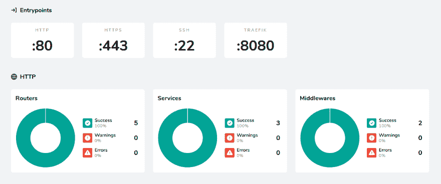

# 步骤 2:概念(VF)

> 原文:[https://dev.to/jadekharats/traefik-2-concept-29kb](https://dev.to/jadekharats/traefik-2-concept-29kb)

# [](#traefik-2-concept)教程 2:概念

## [](#description)描述

Traefik 是一个反向代理，也是负载平衡器。版本 1 很容易安装在 swarm 坞站上。

## [](#le-besoin)需求

一般来说，我们需要部署容器，并且可以通过域名访问它们。

如果我们分解这种需求，我们有:

*   监听此 ip 和一个或多个端口的服务
*   认证交易的服务
*   凭证管理服务
*   将请求(HTTP 或 TCP)重定向到正确容器的服务。

我们有 Traefik v2

## traefik v2 的元素

### [](#les-configurations)Les 配置

Traefik 支持两种类型的配置:动态配置或静态配置。
对于静态部分，我选择`traefik.yaml`文件。
动态部分由放置在容器级别的标签管理。

### [](#les-providers)莱斯提供商

Traefik 需要知道谁将为其提供名为 providers 的动态配置

在我看来，这是一个 swarm 模式的坞站。所以我把这个加在
上

```
providers:
  docker:
    watch: true
    swarmMode: true
    endpoint: "/unix:///var/run/docker.sock" 
```

### [](#les-entrypoints)他们输入了

entrypoints 是 ip 对:traefik 将侦听的端口。这是一个静态配置。

```
entryPoints:
  ssh:
    address: ":22"
  http:
    address: ":80"
  https:
    address: ":443" 
```

注意:Traefik 在配置协议中工作。如果您不需要路由器的输入，则缺省情况下，它将使用缺省列表中的第一个。
就我而言，我把它们按端口号排列，以便于阅读。

### 路由器

路由器可以是静态的，但在我的情况下是动态管理的。
路由器需要一个或多个输入类型和规则来确定要跟随哪个 Traefik 路由器。

以 treafik 控制板展示为例，继续进行文章。

我们将监听标头中对端口 80 的请求:host("traefik.example.tld ")

因此，我们需要在 traefik 容器中添加以下标签:

```
- "traefik.http.routeurs.traefik-routeur0.entryPoints=http"
- "traefik.http.routeurs.traefik-routeur0.rule=Host(`traefik.example.tld`)" 
```

### 服务

由于服务是带有标签的容器，因此可以方便地进行配置。
Traefik 会从中推论出很多东西。

接下来，我将演示如何指定 Traefik 要在其中查找容器 ip 的网络，以及如何指定端口。

默认情况下，我总是将必须通过 Traefik 曝光的容器添加到网络“`traefik-net`”中。这是 V1 的 aquise 习俗。

因此，在容器标签中，我将指示它采用与此网络相关的 IP

```
- "traefik.docker.network=traefik-net" 
```

接下来，我将为仪表板服务指定端口。但是，Traefik 2 不允许在 docker 提供程序级别启用它。
在档案`traefik.yaml`中，我将方块`providers`修改如下:

```
providers:
  docker:
    watch: true
    swarmMode: true
    useBindPortIp: true
    endpoint: "/unix:///var/run/docker.sock" 
```

这样就可以添加以下标签

```
- "traefik.http.services.traefik-service.loadbalancer.server.port=8080" 
```

当然，也需要 Traefik 来展示他的仪表板，这是在
中所做的

```
api:
  dashboard: true 
```

在此基础上，通过启动 traefik 服务，我们可以访问我们的仪表板。但一切都是公开的。
幸运的是，Traefik 通过 middlewares 提供了一种添加中间处理的方法。

### [](#les-middlewares)中间商

有很多，但首先，我将演示如何添加 basic auth。然后将中间件添加到路由器。

中间件可以是静态的，也可以是动态的。我一直在想地点或者设置这个中间件
然后我最终告诉自己，所有 Traefik 元素都必须动态配置。

于是，我把这个标签加入了我的 Traefik 容器

```
- "traefik.http.middlewares.auth.basicauth.users=titi:$$2y..." 
```

并将其添加到我的路由器

```
- "traefik.http.routeurs.traefik-routeur0.middlewares=auth" 
```

## [](#conclusion)结论

这是我第一次在我的 Swarm 上使用基本配置启动 Traefik v2。
[](https://res.cloudinary.com/practicaldev/image/fetch/s--80q05iMr--/c_limit%2Cf_auto%2Cfl_progressive%2Cq_auto%2Cw_880/https://thepracticaldev.s3.amazonaws.com/i/z2f1brpoxxazgayh8rem.png)

在下一篇文章中，我将详细介绍用于 https 重定向和证书管理的文件`traefik.yaml`和`stack-traefik.yml`。
与此同时，我把下面两个文件的内容摆在你面前。

traefik.yaml

```
api:
  dashboard: true
entryPoints:
  ssh:
    address: ":22"
  http:
    address: ":80"
  https:
    address: ":443"
providers:
  docker:
    watch: true
    swarmMode: true
    useBindPortIP: true
    endpoint: "unix:///var/run/docker.sock" 
```

stack-traefik.yml

```
 version: "3.3"

 networks:
   traefik-net:
     external: true

 configs:
   traefik.yaml:
     file: ./traefik.yaml

 services:
   traefik:
     image: traefik:v2.0
     ports:
       - 80:80
       - 443:443
       - 22:22
     volumes:
       - /var/run/docker.sock:/var/run/docker.sock:ro
     configs:
       - source: traefik.yaml
         target: /etc/traefik/traefik.yaml
     networks:
       - traefik-net
     deploy:
       mode: global
       placement:
         constraints: [node.role == manager]
       labels:
         - "traefik.docker.network=traefik-net"
         - "traefik.http.routers.traefik-router0.entrypoints=http"
         - "traefik.http.routers.traefik-router0.rule=Host(`traefik.kharats.fr`)"
         - "traefik.http.routers.traefik-router0.middlewares=auth"
         - "traefik.http.middlewares.auth.basicauth.users=titi:$$toto..."
         - "traefik.http.services.traefik-service.loadbalancer.server.port=8080" 
```