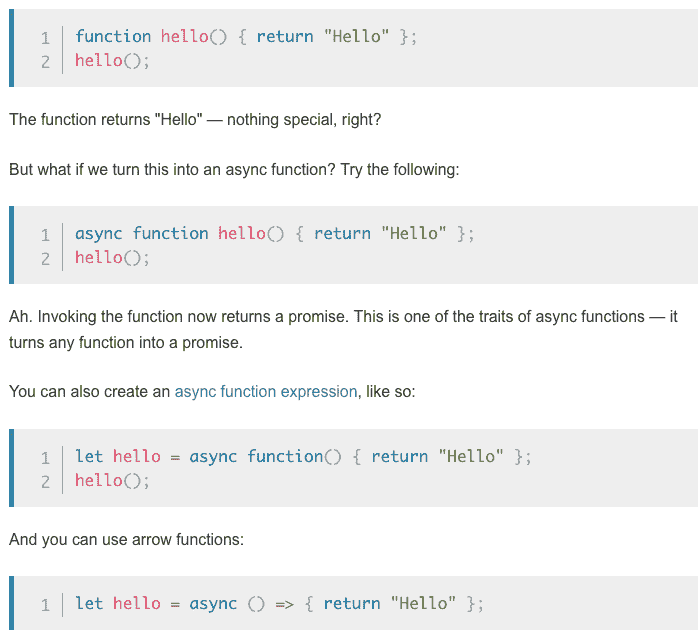

# *异步/等待——这是我向你保证的

> 原文：<https://dev.to/iris/async-await-this-i-promise-you-22l2>

## 异步和等待:2017 年以来让承诺更容易

async 和 await 特性是作为 [ECMAScript 2017](https://developer.mozilla.org/en-US/docs/Archive/Web/JavaScript/ECMAScript_Next_support_in_Mozilla#ECMAScript_2017) 的一部分引入 Javascript 的。

Async 和 await 为承诺的交互提供了简单直观的语法。对异步代码使用 async/await 的好处之一是改进了错误处理，减少了条件和。then()s，并且它们更容易与调试器一起使用。

## 异步

async 关键字可以用来将任何函数转换成异步函数。

异步函数总是返回一个承诺。

只需将 async 关键字放在任何函数表达式或声明的开头。看看下面 MDN 中的异步函数[语法示例:](https://developer.mozilla.org/en-US/docs/Learn/JavaScript/Asynchronous/Async_await#The_async_keyword)

[](https://res.cloudinary.com/practicaldev/image/fetch/s--AegQiX45--/c_limit%2Cf_auto%2Cfl_progressive%2Cq_auto%2Cw_880/https://thepracticaldev.s3.amazonaws.com/i/wlok0j5z4e9f2sm5qbt6.png)T3】

```
function tearingUp() {
   return "It's tearin' up my heart when I'm with you. But when we are apart, I feel it too"
}
async function myHeart()  {
   return "And no matter what I do, I feel the pain. With or without you"
}
console.log(tearingUp()) // "It's tearin' up my heart when I'm with you. But when we are apart, I feel it too"
console.log(myHeart()) // Promise { <state>: "fulfilled", <value>: "And no matter what I do, I feel the pain. With or without you" } 
```

<svg width="20px" height="20px" viewBox="0 0 24 24" class="highlight-action crayons-icon highlight-action--fullscreen-on"><title>Enter fullscreen mode</title></svg> <svg width="20px" height="20px" viewBox="0 0 24 24" class="highlight-action crayons-icon highlight-action--fullscreen-off"><title>Exit fullscreen mode</title></svg>

您可以使用[与异步函数返回的承诺进行交互。then()](https://developer.mozilla.org/en-US/docs/Web/JavaScript/Reference/Global_Objects/Promise/then) 方法，但是还有另一种方法:await。

## 等待

await 关键字只能在异步函数中使用。Await 实际上是在继续当前代码行之前等待承诺解决。

```
async function digitalDigital()  {
   let firstPart = Promise.resolve(`Digital, digital get down`)
   let nextPart = await firstPart + ` (get down) just you and me`
   console.log(nextPart) // "Digital, digital get down (get down) just you and me"
} 
```

<svg width="20px" height="20px" viewBox="0 0 24 24" class="highlight-action crayons-icon highlight-action--fullscreen-on"><title>Enter fullscreen mode</title></svg> <svg width="20px" height="20px" viewBox="0 0 24 24" class="highlight-action crayons-icon highlight-action--fullscreen-off"><title>Exit fullscreen mode</title></svg>

*注意——如果你连续等待许多承诺，你可能会大大减慢你的运行时间*

## 总之...

Async 和 await 使得读写异步代码更加容易。你可以把所有旧的东西整理一下，节省空间。然后()s，将任何函数变成一个承诺，并在等待承诺解决时暂停您的代码。

```
async function byeByeBye() {
   let amazingLyric = new Promise((resolve, reject) => {
    setTimeout(() => resolve("Baby bye bye bye"), 2000)
  });
  let dunzo = await amazingLyric;
  alert(dunzo)
}
byeByeBye() // "Baby bye bye bye" 
```

<svg width="20px" height="20px" viewBox="0 0 24 24" class="highlight-action crayons-icon highlight-action--fullscreen-on"><title>Enter fullscreen mode</title></svg> <svg width="20px" height="20px" viewBox="0 0 24 24" class="highlight-action crayons-icon highlight-action--fullscreen-off"><title>Exit fullscreen mode</title></svg>

以下是我在研究这篇文章时使用的一些便利资源:

*   [MDN 异步/等待文档](https://developer.mozilla.org/en-US/docs/Learn/JavaScript/Asynchronous/Async_await)
*   Ashay Mandwarya 如何在 JavaScript 中使用 Async Await
*   [Javascript.info 文档](https://javascript.info/async-await)
*   穆斯塔法·加法尔的《JavaScript Async/Await 优于简单承诺的 7 个理由(教程)》