# 使用 Azure DevOps 持续将 Angular 部署到 Azure 应用服务

> 原文:[https://dev . to/this dot media/continuously-deploying-angular-to-azure-app-service-with-azure-devo PS-4hf 2](https://dev.to/thisdotmedia/continuously-deploying-angular-to-azure-app-service-with-azure-devops-4hf2)

# [](#introduction)简介

在上一篇文章中，我们看到了如何将 Angular 应用程序与 Azure DevOps 集成，这样我们就可以持续地构建我们的项目，并将输出作为工件发布，并附加到构建管道中。

在本文中，我们将创建一个发布管道，以便在发布这样的工件时自动部署到 Azure 应用服务。

# [](#creating-the-release-pipeline)创建发布管道

我们将在同一个项目中创建发布管道，作为我们想要部署工件的构建管道。

从项目的边栏中导航到 releases，并选择 New pipeline。

因为我们将利用 Azure App Service 来托管我们的 Angular 应用程序，所以选择 Azure App Service 部署模板，然后单击 apply:

[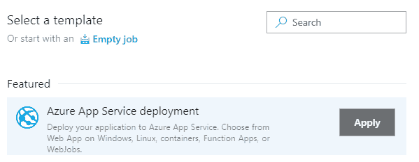T2】](https://res.cloudinary.com/practicaldev/image/fetch/s--ErWWMLan--/c_limit%2Cf_auto%2Cfl_progressive%2Cq_auto%2Cw_880/https://thepracticaldev.s3.amazonaws.com/i/cg60b369wk6ckfkagcvn.png)

Azure DevOps 支持单个发布管道中的多个阶段(例如，开发、测试、生产环境)。对于本文，我们将只使用一个阶段，默认情况下已经创建了这个阶段，名称为 Stage 1。如果你愿意，你可以给它一个合适的名字，或者保持原样。

[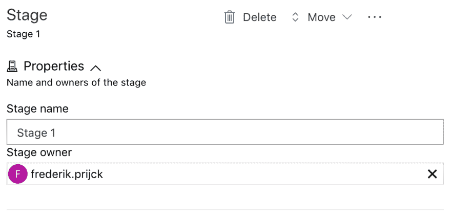T2】](https://res.cloudinary.com/practicaldev/image/fetch/s--zZ6cl6JC--/c_limit%2Cf_auto%2Cfl_progressive%2Cq_auto%2Cw_880/https://thepracticaldev.s3.amazonaws.com/i/e5h1yehoptgh6a1jj20o.png)

当选择 Azure App Service 部署模板时，任务会自动添加到发布管道中。转到任务部分，填写所需信息。我们需要选择 Azure 订阅。([这里的](https://docs.microsoft.com/bs-latn-ba/azure/billing/billing-mca-create-subscription)是如果你还没有的话，你可以如何创建一个。确保您选择了不收费的**免费试用**订阅。免费试用不应用于生产)。

如果这是你第一次将 Azure DevOps 连接到你的 Azure 帐户，你需要单击“授权”。一旦我们授权 Azure DevOps 与我们的 Azure 订阅进行通信，我们就可以选择将托管我们的应用程序的应用服务(确保您已经从下拉列表中选择了值，而不只是手动键入):

[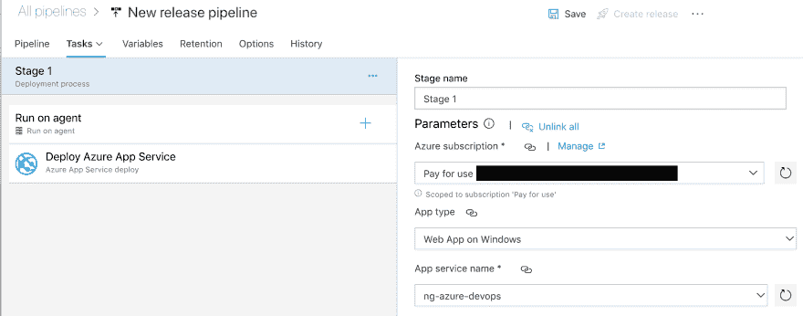T2】](https://res.cloudinary.com/practicaldev/image/fetch/s--SAvpWOJl--/c_limit%2Cf_auto%2Cfl_progressive%2Cq_auto%2Cw_880/https://thepracticaldev.s3.amazonaws.com/i/68oy7htegx749jt57460.png)

如果你没有在 [Azure 门户](https://azure.microsoft.com/en-us/features/azure-portal/)上创建应用服务，你需要打开 Azure 门户仪表盘，找到左边的`App Service`按钮。然后，选择它，并点击`Add`按钮。您应该看到以下内容:

[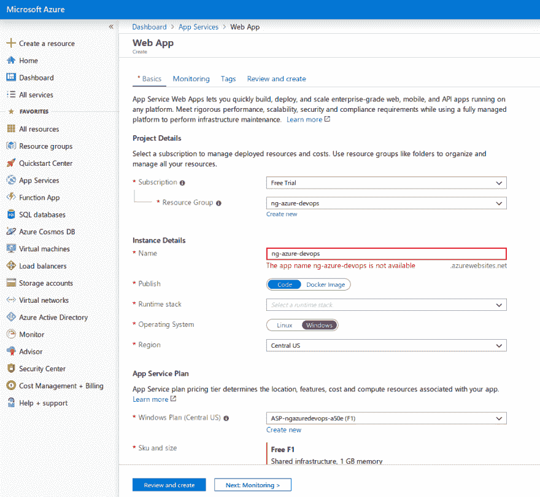T2】](https://res.cloudinary.com/practicaldev/image/fetch/s--qiY6P1Ya--/c_limit%2Cf_auto%2Cfl_progressive%2Cq_auto%2Cw_880/https://thepracticaldev.s3.amazonaws.com/i/qch4h3eu0zpb3bjv8v77.png)

## [](#adding-build-artifacts)添加构建构件

既然我们已经为我们的部署任务配置了目标环境，那么转到 Pipeline 部分(在 Tasks 部分的左边)来添加我们想要部署的工件。单击 Add Artifact，选择构建源类型(因为构件存储在构建管道中)，并从 source 下拉列表中选择适当的构建管道。您可以保留要部署的版本和源别名的默认值，因为我们总是希望部署最新的版本。源别名是将用于下载工件的文件夹。当操作和上传工件时，我们将在接下来的步骤中使用这个值。

[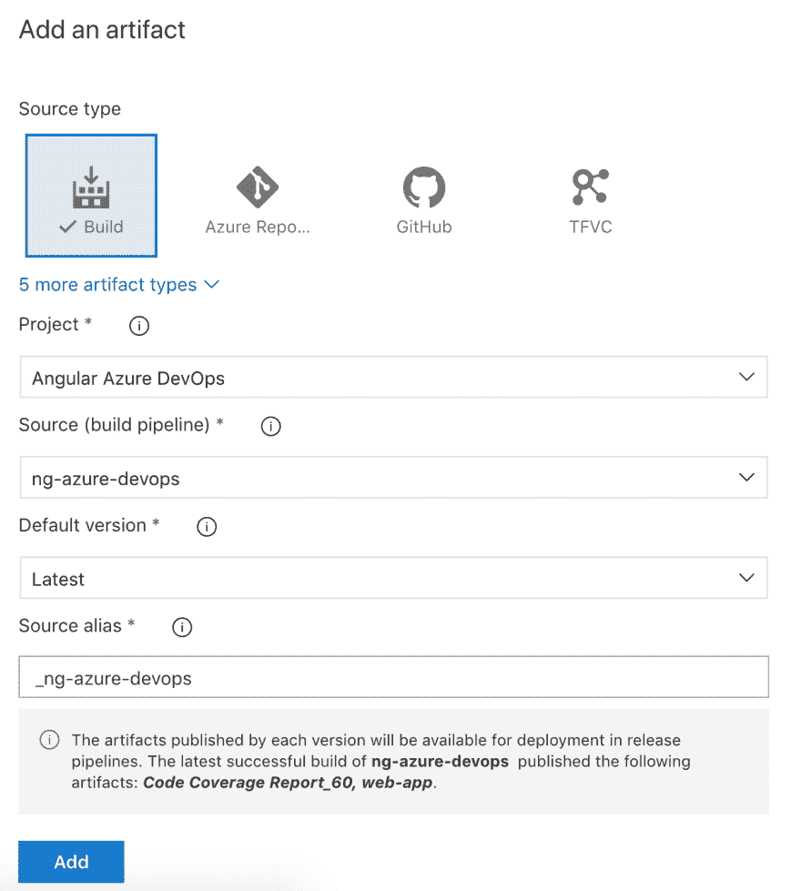T2】](https://res.cloudinary.com/practicaldev/image/fetch/s--b0L8EZaf--/c_limit%2Cf_auto%2Cfl_progressive%2Cq_auto%2Cw_880/https://thepracticaldev.s3.amazonaws.com/i/ta8rs4rrybqe5u6t7vo1.png)

这将使所有属于构建管道的工件在发布管道中可用。当发布管道被触发时，它们将被自动下载。

既然我们已经配置了工件和环境，我们将需要对我们的部署做一个额外的更改。对于部署 Azure App Service 任务，我们需要指定它必须部署哪个工件。

我们的构建管道发布了两个工件:

*   代码覆盖率报告
*   我们想要部署的`ng build`构建输出

如果需要，我们可以添加额外的步骤来部署代码覆盖工件，但是对于本文，我们将只部署`ng build`输出，它被发布为名为`web-app`的工件，并在我们的 Azure App Service 部署步骤中的`_ng-azure-devops`目录中可用(这是添加工件时配置的源别名)。

现在转到我们管道中的 *Tasks* 选项卡，点击 deployment task，并将*包或文件夹*更改为`$(System.DefaultWorkingDirectory)/_ng-azure-devops/web-app`。

[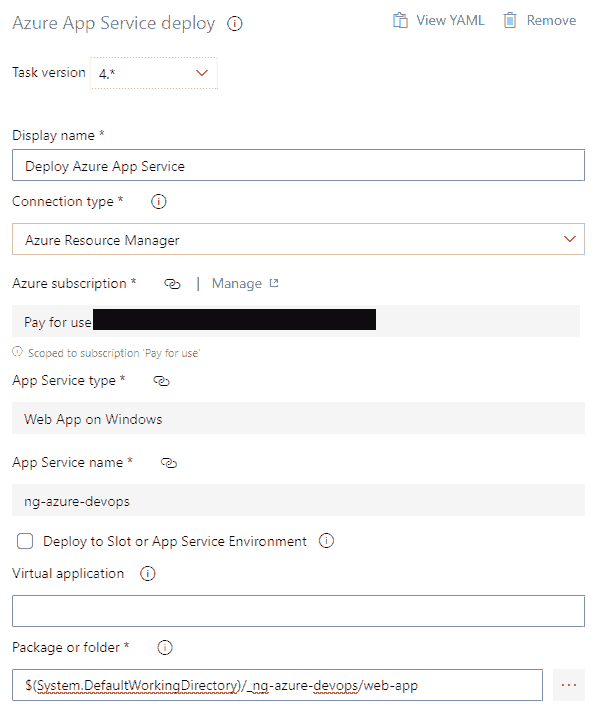T2】](https://res.cloudinary.com/practicaldev/image/fetch/s--D4DrxMqF--/c_limit%2Cf_auto%2Cfl_progressive%2Cq_auto%2Cw_880/https://thepracticaldev.s3.amazonaws.com/i/37frysbhd14rb0lrp2cp.png)

## [](#continuous-deployment-trigger)持续部署触发

尽管我们可以保存配置，并在此时创建手动发布，但是为了持续地部署我们的工件，我们将需要设置一个触发器。单击 pipeline 部分中工件上显示的雷击符号，启用连续部署触发器，并为您想要部署的分支(在本例中是主分支)添加一个分支过滤器。对于本文，我们不需要拉请求触发器。

[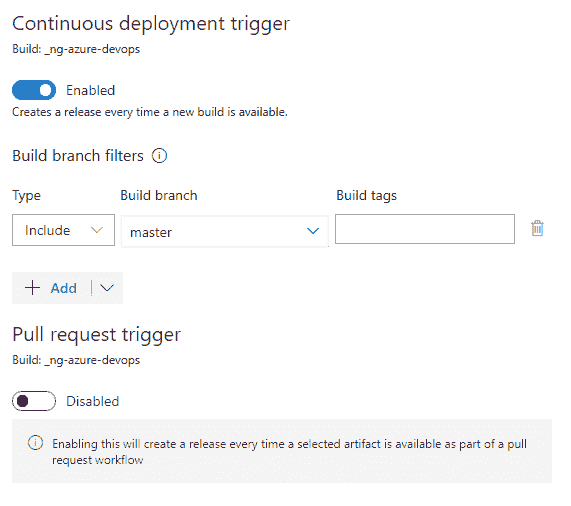T2】](https://res.cloudinary.com/practicaldev/image/fetch/s--PX_vWK38--/c_limit%2Cf_auto%2Cfl_progressive%2Cq_auto%2Cw_880/https://thepracticaldev.s3.amazonaws.com/i/nwxu59qfwruty1n77v8z.png)

保存对发布管道的更改，并触发新的构建(通过更改代码或手动将其从构建管道中排队)。

一旦构建和发布管道成功完成，您应该能够导航到应用程序服务的 URL，并看到默认的 Angular 项目。

[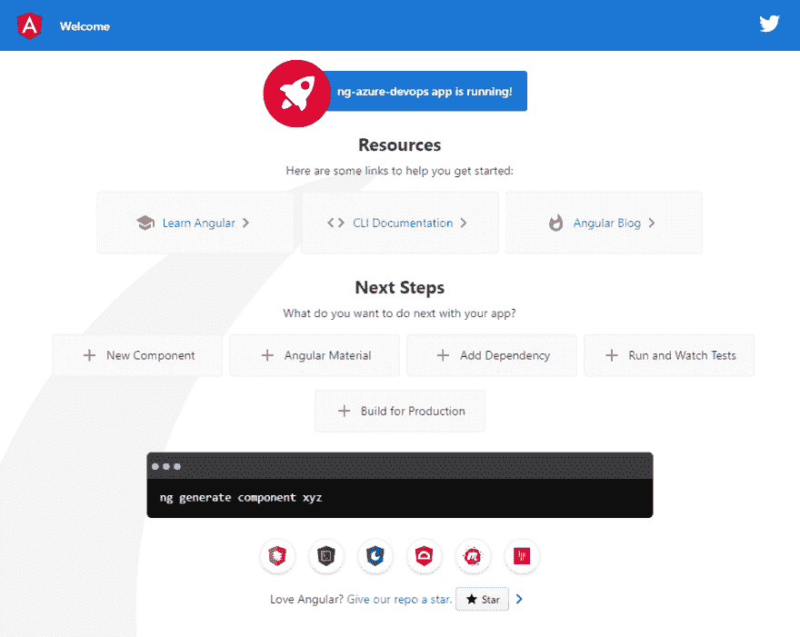T2】](https://res.cloudinary.com/practicaldev/image/fetch/s--_oGcLkHm--/c_limit%2Cf_auto%2Cfl_progressive%2Cq_auto%2Cw_880/https://thepracticaldev.s3.amazonaws.com/i/hm3ugccqyrphwchr3pfp.png)

# [](#environment-specific-configuration)环境特定配置

当部署我们的应用程序时，我们可能需要一些配置，这些配置对于托管我们的应用程序的每个环境都是不同的。由于前端应用程序经常需要与后端通信，我们将使 API URL 可配置，以便它可以针对每个环境而有所不同。

## [](#angular-environments)角环境

Angular 有一个内置的环境系统，允许你指定多个环境配置。当使用给定的目标环境构建应用程序时，Angular CLI 将使用特定于环境的环境文件(如 environment.prod.ts)的内容替换 environment.ts 文件

尽管这工作得很好，但是它的缺点是我们需要为我们计划部署的每个环境重新编译和重新加载工件。然而，Azure DevOps 发布管道背后的想法是只构建工件一次，同时仍然能够将它们部署到理论上无限多的环境中。

## [](#runtime-environment-configuration)运行时环境配置

因为我们需要能够使用不同的配置将我们的应用程序部署到多个环境中，所以我们需要一种在构建工件之后交换环境配置的方法。

在 Angular 应用程序中实现这一点的典型方法是在包含配置的 assets 目录中包含一个 config.json 文件。将它放在 assets 目录中可以确保它在运行 ng build 时被复制到 dist 文件夹中。

```
{  "apiUrl":  "http://localhost"  } 
```

我们可以加载配置文件作为 APP_INITIALIZER 的一部分，确保应用程序在加载配置文件之前不会启动。

```
@Injectable({
  providedIn: 'root'
})
export class ConfigService {
  config: Config;

  constructor(private http: HttpClient) {}

  loadConfig() {
    return this.http
      .get<Config>('./assets/config.json')
      .toPromise()
      .then(config => {
        this.config = config;
      });
  }
} 
```

```
 export const configFactory = (configService: ConfigService) => {
  return () => configService.loadConfig();
};

@NgModule({
  ...
  providers: [
    {
      provide: APP_INITIALIZER,
      useFactory: configFactory,
      deps: [ConfigService],
      multi: true
    }
   ],
   ...
})
export class AppModule { } 
```

只要我们需要访问特定于环境的配置，我们就可以注入 ConfigService 来使用 config 属性。

```
@Component({
  selector: 'app-root',
  templateUrl: './app.component.html',
  styleUrls: ['./app.component.css']
})
export class AppComponent {
  title = 'ng-azure-devops';

  constructor(configService: ConfigService) {
    console.log('config', configService.config);
  }
} 
```

在上面的组件中，我们注入了 ConfigService，以便将整个配置对象记录到控制台。这应该允许我们检查是否已经为我们的环境正确地设置了配置。在实际的应用程序中，您可能需要在负责调用特定于环境的 API 的服务中注入配置。

我们不需要为要部署的每个环境添加单独的配置文件。相反，我们将使用单个文件，并作为发布管道的一部分更新其内容。这允许在您的代码基础和它被部署到的不同数量的环境之间进行分离。

调整测试，并确保它们通过。然后提交，并将更改推送到存储库。

## [](#modifying-configjson-on-azure-devops)在 Azure DevOps 上修改 config.json

我们需要修改 config.json 的内容，作为发布管道中任务的一部分，移动到发布管道，编辑它，并在部署我们的应用程序之前添加一个文件转换任务。

[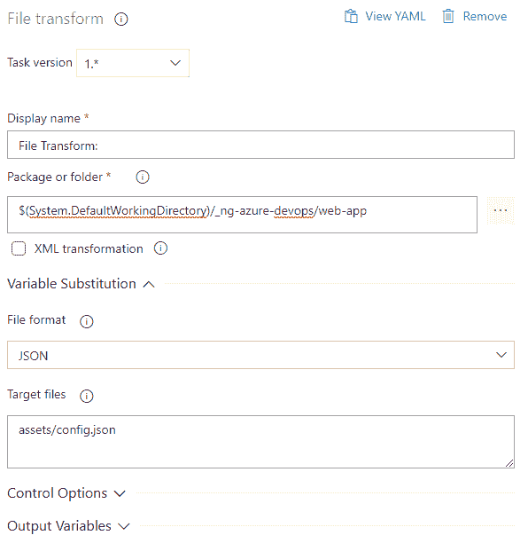T2】](https://res.cloudinary.com/practicaldev/image/fetch/s--EdRErsaM--/c_limit%2Cf_auto%2Cfl_progressive%2Cq_auto%2Cw_880/https://thepracticaldev.s3.amazonaws.com/i/ud5iuyq3uxmul6kz7oyz.png)

我们需要配置该任务的三个重要部分:

*   包或文件夹:指向我们想要为其转换文件的正确工件
*   文件格式:Azure DevOps 的文件转换任务同时支持 XML 和 JSON。在本文中，我们将使用 JSON。
*   目标文件:包括 config.json 文件的路径，相对于工件的根。

为了让文件转换任务在部署 config.json 文件之前开始处理它，我们需要做的就是这些。

为了定义在转换配置文件时应该使用什么名称和值，我们需要创建变量作为发布管道的一部分。文件转换任务将尝试查找所有变量的名称，并相应地更新其值。

对于本文，我们所需要的是一个 apiUrl 变量，它的值不同于我们在本地拥有的值(我在本地使用了 [localhost](http://localhost) ，在环境中使用了 thisdot.co):

[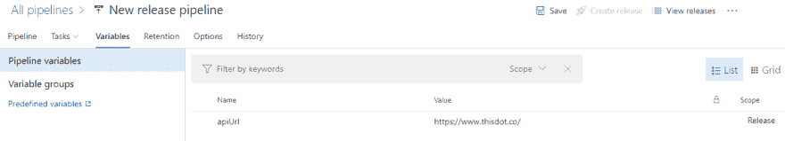T2】](https://res.cloudinary.com/practicaldev/image/fetch/s--CQ3qn6BD--/c_limit%2Cf_auto%2Cfl_progressive%2Cq_auto%2Cw_880/https://thepracticaldev.s3.amazonaws.com/i/ghydcpo3qag6h1lsq7vc.png)

如果你有一个更复杂的配置对象，使用嵌套路径，你需要使用 JSONPath 表达式来指定它们，参见[https://docs . Microsoft . com/en-us/azure/devo PS/pipelines/tasks/utility/file-transform？关于文件转换任务的更多信息。](https://docs.microsoft.com/en-us/azure/devops/pipelines/tasks/utility/file-transform?view=azure-devops)

# [](#enabling-json-files-on-azure)在 Azure 上启用 JSON 文件

Azure 应用服务默认不允许提供 JSON 文件。为此，我们需要添加一个 web.config 文件(关于配置 system.webServer 的更多信息可以在[https://docs . Microsoft . com/en-us/IIS/configuration/system . web server/](https://docs.microsoft.com/en-us/iis/configuration/system.webserver/)找到)。

```
<?xml version="1.0" encoding="utf-8"?>
<configuration>
    <system.webServer>
        <staticContent>
            <remove fileExtension=".json" />
            <mimeMap fileExtension=".json" mimeType="application/json" />
        </staticContent>
    </system.webServer>
</configuration> 
```

我们可以将这个配置文件添加到我们的 git 存储库中，并确保在运行`ng build.`时也将它复制到 dist 文件夹中。如果我们只需要启用 JSON，那么这个 get 就有点复杂了。

幸运的是，我们还可以添加一个文件作为发布管道的一部分。因为我们的 web.config 文件非常小，所以我将使用这种方法。这又一次使我们的源代码独立于我们将托管它的位置。

转到发布管道，在转换配置文件之前或之后添加一个新任务。我们确实需要确保在部署工件之前添加这个任务，所以确保它在部署任务之前执行。

创建文件的任务不是 Azure DevOps 本身的一部分。你可以通过市场免费获得:[https://marketplace.visualstudio.com/items?itemName = eliostruyf . build-task](https://marketplace.visualstudio.com/items?itemName=eliostruyf.build-task)

安装后，编辑发布管道，并添加新的文件创建者任务，提供:

*   文件路径:这是正在创建的文件的路径，包括文件名
*   文件内容:应该放在创建的文件中的任何内容。

[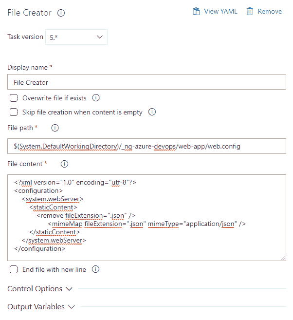T2】](https://res.cloudinary.com/practicaldev/image/fetch/s--1BZUzkjN--/c_limit%2Cf_auto%2Cfl_progressive%2Cq_auto%2Cw_880/https://thepracticaldev.s3.amazonaws.com/i/15bg8byzv3hrhynwbl6k.png)

保存发布管道，并创建一个新的发布(通过触发一个新的构建，或者使用最后已知的工件手动创建一个发布)。

成功完成发布后，导航到应用程序服务的 URL 应该会显示默认的 Angular 应用程序以及显示特定于环境的配置的控制台输出。

[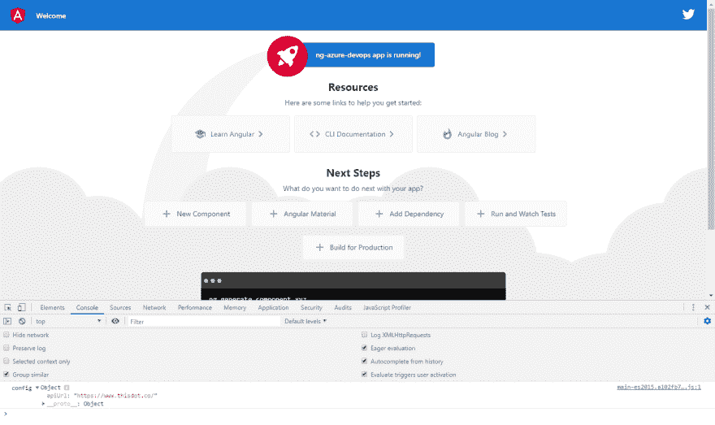T2】](https://res.cloudinary.com/practicaldev/image/fetch/s--QEoqJ0XP--/c_limit%2Cf_auto%2Cfl_progressive%2Cq_auto%2Cw_880/https://thepracticaldev.s3.amazonaws.com/i/14tem0uoh2ijbxgg01fi.png)

# [](#conclusion)结论

Azure DevOps 使设置连续部署变得轻而易举。只需几个步骤，我们就可以集成一个 Angular 应用程序，将我们的工件自动部署到一个或多个环境中，为每个环境提供所需的特定于环境的配置。

这将会从手工部署中节省大量的时间，让您的团队专注于软件的质量。

这篇文章是由 T2 的软件工程师弗雷德里克·普里查克写的。

你可以在推特上关注他，电话: [@frederikprijck](https://dev.to/frederikprijck) 。

需要 JavaScript 咨询、指导或培训帮助吗？在 [This Dot Labs](https://thisdot.co) 查看我们的服务列表。