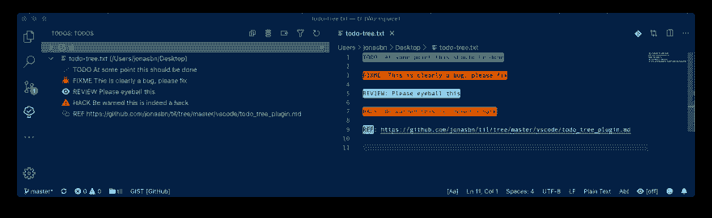

# 一个漂亮的 VScode 扩展

> 原文:[https://dev . to/Jonas bn/til-todo-tree-a-nifty-vs code-extension-16j 5](https://dev.to/jonasbn/til-todo-tree-a-nifty-vscode-extension-16j5)

这是对 vscode 的一个极好的扩展。

它允许你在代码中定义标签，比如`TODO`和`FIXME` ( *默认为*)，这些标签会在你的代码中高亮显示，并出现在一个特殊的侧栏部分。

[T2】](https://res.cloudinary.com/practicaldev/image/fetch/s--gOwM_yTB--/c_limit%2Cf_auto%2Cfl_progressive%2Cq_auto%2Cw_880/https://thepracticaldev.s3.amazonaws.com/i/sezj5mkhkhofqph6v36v.png)

这是我在上面的例子中使用的配置。

```
{  "todo-tree.autoRefresh":  true,  "todo-tree.defaultHighlight":  {  "type":  "text-and-comment"  },  "todo-tree.customHighlight":  {  "TODO":  {  "foreground":  "black",  "background":  "green",  "iconColour":  "green",  "icon":  "check",  "type":  "text"  },  "FIXME":  {  "foreground":  "black",  "background":  "red",  "iconColour":  "red",  "icon":  "bug"  },  "REVIEW":  {  "foreground":  "black",  "background":  "cyan",  "iconColour":  "lightblue",  "icon":  "eye"  },  "HACK":  {  "foreground":  "black",  "background":  "#FFA500",  "iconColour":  "orange",  "icon":  "alert"  },  "REF":  {  "foreground":  "black",  "background":  "grey",  "iconColour":  "grey",  "icon":  "link",  "type":  "tag"  }  },  "todo-tree.tags":  [  "TODO",  "FIXME",  "REVIEW",  "HACK",  "REF"  ]  } 
```

<svg width="20px" height="20px" viewBox="0 0 24 24" class="highlight-action crayons-icon highlight-action--fullscreen-on"><title>Enter fullscreen mode</title></svg> <svg width="20px" height="20px" viewBox="0 0 24 24" class="highlight-action crayons-icon highlight-action--fullscreen-off"><title>Exit fullscreen mode</title></svg>

您可以定义自己的标签，并根据自己的喜好分配图标和配色方案。

这个胡麻是从[我的胡麻收藏](http://jonasbn.github.io/til/)里拿的。

## [](#resources)资源:

*   [Visual Studio 市场](https://marketplace.visualstudio.com/items?itemName=Gruntfuggly.todo-tree)