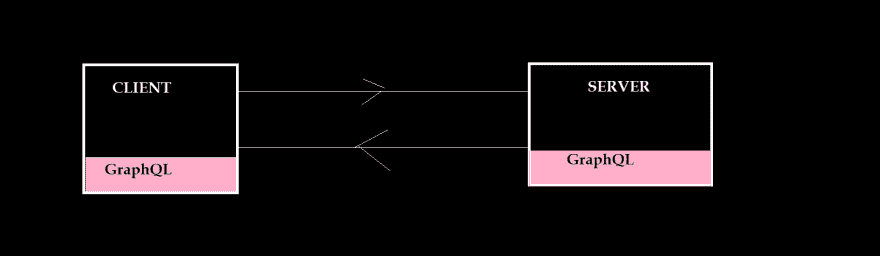
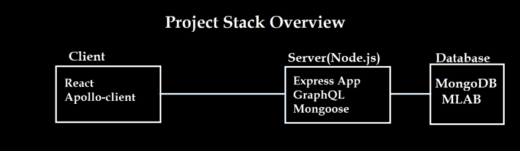
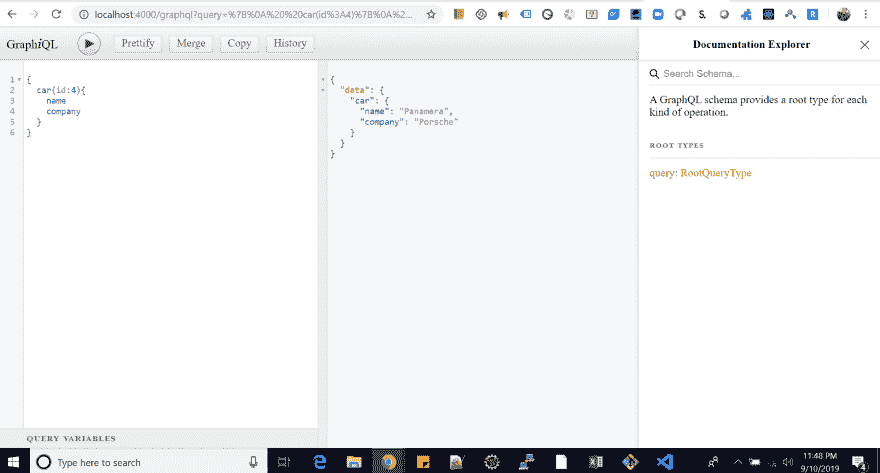
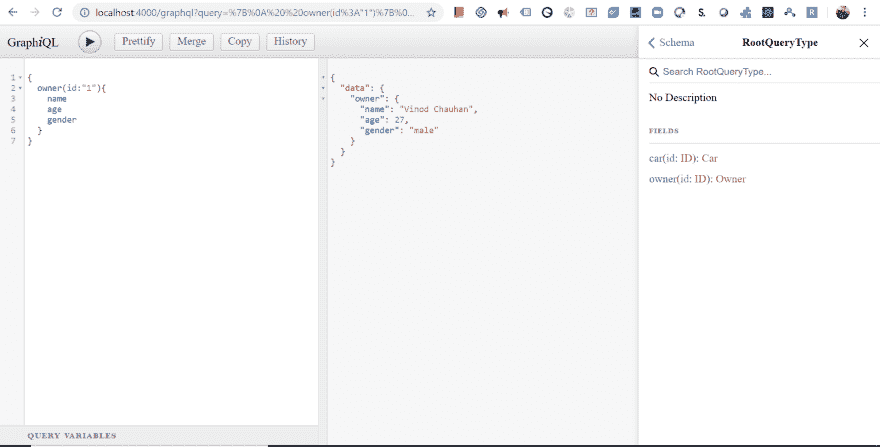

# MERN 应用程序通过阿波罗客户端使用 GraphQL，(反应钩)。(第一部分)

> 原文:[https://dev . to/vinodchauhan 7/mern-app-using-graph QL-via-Apollo-client-react-hooks-part-1-17p 9](https://dev.to/vinodchauhan7/mern-app-using-graphql-via-apollo-client-react-hooks-part-1-17p9)

在本文中，我们将尝试了解 graphQL、Apollo-client 以及如何在我们的应用程序中实现这两者。

> 注意:如果您不了解 React & Node，那么请先了解这两种技术的一些基础知识。这将有助于我让你了解这篇文章。

[GitHub 链接:MERN-app-using-graph QL-Apollo-client](https://github.com/vinodchauhan7/MERN-app-using-graphql-apollo-client/tree/master)

[](/vinodchauhan7) [## MERN 应用程序通过阿波罗客户端使用 GraphQL，(反应钩)。(第二部分)

### vinodchauhan 7 Sep 11 ' 197 分钟读取

#react #mern #apolloclient #graphql](/vinodchauhan7/mern-app-using-graphql-via-apollo-client-react-hooks-part-2-2ifn)

## [](#what-is-graphql)什么是 GraphQL？

GraphQL 是一种强大的查询语言，它允许在客户机和服务器之间传递数据。这是比 REST 更加灵活和高效的方法。

[T2】](https://res.cloudinary.com/practicaldev/image/fetch/s--1azFstEV--/c_limit%2Cf_auto%2Cfl_progressive%2Cq_auto%2Cw_880/https://thepracticaldev.s3.amazonaws.com/i/cqv0t8j58dpax7x49j8n.png)

当然，我们不需要在每种情况下都使用 GraphQL 进行数据通信，但是在某些情况下，graphql 可能是非常优化的方法。例如，假设我们需要建立一个汽车管理系统。在这个应用程序中，出于学习的目的，我们有以下可能的情况:
1)一辆汽车可以有多个所有者。
2)一个车主可以拥有多辆车。

考虑到上述情况，在 REST 方法中，我们的堆栈中可以有 paramount 2 个 API:

=> *获取单辆车的端点。*
API :: **'域名/api/car/:id'**
响应::**'名称，型号，公司，拥有者 Id**

=> *获取所有者信息的端点。*
API :: **'域名/API/所有者/:id'**
响应::**'姓名，年龄，性别，身份证**

让我们想象一下，如果我们需要一辆车的所有者信息和他拥有的其他车的信息，会发生什么。在这种情况下，我们需要根据他/她拥有的汽车数量进行多次 api 点击。如果我们的应用程序有很大的客户群，我们可能会陷入性能问题。为了在很大程度上处理这个问题，我们有更好的方法来处理这种类型的场景。我们可以在这里使用 graphql。

#### [](#a-graphql-approach-for-such-type-of-scenarios-can-be-)针对此类场景的 GraphQL 方法可以是:

```
{
   car(id:3){
    name
    model
    company
    Owner {
      name
      age
      cars{
        name
        company
      }
    }
   }

   //or
   car(id:3){
     name
     Owner{
       name
       gender
     }
   }
} 
```

所有这些信息将通过只点击单个 API 一次来收集。这就是 graphql 的强大之处。所以让我们开始吧。

[T2】](https://res.cloudinary.com/practicaldev/image/fetch/s--B7SYlllR--/c_limit%2Cf_auto%2Cfl_progressive%2Cq_auto%2Cw_880/https://thepracticaldev.s3.amazonaws.com/i/9mzk5wgdl5rtsi5h4jmx.png)

# [](#server-side-implementation)服务器端实现

首先你需要在你的系统中下载**节点**的最新版本。安装后。可以使用 VSCode editor 进行开发。它是免费的。

```
 Open terminal on VScode for ease.
  1) create folder MERNAPP
  2) cd MERNAPP
  3) create folder server
  4) Hit "npm init" command on terminal for creating package.json file
  5) And press "Enter" till it ends asking you question for creating it.

  //After creating package.json, Install the following packages in one go.

  6) npm install express express-graphql graphql lodash mongoose cors --save

  //After doing this step your package.json file look like this:

  //package.json
  {
  "name": "server",
  "version": "1.0.0",
  "description": "Server with Graphql & mongodb",
  "main": "index.js",
  "scripts": {
    "test": "echo \"Error: no test specified\" && exit 1"
  },
  "author": "vinod Chauhan",
  "license": "ISC",
  "dependencies": {
    "cors": "^2.8.5",
    "express": "^4.17.1",
    "express-graphql": "^0.9.0",
    "graphql": "^14.5.4",
    "lodash": "^4.17.15",
    "mongoose": "^5.6.13"
  }
} 
```

> ### Don't worry about all these software packages, I will give you the proper knowledge of why we need these software packages.

### [](#a-setup-express-app)a)设置快递 App

1)在 VS 编辑器的“服务器”文件夹中，创建一个新文件“app.js”。

```
 //Get the express library from node_modules which we have just downloaded.
const express = require("express");

//Making const of express() into a variable (JS function first class Object).
const app = express();

//When our application starts, it will listen on port 4000
app.listen(4000, () => {
  console.log("Server is listening on port 4000");
}); 
```

要运行此 app.js，首先在您的系统上全局下载“nodemon ”,这样您就不需要一次又一次地启动/停止应用程序来查看更改。

```
 //Install nodemon package
   npm install nodemon -g

   //Run your app.js with nodemon
   nodemon app.js
   [nodemon] 1.19.1
   [nodemon] to restart at any time, enter `rs`
   [nodemon] watching: *.*
   [nodemon] starting `node app.js`
   Server is listening on port 4000 
```

打开你的收藏。浏览器和入口 localhost:4000，目前会显示空白页。

如果您已经完成了这一步，那么我们将在下一步在 express 中设置 graphql。

### [](#b-graphql-setup-in-express-app)b)快速应用程序中的 GraphQL 设置

我们的“express-graphql”服务器将帮助 express server 了解 graphql，并让我们开展工作。

```
 //Get the express library from node_modules which we have just downloaded.
   const express = require("express");

   const graphqlHTTP = require("express-graphql");

   //Making const of express() into a variable (JS function first class Object).
   const app = express();

   /*We can use graphql on express server with middlewares, so that whenever
    we need graphql query from frontend, our express server can handle it
    smoothly.
    graphqlHTTP method let us do what we want to do if we have captured 
    '/graphql' middleware.
   */
   app.use("/graphql", graphqlHTTP({}));

   //When our application starts, it will listen on port 4000
   app.listen(4000, () => {
    console.log("Server is listening on port 4000");
   }); 
```

在浏览器类型:localhost:4000/graphql
上运行 app.js，目前会给我们错误提示:

```
{"errors":[{"message":"GraphQL middleware options must contain a schema."}]} 
```

别担心，我们的下一步只是设置 Graphql 模式。

### [](#c-graphql-schema)c) GraphQL 模式

在服务器文件夹中，创建“schema”文件夹，并在其中创建“schema.js”。

* *模式文件主要有 3 个主要职责要做。1)从“GraphQLObjectType”对象创建类型。2)定义类型之间的关系。
3)定义“根查询”让用户进入图形并使用数据。

由于 schema.js 文件在服务器端起主要作用，所以我们将一步一步地逐步完成。

```
 /// schema.js

const graphql = require("graphql"); //use graphql package

/*Getting GraphQLObjectType function from 'graphql' to define the (dataType) 
 structure of our queries and their model type.
*/
const {
  GraphQLObjectType,
  GraphQLID,
  GraphQLString,
  GraphQLInt,
  GraphQLSchema
} = graphql;

//Defining CarType with its fields.
const CarType = new GraphQLObjectType({
  name: "Car",
  fields: () => ({
    id: { type: GraphQLID },
    name: { type: GraphQLString },
    model: { type: GraphQLInt },
    company: { type: GraphQLString }
  })
});

//Defining RootQuery
const RootQuery = new GraphQLObjectType({
  name: "RootQueryType",
  fields: {
    // Fields here will be the query for frontends
    //We are defining a 'car' query which can take (car ID ) to search in DB.
    car: {
      type: CarType, //Defining model for car Query
      args: { id: { type: GraphQLID } },  //args field to extract argument came with car query, e.g : Id of the car object to extract its details.
      resolve(parent, args) {
        //code to get value  from DB
      } //resolve function
    } //car query ends here
  } //fields end here
});

//exporting 'GraphQLSchema with RootQuery' for GraphqlHTTP middleware.
module.exports = new GraphQLSchema({
  query: RootQuery
}); 
```

在上面的文件 schema.js 中，我们做了以下步骤:
1)导入‘graphql’以在 express server 中使用 graph QL。
2)从 graphql 库中抓取不同的对象、数据类型。
3)从 GraphQLObjectType()创建常量“CarType”类型及其字段()。
4)为 GraphQLSchema 函数创建带有端点查询“car”的 root query“root query”。
5)将上述内容导出为 GraphQLSchema，并在其中使用“RootQuery”作为参数。

App.js 变更

```
 //Get the express library from node_modules which we have just downloaded.
const express = require("express");

const graphqlHTTP = require("express-graphql");

//Imports
const schema = require("./schema/schema");

//Making const of express() into a variable (JS function first class Object).
const app = express();

/*We can use graphql on express server with middlewares, so that whenever
    we need graphql query from frontend, our express server can handle it
    smoothly.
*/
app.use(
  "/graphql",
  graphqlHTTP({
    schema: schema
  })
);

//When our application starts, it will listen on port 4000
app.listen(4000, () => {
  console.log("Server is listening on port 4000");
}); 
```

到目前为止，我们在浏览器上的输出已经改变，但有一些其他错误。

```
 {"errors":[{"message":"Must provide query string."}]}

//Dont worry guys we will remove this error too. 
```

### [](#d-defining-resolve-function)d)定义解析函数

首先，让我们获得虚拟数据，使我们的查询暂时工作。

将以下代码放入 schema.js 文件

```
const graphql = require("graphql"); //use graphql package

const _ = require("lodash");

/*Getting GraphQLObjectType function from 'graphql' to define the (dataType) 
 structure of our queries and their model type.
*/
const {
  GraphQLObjectType,
  GraphQLID,
  GraphQLString,
  GraphQLInt,
  GraphQLSchema
} = graphql;

const CarsArray = [
  { id: "1", name: "S-Class", model: "2019", company: "Mercedes" },
  { id: "2", name: "Continental GT", model: "2019", company: "Bentley" },
  { id: "3", name: "Phantom", model: "2019", company: "Rolls-Royce" },
  { id: "4", name: "Panamera", model: "2019", company: "Porsche" },
  { id: "5", name: "A8", model: "2019", company: "Audi" },
  { id: "6", name: "I-Pace", model: "2019", company: "Jaguar" }
];

//Defining CarType with its fields.
const CarType = new GraphQLObjectType({
  name: "Car",
  fields: () => ({
    id: { type: GraphQLID },
    name: { type: GraphQLString },
    model: { type: GraphQLInt },
    company: { type: GraphQLString }
  })
});

//Defining RootQuery
const RootQuery = new GraphQLObjectType({
  name: "RootQueryType",
  fields: {
    // Fields here will be the query for frontends
    //We are defining a 'car' query which can take (car ID ) to search in DB.
    car: {
      type: CarType, //Defining model for car Query
      args: { id: { type: GraphQLID } },
//args field to extract argument came with car query, e.g : Id of the car object to extract its details.
      resolve(parent, args) {
        //code to get value  from DB
        /**
         * With the help of lodash library(_), we are trying to find car with id from 'CarsArray'
         * and returning its required data to calling tool.
         */
        return _.find(CarsArray, { id: args.id });
      } //resolve function
    } //car query ends here
  } //fields end here
});

//exporting 'GraphQLSchema with RootQuery' for GraphqlHTTP middleware.
module.exports = new GraphQLSchema({
  query: RootQuery
}); 
```

下面是我们在 schema.js 中完成的步骤:
1)导入‘lodash’库来方便我们的生活。
2)带有所需细节的假人“CarsArray”。
3)定义‘汽车’查询的‘解决’功能。

### e)测试我们的查询。

为了测试我们的查询，首先我们需要对 app.js 文件做一点修改。

```
app.use(
  "/graphql",
  graphqlHTTP({
    schema: schema,
    graphiql: true
  })
); 
```

通过添加“graphic QL:true”，我们启用了一个内置的强大工具来测试我们的查询。现在打开:localhost:4000/graph QL
[](https://res.cloudinary.com/practicaldev/image/fetch/s--ia_QcVmc--/c_limit%2Cf_auto%2Cfl_progressive%2Cq_auto%2Cw_880/https://thepracticaldev.s3.amazonaws.com/i/r88h4fus7uslnpd3kxi6.png)

在上图中可以看到，在窗口的左侧，通过给出汽车对象的 id，写一个包含您想要的详细信息的查询。

> 哇哦！我们刚刚在 graphql 中进行了一次汽车查询。如果你得到的结果和我一样，那么恭喜你。

### [](#f-defining-ownertype-)f)定义 OwnerType:

在 schema.js 中，编写以下代码。

```
const graphql = require("graphql"); //use graphql package

const _ = require("lodash");

/*Getting GraphQLObjectType function from 'graphql' to define the (dataType) 
 structure of our queries and their model type.
*/
const {
  GraphQLObjectType,
  GraphQLID,
  GraphQLString,
  GraphQLInt,
  GraphQLSchema
} = graphql;

const CarsArray = [
  { id: "1", name: "S-Class", model: "2019", company: "Mercedes" },
  { id: "2", name: "Continental GT", model: "2019", company: "Bentley" },
  { id: "3", name: "Phantom", model: "2019", company: "Rolls-Royce" },
  { id: "4", name: "Panamera", model: "2019", company: "Porsche" },
  { id: "5", name: "A8", model: "2019", company: "Audi" },
  { id: "6", name: "I-Pace", model: "2019", company: "Jaguar" }
];

var OwnersArray = [
  { id: "1", name: "Vinod Chauhan", age: 27, gender: "male" },
  { id: "2", name: "John Dow", age: 46, gender: "male" },
  { id: "3", name: "Kristen", age: 30, gender: "female" },
  { id: "4", name: "Paris", age: 44, gender: "female" },
  { id: "5", name: "Sylvestor", age: 26, gender: "male" }
];

//Defining CarType with its fields.
const CarType = new GraphQLObjectType({
  name: "Car",
  fields: () => ({
    id: { type: GraphQLID },
    name: { type: GraphQLString },
    model: { type: GraphQLInt },
    company: { type: GraphQLString }
  })
});

//Defining CarType with its fields.
const OwnerType = new GraphQLObjectType({
  name: "Owner",
  fields: () => ({
    id: { type: GraphQLID },
    name: { type: GraphQLString },
    age: { type: GraphQLInt },
    gender: { type: GraphQLString }
  })
});

//Defining RootQuery
const RootQuery = new GraphQLObjectType({
  name: "RootQueryType",
  fields: {
    // Fields here will be the query for frontends
    //We are defining a 'car' query which can take (car ID ) to search in DB.
    car: {
      type: CarType, //Defining model for car Query
      args: { id: { type: GraphQLID } }, //args field to extract
      // argument came with car query, e.g : Id of the car object to extract its details.
      resolve(parent, args) {
        //code to get value  from DB
        /**
         * With the help of lodash library(_), we are trying to find car with id from 'CarsArray'
         * and returning its required data to calling tool.
         */
        return _.find(CarsArray, { id: args.id });
      } //resolve function
    }, //car query ends here
    owner: {
      type: OwnerType,
      args: { id: { type: GraphQLID } },
      resolve(parent, args) {
        return _.find(OwnersArray, { id: args.id });
      }
    }
  } //fields end here
});

//exporting 'GraphQLSchema with RootQuery' for GraphqlHTTP middleware.
module.exports = new GraphQLSchema({
  query: RootQuery
}); 
```

在刷新浏览器或键入 localhost:4000/graphql 时，查找所有者查询。

[T2】](https://res.cloudinary.com/practicaldev/image/fetch/s--hcMHsLrF--/c_limit%2Cf_auto%2Cfl_progressive%2Cq_auto%2Cw_880/https://thepracticaldev.s3.amazonaws.com/i/q3119j0jowmzui0um3zf.png)

> 我会尽快上传第二部分。直到再见。