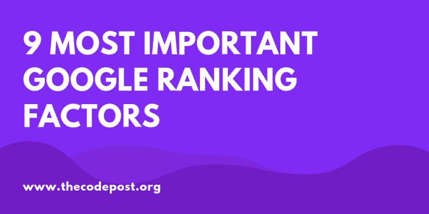
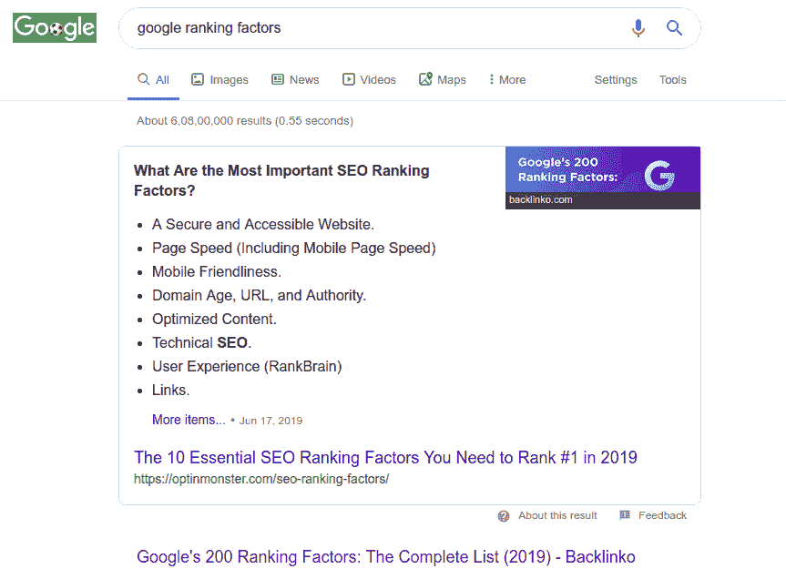
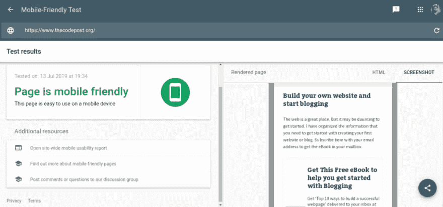
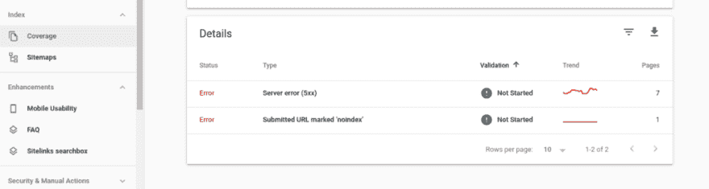

# 9 个非常重要的谷歌搜索排名因素

> 原文:[https://dev . to/sarthakkanguly/the-really-important-Google-search-ranking-factors-51mh](https://dev.to/sarthakganguly/the-really-important-google-search-ranking-factors-51mh)

谷歌可能会使用几十个参数在搜索结果页面上对你的网站进行排名。有很多关于谷歌排名因素的猜测。

事实是，我们谷歌之外的人其实不知道。

[T2】](https://res.cloudinary.com/practicaldev/image/fetch/s--Z2z45VUI--/c_limit%2Cf_auto%2Cfl_progressive%2Cq_auto%2Cw_880/https://img.thecodepost.org/2019/07/9-MOST-IMPOrtant-Google-ranking-factors-1024x512.png)

布莱恩·迪恩列出了大约 200 个奇怪的因素，他声称这是完整的清单。这份清单很棒，也很全面。但是如果你真的把整个内容过一遍，列出来，你就会发现他的帖子的这些问题。

*   他的主张中有大量重复。
*   除了行业研究(搜索引擎杂志，moz 等。)和一些详细阐述这一主题的谷歌专利——很少有证据表明这些因素实际上是重要的。
*   这种模棱两可是危险的。因为做得过分甚至会惩罚你的网站。

我不会说这份名单毫无用处。但是，我有一个问题[,关于那些只是为了加强自身而做的长表格。](https://www.thecodepost.org/internet/long-form-content-avoid-mistakes/)它在玩弄系统。这正是谷歌实际惩罚的一点。

即使在那时，他也做得很好。实际上，关键词“谷歌排名因素”的搜索结果让 backlinko 稳居榜首。当然，实际上在 spot 0 上有一个更相关的 optinmonster 帖子。

重点是——它需要更新，这样那些没有多少证据的可疑点就会被删除。

让我们面对现实吧。找到实际的因素是一项极其困难的工作。一些你不能指望在几周内完成的事情。最好把精力放在自己擅长的事情上。重要的东西。

所以这里是将到达谷歌搜索结果第一页的点。

### Google 如何对页面进行排名？

让我们一步一步地检查这个。

首先，让我们看看谷歌在第一个没有广告的搜索结果页面上告诉我们什么是“谷歌排名因素”。

[T2】](https://res.cloudinary.com/practicaldev/image/fetch/s--NyJ4Pt4H--/c_limit%2Cf_auto%2Cfl_progressive%2Cq_auto%2Cw_880/https://img.thecodepost.org/2019/07/google-ranking-factors-search-results.png)

排名因素的谷歌搜索结果

如果你仔细观察，你会发现 backlinko 排名第一(optinmonster 排名第 0)。但是多个链接实际上引用了我上面引用的同一个 backlinko 帖子。

这告诉我们什么是原创内容？

不多。

那么他们的排名如何呢？

如果你查看一下域名，你会发现这些都是这个领域的知名玩家。这里列出的域都不是新的。

所以，假设原创内容没有域名权威重要是安全的吗？大概吧。但看起来确实如此。

但这并不意味着你可以继续从另一个网站复制内容。还要注意，使用的 backlinko inforgraphics 实际上是原创建者的。但帖子的其余部分只是略微阐述了一下。如果你去过原帖，剩下的都是多余的。

你应该不希望你的帖子变成那样。你是新玩家。你没有依靠你的领域权威的奢侈。你必须先把它建立起来。

那么去哪里找呢？

### 追求谷歌排名的因素

实际上，Moz 在给搜索排名因素打分和排序方面做得很好。这是在对内容营销人员的 90 多个参数的意见调查中完成的。

听起来很可靠。

由于谷歌没有详细说明确切的细节，我们将不得不根据其他人的推断。

在 NorthCutt 可以看到更好、更透明的结果[。这些人实际上已经把数据科学放在了它的初级形态。这很好。](https://northcutt.com/seo-checklist/google-ranking-factors/)

他们考虑的证据是

*   谷歌自己的专利申请——他们认为这是一个可能的排名因素
*   谷歌的官方声明——他们的排名更高
*   被证明有效的因素——在科学上——这是他们认为最权威的。我同意。

他们所做的是列出 273 个因素，这些因素被整齐地归类为神话或事实——有差异。这是不可避免的，因为我们永远无法完全确定，等待任何知名搜索引擎的全面披露。

所以，一个更合理的问题是。

在努力提高我的搜索排名的同时，我应该关注什么？

这是我会做的。

### 最重要的 9 个谷歌排名因素

好吧。

大问题。

当我自己承认这些都不清楚的时候，我是怎么想出实际上可以优先考虑的谷歌排名因素的？

这是因为我整理了来自多个独立来源的信息以及我自己的研究和经验。

当然，甚至[搜索引擎杂志也详细报道了这一点](https://www.searchenginejournal.com/google-200-ranking-factors-facts/265085/#close)。

但无论如何，以下是清单。

此外，请注意，这些没有任何特定的重要性顺序。

#### 标题标签、URL 和 Alt 文本中的关键词作为 Google 排名因子

咩！

这是显而易见的吧？

但是它经常被忽视。约翰·穆勒在一次聚会中谈到了这个问题。

关键词及其作为排名因素的定位

对于关键词的位置以及它们如何影响搜索结果，他没有说太多。但是如果关键词排在前面就更有意义了。如果标题很大，这一点尤其重要。

例如，让我们看看下面的标题，或者 url 结构和关键字是如何优化的。

原标题:成为专业网站开发人员的 11 个技巧

原网址结构:[11-提示-专业-网页-开发者](http://www.example.com/11-tips-professional-web-developer)

关键词:专业 web 开发人员

推荐标题:成为专业 Web 开发人员的 11 个技巧(是的，是一样的)

推荐者 url 结构:/professional-web-developer-11-tips

两者都很好，根据约翰的建议，两者都应该做得很好。但我会选择后者，因为它比前者更优先考虑目标受众。

对于你想在 url 中排名的关键词也是如此。这是不言自明的。但即使在这里，确切的关键字的位置也不清楚。既然你[不应该使用重磅的 slugs](https://yoast.com/slug/) ，保持关键词在你的 slugs 的五个或六个单词中应该使它足够突出。

关键字的另一个重要位置是图片的 alt 标签。它不仅有助于页面排名，甚至图像搜索结果也会与你相关。只是不要让它们太长，它实际上也应该描述图像。所以不要过度。

下面是一个体面的例子。

``

我这里的关键词是‘金橡树’。我也让它变得相关。

注意:在前面提到的例子中没有金橡树。只是为了证明我的观点。

url 中关键字的证据: [US8489560B1](https://patents.google.com/patent/US8489560B1/en) (专利)

标题中关键词的证据: [US20070022110A1](https://patents.google.com/patent/US20070022110A1/en) (专利)

alt 标签中关键字的证据:[马特·卡茨](https://www.youtube.com/watch?v=3NbuDpB_BTc)

域名中关键词的证据: [EP1661018A2](https://patents.google.com/patent/EP1661018A2/en) (专利)

#### 你的网站应该响应迅速或者至少是移动友好的

谷歌现在实际上已经转向移动优先索引。这意味着，如果你的网站在默认的移动视图中看起来不可读，你的网站排名会受到影响。这是一个非常强大的谷歌排名因素。

自 7 月 1 日起，谷歌实际上默认切换到移动优先索引所有新网站。他们很认真地对待这个问题，并准备了一份非常详细的说明，告诉你可以做什么和应该避免什么。

因此，如果你的网站还没有移动响应，你必须现在就做好。对于大多数网站来说，它只需要非常有限的开发者参与。

谷歌甚至列出了你可以避免的常见错误。

一旦你做了同样的事情，用[页面或者这里的](https://search.google.com/test/mobile-friendly)代码测试来测试它。

[T2】](https://res.cloudinary.com/practicaldev/image/fetch/s--1PLE1W7u--/c_limit%2Cf_auto%2Cfl_progressive%2Cq_auto%2Cw_880/https://img.thecodepost.org/2019/07/mobile-friendly-test-as-google-ranking-factor-1024x480.png)

移动友好是搜索引擎优化的一个重要指标

#### 域名权威作为谷歌排名因素

当然，这就是 [Moz 用来确定相关性](https://moz.com/learn/seo/domain-authority)的方法。

谷歌与此无关。

然而，让我们把它重新命名为“某物”,它重视到一个域的权威入站链接。这个“东西”实际上是有价值的，并且有确凿的证据证明这一点。

你需要获得更多高质量的反向链接。而且链接需要稳定。

另一个有趣的点是，你的网站的抓取预算将取决于它获得的域权限。这意味着一个高 DA 或高排名的网站将比另一个排名低的网站更经常被抓取。

听起来不公平？

大概就是最大限度的利用可用资源吧。但这就是他们的做法。

如何安全地获得它们是另一个话题。至于证据，它们就在这里。

*   页面和域名的权威入站链接- [搜索引擎的剖析](http://infolab.stanford.edu/~backrub/google.html)
*   链路稳定性很重要- [US8549014B2(专利)](https://patents.google.com/patent/US8549014B2/en)
*   来自相关网站的链接[帮助](http://web.archive.org/web/20070115000853/http:/www.cs.toronto.edu/~georgem/hilltop/)
*   链接的上下文是一个因素- [US8577893B1](https://patents.google.com/patent/US8577893/en) [【专利】](https://patents.google.com/patent/US8577893/en)

#### 出站链接质量作为谷歌排名因素

这一点往往被忽视。

你链接的网站也很重要。

如果前者链接到后者，PageRank 就会从一个站点流向另一个站点。问题是，如果所有排名只是从一个站点流向另一个站点，最终会导致无限延伸。

所以 PageRank 实际上是在从一个站点流向另一个站点时衰减的。

因此，当你想链接到其他网站时，你可能需要检查它们的信誉。如果你不确定，试着给它一个`nofollow`属性。这样你就不会让你的页面排名从你的网站流向他们的网站。

Matt [在这个帖子](https://www.mattcutts.com/blog/pagerank-sculpting/)里解释过。

#### 利用 HTTPS 帮忙

HTTPs 是一个强烈的信号，表明你对你的网站是认真的。即使没有事务要做，HTTPs 也是必要的。尤其是因为这已经在大多数主要博客和网站上实现了。所以你会因为没有完成任务而被扣分。

[T2】](https://res.cloudinary.com/practicaldev/image/fetch/s--wD8xKuJu--/c_limit%2Cf_auto%2Cfl_progressive%2Cq_auto%2Cw_880/https://img.thecodepost.org/2019/07/page-is-secure-with-the-lock-in-url.png)

检查网址。看到锁了吗？这意味着网站是安全的。否则你会看到一个难看的“不安全”标签。

我知道是什么阻碍了你。

SSL 证书并不便宜。

事实上你是对的。大多数 SSL 证书将花费你几乎类似于你的域名费用一年。但是，您可以选择获得一个您可以信任的免费 SSL 证书。

您可以在一个真实的网站上试用这个[指南来实际安装证书。](https://www.thecodepost.org/internet/install-lets-encrypt-ssl-godaddy-practitioners-guide/)

当然，证书三个月后到期，所以你必须每季度更新一次。但是它仍然是免费的。

HTTPs 作为排名因素的证据- [Googleblog](https://webmasters.googleblog.com/2014/08/https-as-ranking-signal.html)

#### 带有明显格式的单词作为谷歌排名因素

这可能会令人吃惊。

但是你在文章或页面中对单词的强调会对搜索引擎结果产生影响。这是常识，真的。当你突出显示、加粗或倾斜一个特定的短语时，你希望读者特别注意它。

显然，谷歌机器人也是如此。

因此，如果你正在写一些关于某个特定主题的东西，并希望一些关键词排名靠前，适当地突出它们可以证明它们与主题的相关性。这关系到这些关键词在页面上的排名。

明显格式化的证据: [US8818982B1](https://patents.google.com/patent/US8818982B1/en)

#### 查询值得新鲜度作为排名因素

新鲜的内容是一个很大的正面排名因素。

你检查过大新闻页面是如何出现在最上面的吗？

即使是那些成立才几天的新闻网站？

经常发布内容的页面可能会被更快地索引，因此它们的结果可能会更早地显示出来。

然而，这些仅与包含新闻相关内容的页面相关。在这些情况下，上下文变得很重要。

一定要记住一件事。你的文章质量高于一切。如果你的帖子的质量在每天大量产生新帖子时受到影响，不要这样做。

没有一个大博客会这么做。你不是一个有记者和编辑的通讯社。

那你是做什么的？

不要报道新闻相关的搜索查询。

耶！

听起来很可笑？但是不要。不要在你知道一些有趣的新闻或你所在领域的花絮后马上写它们。就该主题写一篇内容单薄的帖子会帮你一事无成。新闻网站会拿走奶油，而你会继续被忽视。

而是这样做。

举个例子，Gitlab 正被谷歌收购(假设情景)

*   研究题目——git lab 是什么？
*   从多个来源了解实际发生了什么——git lab 对此怎么说？谷歌的新闻稿是什么？
*   调查它如何影响其他玩家或竞争对手——其他开发者对此会有什么反应？这对谷歌股票有什么影响等等。
*   如果独立开发人员希望做出改变，他们在选择 Gitlab 替代方案时有什么选择？Gitlab 的去留各有利弊？

有很多问题你可以自己回答。

这些都是有效的。还记得 Github 被微软收购的时候吗？这些是在互联网上流传的查询。

专注于你的优势。对主题进行研究，给出你有价值的见解，这些见解要详细，并且实际上能帮助读者了解一些东西，而不仅仅是“发生了什么”。

品质的证据值得新鲜: [QDF 是真实的](https://www.youtube.com/watch?v=QyFlIhruda4)

马特卡茨在查询值得新鲜

#### 断开内部链接，空锚链接或门道页面

这是一个消极的因素，也是一个严重的因素。

不是因为[空锚链接](https://support.google.com/webmasters/answer/66355?hl=en)或者[门口页面](https://support.google.com/webmasters/answer/2721311?hl=en)。那就等于你自己扼杀了你的博客或网站。

但是即使是大量断开的内部链接，最终也会危害到你的网站。

站在读者的角度想想。

我想从你的博客中导航到另一个内部链接，但最终却没有找到 404 页面。我会有什么反应？

是的，有可能我会从你的网站上弹开，并且可能永远不会回来。

404 疼的厉害。如果同样的错误持续很长时间，Googlebot 会记录下来，并考虑以下可能性

可能该网站不再被维护。“让我降低网页的抓取率和排名，让浏览者看到更多相关的结果。”

砰！即使你真的活跃在你的网站上，并不断发布新的内容，旧的 404 错误或坏的链接会让搜索引擎觉得它没有得到维护(至少是正确的)。

谢天谢地，使用谷歌搜索控制台很容易注意到这个[。查找爬行错误，您将知道在哪里和修复什么。](https://www.google.com/webmasters/tools/crawl-errors?pli=1)

[T2】](https://res.cloudinary.com/practicaldev/image/fetch/s--12XJomYC--/c_limit%2Cf_auto%2Cfl_progressive%2Cq_auto%2Cw_880/https://img.thecodepost.org/2019/07/no-404-errors-google-ranking-factor-1024x273.png)

我没有任何链接中断的错误。请记下这个参数！

#### 页面速度成为谷歌排名的一个突出因素

好吧。

在这个问题上，设计师将与开发商展开一场较量。

页面速度不再仅仅是方便的问题。实际上，它甚至不再是一个次要因素了。

自从 2010 年 4 月 [**以来，页面速度一直是至关重要的**](https://webmasters.googleblog.com/2010/04/using-site-speed-in-web-search-ranking.html) 。

如果你今天要发布一个新的网页，这是非常重要的。在竞争激烈的情况下，把这件事做好。

有一个很好的理由让你在这里得到提升。因为有两个主要原因，这是一个容易实现的目标。

1.  事实上，即使在今天，大多数网站的优化都很糟糕。一个简单的[**light house Insights**](https://developers.google.com/speed/pagespeed/insights/)测试将向你展示你的竞争对手是如何做的。
2.  修复并使[你的页面加载更快](https://www.thecodepost.org/internet/wordpress-speed-improving-website-performance/)。如果需要可以得到 [**放大器**](https://www.ampproject.org/support/developer/get_support) 。但是提高你的速度，并确保保持这种速度，将有助于你在未来一段时间内满足一项要求。每次你在你的页面上安装一个新的 JavaScript，或者添加新的样式或插件——检查它对页面加载时间的影响。这将有助于你的网站保持简洁。

### 结论

所以，是的，你真的不需要浏览“200 个谷歌排名因素”的完整列表。相反，把注意力放在你能实现的事情上。

当涉及到实际的页面 seo 优化时，这是常识。确保你不做任何黑帽子的事情。但是常识已经涵盖了这一点。

当我开始的时候，关键词被认为是重要的，现在也是。但是有许多虚假的因素只会迷惑你，消耗你的时间。

以下这些因素并不存在:

*   元关键词
*   xml 站点地图
*   使用 rel=author
*   使用[专用 IP 地址](https://www.mattcutts.com/blog/myth-busting-virtual-hosts-vs-dedicated-ip-addresses/)
*   Dmoz 列表或[其他目录列表](https://www.youtube.com/watch?v=KCY5pbAuYpk)
*   来自政府或教育网站的反向链接(这些并不比其他任何网站更有用)-这是一个陷阱。Dot GOV 和 EDU 网站通常有更高的域权限，因为许多相关网站链接到它们。不是反过来。你不能创建一个新的 EDU 域名，并获得免费的域名授权。
*   低 Alexa 分数

如果你想让我画一个底线，一个简单的提示应该涵盖一切，那就是你的网站或页面需要从其他网页获得**大量高质量的反向链接**。实际上，其他所有技巧都是这个技巧的推论。

所以，不要太担心获得最高的结果。制作好的内容，注意不要做任何会影响你的列表的事情，并且和你所在领域的其他人建立有机的联系。

我相信你心里有很多问题。

请随时发表评论。

你会先从哪个开始？你认为还有哪些选项更重要？

原帖在此托管[。](https://www.thecodepost.org/internet/9-important-google-ranking-factors/)