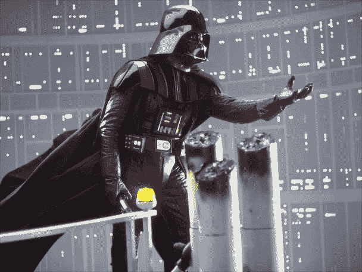

# 用这个简单的 CSS 技巧给你的网站添加黑暗模式

> 原文：<https://dev.to/vuesomedev/add-dark-mode-to-your-site-with-this-short-css-trick-1g7b>

现在大多数应用程序都有黑暗模式:你的命令行，你的 IDE，你的浏览器，等等。为什么你的网站会有所不同？当访问者的浏览器启用了黑暗模式时，您的网站也会变暗。这比你想象的要容易。我会告诉你怎么做。

```
@media (prefers-color-scheme: dark) {
  body {
    background-color: black;
    color: #ccc;
  }
} 
```

<svg width="20px" height="20px" viewBox="0 0 24 24" class="highlight-action crayons-icon highlight-action--fullscreen-on"><title>Enter fullscreen mode</title></svg> <svg width="20px" height="20px" viewBox="0 0 24 24" class="highlight-action crayons-icon highlight-action--fullscreen-off"><title>Exit fullscreen mode</title></svg>

你好，黑暗，我的老朋友。

[](https://res.cloudinary.com/practicaldev/image/fetch/s--qf7Tpy1H--/c_limit%2Cf_auto%2Cfl_progressive%2Cq_auto%2Cw_880/https://thepracticaldev.s3.amazonaws.com/i/1doxomndodgxphmnlytj.jpg)

这个 CSS 代码片段覆盖了用户深色主题的样式。最棒的是这个功能在 Chrome 76、Firefox 67、Safari 12.1、Opera 62 中已经有了。

您可以使用 Javascript 检查浏览器是否支持它。

```
if (window.matchMedia('(prefers-color-scheme)').media === 'not all') {
  console.log('Browser doesn\'t support dark mode');
} 
```

<svg width="20px" height="20px" viewBox="0 0 24 24" class="highlight-action crayons-icon highlight-action--fullscreen-on"><title>Enter fullscreen mode</title></svg> <svg width="20px" height="20px" viewBox="0 0 24 24" class="highlight-action crayons-icon highlight-action--fullscreen-off"><title>Exit fullscreen mode</title></svg>

我希望这一小段有助于提升你的网站风格。
快乐编码🚀