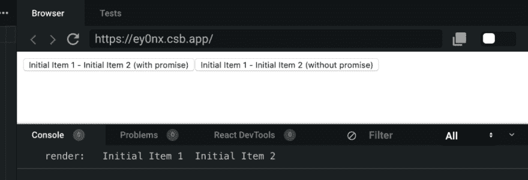
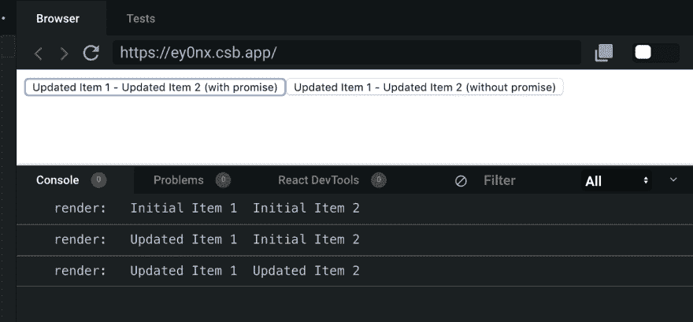
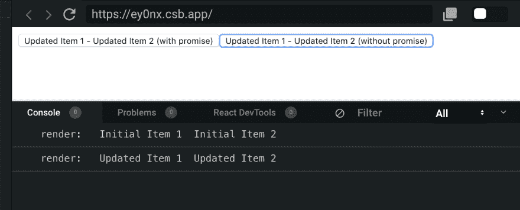
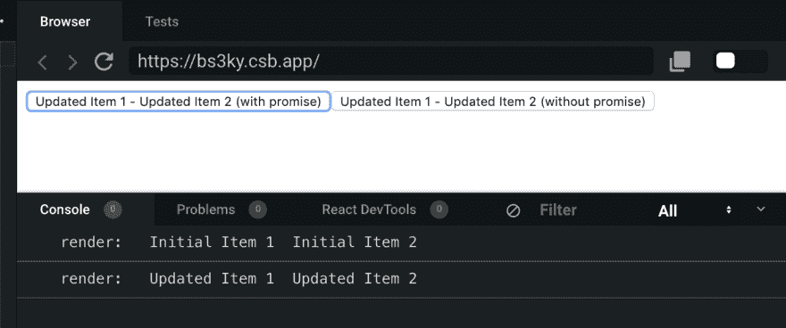

# 通过批量更新简化 React 应用中的状态管理

> 原文：<https://dev.to/bnevilleoneill/simplifying-state-management-in-react-apps-with-batched-updates-2egp>

**作者:[彼得·埃克内埃兹](https://blog.logrocket.com/author/peterekeneeze/)T3】✏️**

使用`useState`或`this.setState`更新组件状态后，组件的某些部分会根据更新重新渲染。更重要的是，如果您有各种调用来更新像`onClick`这样的 React 事件处理程序中的状态，React 会批量更新，而不是一次更新一个，从而减少组件渲染的次数。

但是，您可能并不总是调用事件处理程序来更新状态，在这些情况下(例如在 Promise 或 SetTimeout 中)，React 会同步更新，而不是成批更新。这意味着您将获得多次重新渲染。考虑下面的例子(或者查看 CodeSandbox 上的[演示):](https://codesandbox.io/s/batched-update-snippet1-4wuk8) 

```
import React, { Fragment, useState } from "react";
import ReactDOM from "react-dom";
function Component() {
  const [item1, setItem1] = useState("Initial Item 1");
  const [item2, setItem2] = useState("Initial Item 2");
  console.log("render: ", item1, item2);
  function handleClickWithPromise() {
    Promise.resolve().then(() => {
      setItem1("Updated Item 1");
      setItem2("Updated Item 2");
    });
  }
  function handleClickWithoutPromise() {
    setItem1("Updated Item 1");
    setItem2("Updated Item 2");
  }
  return (
    <Fragment>
      <button onClick={handleClickWithPromise}>
        {item1} - {item2} (with promise)
      </button>
      <button onClick={handleClickWithoutPromise}>
        {item1} - {item2} (without promise)
      </button>
    </Fragment>
  );
}
function App() {
  return <Component />;
}
const rootElement = document.getElementById("root");
ReactDOM.render(<App />, rootElement); 
```

<svg width="20px" height="20px" viewBox="0 0 24 24" class="highlight-action crayons-icon highlight-action--fullscreen-on"><title>Enter fullscreen mode</title></svg> <svg width="20px" height="20px" viewBox="0 0 24 24" class="highlight-action crayons-icon highlight-action--fullscreen-off"><title>Exit fullscreen mode</title></svg>

在这个例子中，我们有两个状态值`item1`和`item2`，当两个按钮中的任何一个被点击时，我们更新它们的值。但是，在第一个按钮中，我们在承诺范围内进行更新。

默认情况下，React 批处理在已知方法(如生命周期方法或事件处理程序)中进行的更新，但是当更新在回调中(如在`SetTimeout`或 Promises 中)时，React 不会这样做。这意味着，如果有多次调用来更新状态，React 会在每次调用时重新呈现组件。

[](https://logrocket.com/signup/)

当`Component`第一次渲染时，控制台输出`item1`和`item2`的初始值。

[](https://res.cloudinary.com/practicaldev/image/fetch/s--ZCozxLg5--/c_limit%2Cf_auto%2Cfl_progressive%2Cq_auto%2Cw_880/https://i2.wp.com/blog.logrocket.com/wp-content/uploads/2019/09/componentrender.png%3Fresize%3D1024%252C349%26ssl%3D1)

然后，如果您单击第一个按钮，组件会重新渲染两次，您会看到最初的渲染和随后的两次重新渲染:

[](https://res.cloudinary.com/practicaldev/image/fetch/s--bYyoSnrk--/c_limit%2Cf_auto%2Cfl_progressive%2Cq_auto%2Cw_880/https://i1.wp.com/blog.logrocket.com/wp-content/uploads/2019/09/tworenders.png%3Fresize%3D1416%252C658%26ssl%3D1)

但是，如果您刷新页面并单击第二个按钮，您会看到初始呈现和仅一次重新呈现，尽管仍然有两次对状态的更新:

[](https://res.cloudinary.com/practicaldev/image/fetch/s--eSQg7tCL--/c_limit%2Cf_auto%2Cfl_progressive%2Cq_auto%2Cw_880/https://i0.wp.com/blog.logrocket.com/wp-content/uploads/2019/09/Initialrenderandonererender.png%3Fresize%3D1380%252C556%26ssl%3D1)

为什么可能呢？因为 React 在已知的方法中自动批量更新，在本例中是一个事件处理程序。请随意使用[演示](https://codesandbox.io/s/batched-update-snippet1-4wuk8)亲自测试功能:

[https://codesandbox.io/embed/4wuk8](https://codesandbox.io/embed/4wuk8)

当您在一个承诺中包含多个状态调用时，就像上面的例子一样，您可以强制 React 进行批量更新，因此只会导致一次重新呈现。这可以通过包装调用来完成，以更新`*ReactDOM.unstable_batchedUpdates()*`中的状态，如下所示:

```
function handleClickWithPromise() {
    Promise.resolve().then(() => {
      ReactDOM.unstable_batchedUpdates(() => {
        setItem1("Updated Item 1");
        setItem2("Updated Item 2");
      });
    });
  } 
```

<svg width="20px" height="20px" viewBox="0 0 24 24" class="highlight-action crayons-icon highlight-action--fullscreen-on"><title>Enter fullscreen mode</title></svg> <svg width="20px" height="20px" viewBox="0 0 24 24" class="highlight-action crayons-icon highlight-action--fullscreen-off"><title>Exit fullscreen mode</title></svg>

接下来，用上面的片段更新[之前的演示](https://codesandbox.io/s/batched-update-snippet1-4wuk8)上的`handleClickWithPromise()`函数，就像我们目前在这个[沙箱](https://codesandbox.io/s/objective-surf-bs3ky)上的一样。现在，如果你点击第一个按钮，更新将被批量处理，导致只有一个渲染。如果您查看您的控制台，您应该会在单击第一个按钮后看到以下内容:

[](https://res.cloudinary.com/practicaldev/image/fetch/s--gffA5xLx--/c_limit%2Cf_auto%2Cfl_progressive%2Cq_auto%2Cw_880/https://i1.wp.com/blog.logrocket.com/wp-content/uploads/2019/09/renderconsole.png%3Fresize%3D1378%252C576%26ssl%3D1)

这不像上次我们点击第一个按钮时有两次重新渲染(有承诺)。作为在`*ReactDOM.unstable_batchedUpdates()*`中包装更新状态调用的结果，我们获得了与第二个按钮完全相同的功能(没有承诺)。

正如我前面提到的，如果你使用`*unstable_batchedUpdates()*`，请记住这是一个实现细节。React 的未来版本可能会将此作为默认行为，这样您就不必使用不稳定的 API 了。

## 该不该用？

这个方法的名字确实让人有点担心在生产中使用是否安全。然而，React 团队已经[鼓励过](https://github.com/facebook/react/issues/16377)(在撰写本文时，仍然如此)在适当的时候使用这个 API。因此，可以肯定地说，虽然“不稳定”，但它足够稳定，可以用于今天的生产。

## 何时使用

如果您需要多次调用来更新状态，就像上面的例子一样，您可能会发现有一种更好的方法。根据我的经验，在大多数情况下，我看到开发人员进行多次调用来更新状态，这些调用可以很容易地被一次调用所取代。让我们来看一些实例，在这些实例中，您可能会多次调用来更新状态。

```
this.setState({ ...this.state, foo: 42 });
if (condition) {
    this.setState({ ...this.state, isBar: true });
} 
```

<svg width="20px" height="20px" viewBox="0 0 24 24" class="highlight-action crayons-icon highlight-action--fullscreen-on"><title>Enter fullscreen mode</title></svg> <svg width="20px" height="20px" viewBox="0 0 24 24" class="highlight-action crayons-icon highlight-action--fullscreen-off"><title>Exit fullscreen mode</title></svg>

上面的代码可以被重构，用一个简单的调用来更新状态，比如:

```
let newState = { this.state, foo: 42 };
if (condition) {
    newState = { ...this.state, isBar: true };
}
this.setState(newState); 
```

<svg width="20px" height="20px" viewBox="0 0 24 24" class="highlight-action crayons-icon highlight-action--fullscreen-on"><title>Enter fullscreen mode</title></svg> <svg width="20px" height="20px" viewBox="0 0 24 24" class="highlight-action crayons-icon highlight-action--fullscreen-off"><title>Exit fullscreen mode</title></svg>

当然，你正在创建一个全新的变量，这没关系。通常，正如我们前面看到的，React 会自动批量更新某些函数，而不是其他函数。因此，当您试图将调用次数减少到`setState`时，您应该慎重考虑。

另一个需要多次调用来更新状态的例子是:

```
// Increment foo
this.setState({ ...this.state, foo: this.state.foo + 1 });
this.setState({ ...this.state, foo: this.state.foo + 1 }); 
```

<svg width="20px" height="20px" viewBox="0 0 24 24" class="highlight-action crayons-icon highlight-action--fullscreen-on"><title>Enter fullscreen mode</title></svg> <svg width="20px" height="20px" viewBox="0 0 24 24" class="highlight-action crayons-icon highlight-action--fullscreen-off"><title>Exit fullscreen mode</title></svg>

在这种情况下，随后的调用会利用先前调用所产生的更新值。同样，上面的代码可以这样重构:

```
function incrementFooBy(delta) {
    return (previousState, currentProps) => {
        return { ...previousState, foo: previousState.foo + delta };
    };
}
this.setState(incrementFooBy(2)); 
```

<svg width="20px" height="20px" viewBox="0 0 24 24" class="highlight-action crayons-icon highlight-action--fullscreen-on"><title>Enter fullscreen mode</title></svg> <svg width="20px" height="20px" viewBox="0 0 24 24" class="highlight-action crayons-icon highlight-action--fullscreen-off"><title>Exit fullscreen mode</title></svg>

这里，我们使用 currying 来根据先前的状态和预期的更改“编写”更新内容，然后将值传递给`this.setState`。

## 是否适用于挂钩？

这可能是你想问的一个问题，所以让我就此打住，说是的。随着钩子的引入，我经常看到这种情况。考虑下面这个例子:

```
const [value, updateValue] = useState({});
const [anotherValue, updateAnotherValue] = useState({});

updateValue({ content: "Hello" });
updateAnotherValue({ content: "World" }); 
```

<svg width="20px" height="20px" viewBox="0 0 24 24" class="highlight-action crayons-icon highlight-action--fullscreen-on"><title>Enter fullscreen mode</title></svg> <svg width="20px" height="20px" viewBox="0 0 24 24" class="highlight-action crayons-icon highlight-action--fullscreen-off"><title>Exit fullscreen mode</title></svg>

有时当你使用钩子时，你会发现自己在一个单一的功能组件中创建了多个状态对象。如果你这样做，这可能是一个信号，表明你的功能组件违反了单一责任原则，做了不止一件事。如果多个状态对象放在一起是有意义的，那么您应该将这些值组合成一个状态对象，如下所示:

```
const [allValues, updateAllValues] = useState({});

updateAllValues({firstContent: "Hello", secondContent: "World" }); 
```

<svg width="20px" height="20px" viewBox="0 0 24 24" class="highlight-action crayons-icon highlight-action--fullscreen-on"><title>Enter fullscreen mode</title></svg> <svg width="20px" height="20px" viewBox="0 0 24 24" class="highlight-action crayons-icon highlight-action--fullscreen-off"><title>Exit fullscreen mode</title></svg>

或者将两个状态对象分离成它们自己独立的功能组件，如果它们在一起没有意义的话。如果你不属于上面提到的任何一种情况，那么我认为你应该使用`*unstable_batchedUpdates*`。

我觉得有必要提一下，进行多次调用来更新状态并没有那么糟糕，特别是因为 React 在某些情况下会自动批量更新，而在其他情况下，它并不会真正产生任何性能问题。因此，如果你发现自己需要使用`*unstable_batchedUpdates*`，那么你一定处于非常罕见的情况。

## 会被弃用吗？

根据 Dan Abramov 对 Stackoverflow 问题的回复:

“但是，我们不会在次要版本中删除[`unstable_batchedUpdates`]，因此在 React 17 之前，如果您需要在 React 事件处理程序之外的某些情况下强制批处理，您可以放心地依赖它。”

他对 Github 问题的另一个评论是:

“这是预期的行为，因为我们目前只在已知的反应范围内批量更新(例如，在同步生命周期方法期间，或在事件处理程序期间)。如上所述，您可以使用`unstable_batchedUpdates`来解决这个问题。未来，批处理将在任何地方默认开启。”

截至撰写本文时，官方路线图博客帖子中没有提到任何 React 版本中的`unstable_batchedUpdates`将被弃用，除了 Dan 的评论之外，也没有太多信息更准确地说明 API 何时将被弃用。

## 最后的想法

在这篇文章中，我们仔细研究了批量更新特性，并展示了它如何简化 React 应用程序中的语句管理和呈现过程。提到了这个 featured 目前还不稳定，值得注意的是目前可以使用。首先，只需将状态调用放入传递给`*ReactDOM.unstable_batchedUpdates*`的回调函数中。

* * *

**编者按:**看到这个帖子有问题？你可以在这里找到正确的版本。

## Plug: [LogRocket](https://logrocket.com/signup/) ，一款适用于网络应用的 DVR

[](https://res.cloudinary.com/practicaldev/image/fetch/s--6FG5kvEL--/c_limit%2Cf_auto%2Cfl_progressive%2Cq_auto%2Cw_880/https://i2.wp.com/blog.logrocket.com/wp-content/uploads/2017/03/1d0cd-1s_rmyo6nbrasp-xtvbaxfg.png%3Fresize%3D1200%252C677%26ssl%3D1)

[log rocket](https://logrocket.com/signup/)是一个前端日志工具，让你重放问题，就像它们发生在你自己的浏览器中一样。LogRocket 不需要猜测错误发生的原因，也不需要向用户询问截图和日志转储，而是让您重放会话以快速了解哪里出错了。它可以与任何应用程序完美配合，不管是什么框架，并且有插件可以记录来自 Redux、Vuex 和@ngrx/store 的额外上下文。

除了记录 Redux 动作和状态，LogRocket 还记录控制台日志、JavaScript 错误、stacktraces、带有头+体的网络请求/响应、浏览器元数据、自定义日志。它还使用 DOM 来记录页面上的 HTML 和 CSS，甚至为最复杂的单页面应用程序重新创建像素级完美视频。

[免费试用](https://logrocket.com/signup/)。

* * *

帖子[通过批量更新](https://blog.logrocket.com/simplifying-state-management-in-react-apps-with-batched-updates/)简化 React 应用的状态管理最先出现在[博客](https://blog.logrocket.com)上。