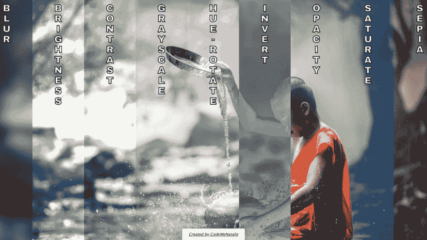
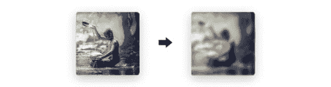
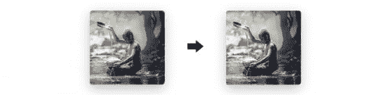
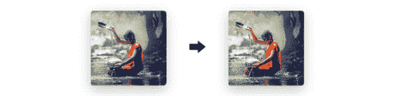

# 背景过滤属性

> 原文:[https://dev.to/itsmenatalie/backdrop-filter-property-3bah](https://dev.to/itsmenatalie/backdrop-filter-property-3bah)

[T2】](https://cdn.sanity.img/0ugmrqfk/production/4b59318ec922a787645b6800c0ffe4407f713e2e-1440x744.png?rect=59,0,1323,744&w=1200&h=675&auto=format)

“毛玻璃”效应在 10 多年前风靡网络，至今仍很流行。只需一行 CSS 就可以创建褪色的背景效果和其他复杂的设计效果！

`backdrop-filter`是一个可动画化的 CSS 属性，它允许将各种图形效果应用到元素后面的区域。由于这一特性，你可以实现不同的效果，如模糊，变色或磨砂玻璃。“背景”基本上描述了位于指定项目后面的绘制内容的所有内容。当在 SVG 中使用它时，它将一个效果应用到一个容器中，但不包括`defs`标签。元素或其背景需要至少部分透明才能看到它们，因为它们应用于后面的所有内容。

使用`backdrop-filter`属性时，您可以从许多过滤器值中选择:

*   `blur()`–应用像素分散的距离测量。这使得元素不太清楚。你用的数字表示力量。该值越高，项目越不明显。

<figure> 

<figcaption>模糊效果</figcaption>

</figure>

*   `brightness()`–调整元素颜色的亮度。如果你设置的值小于 1，结果会变暗，大于 1 的数字会变亮。该过滤器接受百分比或从 0 到无穷大的任何数字。

*   `contrast()`–通过增加已经变亮的区域和减少变暗的区域来定义元素的对比度。它获取项目的每个像素，并调整亮暗值之间的差异。

*   `grayscale()`–改变元素的光量，同时增强其黑白颜色。当您将该值设置为 1 或 100%时，元素将完全灰度化。

<figure> 

<figcaption>灰度效果</figcaption>

</figure>

*   `invert()`–生成元素的相反颜色。

*   `hue-rotate()`–指定围绕色环的一个角度，元素将根据该角度进行调整。您可以提供从 0 到 360 度的角度或弧度值。每个度数都有自己的颜色——0 度是红色，120 度是绿色，240 度是蓝色。这意味着如果你的元素中有绿色像素，并且设置值为 240，那么你的红色像素将是蓝色的。

*   `none`–不对背景应用任何滤镜。

*   `opacity()`–将透明度应用于元素的颜色。

*   `saturate()`–改变元素颜色的强度，使其看起来更生动或更不生动。将该值设置为 2(或 200%)将使饱和度加倍。减少该值将使项目看起来更灰和混合。

<figure> 

<figcaption>饱和效果</figcaption>

</figure>

*   `sepia()`–将棕褐色色调应用到元素中，给人一种更温暖、更古色古香的感觉。

下面是一个例子:

[https://codepen.io/CodeMeNatalie/embed/MWgrdxr?height=600&default-tab=result&embed-version=2](https://codepen.io/CodeMeNatalie/embed/MWgrdxr?height=600&default-tab=result&embed-version=2)

请注意，此属性与 Edge 和 Internet Explorer 不兼容。要了解更多信息，你应该查看官方文档。