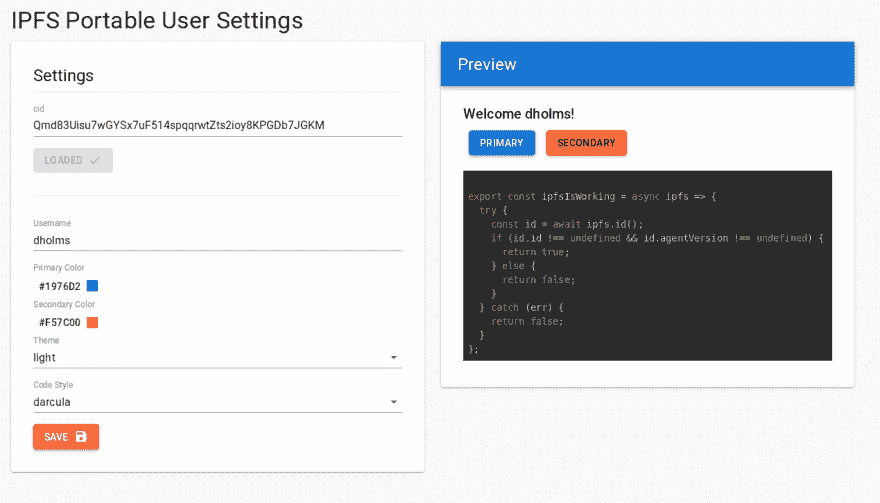
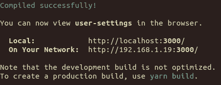
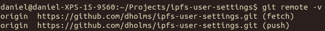
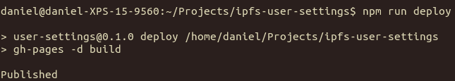

# IPFS 便携式用户设置应用首次发布

> 原文：<https://dev.to/fission/first-release-of-ipfs-portable-user-settings-app-25gg>

*作者是我们的新队友丹尼尔，你可以在 Github 上找到他的名字[@ dholms](https://github.com/dholms)T3】*

在裂变公司，我们一直在努力和 IPFS 一起设计很酷的新实验。IPFS 基于内容的寻址方式为我们提供了一个扁平的通用名称空间来存储文件和其他数据，这促使我们以不同的方式思考如何构建和部署软件。这引导我们构建原型和实验，帮助我们:

*   我们或另一个团队可以扩展的创意项目
*   测试和校准我们为实际操作而构建的工具
*   促进新库/技术的创建

我们最近的应用程序来自我们提出的一个简单问题:如果我的偏好在所有应用程序中都是一样的，为什么我需要在每个应用程序中填写相同的信息？

介绍 [IPFS 便携式用户设置](https://github.com/fission-suite/ipfs-user-settings/)——一个完全客户端的应用程序，允许你通过 IPFS 更新你的偏好，并把它们带到你去的任何地方。

### 玩转[现场试玩](https://fission-suite.github.io/ipfs-user-settings/)

[](https://res.cloudinary.com/practicaldev/image/fetch/s--4cZHD9Hd--/c_limit%2Cf_auto%2Cfl_progressive%2Cq_auto%2Cw_880/https://s3.fission.codes/2019/09/user-settings-screenshot.png)

## 背景

虽然新兴的去中心化网络和过去的网络在很多方面都有所不同，但是可以把它看作是用户模型的不同。web2.0 用户数据模型是以公司(或平台)为中心的。这包括将您的数据锁定在公司所有的单一数据库中，最终结果是您的身份在各种公司孤岛中被分割和复制。Web3 带来了一种新的数据概念化方式:以用户为中心的数据模型。在这种模式下，用户拥有他们的数据，这些数据只能由他们以及受信任的人和应用程序读取/编辑。应用程序承担了不同的功能:它们作为“窗口”存在，用户授予权限查看或编辑其数据的某些属性。

通常，web3 技术的好处被放在反动的术语中。也就是说，它是对当前互联网企业管理者的过度/失误做出的反应:审查、草率或恶意使用用户数据、临时性(25 年后我还能在脸书上看到我的照片吗？我在 Gmail 上的存档邮件？)，等等。

裂变的一个目标是，我们不仅要解决 web2 的缺点，还要创造积极的理由来跳到 web3。

去中心化的应用程序应该让开发人员创建起来既有趣又容易，让用户接受起来也令人兴奋，因为它们提供了在旧网络中不可能实现的功能。这是我们开发便携式用户设置的动机。我们希望给出 web3 的一些可能性背后的直觉，以及一个更健壮的版本可以基于的技术演示。

我们也想让这个应用完全 p2p 化。这里不需要 HTTP 网关！如果您的浏览器支持 IPFS，并且您正在运行本地守护程序，则该应用程序会连接到该守护程序。如果没有，它会优雅地设置一个 [`js-ipfs`](https://github.com/ipfs/js-ipfs) 的浏览器内实例。

这可能有很多方向。也许我们想启用通用黑暗模式，以便您浏览的所有网站都尊重您的全局黑暗模式设置？请留下您希望在这个世界上看到的便携式用户设置的评论。

## 技术成果

这个项目不仅产生了一个非常简洁的演示，还产生了一些有用的技术分支:

**[get-ipfs](https://github.com/fission-suite/get-ipfs)**

开发者在试图利用去中心化 web 时可能面临的最大问题之一就是进入门槛高。我们将我们的 IPFS 回退功能打包到它自己的包中: [get-ipfs](https://github.com/fission-suite/get-ipfs) 。这是您新的一站式商店，用于将 IPFS 实例加载到网页中。就像`const ipfs = await getIpfs()`一样简单，你可以在你的 webapp 中直接 P2P 使用去中心化的 web。试试吧，让我们知道它是如何为你工作的！

**裂变 JavaScript 客户端**

这个 app 也是我们第一次在野外使用[裂变 JavaScript 客户端](https://github.com/fission-suite/typescript-client)。虽然添加/获取是通过 P2P 完成的，但是对 pin 的请求必须通过 HTTP 发送。然而，该库具有通过 HTTP 创建支持 IPFS 的应用程序所需的所有功能。查看[库](https://github.com/fission-suite/typescript-client)，看看你能想出什么酷的用法！

**托管 IPFS 节点**

虽然我们已经托管了一个 IPFS 节点，但我们的托管节点现在更加健壮了。它能够处理安全的 websocket 连接(因此它可以与浏览器内的`js-ipfs`节点对话！)并将数据存储在 S3。查看我们为[发布的在 AWS](https://talk.fission.codes/t/a-loosely-written-guide-to-hosting-an-ipfs-node-on-aws/234) 上设置你自己的 IPFS 节点的演练！

同样，点击这里查看演示[或者继续阅读，了解如何构建和托管您自己的演示！](https://fission-suite.github.io/ipfs-user-settings/)

## 运行/部署您自己的应用

### 叉回购

*注意:这仅在您计划部署自己的用户设置应用程序时才有必要。如果您只想在本地玩，您可以简单地克隆存储库。*

单击存储库右上角的“Fork”。

[](https://res.cloudinary.com/practicaldev/image/fetch/s--1EYeuvpO--/c_limit%2Cf_auto%2Cfl_progressive%2Cq_auto%2Cw_880/https://s3.fission.codes/2019/09/fork-repo.png)

### 本地克隆回购

在您的终端中，克隆`ipfs-user-settings` repo:

```
git clone https://github.com/$YOUR_USERNAME/ipfs-user-settings.git
cd ipfs-user-settings 
```

### 设置环境

环境变量是可选的，但是需要进行设置以获得最佳用户体验。

首先，在资源库的根目录下创建一个`.env`文件:

`touch .env`

您的`.env`将会看起来像这样:

```
REACT_APP_DEFAULT_CID = QmUWWqCNSdZmus7mc52um5cpqUi1CaE97AzBTY7iWfBXV9
REACT_APP_BOOTSTRAP_NODE = /dns4/ipfs.runfission.com/tcp/4003/wss/ipfs/QmVLEz2SxoNiFnuyLpbXsH6SvjPTrHNMU88vCQZyhgBzgw
REACT_APP_INTERPLANETARY_FISSION_URL = https://runfission.com
REACT_APP_INTERPLANETARY_FISSION_USERNAME = ADD_USERNAME_HERE
REACT_APP_INTERPLANETARY_FISSION_PASSWORD = ADD_PASSWORD_HERE 
```

让我们来看看这些变量的作用。

`REACT_APP_DEFAULT_CID`:包含您希望新用户看到的默认设置的 cid。您可以将它设置为我们推荐的默认值(或者留空，它将默认为该值)。

`REACT_APP_BOOTSTRAP_NODE`:您希望用户节点连接到的 ipfs 节点的多地址。您可以将其设置为上面的值，以连接到裂变托管的 IPFS 节点(或者将其留空，它将默认为该值)。

**注意:**如果使用自定义节点，必须与`js-ipfs`互通。这意味着它要么需要通过 WebRTC 连接，要么需要通过安全的 Websockets 连接(注意上面多地址中的`wss`)。

`REACT_APP_INTERPLANETARY_FISSION_...`:最后三个变量是您为使用裂变 web-api 而提供的帐户信息。这些用于将内容固定到裂变 IPFS 节点，以便内容即使在用户离线后也能保持在线。如果您将其留空，webapp 将不会固定用户内容。目前，这些可以通过加入[裂变 Heroku 附加阿尔法](https://elements.heroku.com/addons/interplanetary-fission)获得。如果你已经尝试过我们之前的[照片库演示](https://github.com/fission-suite/ipfs-photo-gallery)，你可以在这里使用相同的凭证，否则按照教程中的[提供用户名和密码](https://talk.fission.codes/t/ipfs-photo-gallery-in-alpha-mode/197/10)

### 本地运行 app

首先安装依赖:

`npm install`

然后运行 app:

`npm run start`

这将在`http://localhost:3000`在您的浏览器中打开一个页面！

[](https://res.cloudinary.com/practicaldev/image/fetch/s--M7oWT2tV--/c_limit%2Cf_auto%2Cfl_progressive%2Cq_auto%2Cw_880/https://s3.fission.codes/2019/09/run-local-terminal.png)

玩一会儿！尝试更改您的设置，保存它，并加载过去的 cid。

### 构建 app

为了让你的应用程序建立正确的内部链接，你需要改变主页:

打开`package.json`并将`homepage`改为这个站点将被托管的 URL(`$YOUR_USERNAME.github.io/ipfs-user-settings`)。

搭建 app:

`npm run build`

[](https://res.cloudinary.com/practicaldev/image/fetch/s--xwbU-57C--/c_limit%2Cf_auto%2Cfl_progressive%2Cq_auto%2Cw_880/https://s3.fission.codes/2019/09/build-terminal.png)

部署应用程序

使用您喜欢的工具进行部署:Heroku、GitHub pages 等。或者如果你在一个月后读到这篇文章，请使用新的“裂变直播”工具😉

我们为 GitHub 页面提供了一个部署命令。

首先，确保您的存储库被设置为 git remote。

**如果还是设为`fission-suite`就不行了。**

运行:`git remote -v`并确保 remote 旁边的 url 是`https://github.com/$YOUR_USERNAME/ipfs-user-settings.git`

如果你早些时候进行回购，这应该没问题。如果您确实需要更换遥控器，只需运行

`git remote set origin https://github.com/$YOUR_USERNAME/ipfs-user-settings.git`

[](https://res.cloudinary.com/practicaldev/image/fetch/s--22_UYoKJ--/c_limit%2Cf_auto%2Cfl_progressive%2Cq_auto%2Cw_880/https://s3.fission.codes/2019/09/check-remote.png)

部署 app:

`npm run deploy`

[](https://res.cloudinary.com/practicaldev/image/fetch/s--ruXiV97c--/c_limit%2Cf_auto%2Cfl_progressive%2Cq_auto%2Cw_880/https://s3.fission.codes/2019/09/deploy.png)

现在打开您的浏览器到`$YOUR_USERNAME.github.io/ipfs-user-settings`看看您的网站启动和运行！

让我们知道进展如何！我们总是渴望听到任何反馈，所以来加入我们论坛、 [Discord](https://discord.gg/daDMAjE) 或 [GitHub](https://github.com/fission-suite/) 的讨论吧。