# 通过 RPI 和分线点花园(EFM、NiFi、MiNiFi 代理)为 Edge AI 传感器读数供电

> 原文：<https://dev.to/tspannhw/powering-edge-ai-for-sensor-reading-with-rpi-and-breakout-garden-efm-nifi-minifi-agents-gkj>

### 利用 RPI 和分线花园(EFM、NiFi、MiNiFi 代理)为 Edge AI 提供传感器读数

[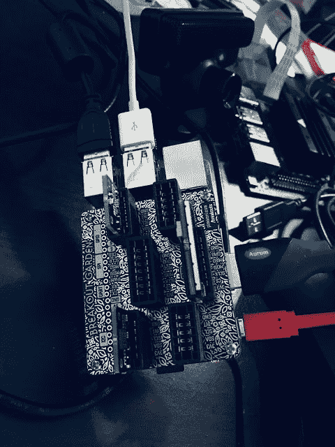](https://1.bp.blogspot.com/-Alji2wnVRd8/XPVzUvoOYiI/AAAAAAAAXrE/bDG6qpomjMMd712iY2qBhKXfmKm6FS7PgCLcBGAs/s1600/unnamed.jpg)

[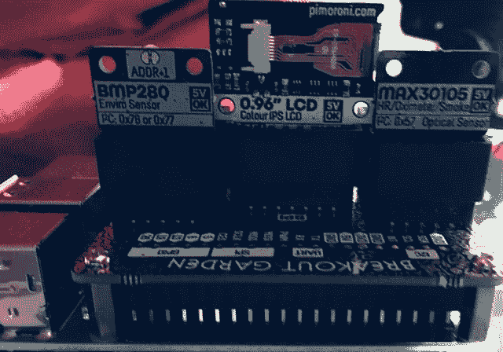](https://1.bp.blogspot.com/-mUcRm__Di90/XXEqiRMFgsI/AAAAAAAAYVE/jtA9uRmXbHYTwrfOevxG_C-WAO-dgadkgCLcBGAs/s1600/breakoutgarden2.png)

[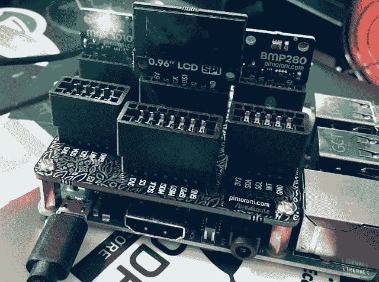](https://1.bp.blogspot.com/-8qFhjqoFJIY/XXEqiOyUsJI/AAAAAAAAYVA/mkyYhaCDtv8sPSsFX0fUa-obpkCFpKOGACLcBGAs/s1600/garden2bmp280max3010.png)

**硬件组件列表:**

*   树莓派 3B+
*   BMP-280 温度、压力和高度
*   ST7735 0.96 SPI 彩色 LCD 160x80
*   MAX-30105 血氧计和烟雾传感器
*   索尼 Playstation 3 眼 USB 网络摄像头

### 软件组件列表:

*   拉斯比安
*   Python 3.5
*   JDK 8 Java(即将升级到 JDK 11)
*   Apache NiFi 1.9.2 版
*   MiniFi Java 代理 0.6.0
*   Cloudera Edge 流量管理器
*   阿帕奇卡夫卡 2.2

### **总结**

[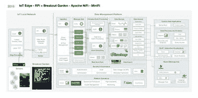](https://res.cloudinary.com/practicaldev/image/fetch/s--KYnA904A--/c_limit%2Cf_auto%2Cfl_progressive%2Cq_auto%2Cw_880/https://xgkfq28377.i.lithium.com/t5/image/serverpage/image-id/7451iAE204037258B2FF4/image-size/medium%3Fv%3D1.0%26px%3D400)

潜在的使用案例:跟踪设施中的环境，包括网络摄像头检测、温度、压力和烟雾。

我们的树莓派 3B+有一个突破花园帽，有两个传感器和一个小显示器。显示屏显示捕获的图像，并不断更新。

我们目前通过 nohup 运行，但是当我们经常使用时，我会切换到 Linux 服务，在启动时运行。

Python 脚本初始化到所有传感器的连接，然后进入一个无限循环，读取这些值并构建一个 JSON 包，我们通过 MQTT 在端口 1883 上将这个包发送到 MQTT Mosquitto 代理。MiniFi 0.6.0 Java 代理正在该端口上使用 ConsumeMQTT 来捕获这些消息，并根据警报值对它们进行过滤。如果在检查的参数之外，我们通过 S2S/HTTP(s)将它们发送到 Apache NiFi 服务器。

我们还有一个 USB 网络摄像头(索尼 Playstation 3 EYE ),它可以捕捉图像，我们可以用 MiniFi 读取这些图像，并将其发送给 niFi。我们将把 TensorFlow lite 模型纳入我们的分析中。

我们需要做的第一件事非常简单。我们需要插上我们的皮莫尔尼突破花园帽和我们的 3 个插头。

你得做 Python 3，Java 8，MiniFi 的标准安装，我推荐 OpenCV。在启动 Raspberry Pi 之前，请确保您的所有设备都已安全插入，并且方向正确。

在这里下载 MiniFi Java:[https://nifi.apache.org/minifi/download.html](https://nifi.apache.org/minifi/download.html)

安装 Python PIP

卷发[https://bootstrap.pypa.io/get-pip.py](https://bootstrap.pypa.io/get-pip.py)

安装临时花园库

wget[https://github . com/pimoroni/breakout-garden/archive/master . zip](https://github.com/pimoroni/breakout-garden/archive/master.zip)

解压缩 master.zip

cd 分会场-花园-主

须藤。/install.sh

### 倪飞流

[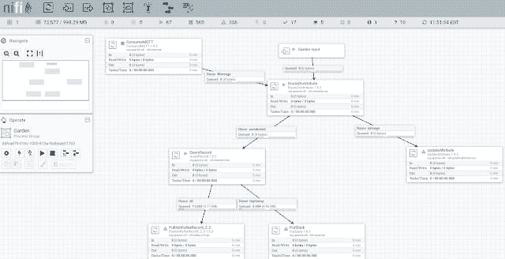](https://1.bp.blogspot.com/-Y_ac30aIP7s/XXfKSJnWb8I/AAAAAAAAYXc/WejvV-sU2yUKlNRkDQY-WQArnAQGua0UQCLcBGAs/s1600/garden2NiFiFlow.png)

#### 我们可以在物联网事件流入时进行查询

[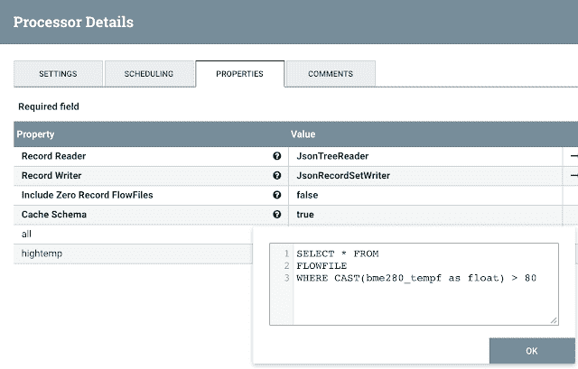](https://1.bp.blogspot.com/-oAA3jbR7GG8/XXfKTbo58uI/AAAAAAAAYXw/h2bQI5R7nCkeOicur0BGqAh9PjbR9QcRQCLcBGAs/s1600/queryHightTemp.png)

#### 添加 ExecuteProcess 来运行我们的 Shell/Python

[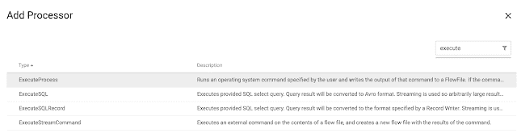](https://1.bp.blogspot.com/-0rBZD8RBj24/XXfKQB8vnFI/AAAAAAAAYWw/XY5Lvo6prow-R8MiWjFd6yUit-6FBDAEQCLcBGAs/s1600/addExecuteProcess.png)

#### 物联网 JSON 数据

[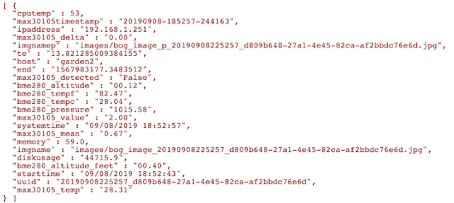](https://1.bp.blogspot.com/-S6Yl7annJ44/XXfKSnw_KoI/AAAAAAAAYXg/mZ48ezxxLxkig0YyPL38bEQ8buwxY_4ywCLcBGAs/s1600/garden2jsondata.png)

#### 物联网用户

#### Cloudera Edge Management -从设备上的 MiNiFi 代理监控物联网事件

[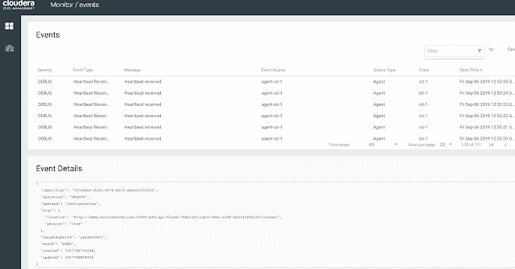](https://1.bp.blogspot.com/-p2dZ3dkSYjc/XXfKQxn-reI/AAAAAAAAYXA/5MTT9Z-WLtUbUaXBYUj66WasKTA7w_RsgCLcBGAs/s1600/cemEventsLog.png)

#### 图形化构建物联网流程很简单！它遵循 [Hadoop 理念](https://medium.com/@acmurthy/hadoop-is-dead-long-live-hadoop-f22069b264ac)将这些东西缝合在一起。

[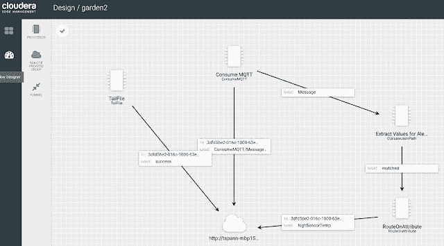](https://1.bp.blogspot.com/-umG5dbQf4g0/XXfKRPii8-I/AAAAAAAAYXE/-XhpB8W7TYwLqs_cR_4GOjxrU0wQehOXgCLcBGAs/s1600/cemGarden2.png)

配置到 MQTT 代理的连接

[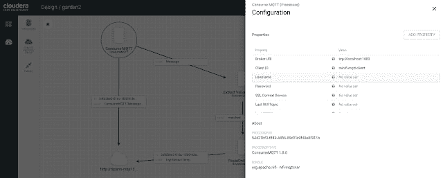](https://1.bp.blogspot.com/-y_UWdGdx19E/XXfKRvG-RvI/AAAAAAAAYXQ/X58Qustq6kYNOVVnKzknuQLD-zDcs493wCLcBGAs/s1600/consumeMQTT.png)

#### MQTT 配置 2

[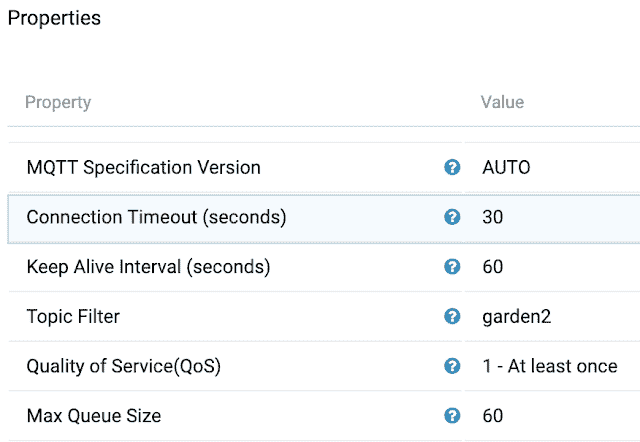](https://1.bp.blogspot.com/-YzbPTRhP7v4/XXfKRzQHXFI/AAAAAAAAYXU/u8OQln5QlAIl1-K-ngHLTxlxaJLg6UyyQCLcBGAs/s1600/consumemqttsettings2.png)

**cloud era Edge Flow Manager REST API**

[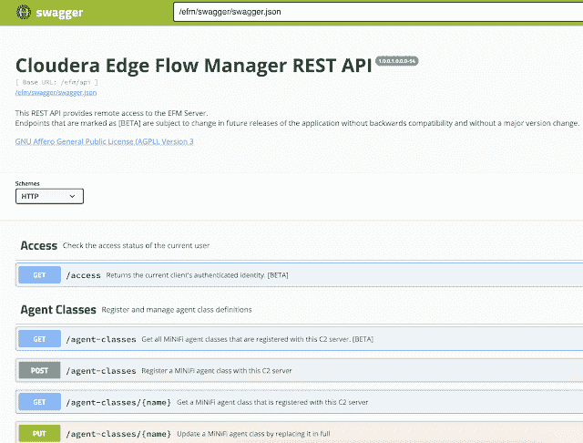](https://1.bp.blogspot.com/-rUedK4S84hA/XXfKSKeuc7I/AAAAAAAAYXY/PUHRxblRpkALRoTTQgxvkpusmKCT7O_kQCLcBGAs/s1600/efmSwagger.png)

让我们检查来自设备的 MQTT 消息

[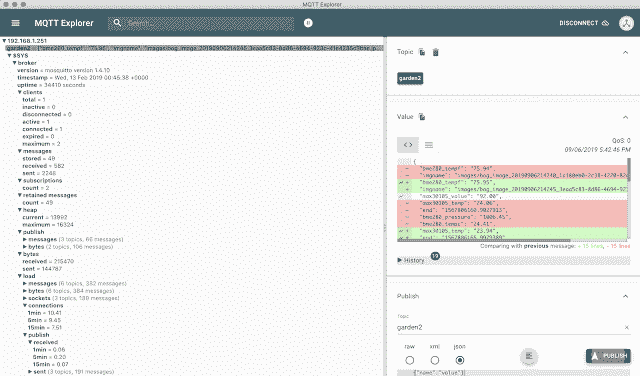](https://1.bp.blogspot.com/-Wpupc3pTCoU/XXfKS_pX1aI/AAAAAAAAYXk/BGnVEOrxvvE5nMAuNkh4TvSzkrKyOfl-QCLcBGAs/s1600/mqttExploration.png)

如你所见，我们遵循 Hadoop 理念，即保持事物的开放性、可扩展性、模块化、灵活性、透明性和可组合性，使用开放数据标准、开源、多样化和云友好。通过这种方式，我们可以随时满足用户的需求，适应任何环境、任何数据、任何云。如果我们需要窗口，我们可以很容易地添加风暴或弗林克。对于其他流用例，我们可以根据需要将我们的 Kafka 主题连接到 Spark 结构化流或 Kafka 流进行额外处理。我们可以在我们的企业、我们的生态系统或世界范围内将我们的公共模式作为开放数据标准从我们的模式注册中心公开。数据是为了共享和利用来构建知识。让我们实现它，从任何边缘到任何数据存储，到任何数据云，到任何 AI / ML / DS / DL 模型。

**来源:**

【https://github.com/tspannhw/breakoutgardenhat-spi-minifi】T4

**资源**:

**突围花园帽**

[https://github.com/pimoroni/bmp280-python](https://github.com/pimoroni/bmp280-python)

[https://github.com/pimoroni/breakout-garden](https://github.com/pimoroni/breakout-garden)

[https://shop . pimoroni . com/products/BMP 280-breakout-temperature-pressure-altitude-sensor](https://shop.pimoroni.com/products/bmp280-breakout-temperature-pressure-altitude-sensor)

[https://shop.pimoroni.com/products/breakout-garden-hat](https://shop.pimoroni.com/products/breakout-garden-hat)

[https://shop . pimoroni . com/products/breakout-garden-hat-I2C-SPI](https://shop.pimoroni.com/products/breakout-garden-hat-i2c-spi)
T3】https://github . com/pimoroni/breakout-garden/tree/master/examples/heart beat

[https://shop . pimoroni . com/products/0-96-SPI-colour-LCD-160 X80-breakout](https://shop.pimoroni.com/products/0-96-spi-colour-lcd-160x80-breakout)

[https://shop . pimoroni . com/products/max 30105-breakout-心率-血氧计-烟雾-传感器](https://shop.pimoroni.com/products/max30105-breakout-heart-rate-oximeter-smoke-sensor)

[https://github.com/pimoroni/max30105-python](https://github.com/pimoroni/max30105-python)

[https://github.com/tspannhw/minifi-breakoutgarden](https://github.com/tspannhw/minifi-breakoutgarden)

使用不同配置的突破花园传感器

[https://Community . cloud era . com/t5/Community-Articles/IoT-Series-Sensors-Utilizing-Breakout-Garden-Hat-Part-1/ta-p/249262](https://community.cloudera.com/t5/Community-Articles/IoT-Series-Sensors-Utilizing-Breakout-Garden-Hat-Part-1/ta-p/249262)

**tensorlow**

[【https://github . com/tensorlow/examples/blob/master/lite/examples/image _ class ification/raspberry _ pi/readme . MD](https://github.com/tensorflow/examples/blob/master/lite/examples/image_classification/raspberry_pi/README.md) [https://www . tensorlow . org/](https://www.tensorflow.org/lite/guide/python)

sudo apt-get install lib atlas-base-dev

wget[https://dl . Google . com/coral/python/TF lite \ _ runtime-1 . 14 . 0-cp35-cp35m-Linux \ _ arm V7 l . whl](https://dl.google.com/coral/python/tflite%5C_runtime-1.14.0-cp35-cp35m-linux%5C_armv7l.whl)
T5】pip 3 install TF lite _ runtime-1 . 14 . 0-cp35-cp35m-Linux _ arm V7 l . whl