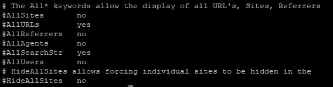
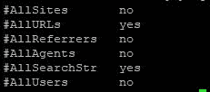
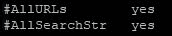

# 用 Grep 和 Regex 搜索你的文件

> 原文:[https://dev . to/scal yr/search-your-files-with-grep-and-regex-1gnj](https://dev.to/scalyr/search-your-files-with-grep-and-regex-1gnj)

要理解 grep 正则表达式组合，先问自己一个问题。你如何搜索一个文件？从表面上看，这似乎是一个愚蠢的问题。

但对许多人来说，介于常识性答案之间(“双击它，开始阅读！”)和高度技术性的(“命令行文本 grep regex”)存在一系列有趣的问题。

*   这个文件在哪里？
*   是什么样的文件？
*   文件有多大？
*   你到底在文件里找什么？

今天，我们将看看搜索文件的最通用的方法之一:使用 [grep](https://www.gnu.org/software/grep/manual/grep.html) 和 [regex(正则表达式的缩写)](https://en.wikipedia.org/wiki/Regular_expression)。

### 学习 Grep 和 Regex 教你一个强大的搜索技术

使用这种工具组合，您可以搜索任何种类和大小的文件。你也可以在极其有限的环境中搜索，如果你有创意，你可以找到任何东西。

但是随着这种多样性而来的是一点学习曲线。

因此，让我们来看看如何摆脱这种情况，让您熟悉这种文件搜索技术。为此，我将通过一个假设的例子来尝试提取一些信息。

当你读完之后，你会理解足够的基础知识来用 grep-regex 搜索你的文件。

[T2】](https://res.cloudinary.com/practicaldev/image/fetch/s--7zZpI83a--/c_limit%2Cf_auto%2Cfl_progressive%2Cq_auto%2Cw_880/https://library.scalyr.com/2018/07/19175307/Magnifying-Glass-Over-Search-Screen.png)

### 什么是 Grep？高度的理解

Grep(实际上是“grep”——不要大写)是一个起源于 Unix 世界的命令行实用程序。此后，它进入了 Linux 机器，甚至[进入了 Windows 世界](https://stackoverflow.com/questions/87350/what-are-good-grep-tools-for-windows)。

它是做什么的？很简单。Grep 帮助你搜索文件，寻找模式。

这是一个模板。

```
 grep [-options] pattern [filename]
```

因此，基本上，在命令行提示符下，如果您想在“cars.txt”文件中搜索文本“ford ”,您可以键入“grep Ford cars . txt”。grep 实用程序会在控制台中打印任何匹配的行，供您查看。

*-options* 标签就是这样:它让您提供一些选项。例如，您可以告诉 grep 忽略字符的大小写，或者将结果放入一个新文件中。

这就是 grep 的全部内容。它的美在于它的简单和它给你做事的力量。

### Regex 是什么意思？

说到权力，我们来说说 regex。

正如我前面提到的，这个术语实际上是“正则表达式”，但它在程序员世界中是一个如此普遍的术语，以至于它赢得了一个昵称。我认为 regex 还没有完全成为英语词典，但是程序员知道你的意思。

您会发现程序员对 regex 又爱又恨——就像，有些程序员喜欢它们，有些讨厌它们。

人们喜欢正则表达式，因为它赋予了用户强大的功能。其他人讨厌他们的不可理解性和他们制造的混乱。[T2】](https://res.cloudinary.com/practicaldev/image/fetch/s--aQhxmIJP--/c_limit%2Cf_auto%2Cfl_progressive%2Cq_auto%2Cw_880/https://library.scalyr.com/2018/07/19175308/Pull-quote-programmers-have-a-love-hate-relationship-with-regex-300x200.png)

### 好吧，那到底是什么？

和 grep 一样，足够简单。正则表达式是表示模式的字符序列，它们指示正则表达式解析器如何搜索文本和匹配模式。

想出这个概念的一个更简单的版本:[通配符](https://apus.libanswers.com/faq/2235)。通配符允许您在字典中输入一个搜索，比如“d*g”，并接收包括“dog”、“dig”和“dug”的结果

```
d*g => {dig, dog, dug}
```

Regex 将此提升到了一个全新的水平。

您可以使用它们进行简单的匹配和通配符搜索。例如，表达式“d.*g”与我的通配符示例所表达的意思相同:匹配以 d 开头、以 g 结尾并且中间有填充符的单词。

但是你也可以变得更复杂。一个*地段*更复杂。

```
^(19|20)\d\d[- /.](0[1-9]|1[012])[- /.](0[1-9]|[12][0-9]|3[01])$
```

想猜猜这是干什么的吗？它匹配从 1900 年到 2099 年的 yyyy-mm-dd 格式的日期。我是说，很明显，对吧？

正是这种复杂性让编程界爱恨交加。

只用 64 个字符表达日期的验证逻辑是非常强大的。但是如果没有大量的学习和记忆，祝你好运理解它们。它们很难读懂。

### Grep:一个简单实用的例子

到目前为止，您可能已经将 grep-regex 等式与其价值主张放在了一起。

*   Grep 允许您从命令行搜索文件，
*   regex 允许你做一些真正令人生畏的事情。

但是让我们先走后跑，看看一个只用 grep 的例子。

[](https://res.cloudinary.com/practicaldev/image/fetch/s--KB38szPF--/c_limit%2Cf_auto%2Cfl_progressive%2Cq_auto%2Cw_880/https://library.scalyr.com/2017/12/08095421/You-have-a-more-powerful-option.png) 很多使用 Apache 的托管解决方案都有一个叫做[web lizer](https://en.wikipedia.org/wiki/Webalizer)的功能。它提供了一种非常特殊的[日志聚合](https://www.scalyr.com/blog/what-is-log-aggregation-and-how-does-it-help-you/)，但是这个例子并不感兴趣。

相反，我们对它的配置文件 webalizer.conf 感兴趣。对于这个例子，我想登录到我的托管 web 服务器，并弄清楚一些关于我的配置的事情。

很多人默认会在文本编辑器中打开一个文件，四处查看和搜索。但是回想一下我在帖子开头提到的限制。

*   该文件驻留在一个服务器上，在那里我只能进行有限的 SSH 访问，并且不能使用图形文本编辑器。
*   我不知道里面到底有什么，据我所知，它可能真的很大。
*   我可能需要调整我的搜索。

因为这些限制，我选择了 grep。

我知道我可以从命令行使用它来搜索文件。现在，假设谷歌搜索某个问题，告诉我需要检查一系列以“All”开头的设置，但我真的不知道它们在文件中的什么位置。

Grep 来救援。

```
grep All webalizer.conf
```

[T2】](https://res.cloudinary.com/practicaldev/image/fetch/s--c_UZgPIW--/c_limit%2Cf_auto%2Cfl_progressive%2Cq_auto%2Cw_880/https://library.scalyr.com/2018/07/19175308/Grep1.jpg)

这很好，但是我真的不在乎那些评论或者“隐藏地点”，所以我稍微修改了一下。

```
grep "#All" webalizer.conf
```

(引号是因为我也想搜索特殊字符“#”)

[T2】](https://res.cloudinary.com/practicaldev/image/fetch/s--o81EwCxG--/c_limit%2Cf_auto%2Cfl_progressive%2Cq_auto%2Cw_880/https://library.scalyr.com/2018/07/19175308/grep2.jpg)

非常方便！现在我只看到我直接感兴趣的线条。

### Grep 正则表达式:一个简单实用的例子

好了，现在我们有进展了。我已经得到了我想要的设置。我还可以看到，我的问题可能源于这样一个事实，即设置没有启用，凭借“#”注释掉它们。

但是，假设对于这个假设的例子，我想深入一点。我们还假设文件大了很多，有了更多的匹配，所以简单地打开它并寻找这些行是不可行的。

如果我想把范围缩小到只有“是”的条目呢？

哼。

我已经基本达到了简单搜索的极限。不仅在#All 和 yes/no 之间有不确定的文本，而且还有数量可变的空格。让我们进一步说，我只对“是”的存在感兴趣，而不是“否”或假设的空白。

我该怎么做？

嗯，我已经准备好**开始使用 regex** 。(我还会用[这个工具](https://regexr.com/)测试它们，因为 regex 很难用*。让我们看看这个会发生什么。*

```
grep "#All.*yes" webalizer.conf
```

[T2】](https://res.cloudinary.com/practicaldev/image/fetch/s--gPXhBA_c--/c_limit%2Cf_auto%2Cfl_progressive%2Cq_auto%2Cw_880/https://library.scalyr.com/2018/07/19175309/grep3.jpg)

成功！

现在，我们已经将范围缩小到我们想要处理的项目，但是这些项目被注释掉了。

如你所见，这是非常强大的。我只是触及了表面，深入研究 grep(和*特别是【regex)将使我们远远超出这篇文章的范围。但是，即使只访问命令行，而不打开文件，您也可以执行非常复杂的搜索来锁定问题。*

### 一些附加的 Grep/Regex 示例

在结束之前，我会给你一些额外的、快速的例子来帮助你进一步理解这个想法。

*   grep "^#All" webalizer.conf 搜索任何行首带有" #All "的行。
*   grep "yes$l" webalizer.conf 搜索任何以" yes "结尾的行。
*   grep“^$”webalizer . conf 将查看 web alizer 是否有任何空行。
*   grep "[0-9]\ { 3 \ }-[0-9]\ { 4 \ } " contacts.txt 在 contacts . txt 中搜索电话号码。
*   grep "home|mobile" contacts.txt 搜索任何包含单词" home "或单词" mobile "的线路。

希望这些例子能让你了解这些类型的搜索是多么的通用。这并不是为了全面，而是为了帮助你了解你可能会做的事情。

### Grep 和 Regex:知道什么时候说什么时候

[](https://res.cloudinary.com/practicaldev/image/fetch/s--hjRFCSjg--/c_limit%2Cf_auto%2Cfl_progressive%2Cq_auto%2Cw_880/https://library.scalyr.com/2018/07/19175309/Pull-quote-you-can-perform-remarkably-sophisticated-searches-to-zero-in-on-issues-300x234.png) 我将以一点哲学建议来结束我的演讲。当你学会使用这些工具时，你会发现自己能够做一些真正酷的事情。他们会帮助你解决问题，提高工作效率。

但是不要因为树木而让自己看不见森林。

在紧要关头(就像我假设的那样)，你需要登录到一个服务器，钻取一些配置文件，并在其中找到一些东西，这很棒。如果你发现自己每天都在做类似的事情，你可能会问自己为什么。

如果这就是你的生活——在数不清的海量文件(例如日志文件)中搜索和重新索引，那么你可能有更好的选择供你支配。

Grep 和 regex 非常强大，但是专门用于自动获取、解析和分析常见文件类型的工具也非常强大。

而且，由于我们都在从事自动化的工作，如果您发现自己经常在各种文件中使用 grep 和 regex，您可能会问自己，是否有一种方法可以自动化您正在做的事情。