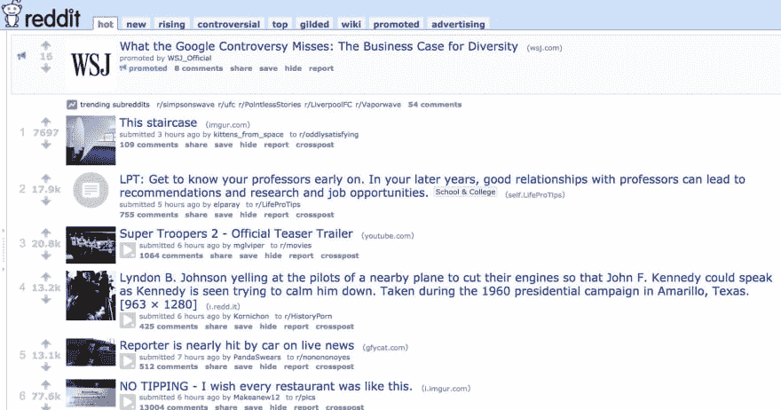

# 我是如何跌跌撞撞地进入远程工作，并且永不回头的

> 原文：<https://dev.to/coda/how-i-stumbled-into-remote-work-and-never-looked-back-51c4>

我从未想过我会成为一名远程工作者。我在 90 年代长大，我看到我的父亲带着他的公文包去上班，每天差不多在同一时间回家。他一回到家，就再也不谈“工作”了。我以为在一个你称之为“工作”的地方打卡上下班是常态，这将是我大学毕业后的生活。我从来不认为这种工作是“好”或“坏”，这只是当时的情况。

我想反思我是如何成为一名远程工作者的，以及我是如何看不到以其他方式“工作”的。

## 在走廊地板上更新电子表格

<figure>

<figcaption>Source: Akitas Mexico</figcaption>

</figure>

我的职业生涯始于一名金融分析师，我记得去纽约玩了几天，只是因为我想看看几个朋友。我的团队在旧金山，所以我仍然必须在西海岸工作。我住在一个朋友家，仍然清晰地记得晚上 11 点坐在他们狭窄的公寓走廊上更新一个需要上传到 Oracle 服务器的电子表格。

那时候(~2008 年)，笔记本电脑不一定有内置的 Wi-Fi 组件，所以我有这个 u 盘，可以接收 Wi-Fi 或接入我的团队的数据计划。当然，更新速度非常慢，我只是坐在那里等待电子表格中的更改上传到服务器。在那一刻，我意识到我的“工作”只是在到期日(月末结账)之前更新数据库。我在哪里或如何做并不重要，只要完成了，对我的团队和公司来说这才是最重要的。

## 自行车和豆包

<figure>

<figcaption>Source: Wikimedia Commons</figcaption>

</figure>

我有幸工作的公司是谷歌。谷歌的室内设计与大多数公司不同。从小吃厨房到公共空间的一切都被有趣地设计，使工作场所成为一个真正有趣的工作场所。公共空间将会摆满椅子、沙发和豆袋。

我在谷歌的第一年，我看到人们只是躺在这些豆袋上，在他们的电脑上工作。起初，我认为这是疯狂的。为什么这些员工不在他们的办公桌前？他们的老板不会因为没有和下属“见面时间”而抓狂吗？这就是文化，只要工作完成，员工可以在他们觉得舒服的任何地方工作。

位于山景城的总部是一个由建筑物组成的庞大校园。如果你在校园的另一边开会，你将不得不安排 10-15 分钟乘班车到校园的另一边，或者跳上一辆自行车，把你的笔记本电脑放在自行车前面的小篮子里。对于是否应该亲自参加会议以节省“通勤”时间，我会随机应变，但我可以很容易地从其他会议室或从我的笔记本电脑(当然是坐在豆袋上)用 Google Hangouts 拨号参加会议。我获得了工作所需的所有信息，并节省了 20-30 分钟的通勤时间。

## 挠创业之痒

在我开始追求自己的创业并从事自由职业后，我发现自己在咖啡店、公共图书馆和我的公寓之间徘徊。我意识到只要旅馆或公寓有网络，我也可以旅行和完成工作。这段职业生涯中最精彩的部分是，我发现了 3 项至今仍对我有帮助的技能:

1.  如何数字化学习
2.  如何进行数字交流
3.  如何编写合适的文档

我开始参加在线课程，学习网络开发的快速技巧。我学到了在网上论坛发帖和写博客的一些细微差别。随着我公司规模的扩大，我专注于编写良好的文档来概述我们的流程和系统。每当有一个问题需要解决时，我会立即想到用数字方式解决问题。我认为这是独立生活的最大好处之一:当你把事情搞砸的时候，学会在没有公司支持的情况下解决问题。我必须要有斗志和成本效益，最好的方法是尽可能多地使用网上资源。

## 培养远程工作技能

<figure>

<figcaption>Source: yonder.io</figcaption>

</figure>

尽管所有的趋势都指向越来越多的公司转向远程工作，但总会有人需要每天去实体办公室，与同事和管理层面对面交流。另一方面，你的个人环境可能会迫使你成为一名远程工作者，因为你没有选择，所以你必须尽可能地发展这些技能。以下是我获得成为一名可靠的远程工作者的技巧:

### 1。观察其他公司的员工

<figure>

<figcaption>Source: nreionline</figcaption>

</figure>

就像我最初在谷歌看到人们做豆包的经历一样，看到其他公司如何与远程工作人员一起工作可以拓宽你的视野，让你知道什么样的安排是可能的。一个简单的方法是要求参观我们的工作场所，并询问一些人他们是如何完成工作的。他们用什么工具？他们如何参加会议？

### 2。加入与你的行业相关的在线社区

<figure>

<figcaption>Source: USA Today</figcaption>

</figure>

我曾经认为在线社区和论坛只是为你试图解决的问题寻找答案的地方(仍然是一个很好的资源！).你如何建立一个脸书广告活动？你如何设置你的 Shopify 商店？这些都是你可能会问并得到答案的常见问题。但是一旦你远离了，这些社区中的个体*在某种程度上就成了你的同事。除了为一些深奥的问题寻找答案，在线社区还能拓展你对工作的思考，给你一个与他人交流的机会(尽管是数字化的)。如果你想获得更多远程工作的技巧，LinkedIn 上的[数字游牧者](https://www.linkedin.com/groups/13657237/)群是一个很好的起点。*

### 3。编写详细而全面的文档

<figure>

<figcaption>Sabeza HR</figcaption>

</figure>

如果你有同事，这可能是我优先考虑的第一技能。有多少次你在 Slack 上被问到类似这样的问题:“嘿 Bob，上传图片到我们 CMS 的流程是什么？”您可以很容易地对 Slack 做出响应，但这是不可伸缩的。创建一个文档或 wiki，详细说明保存图像、登录 CMS 和插入图像的过程，这意味着每个同事和未来的员工都有一个了解您的过程的真实来源。这项技能延伸到记录会议、决策、客户访谈等等。想想你使用的所有在线 SaaS 工具。每当你有一个关于某个东西如何工作的问题，你可以谷歌一下这个问题，最好的 SaaS 工具有很好的文档，给你一步一步的指导如何修复你的问题。

## 创造套路和一致性

 
我在其他公司(包括[我自己的](https://www.coda.io))看到的一个观察结果是，人们会在一个物理位置上班，然后戴上降噪耳机来完成他们的“工作”。我不打算就开放式工作空间展开全面的讨论，但是最近有很多关于进入[流状态](https://en.wikipedia.org/wiki/Flow_(psychology))或“区域”的讨论。这通常意味着沉浸在当前的任务中，工作时不被打扰。通过创造一个让你可以长时间不间断工作的环境，你可以更加一致地有效完成工作。

我仍然喜欢去我的办公室(一个共同工作的空间)，有一张我可以称之为自己的桌子，以及我在办公室周围的午餐地点。在需要每天去办公室面对面交流的一端，以及作为一个真正的流浪者，你的位置每天/每周都在变化的另一端，我会落在光谱的中间和完全流浪者的极端之间。我无法想象需要每天去办公室见面，也无法想象自己每天都在旅行，不知道互联网是否稳定，无法完成工作，也不知道在哪里可以吃午餐。我发现，在享受远程工作的好处的同时，我仍然可以获得最大的产出。