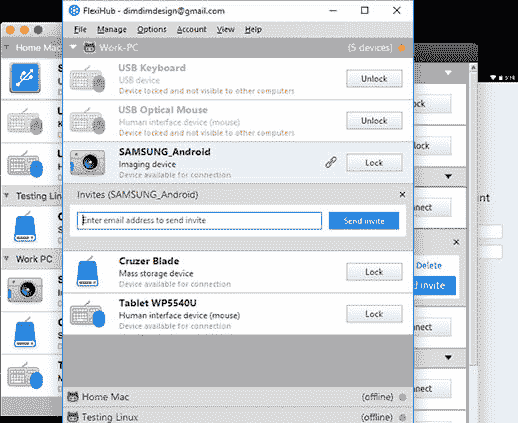

# RS232 延长线已经用电缆接过去了。

> 原文:[https://dev . to/Oscar 37921395/RS232-带线缆的扩展器-已在过去-18d3](https://dev.to/oscar37921395/rs232-extender-with-cable-already-in-the-past-18d3)

 
RS232 扩展器软件解决方案旨在通过互联网(局域网或以太网)重定向串行设备，使其同时可供多个远程用户使用。这个 [FlexiHub](https://www.flexihub.com/rs232-extender-software/) over IP 的一个显著特点是它的界面非常简单直观。只需点击几下鼠标，就可以在任何距离拆分 COM 外设。