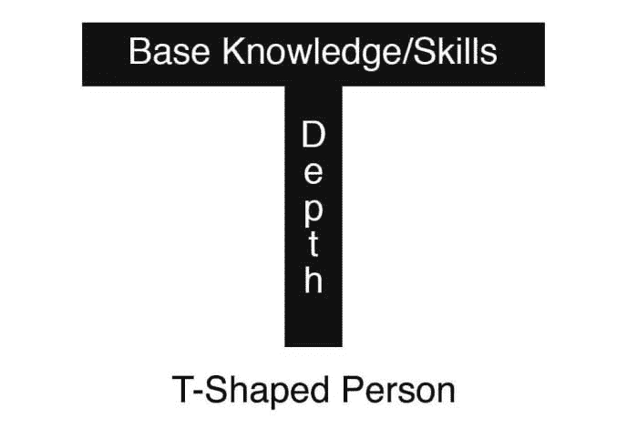
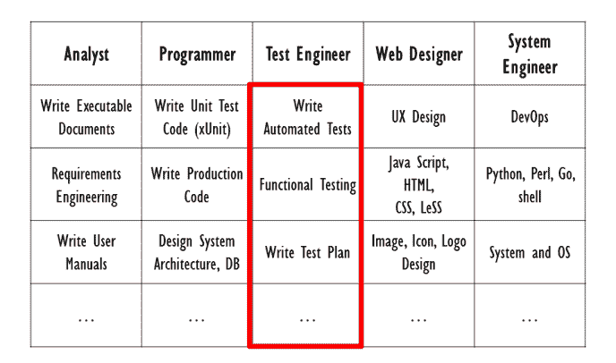

# 什么是 T 型开发人员(以及为什么你应该成为一名 T 型开发人员)

> 原文:[https://dev . to/davidmm 1707/what-it-a-a-t-shaped-developer-and-why-you-should-one-2pci](https://dev.to/davidmm1707/what-it-is-a-t-shaped-developer-and-why-you-should-be-one-2pci)

原帖:[什么是 T 型开发人员(以及为什么你应该成为一名 T 型开发人员)](https://letslearnabout.net/blog/what-it-is-a-t-shaped-developer-and-why-you-should-be-one/)

# 什么是 T 型开发人员(以及为什么你应该成为一名 T 型开发人员)

[T2】](https://res.cloudinary.com/practicaldev/image/fetch/s--E3jfjIli--/c_limit%2Cf_auto%2Cfl_progressive%2Cq_auto%2Cw_880/https://i0.wp.com/collegeinfogeek.com/wp-content/uploads/2017/10/Illustration-of-T-Shaped-Concept.jpg%3Fw%3D688%26ssl%3D1)

全栈、前端、后端、专家、百事通……你几乎每天都会听到它们。但是什么是 T 型显影剂呢？

在这里，我将解释什么是 T 型开发人员，但更重要的是:为什么你应该是一个，以及如何。

* * *

### 什么是 T 形显影剂

传统上，组织更喜欢 I 型开发人员:这是一种对某个领域的专业知识有深入了解的专家。

[T2】](https://res.cloudinary.com/practicaldev/image/fetch/s--ZJUWc2WV--/c_limit%2Cf_auto%2Cfl_progressive%2Cq_auto%2Cw_880/https://i2.wp.com/d262ilb51hltx0.cloudfront.net/max/960/1%2A2sDJV6aBGxFC1AxMiYWyuA.png%3Fw%3D688%26ssl%3D1)

那些被称为 I 型开发人员的开发人员，虽然在他们的知识领域是专家并且非常有效率，但是他们有一个问题:在他们的堆栈之外的任何东西都是无人区。

后端开发人员不明白如何做好 UX/用户界面，前端开发人员不能解决部署问题。

每个开发人员都有一套非常严格的技能。

但是后来组织注意到了这一点，用 T 型开发人员模型解决了这个问题。

[T2】](https://res.cloudinary.com/practicaldev/image/fetch/s--_Yqh7Tb5--/c_limit%2Cf_auto%2Cfl_progressive%2Cq_auto%2Cw_880/https://i1.wp.com/aelogica.com/wp-content/uploads/2018/10/tshaped-skillset.png%3Fw%3D688%26ssl%3D1)

现在，除了有一个深入自己领域的专业领域，他们还拥有其他专业领域的广泛知识。

在这种情况下，一个测试人员知道执行工作所必须知道的一切，但是也理解 UX 设计，能够创建单元测试，能够执行基本的 DevOps 操作，等等。

但是…为什么雇主想要 T 型的开发者？

* * *

### 为什么要成为 T 型开发人员

[T2】](https://res.cloudinary.com/practicaldev/image/fetch/s--19K9gYKR--/c_limit%2Cf_auto%2Cfl_progressive%2Cq_auto%2Cw_880/https://encrypted-tbn0.gstatic.com/images%3Fq%3Dtbn:ANd9GcRWOjI3TpmdYpllH3p1unyvsN9FJQ8G6C_k7IhVJSuAgccSxA9I)

成为一名多技能开发人员有很多好处:

*   **更全面的开发人员:** T 型开发人员有自己的专长，通常是前端、后端、DevOps，甚至是 MERN/MEAN/MEVN 等技术堆栈。但是他们也乐于做自己范围之外的工作。
*   **可以无处不在**:一个 T 型的开发人员可以为项目的每一部分做出贡献。你可以有一个小团队，每个成员都有更多的责任，因为他们可以涵盖广泛的技能。
*   **了解其他开发人员**:由于他们拥有广泛的技能，他们知道每个领域的基础知识，可以更好地与其他开发人员互动:他们知道如何询问他们想要什么，了解他们任务的难度，并知道对他们有什么期望。
*   **虚心:**一个不怕[学习](https://letslearnabout.net/blog/learning-how-to-learn/)任何新事物的开发者对[雇主](https://medium.com/mop-developers/we-need-t-shaped-full-stack-developers-4c62c9d757a0)来说都是一笔宝贵的财富。
*   **可以覆盖其他开发者:**后端开发者休假一周或者生病了怎么办？这个项目应该停止直到下次再来吗？一个 T 型开发团队可以在后端开发人员应该在的地方工作。

* * *

### 如何成为一体

[T2】](https://res.cloudinary.com/practicaldev/image/fetch/s--zjv8Nrtm--/c_limit%2Cf_auto%2Cfl_progressive%2Cq_auto%2Cw_880/https://i0.wp.com/storage.needpix.com/rsynced_images/together-2643652_1280.jpg%3Fw%3D688%26ssl%3D1)

你现在应该被说服了(我希望！)并希望成为其中一员。想知道怎么做吗？

*   学习你专业领域之外的东西:这可以让你在保持专业领域的同时，在不同领域提高和拓展你的技能。学习其他领域的基础知识。它们很容易被采摘。
*   **慢慢来:**T 型身材不是一个周末参加 Udemy 课程就能实现的简单任务。这需要时间。几年。保持开放的心态，扩大知识面。继续成长。
*   **同理心:**为了加快每个团队成员的学习速度，你需要创造一个安全、协作的环境，让知识能够流动。理解别人在他们的舒适区之外，要有耐心。

* * *

### 结论

成为 T 型很重要，因为你可以适应其他角色，还因为你可以更好地与队友沟通，了解他们的需求和工作方式，以及如何互相帮助。

要做到这一点，你需要超越自己的极限，学习你专业知识范围之外的东西。当然还有时间。

在那之后，你将成为你的组织的一个重要部分，更重要的是:一个全面的开发人员，了解项目过程的每一个部分。

你呢？你是什么样的开发者？

* * *

[我的 Youtube 教程视频](https://www.youtube.com/channel/UC9OLm6YFRzr4yjlw4xNWYvg?sub_confirmation=1)

[在 Twitter 上联系我](https://twitter.com/DavidMM1707)

学习[如何变得更有效率](https://letslearnabout.net/blog/how-i-became-three-times-more-productive/)