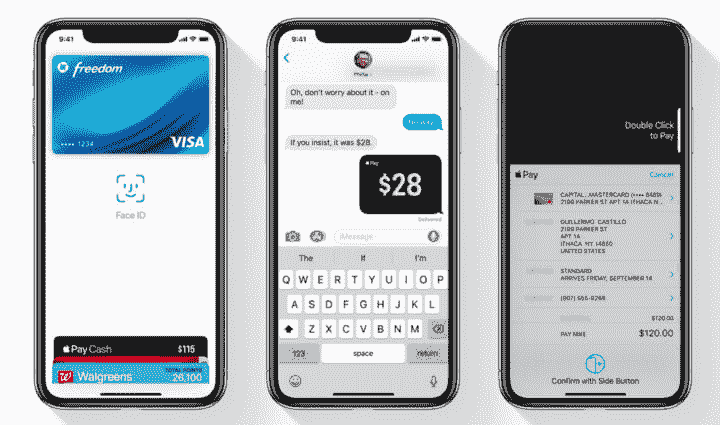
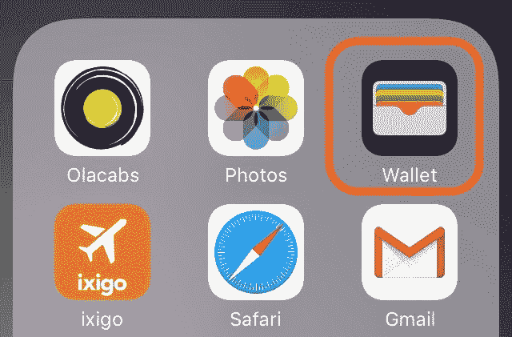
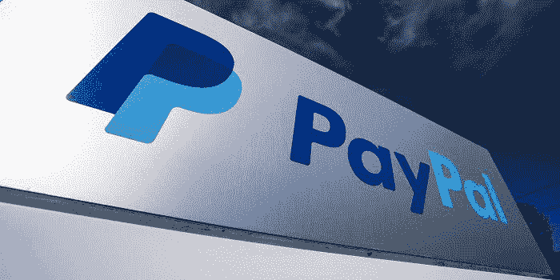
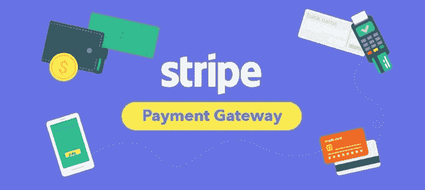
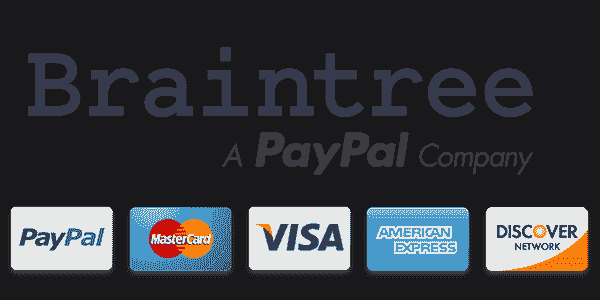

# Ionic 4 中的支付网关解决方案——Paypal、Apple Pay、Stripe 等

> 原文:[https://dev . to/enappd/payment-gateway-solutions-in-ional-4-paypal-apple-pay-stripe-and-others-413 a](https://dev.to/enappd/payment-gateway-solutions-in-ionic-4-paypal-apple-pay-stripe-and-others-413a)

* * *

> 一个可靠的支付插件是通过你的应用程序销售你的产品或服务不可或缺的。Ionic 支付插件有几个不同的特性和功能。您需要选择一个最适合您的业务需求，并与您的网站无缝集成。让我们来看看你可以在应用上使用的最好的 Ionic 支付插件:

### 1.Apple Pay



<figure>

<figcaption class="imageCaption">Apple Pay</figcaption>

</figure>

Apple Pay 是苹果公司的一项移动支付和数字钱包服务，允许用户亲自在 iOS 应用程序和网络上进行支付。这项服务在 iPhone 6 和新款机型、iPad Air 2 和新款机型、装有触控 ID 的 MAC 电脑以及所有苹果手表上都受支持。拥有 iPhone 5 和 5C 的用户可以通过 Apple Watch 使用这项服务。

要使用 **Apple Pay** ，你需要使用以下命令安装插件

```
ionic cordova plugin add cordova-plugin-applepay
```

```
npm install @ionic-native/apple-pay
```

安装插件后，您可以使用下面的代码段来实现**Apple Pay**(Ionic 4 的代码)

```
// import ApplePay in the component
import { ApplePay } from '@ionic-native/apple-pay/ngx'; 
```

```
constructor(private applePay: ApplePay) { } 
```

```
async applePay() {

  try {
    const applePayTransaction = await this.applePay.makePaymentRequest({
      items,
      shippingMethods,
      merchantIdentifier,
      currencyCode,
      countryCode,
      billingAddressRequirement: ['name', 'email', 'phone'],
      shippingAddressRequirement: 'none',
      shippingType: 'shipping'
    });
```

```
 const transactionStatus = await completeTransactionWithMerchant(applePayTransaction);
    await this.applePay.completeLastTransaction(transactionStatus);
  } catch {
    // handle payment request error
  }
```

```
}
```

要使用 **Apple Pay** 为 App store 发布构建应用，需要在 XCode `capabilities`标签中启用`Apple Pay`。你可以在这里找到更多细节


### 2.苹果钱包



**苹果钱包**是一款包含在 iOS 操作系统中的移动应用程序，允许用户通过 Apple Pay 存储*钱包通行证*，即优惠券、登机牌、学生证、活动门票、电影票、公共交通票、商店卡、(从 iOS 8.1 开始)信用卡、借记卡、预付卡和忠诚卡。

要添加**苹果钱包**插件，请使用以下命令

```
ionic cordova plugin add cordova-apple-wallet
```

```
npm install @ionic-native/apple-wallet
```

使用导入已安装的插件

```
import { AppleWallet } from '@ionic-native/apple-wallet/ngx';
```

检查**苹果钱包**是否可用

```
this.appleWallet.available()
 .then((status) => {
   // status is a boolean value, either true or false
   console.log("Is Apple Wallet available? ", status);
  })
 .catch((message) => {
   console.error("ERROR >> ", message);
 });
```

使用此方法开始添加卡

```
let data = {
      cardholderName: 'Test User',
      primaryAccountNumberSuffix: '1234',
      localizedDescription: 'Description of payment card',
      paymentNetwork: 'VISA'
    }
    AppleWallet.startAddPaymentPass(data)
    .then((res) => {
    /**
     * User proceed and successfully asked to add card to his wallet
     * Use the callback response JSON payload to complete addition process
     * Expect
     * res = {
     *   "certificateSubCA":"Base64 string represents certificateSubCA",
     *   "certificateLeaf":"Base64 string represents certificateLeaf"
     *   "nonce":"Base64 string represents nonce",
     *   "nonceSignature":"Base64 string represents nonceSignature",
     * }
     */
    })
    .catch((err) => {
      // Error or user cancelled.
    });
```

并完成卡片添加，从上面的函数中进行回调

```
let encryptedData = {
        activationData: "encoded Base64 activationData ",
        encryptedPassData: "encoded Base64 encryptedPassData ",
        wrappedKey: "encoded Base64 wrappedKey"
    }
    AppleWallet.completeAddPaymentPass(encryptedData)
    .then((res) => {
      // A success callback response means card has been added successfully
    })
    .catch((err) => {
      // Error and can not add the card
    });
```

更多信息，请查看苹果开发者文档，从[这里](https://developer.apple.com/documentation/passkit/pkaddpaymentpassviewcontrollerdelegate/1615915-addpaymentpassviewcontroller?language=objc)。

### 3.贝宝



> 有关 Ionic 4 中 Paypal 集成的详细信息，请阅读我们的博客— [IONIC 4 PAYPAL 集成](https://enappd.com/blog/ionic-4-paypal-payment-integration-for-apps-and-pwa/16/)

**PayPal Holdings，Inc.** 是一家经营全球在线支付系统的美国公司，该系统支持在线转账，并作为支票和汇票等传统纸质支付方式的电子替代方式。该公司作为在线供应商、拍卖网站和许多其他商业用户的支付处理器运营，为此它收取一定费用，以换取一键交易和密码记忆等好处。

Paypal 是最大、最受欢迎的移动和网络应用支付网关之一。好消息是——它可以用于 iOS 和 Android。要为 Ionic 安装 **Paypal** 插件，请使用

```
ionic cordova plugin add com.paypal.cordova.mobilesdk
```

```
npm install @ionic-native/paypal
```

使用以下方式将 **Paypal** 导入您的组件

```
import { PayPal, PayPalPayment, PayPalConfiguration } from '@ionic-native/paypal/ngx';
```

使用以下命令开始付款。您需要从您的 Paypal 帐户中提取`client_id`。([如何从 Paypal 账户获取我的凭证](https://developer.paypal.com/docs/integration/direct/webhooks/my-apps-and-credentials/))

```
this.payPal.init({
  PayPalEnvironmentProduction: 'YOUR_PRODUCTION_CLIENT_ID',
  PayPalEnvironmentSandbox: 'YOUR_SANDBOX_CLIENT_ID'
}).then(() => {
  // Environments: PayPalEnvironmentNoNetwork, PayPalEnvironmentSandbox, PayPalEnvironmentProduction
  this.payPal.prepareToRender('PayPalEnvironmentSandbox', new PayPalConfiguration({
    // Only needed if you get an "Internal Service Error" after PayPal login!
    //payPalShippingAddressOption: 2 // PayPalShippingAddressOptionPayPal
  })).then(() => {
    let payment = new PayPalPayment('3.33', 'USD', 'Description', 'sale');
    this.payPal.renderSinglePaymentUI(payment).then(() => {
      // Successfully paid
    }, () => {
      // Error or render dialog closed without being successful
    });
  }, () => {
    // Error in configuration
  });
}, () => {
  // Error in initialization, maybe PayPal isn't supported or something else
});
```

沙盒响应示例如下所示

```
// Example sandbox response

      {
        "client": {
          "environment": "sandbox",
          "product_name": "PayPal iOS SDK",
          "paypal_sdk_version": "2.16.0",
          "platform": "iOS"
        },
        "response_type": "payment",
        "response": {
          "id": "PAY-1AB23456CD789012EF34GHIJ",
          "state": "approved",
          "create_time": "2016-10-03T13:33:33Z",
          "intent": "sale"
        }
      }
```

> 有关 Ionic 4 中 Paypal 集成的详细信息，请阅读我们的博客— [IONIC 4 PAYPAL 集成](https://enappd.com/blog/ionic-4-paypal-payment-integration-for-apps-and-pwa/16/)

### 4.种类



> 有关 Ionic 4 中条纹集成的详细信息，请阅读我们的博客— [Ionic 4 条纹支付集成](https://medium.com/enappd/integrating-stripe-payment-in-ionic-4-for-apps-and-pwa-de05142c523e)

**Stripe** 是一家科技公司。其软件允许个人和企业通过互联网接收付款。Stripe 提供运营在线支付系统所需的技术、防欺诈和银行基础设施。

Stripe 是全球发展最快的支付解决方案。它正在迅速超越贝宝等的受欢迎程度。在移动和网络支付领域。

Stripe 可以在 iOS 和 Androi 上使用，也可以在 Ionic PWA 上使用！

使用以下命令安装**条带**

```
ionic cordova plugin add cordova-plugin-stripe
```

```
npm install @ionic-native/stripe
```

首先，我们需要在组件中设置我们的导入**条带**。然后从**条纹**账户设置我们的可发布密钥。这可以是您的测试或现场关键。

```
import { Stripe } from '@ionic-native/stripe/ngx';
```

```
constructor(private stripe: Stripe) { } 
```

```
this.stripe.setPublishableKey('my_publishable_key');
```

```
let card = {
 number: '4242424242424242',
 expMonth: 12,
 expYear: 2020,
 cvc: '220'
}
```

```
this.stripe.createCardToken(card)
   .then(token => console.log(token.id))
   .catch(error => console.error(error));
```

一旦我们从 Stripe 获得令牌，我们就可以在后端使用该令牌向客户收费。条带集成不需要 XCode 中的任何特殊功能。

### 5.布伦特里



Braintree 提供全球商务工具，人们需要这些工具来为他们的用户建立业务、接受支付和实现商务。这是一个被 PayPal 收购的支付处理器，它强调“简单、稳健的支付方式”，并具有类似嵌入式支付 UI 的功能。对于通过信用卡、PayPal、Venmo 和 Apple Pay 接受付款来说，这是一个不错的选择。

**Braintree** 插件可用于 Ionic 应用。该插件支持在 Android 和 iOS 上的 Ionic 应用程序中使用 **Braintree** 嵌入式支付 UI，使用每个平台的原生嵌入式 UI(不是 Javascript SDK)。

您可以使用安装 **Braintree** 插件

```
ionic cordova plugin add cordova-plugin-braintree
```

```
npm install @ionic-native/braintree
```

要使用它，你需要在组件中导入**布伦特里**。然后，您将需要从布伦特里仪表盘中调出布伦特里`Tokenization Key`。或者，您也可以使用客户端 ID 在服务器端生成此令牌，以便允许用户使用存储的支付方式。详见[布伦特里客户端令牌文档](https://developers.braintreepayments.com/reference/request/client-token/generate/node#customer_id)。

```
import { Braintree, ApplePayOptions, PaymentUIOptions } from '@ionic-native/braintree/ngx';
```

```
constructor(private braintree: Braintree) { } 
```

```
const BRAINTREE_TOKEN = '<YOUR_BRAINTREE_TOKEN>';
```

```
// NOTE: Do not provide this unless you have configured your Apple Developer account
// as well as your Braintree merchant account, otherwise the Braintree module will fail.
const appleOptions: ApplePayOptions = {
  merchantId: '<YOUR MERCHANT ID>',
  currency: 'USD',
  country: 'US'
}
```

```
const paymentOptions: PaymentUIOptions = {
  amount: '14.99',
  primaryDescription: 'Your product or service (per /item, /month, /week, etc)',
}
```

```
this.braintree.initialize(BRAINTREE_TOKEN)
  .then(() => this.braintree.setupApplePay(appleOptions))
  .then(() => this.braintree.presentDropInPaymentUI(paymentOptions))
  .then((result: PaymentUIResult) => {
    if (result.userCancelled) {
      console.log("User cancelled payment dialog.");
    } else {
      console.log("User successfully completed payment!");
      console.log("Payment Nonce: " + result.nonce);
      console.log("Payment Result.", result);
    }
  })
  .catch((error: string) => console.error(error));
```

### 6.支付宝


<figure>

<figcaption class="imageCaption">Selfie for payments</figcaption>

</figure>

支付宝是亚洲非常受欢迎的支付方式，也是阿里巴巴集团的一部分。这是一种支付方式，就像许多其他“电子钱包”服务一样，你可以将支付方式(卡或银行账户)添加到你的支付宝账户，然后可以使用它们处理订单。

要安装支付宝，请使用以下命令

```
ionic cordova plugin add cordova-plugin-gubnoi-alipay
```

```
npm install @ionic-native/alipay
```

然后我们需要在组件中导入**支付宝**。

```
import { Alipay } from '@ionic-native/alipay/ngx';
```

```
constructor(private alipay: Alipay) {
```

```
//alipayOrder is a string that has been generated and signed by the server side.
this.alipay.pay(alipayOrder)
   .then(result => {
      console.log(result); // Success
   })
   .catch(error => {
      console.log(error); // Failed
   });
}
```

更多详情可登陆—[https://docs.open.alipay.com/204/105465/](https://docs.open.alipay.com/204/105465/)

### 结论:

我们很快了解了市场上最受欢迎的支付解决方案。集成这些插件的主要代码片段分享在博客帖子中，以供参考。这会促进你的理解并节省时间。

*本博客最初发表于* [*Enappd*](https://enappd.com/blog/) *。*

### 觉得这个帖子有意思？

还可以看看我们的其他博客文章，包括与 Ionic 4 中的[Firebase](https://medium.com/enappd/how-to-use-firebase-with-ionic-4-complete-guide-for-beginners-1888b1034024)、Ionic 4 中的[地理定位](https://medium.com/enappd/using-geolocation-and-beacon-plugins-in-ionic-4-754b41304007)、Ionic 4 中的[二维码和扫描仪](https://medium.com/enappd/qr-code-scanning-and-optical-character-recognition-ocr-in-ionic-4-95fd46be91dd)以及 Ionic 4 中的[支付网关](https://medium.com/enappd/payment-solutions-in-ionic-8c4bb28ce5cc)

也可以看看这个有趣的帖子[如何用 Phaser](https://medium.com/enappd/how-to-create-mobile-games-pwa-with-ionic4-and-phaser-7fb1e917678e) 在 Ionic 4 中创建游戏

### 需要免费离子 4 启动器？

你也可以在我们的网站[enappd.com](http://enappd.com)找到免费的离子 4 启动器

*   【Ionic 4 的免费聊天主题启动器
*   [游离离子 4 —燃烧基启动器](https://store.enappd.com/product/ionic4-firebase-starter/)

你也可以使用 [Ionic 4 完整版应用](https://store.enappd.com/product/ionic-4-full-app/)制作你的下一个精彩应用

### 参考

*   [离子文件](https://ionicframework.com/docs)