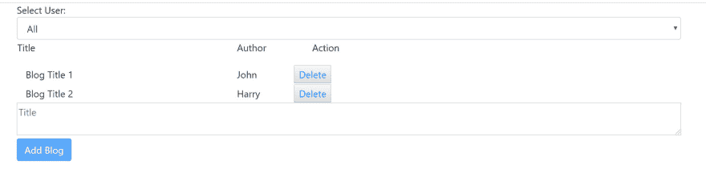

# 用 Angular 8 和 Akita 进行状态管理

> 原文:[https://dev . to/Raj virtual/state-management-with-angular-8 and-akita-507 e](https://dev.to/rajvirtual/state-management-with-angular-8-and-akita-507e)

早在 2017 年，我写了一篇文章，在这里使用 NgRx[](https://medium.com/front-end-weekly/an-intro-to-ngrx-effects-ngrx-store-with-angular-4-c55c4d1d5baf)**构建了一个简单的博客应用。最近我一直在用 [**秋田**](https://github.com/datorama/akita/) 做实验，这是一种状态管理模式，我发现它更简单，样板代码更少。所以我决定用 Akita 重写我的示例应用程序，并希望与您分享代码。**

 ****后端服务器设置**

让我们用 [**json-server**](https://github.com/typicode/json-server) 来模拟我们的后端服务器。json-server 帮助我们为 CRUD 操作设置一个本地开发服务器。让我们从安装 json-server 开始。

`npm install -g json-server`

我们还将创建一个名为 db.json 的 JSON 文件，并为博客和作者添加一些示例条目，如下所示。

```
{
  "blogs": [
    {
      "title": "Blog Title 1",
      "author": "John",
      "id": 1
    },
    {
      "title": "Blog Title 2",
      "author": "Harry",
      "id": 2
    }
  ],
  "authors": [
    {
   "id":1,
      "name": "All"
    },
    {
   "id":2,
      "name": "John"
    },
    {
   "id":3,
      "name": "Harry"
    },
    {
   "id":4,
      "name": "Jane"
    }
  ]
} 
```

让我们通过运行命令
来启动 JSON 服务器

`json-server --watch db.json`

这将在您的计算机端口 3000 上设置一个本地主机服务器。您应该能够导航到[http://localhost:3000/authors](http://localhost:3000/authors)并看到所有的作者。

**博客**

首先，我们需要从服务器返回一个博客列表。让我们在 models 文件夹下添加一个新文件 blog.ts。

```
import { ID } from '@datorama/akita';

export interface Blog {
    id: ID;
    title: string;
    author: string;
} 
```

**博客商店**

接下来，我们创建一个博客存储，这是博客状态将要被存储的地方。在我们的示例应用程序中，我们必须拥有一个博客数组，并使用一个过滤函数根据所选作者过滤博客。这些是我们将在商店中展示的一些状态。可以类似于数据库中的表来查看存储。

```
import { EntityState, EntityStore, StoreConfig } from '@datorama/akita';
import { Blog } from '../models/blog';
import { Injectable } from '@angular/core';

export interface BlogState extends EntityState<Blog> { }

@Injectable({
    providedIn: 'root'
})
@StoreConfig({ name: 'blogs' })
export class BlogStore extends EntityStore<BlogState, Blog> {

} 
```

我们还需要一个过滤器存储来保存过滤器状态，初始值设置为“All”。

```
export interface FilterState extends EntityState<string> {
    authorFilter: {
        filter: string;
    };
}

const initialState = {
    authorFilter: {
        filter: 'All'
    }
};

@Injectable({
    providedIn: 'root'
})
@StoreConfig({ name: 'filter' })
export class FilterStore extends EntityStore<FilterState, string> {
    constructor() {
        super(initialState);
    }
} 
```

**博客查询**

我们需要一种从存储中查询实体的机制。Akita docs 建议组件不要直接从商店获取数据，而是使用查询。让我们创建一个查询文件，并将其命名为 blog-query.ts.

```
import { QueryEntity } from '@datorama/akita';
import { Injectable } from '@angular/core';
import { BlogState, BlogStore } from '../stores/blog-store';
import { Blog } from '../models/blog';
@Injectable({
    providedIn: 'root'
})
export class BlogQuery extends QueryEntity<BlogState, Blog> {
    constructor(protected store: BlogStore) {
        super(store);
    }
} 
```

**过滤查询**

让我们也创建一个过滤查询，添加一个 filter-query.ts 文件。getValue()方法返回存储的原始值，在我们的例子中是过滤值。

```
export class FilterQuery extends QueryEntity<FilterState, string> {
    constructor(protected store: FilterStore) {
        super(store);
    }

    getFilter() {
        return this.getValue().authorFilter.filter;
    }

} 
```

**博客服务**

Akita 建议所有异步调用都应该封装在一个服务中。因此，让我们创建一个博客服务，并将博客存储注入到服务中。

```
import { Injectable } from '@angular/core';
import { HttpClient } from '@angular/common/http';
import { tap } from 'rxjs/operators';
import { Blog } from '../models/blog';
import { BlogStore } from '../stores/blog-store';

@Injectable({ providedIn: 'root' })
export class BlogService {

  filter = 'All';
  constructor(private http: HttpClient, private blogStore: BlogStore) {
  }

  private createBlog({ id, title, author }: Partial<Blog>) {
    return {
      id,
      title, author
    };
  }

  get() {
    return this.http.get<Blog[]>('http://localhost:3000/blogs').pipe(tap(blogs => {
      this.blogStore.set(blogs);
    }));
  }

  add({ title, author }: Partial<Blog>) {
    const blog = this.createBlog({ id: Math.random(), title, author });
    this.blogStore.add(blog);
  }

  delete(id) {
    this.blogStore.remove(id);
  }

} 
```

让我们也创建一个作者服务来获取作者列表。

```
export class AuthorService {

  constructor(private authorStore: AuthorStore,
              private http: HttpClient) {
  }

  get() {
    return this.http.get<Author[]>('http://localhost:3000/authors').pipe(tap(entities => {
      this.authorStore.set(entities);
    }));
  }

} 
```

**UI 层**

我们需要设计 UI 层来显示博客的初始列表。为了设计我们的 UI 层，我们将把我们的 UI 分成智能组件，也称为容器组件和表示组件(有时称为哑组件)。我们将开始构建应用程序的主屏幕，其中有作者过滤器部分和博客部分。博客部分进一步分为博客列表部分和添加博客部分。这是最终的屏幕输出。

[T2】](https://res.cloudinary.com/practicaldev/image/fetch/s--BJB6Gtvd--/c_limit%2Cf_auto%2Cfl_progressive%2Cq_auto%2Cw_880/https://thepracticaldev.s3.amazonaws.com/i/985w3yh4k9q8uxdg8lk6.JPG)

**作者-章节**

```
<div>
    <span>
        Select User:
        <select class="form-control" (change)="onSelectAuthor($event.target.value)">
            <option *ngFor="let author of authors$ | async">{{author.name}}</option>
        </select>
    </span>
</div> 
```

**博客-栏目**

```
<app-blog-list (deleteBlogEvent)="deleteBlog($event)" [blogs]="blogs$ | async"></app-blog-list>
<app-add-blog [filter]="filter" (addBlogEvent)="addBlog($event)"></app-add-blog> 
```

**博客列表**

```
<div class="row">
    <div class="col-sm-6">
        <table class="table-striped">
            <thead>
                <tr>
                    <td>
                        <p> Title </p>
                    </td>
                    <td>
                        <p> Author</p>
                    </td>
                    <td></td>
                    <td align="right">
                        <p>Action</p>
                    </td>
                </tr>
            </thead>

            <tr *ngFor="let blog of blogs">
                <td class="col-sm-1">
                    {{blog.title}}
                </td>
                <td>
                    {{blog.author}}
                </td>
                <td class="col-sm-1">
                </td>
                <td align="right" class="col-sm-1">
                    <button class="btn-link" (click)="deleteBlog(blog)">Delete</button>
                </td>
            </tr>
        </table>
    </div>
</div> 
```

呈现组件通过@Input 从智能组件接收数据，智能组件通过@Output 从呈现组件接收任何动作。在我们的例子中，blog-section 是主要组件，而 blog-list 是我们的表示组件。author-section 是保存作者过滤器下拉列表的组件。

首先，我们将通过调用 author 服务来加载作者以填充过滤器下拉列表。

```
export class AuthorSectionComponent implements OnInit {

  @Output()
  updateFilter = new EventEmitter();
  authors$: Observable<Author[]>;
  constructor(private authorService: AuthorService, private filterService: FilterService, private authorQuery: AuthorQuery) { }

  ngOnInit() {
    this.authorService.get().subscribe();
    this.authors$ = this.authorQuery.selectAll();
  }

  onSelectAuthor(author: string) {
    this.updateFilter.emit(author);
    this.filterService.updateFilter(author === 'All' ? 'All' : author);
  }
} 
```

```
this.authorService.get().subscribe(); 
```

上面的调用将使用作者数据建立作者存储。您会注意到，我们通过调用 store 的 selectAll()方法来获取 authors$ data 作为可观察值。点击 可以了解更多秋田的店铺查询 API[**。
要加载所有的博客，我们可以使用博客查询并调用 selectAll()函数。**](https://netbasal.gitbook.io/akita/entity-store/entity-query/api) 

`this.blogs$ = this.blogQuery.selectAll();`

但是在我们的场景中，每当我们更新过滤器或者添加新的博客时，我们的应用程序状态都会改变。RxJS 有一个名为 combinelatest()的操作符来实现这个功能。这是我们在博客部分更新的代码。

```
 this.blogs$ = combineLatest(
      this.blogQuery.selectAll(),
      this.filterQuery.select(state => state.authorFilter.filter),
      (blogs: any, authorFilter: any) => {
        return blogs ? blogs.filter(blog => authorFilter === 'All' ? blog :   blog.author === authorFilter) : [];
      } 
```

每当我们向商店添加一个新的博客，或者更新过滤条件时，我们都会收到最新的值，我们只需要将最新的过滤条件应用于从 combineLatest()函数接收的新的博客数组。

**结论**

正如你所看到的，Akita 在样板文件和与 Angular 的集成方面比 NgRx 简单得多。我发现与 NgRx 相比，它非常容易实现，只需使用一个服务来设置存储数据，并在组件内部使用一个查询来检索可观察到的数据。

在 这里可以找到完整的代码 [**。**](https://github.com/rajvirtual/angular-cli-akita)**