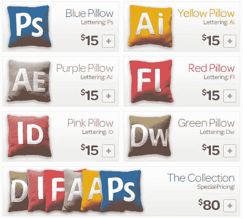
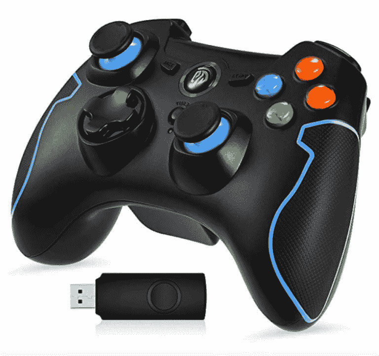
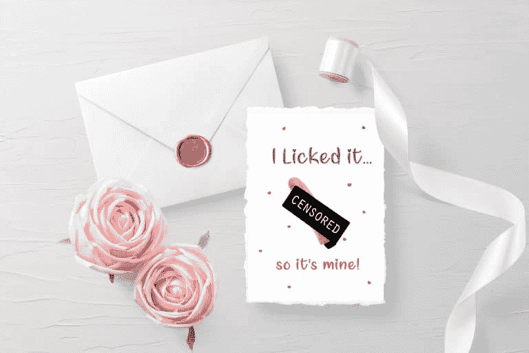
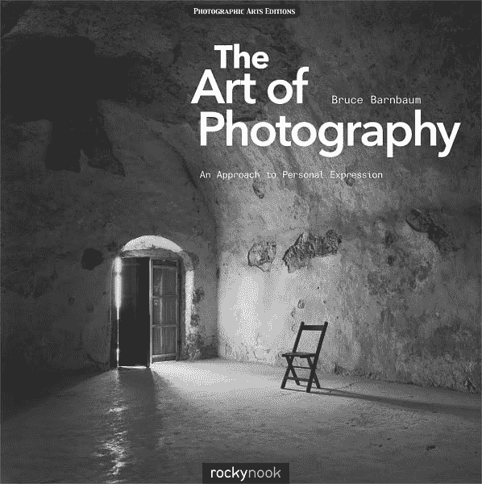
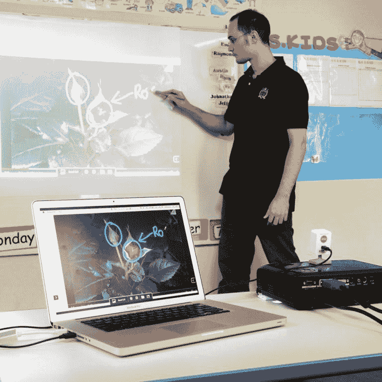
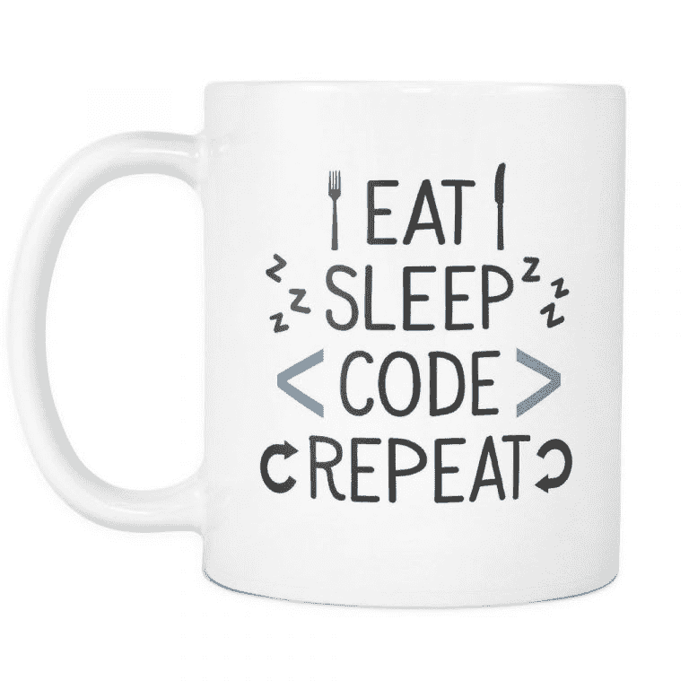

# 如何为你的极客朋友找到完美的礼物

> 原文：<https://dev.to/lana_miro/how-to-find-the-perfect-gifts-for-your-geeky-friends-ob6>

找到你送礼物的人真正喜欢的生日礼物实际上是一件大事。你可能认识这个人很久了，但还是会给他们一些他们可能不会欣赏的东西。由于人们通常对几乎所有东西都有不同的品味，用礼物取悦你的朋友可能是一个真正的挑战。

与此同时，如果你知道你的朋友肯定会喜欢什么，找到完美的礼物也可能是容易的，快速的，有趣的，令人兴奋的。幸运的是，今天我们将为平面设计师、系统管理员、营销人员、摄影师、书呆子以及程序员挑选一些最好的礼物，以便找出适合他们的完美礼物。所以如果你有一些极客朋友，你肯定不想错过。

MasterBundles 是一个在线平台，为客户提供优质的设计包，并发布一些关于各种主题的真正有用且相当有趣的文章。当然，他们有几篇文章展示了给 IT 专家的最佳礼物，其中你可能会发现给你心爱的极客朋友的礼物。

好吧，让我们不要浪费宝贵的时间，看看这些伟大的文章，无疑会帮助你找到你的极客朋友会爱上哪些特别的礼物。

# 60+给平面设计师的最佳礼物

[更多信息](https://masterbundles.com/gift-ideas-for-graphic-designers/)

这篇文章将帮助你更好地理解平面设计师到底是什么样的人，以及他或她最喜欢什么样的礼物。根据这篇文章，对任何平面设计师来说，最好的礼物是平板电脑、耳机、无线鼠标、扩展坞、键盘、打印机、可充电 USB 电池、数字笔、虚拟键盘、外部硬盘驱动器等设备。除此之外，平面设计师也会喜欢各种书籍和教程、装饰品、创意明信片。因此，如果你被邀请参加一个平面设计师的生日聚会，请继续阅读这篇文章

# 2019 年给系统管理员的 15+顶级礼物

 
[更多信息](https://masterbundles.com/gifts-system-administrator/)
在这篇文章中，你会发现一些给系统管理员的很酷的礼物变体。事实上，这篇文章建议的礼物包括耳机、数字闹钟、蓝牙扬声器、胡子套件、无线键盘、无线游戏控制器和智能手表。同时，系统管理员也会喜欢有搞笑题词和印花的创意 t 恤，背包，还有可爱的屏幕湿巾。所以，看看这篇文章，为您的系统管理员找到一份完美的礼物。

# 60+2020 情人节给书呆子的礼物

 
[更多信息](https://masterbundles.com/valentines-day-gifts-for-nerds/)

书呆子实际上是一个相当大的类别，包括程序员、文案、设计师和开发人员。那么这些人会喜欢什么作为礼物呢？根据这篇文章，书呆子们会喜欢虚拟现实耳机，无线智能手机充电器，智能手表，保温杯，浮动蓝牙扬声器，迷你打印机，智能手机相机镜头，电源银行，等等。此外，一张精美的明信片会使你的礼物更加完整。所以，不要过多考虑你的书呆子朋友会喜欢的礼物，看看这篇文章就能找到一个。

# 2019 年给摄影师的 120 份最佳礼物

这篇文章为像摄影师这样有创造力的人提供了一百多种很酷的礼物。事实上，文章重点介绍了以下礼品:Go Pro HERO5 相机、富士胶片 Instax Mini 8 胶片相机、宝丽来移动打印机、摄影照明套件、反光器、LED 管光棒、自拍环灯、四轴无人机，以及其他许多酷炫礼品。此外，这篇文章展示了一些伟大的摄影书籍，可能是一个真正可怕的礼物。所以，用你在这篇文章中发现的精美礼物给你的摄影师朋友一个惊喜吧。

# 2019 年营销人员的 35+礼物创意:怪异、惊人&得心应手

营销人员是那些非常清楚市场上一些受欢迎的产品被高估了的人。这就是为什么为他们寻找礼物可能真的很难。幸运的是，这篇文章将帮助你找到任何营销人员都会爱上的礼物。例如，该文章提供了诸如营销教科书、智能笔记本、扩展坞、LCD 投影仪、便携式交互式白板、创意贴纸、营销杂志、营销研讨会或讲座证书、有趣的 t 恤衫和音乐会门票等礼物。那么，为什么不用这篇文章中提到的最酷的礼物之一来让你的朋友开心呢？

# 2019 年给程序员的 20+份最佳礼物

 
[更多信息](https://masterbundles.com/gifts-for-programmers/)
程序员是相当复杂的人，他们可能有特定的礼物偏好。然而，对于阅读这篇文章的人来说，请一个有好礼物的人不是问题。这篇文章揭示了程序员的真实身份，并最终提出了他们无疑会喜欢的礼物。这些礼物包括带有有趣铭文的咖啡杯、创意水瓶、精美的笔记本电脑贴纸、popsockets、亚马逊音乐订阅、无线鼠标、无人机、咖啡机、游戏键盘、笔记本电脑等等。这篇文章提供了各种不同价格的礼物，所以你一定会为你的开发者找到一些东西。那么，不要犹豫，为你的朋友挑选最完美的礼物吧！

# 最后的想法

为任何人找到一份真正好的礼物都是一项艰巨的任务。为你的极客朋友找一份完美的礼物真是一项艰巨的任务。幸运的是，MasterBundles 有几篇文章，为几乎任何人提供了一整套很酷的礼物变体。为网页设计师找到最有创意的礼物，为系统管理员找到最有用的礼物，为书呆子找到最古怪的礼物，为摄影师找到最精致的礼物，为营销人员找到最复杂的礼物，为程序员找到最有趣的礼物。所以，继续阅读这些文章吧，为了成为那个总是给所有节日最好礼物的朋友。