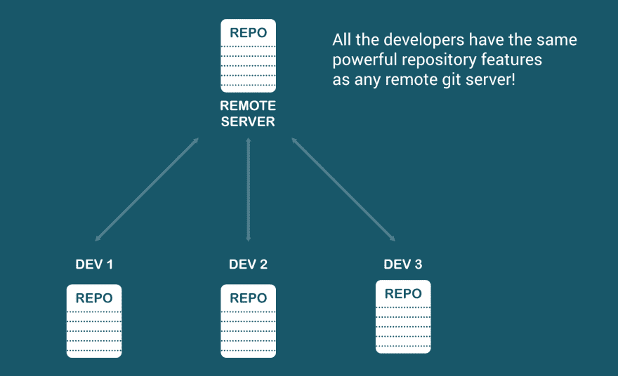
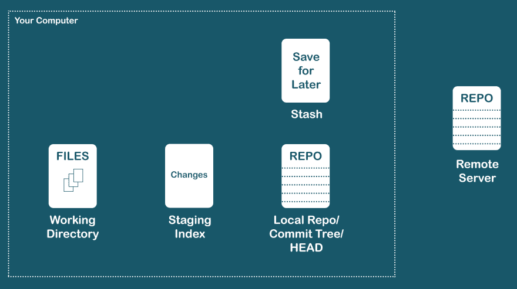
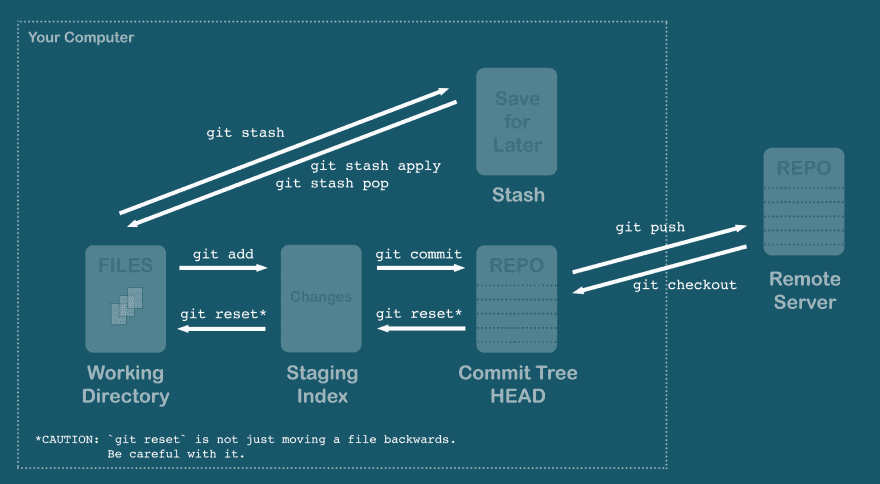
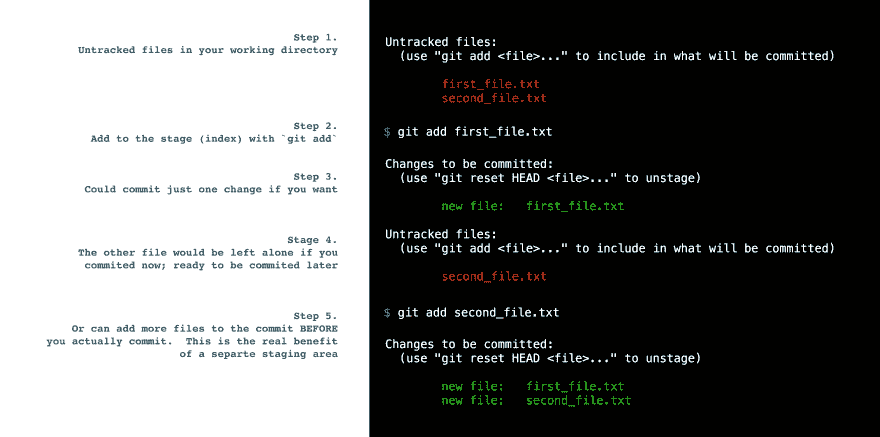
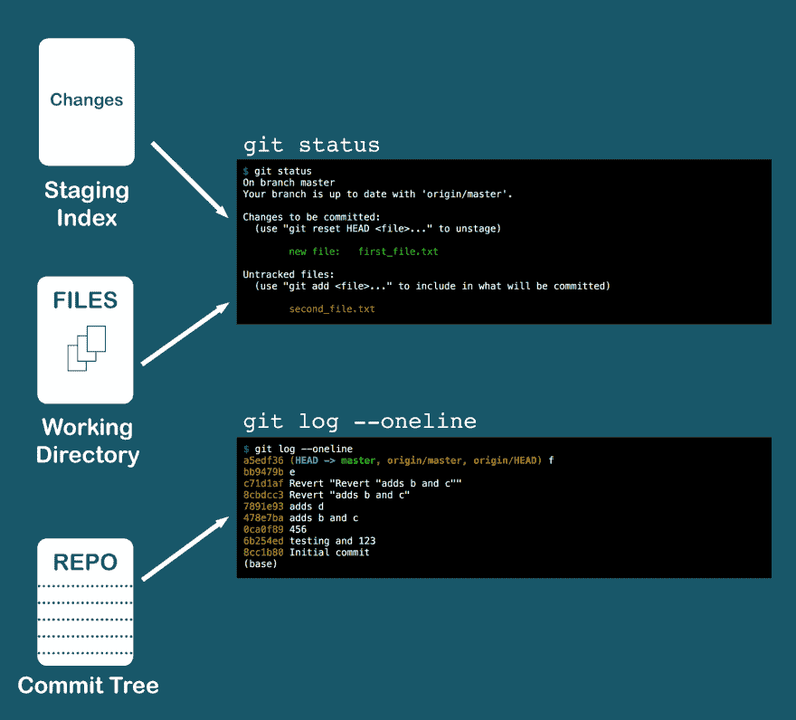
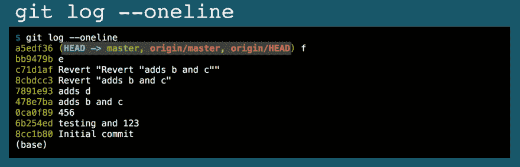
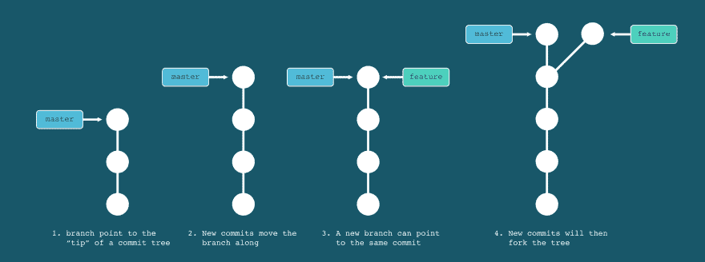
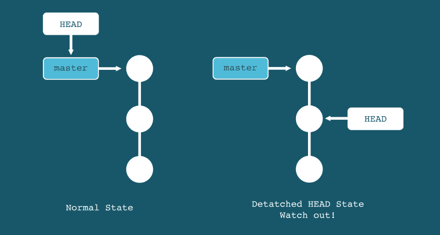

# 被 git 搞糊涂了？这里有一个 git 速成班来解决这个问题🎉

> 原文：<https://dev.to/chrisachard/confused-by-git-here-s-a-git-crash-course-to-fix-that-4cmi>

*这最初是作为 twitter 帖子发布的:*【https://twitter.com/chrisachard/status/1171124289128554498 T2】

*注意:如果你正在寻找 git 的基础介绍，我推荐你先阅读一下 Atlassian 的[本指南](https://www.atlassian.com/git/tutorials/what-is-version-control)。*

**你是否使用 git 但仍然没有真正理解它？**

这里有一个🔥git 速成班🔥来解决这个问题🎉

# 1。

Git 在您的本地计算机上为您提供了一个功能齐全的存储库

这不同于其他版本控制系统

一旦你接受了这一点，你就可以开始揭开 git“魔法”的神秘面纱了

# 2。

把文件(和更改)想象成在 5 个不同的地方，或“状态”

*   工作目录
*   暂存(索引)
*   提交树(本地回购或 HEAD)
*   隐藏物
*   远程回购(github、Bitbucket、gitlab 等)

# 3。

想象一下在这些地方之间移动文件(或更改):

`git add`工作方向= >暂存

`git commit`分期= >头

`git push` HEAD = >远程回购

`git stash`工作方向< = >藏匿点

`git reset`和`git checkout`从上游拉

# 4。

为什么要有专用的中转区？

以便您可以在提交之前选择和检查要提交的文件和更改。

# 5。

显示您的工作目录和暂存中的变化，但请将它们视为独立的事情。

`git log`显示提交本地存储库的历史

# 6。

学会爱`git log`

这是回购状态的快照:显示过去的提交以及本地头、本地分支、远程头和远程分支

`git log --oneline`是查看提交历史的简洁方式

# 7。

分支是对一行提交的顶端的引用

当向该行添加新的提交时，它会自动更新

做一个新的分支会使树在那一点分叉

# 8。

合并采用两个分支，并进行新的提交，将它们组合在一起

如果有冲突，就要手动解决(没有捷径！)

# 9。

`git rebase`允许您重写提交历史

将您当前的提交直接应用到分支机构负责人

可以将您所有的提交压缩成一个来清除历史

不要对公共(远程)提交这样做！

# 10。

有些人说，你应该只合并，以保持你的整个历史

有些人说，在合并到 master 之前，您应该总是重新设置基础，以保持一个干净的历史树

我说:做任何对你和你的团队有用的事情🤷‍♂️

# 11。

HEAD 可以指向一个分支或特定提交

如果它指向一个旧的提交，这被称为“分离的头”

在分离的 HEAD 状态下编辑是危险的(可能会丢失工作或导致工作组合问题)

# 12。

许多 git 命令可以操作任何一个:单个文件、提交或分支

这可能会造成很多混乱——所以要确保你知道你操作的是什么类型的对象

# 13。

在 git
中有很多方法可以撤销不想要的操作，以下是最常见的:

卸载文件:`git reset [file]`

更改上次本地提交:`git commit --amend`

撤消本地提交:`git reset [commit BEFORE the one to undo]`

撤消远程提交:`git revert [commit to undo]`

# 14。

我还可以谈更多的事情！

git 还有哪些让你困惑的地方？

请在下面评论，我会尽力回答或为你找到一些资源🙌

**喜欢这个速成班？**

更多信息请在 twitter 上关注我: [@chrisachard](https://twitter.com/chrisachard)

或者你可以加入简讯:[https://chrisachard.com/newsletter](https://chrisachard.com/newsletter)

*感谢阅读！*