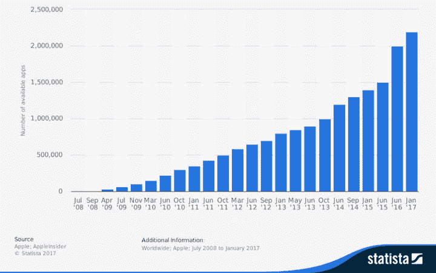
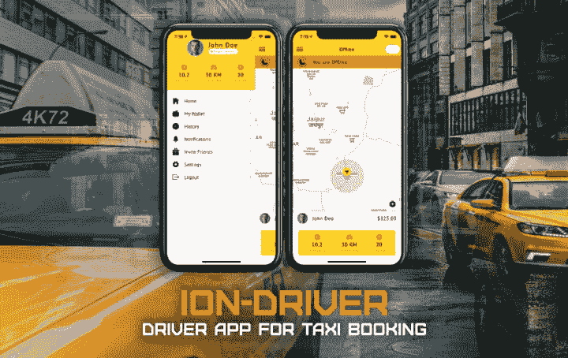

# 应用开发的未来——为什么你应该从模板中构建你的应用

> 原文:[https://dev . to/enappd/future-of-app-development-why-you-should-build-your-apps-from-templates-237 p](https://dev.to/enappd/future-of-app-development-why-you-should-build-your-apps-from-templates-237p)

* * *

模板和主题已经存在一段时间了。CodeCanyon 和 Themeforest 等在线巨头是这场竞赛的先行者，但也有许多其他模板和主题提供商。直到几年前，模板业务主要集中在网站和 Wordpress 模板上。但是现在情况很快发生了变化。2018 年夏天，移动应用生态系统，这个星球上最大的产业之一，将迎来 10 岁生日。如下图所示，谷歌和 App store 的应用程序近年来有了巨大的增长。

> 随着基于应用的创业公司越来越多，开发者必须使用模块化的方式开发应用，这种方式花费的时间和金钱最少。这就是应用程序模板的用武之地。

<figure>

<figcaption class="imageCaption">**Growth in number of apps on App store over the years**</figcaption>

</figure>

#### 什么是应用程序模板🤔

几个应用程序开发机构的集体经验表明，大多数应用程序开发是一个重复的过程。在当今这个时代，这一点尤其重要。在这个时代，人们经常会发现初创公司在打造“某样东西的优步”或“某样东西的 Instagram”。即使是不完全是克隆的应用程序，实际上也在使用类似的组件。这不可避免地要求应用程序开发过程的模块化。应用程序模板是现成的源代码(有时也称为应用程序启动器)，这为应用程序开发提供了一个良好的开端。

#### 模板值吗？😕

想象一下，你开始构建一个“优步”,你得到了现成的完整的应用程序 UI。然后，您可以将您的逻辑、产品和后端插入应用程序，并为应用程序商店做好准备。这样你可以节省大量的开发成本。

以下是使用模板进行应用程序开发的主要优势

1.  **更便宜** —您节省了数千美元的 UI 开发费用。这是一个关键阶段，大多数初创公司最终会花费大部分时间和金钱。如果你能以零头的价格买到现成的功能，从头设计一个功能是不值得的
2.  **更快** —你节省了数周(如果不是数月)的时间，否则你将花费在设计和开发你的应用程序的用户界面上。更快的上市时间通常是一个应用程序创业的关键。
3.  **保持你的团队更小** —如果你是一家早期创业公司，联合创始人不是开发人员，那么雇佣单独的开发人员进行 UI 设计，然后在不同的设备上进行 UI 开发是不明智的。使用混合应用程序(iOS 和 Android 使用相同的技术)可以解决一半的问题，但是您仍然希望有现成的模板。通过这种方式，您可以直接跳到特性集成，并保持您的团队更小
4.  **标准无 Bug**—使用好的 app 模板的最大优势之一就是标准的特性和代码结构。人们经常发现，创始团队用他们所知道的任何东西开发应用程序。这导致了一个写得很糟糕的代码(虽然可以工作)。相反，你可以用适当的标准编写现成的代码，而且大部分都没有错误。您削减了成本，节省了时间，并获得了更高质量的代码。一个人还能要求多少！

<figure>

<figcaption class="imageCaption">A template for Taxi Driver app in a Taxi Booking platform</figcaption>

</figure>

#### 限制😒

App 模板在大量情况下无疑是高效的。但是也有一定的局限性。

1.  **无限的定制可能** —因为每个初创公司都希望他们的应用略有不同，没有模板可能完全符合他们的规格。如果模板能满足你的大部分需求，那么使用它仍然是明智的。
2.  **需要集成后端** — App 模板无法为你提供现成的集成在 App 中的后端。这是因为在数据和特征上可能有无限不同的排列。此外，一个人可能有不同于其他人的后端技术选择。应用程序的 UI 和前端部分使用模板仍然没有缺点
3.  **需要发布到应用商店** —许多人期待现成的解决方案，他们可以购买并上传到商店。即使是最基本的格式，应用程序模板也需要在用户方面做一些工作来为应用程序商店做准备。对于非技术型创业者来说，这可能有点麻烦。

#### 为什么 app 模板会兴起📈

许多因素都指向应用开发中模板和应用构建器使用的增加。

1.  **增加传统企业的应用** —传统企业也在慢慢进入应用业务，即使只是为了他们的公司、商店、公司等的营销或宣传。这些类型的应用不需要复杂的功能，如地理定位、推送通知等。这类应用程序最好由应用程序模板制作，从这类网站的遗产中得到启示，这些网站也是由模板开发的。如果一家公司只是为了显示静态内容而定制应用程序，那就有点过头了。
2.  更短时间内的应用程序——应用程序也是为只发生一次的事件开发的，比如大学事件。对于这种情况，雇佣开发人员从头开始创建 UI 是一种大材小用。因此，在这种情况下，应用程序模板将会很受欢迎。
3.  每个人都想要一个应用程序——如今，即使是学校布置的作业，学生们也在制作应用程序。对于这样一个快速的周转时间，一个应用程序模板是最好的解决方案(当然模板本身不应该是你的任务！)

#### 哪里可以找到应用程序模板🔎

有很多地方可以买到现成的应用程序模板。首先，您可以浏览

*   [code canyon](https://codecanyon.net/category/mobile)&[theme forest](https://themeforest.net/)—咄
*   [Ionicmarket](https://market.ionicframework.com/) — Ionic market 是由 Ionic 混合技术开发的应用程序集合。它在最近几年有了很大的发展，这里有很多应用启动器和模板
*   [Enappd](https://enappd.com/) —一个应用程序启动器集合，包含各种 Ionic 和 React 原生应用程序，包括网飞克隆、送餐应用程序、出租车预订应用程序等。
*   Ionic themes——另一个用 Ionic 技术制作的应用程序网站
*   [NativeBase](https://market.nativebase.io/?utm_source=nativebase%26utm_medium=header%26utm_campaign=nativebase%26affiliate_code=20535682-NAT-196333) — Native base 是一个 [React Native](https://facebook.github.io/react-native/) 设计套件，但它也有自己的 React 原生应用启动器市场

有许多小团队提供他们自己的定制应用程序模板。即使是一个成熟的应用程序，你也可以放心地联系创建模板的开发团队，因为他们对这些东西了如指掌。

#### 模板是我唯一的选择吗？😨

幸好没有。🎉苹果和谷歌之前可能已经想到了所有这些方式，他们的应用程序开发包(分别是 **Xcode** 和 **Android Studio** )带有一个用户界面设计套件，具有拖放功能。最近，Ionic 也发布了他们自己的应用程序生成器，可以轻松地为应用程序构建 UI。但是对于早期的创业来说，所有这些仍然很耗时，即使有 Xcode 和 Android Studio 这样的 UI 设计套件，你也不能总是关注代码标准。

还有其他在线应用构建器，允许你以拖放的方式设计你的应用。最后，你得到了设计的源代码和最终的 APK 或 IPA。这类似于 **XCode** 和 **Android Studio** ，但是资源更少，因为你可以在网上做任何事情。在线构建器提供的选项和设计通常也非常有限，但这是开发的良好开端。一些流行的应用构建者有 [Appy Pie](https://clutch.co/app-development/profile/appy-pie) 、 [Shoutem](https://clutch.co/app-development/profile/shoutem) 、 [Ionic Creator](https://creator.ionic.io/) 、 [Bizness Apps](https://clutch.co/app-development/profile/bizness-apps) 等。

你可以阅读最初发布在[enappd.com](http://enappd.com)的完整文章

### 觉得这个帖子有意思？

还可以看看我们的其他博客帖子，这些帖子涉及 Ionic 4 中的
-[Firebase](https://medium.com/enappd/how-to-use-firebase-with-ionic-4-complete-guide-for-beginners-1888b1034024)、Ionic 4 中的
- [地理定位](https://medium.com/enappd/using-geolocation-and-beacon-plugins-in-ionic-4-754b41304007)、Ionic 4 中的
- [二维码和扫描仪](https://medium.com/enappd/qr-code-scanning-and-optical-character-recognition-ocr-in-ionic-4-95fd46be91dd)以及 Ionic 4 中的
- [支付网关](https://medium.com/enappd/payment-solutions-in-ionic-8c4bb28ce5cc)

也可以看看这个有趣的帖子[如何用 Phaser](https://medium.com/enappd/how-to-create-mobile-games-pwa-with-ionic4-and-phaser-7fb1e917678e) 在 Ionic 4 中创建游戏

### 需要免费离子 4 启动器？

你也可以在我们的网站[enappd.com](http://enappd.com)找到免费的离子 4 启动器

*   【Ionic 4 的免费聊天主题启动器
*   [游离离子 4 —燃烧基启动器](https://store.enappd.com/product/ionic4-firebase-starter/)

你也可以使用 [**Ionic 4 全应用**](https://store.enappd.com/product/ionic-4-full-app/) 制作你的下一个牛逼应用

### 参考

*   [离子文件](https://ionicframework.com/docs)