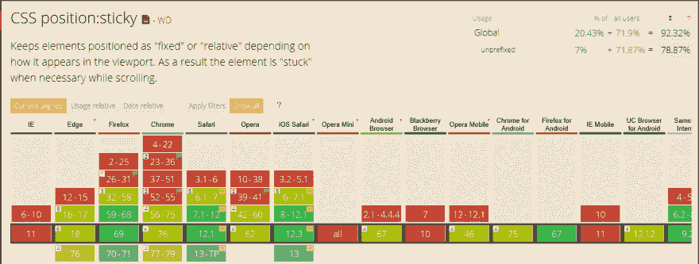

# 如何知道何时应用 CSS 位置粘性获取

> 原文:[https://dev . to/bhupendra 1011/how-to-know-when-CSS-position-sticky-get-s-applied-4gk 2](https://dev.to/bhupendra1011/how-to-know-when-css-position-sticky-get-s-applied-4gk2)

当我们向下滚动页面时，我们经常需要一个元素有一个位置 **sticky** 。position: sticky 可以被认为是 position: relative 和 position: fixed 的组合，一个元素保持在相对位置，直到一个点，然后改变到固定位置。

```
.sticky {
  position: -webkit-sticky;  /* for safari */
  position: sticky;
  top: 0px;
} 
```

上面的元素将在相对位置，直到它从顶部 0px，之后，它改变到位置:固定。

在 sticky position 之前，有一个 JS 解决方案来实现上述行为，这将需要滚动事件监听器

### [](#support-for-position-sticky)支持位置粘性:

[T2】](https://res.cloudinary.com/practicaldev/image/fetch/s--OlGZXosj--/c_limit%2Cf_auto%2Cfl_progressive%2Cq_auto%2Cw_880/https://thepracticaldev.s3.amazonaws.com/i/kbdg7pwoto1z0px8087d.PNG)

IE 和之前版本的 Edge 浏览器不支持粘性位置，可以使用 [stickyfill](https://github.com/wilddeer/stickyfill) polyfill 解决。

### [](#know-when-an-element-gets-sticky-position-)知道一个元素什么时候得到粘性位置:

当元素获得粘性位置时，CSS position sticky 不提供事件，可能有许多用例，如当元素获得粘性位置时改变样式，当用户滚动页面时，将浮动 TOC 小部件更新到当前部分，等等..

[交集观察 API](https://developer.mozilla.org/en-US/docs/Web/API/Intersection_Observer_API) 是一个 Web API，它有助于在某些 DOM 元素彼此“交集”时触发回调。Intersection API 异步监视目标元素与其他元素的交集，这比向滚动事件添加回调具有性能优势。IE 对这个 API 有一个[聚合填充](https://polyfill.io/v3/polyfill.min.js?features=IntersectionObserver)。

* * *

### [](#example-)举例:

[https://codepen.io/bhupendra1011/embed/GRKxWMM?height=600&default-tab=js,result&embed-version=2](https://codepen.io/bhupendra1011/embed/GRKxWMM?height=600&default-tab=js,result&embed-version=2)

☝代码显示一个元素在滚动时得到一个固定的位置。修复后，CSS 类会添加到元素中，该元素会改变其背景颜色并更新图标。当粘性位置被移除时，该类被移除。

* * *