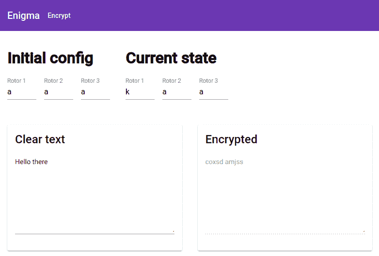

# 构建一个只有 TypeScript 的 Enigma 机器，然后使用 Angular DI 系统正确地实例化它

> 原文：<https://dev.to/maxime1992/building-an-enigma-machine-with-only-typescript-and-then-use-angular-di-system-to-properly-instantiate-it-2e2h>

这篇博客是三篇系列文章的第二篇，叫做**“谜:理解它，实现它，破解它”**:

*   1 - [英格玛机，著名的加密装置是如何工作的？](https://dev.to/maxime1992/enigma-machine-how-does-the-famous-encryption-device-work-5aon)

*   **2 -建立一个只有打字稿的 Enigma 机器，然后使用 Angular DI 系统正确实例化它*【本帖】***

*   3 - [使用 web worker API 从 Enigma 暴力破解加密消息](https://dev.to/maxime1992/brute-forcing-an-encrypted-message-from-enigma-using-the-web-worker-api-166b)

# 目录

*   [简介](#intro)
*   [1 -谜库](#1-enigma-library)
    *   [A 反射器](#a-reflector)
    *   [B 转子](#b-rotor)
    *   [C 机](#c-machine)
*   [2 -英格玛应用](#2-enigma-app)
    *   [A -显示初始配置转子和当前转子](#a-display-the-initial-config-rotors-and-current-ones)
    *   [B -加密来自应用程序的消息](#b-encrypt-a-message-from-the-app)
    *   [B1 -逻辑和模板](#b1-logic-and-template)
    *   [B2——使用依赖注入创建一个英格玛机](#b2-create-an-enigma-machine-using-dependency-injection)
*   [结论](#conclusion)
*   [发现错别字？](#found-a-typo)

如果您发现任何打字错误，请在此自行编辑:[https://github . com/maxime 1992/my-dev . to/blob/master/blog-posts/enigma-part-2/enigma-part-2 . MD](https://github.com/maxime1992/my-dev.to/blob/master/blog-posts/enigma-part-2/enigma-part-2.md)并提交一个拉取请求👌

# [T1】简介](#intro)

在本系列的第一篇博文中，我们已经看到了 Enigma 的内部机制。在这一篇中，我将解释我是如何决定实现它的。

我构建的 Enigma 库与 Angular 无关，它只是**纯打字稿**。背后的原因是:

*   它不应该放在第一位，因为它可以作为一个单独的包与 vanilla JS 或任何其他框架一起使用
*   [⚠️剧透提醒⚠️]为了破解 Enigma，在本系列的下一篇博文中，我们将使用一个 [web worker](https://developer.mozilla.org/en-US/docs/Web/API/Web_Workers_API) ，在 worker 上下文中从 Angular 导入任何东西都会破解它，因为它根本不知道 DOM

酪对于棱角分明的恋人，不用再担心了。我们将使用 Angular，尤其是它的依赖注入 API 来构建使用 Enigma 库的 UI。

**注意:**为了正确管理潜在的错误，库做了一些检查(对反射器，转子等)。代码示例中跳过了这些检查，以使主要逻辑尽可能小。在这种情况下，我添加了一个注释“`// [skipped] and the reason`”，但可以在这里随意查看完整的源代码:[https://github . com/maxime 1992/my-dev . to/tree/master/libs/enigma/enigma-machine](https://github.com/maxime1992/my-dev.to/tree/master/libs/enigma/enigma-machine)

# 1 -谜库

为了制造机器，我们将自下而上，也就是说从反射镜开始，然后是转子，最后是机器本身。

## A -反射器

提醒:反射器是一个简单的地图，其中一个索引与另一个索引相连。

多个反射器可用，所以首先要做的是能够设置反射器配置。如果我们取名为“宽 B”的反射体:`yruhqsldpxngokmiebfzcwvjat`表示`A`(索引`0`)映射到`Y`(索引`24`)等等。因此，当有人在 Enigma 上输入一个字母时，它会通过 3 个转子，在最后一个转子之后，会通过反射器。转子输入可能在`0`和`25`之间的任何指数，我们希望能够以简单的方式找到相应的输出:

```
export class ReflectorService {
  private reflectorConfig: number[] = [];

  constructor(reflectorConfig: string) {
    this.setReflectorConfig(reflectorConfig);
  }

  private setReflectorConfig(reflectorConfig: string): void {
    // [skipped] check that the reflector config is valid

    this.reflectorConfig = this.mapLetterToAbsoluteIndexInAlphabet(reflectorConfigSplit);

    // [skipped] check that every entry of the reflector maps to a different one
  }

  private mapLetterToAbsoluteIndexInAlphabet(alphabet: Alphabet): number[] {
    return alphabet.reduce((map: number[], letter: Letter, index: number) => {
      map[index] = getLetterIndexInAlphabet(letter);

      return map;
    }, []);
  }

  // ...
} 
```

既然我们已经将字符串重新映射到一个数组，这个数组允许我们找到给定输入的输出索引，我们需要公开一个方法，这样机器本身就能够遍历给定索引的转子:

```
public goThroughFromRelativeIndex(index: number): number {
  return this.reflectorConfig[index];
} 
```

正如您所看到的，实现反射器是一项非常简单的任务。现在让我们来看看转子。

## B 型转子

*提醒:转子由两个用电线连接在一起的圆盘组成。因此，对于给定的输入指数，输出可以与输入相同(与反射器相反)。*

对于给定的转子，我们用字母表示转子的配置，就像我们对反射器所做的那样。例如，第一个转子具有以下配置:`ekmflgdqvzntowyhxuspaibrcj`。由于转子会旋转，我发现通过**相对指数**来思考和处理它比用字母思考要容易得多。

例如，对于上面的配置，我们可以表示如下:

```
a   b   c   d   ...  w   x   y   z   Alphabet...
|   |   |   |   ...  |   |   |   |   is remapped to...
e   k   m   f   ...  b   r   c   j   a new alphabet

But internally we want is as:

0   1   2   3   ...  22  23  24  25
|   |   |   |   ...  |   |   |   |
+4  +9  +10 +2  ...  +5  +20 +4  +10 
```

```
export class EnigmaRotorService {
  private rotor: BiMap;
  private currentRingPosition = 0;

  constructor(rotorConfig: string, currentRingPosition: number = LetterIndex.A) {
    const rotorConfigSplit: string[] = rotorConfig.split('');

    // [skipped] check that the string is correctly mapping to alphabet

    this.rotor = createBiMapFromAlphabet(rotorConfigSplit);

    this.setCurrentRingPosition(currentRingPosition);
  }

  public setCurrentRingPosition(ringPosition: number): void {
    // [skipped] check that the ring position is correct

    this.currentRingPosition = ringPosition;
  }

  public getCurrentRingPosition(): number {
    return this.currentRingPosition;
  }

  // ...
} 
```

上面的实现看起来相对较小，但是它的功能是什么呢？它是负责从字符串到具有相对索引的 bi 映射的函数。此处使用 bi 图的原因是，我们希望能够从**左到右**和**右到左**穿过转子。这里的挑战是，我们不希望在任何时候都必须处理负指数。所以如果转子的当前位置是`Z`，相对输入是`0`，我们知道`Z --> J`与`index 25 --> +10`等价。相反，当从右向左时，如果我们在字母`J`(索引`10`)上，它将映射到`Z`，而不是`-10`而是`+17`。下面是实现:

```
export const createBiMapFromAlphabet = (alphabet: Alphabet): BiMap => {
  return alphabet.reduce(
    (map: BiMap, letter: Letter, index: number) => {
      const letterIndex: number = getLetterIndexInAlphabet(letter);
      map.leftToRight[index] = moduloWithPositiveOrNegative(ALPHABET.length, letterIndex - index);
      map.rightToLeft[letterIndex] = moduloWithPositiveOrNegative(ALPHABET.length, -(letterIndex - index));

      return map;
    },
    { leftToRight: [], rightToLeft: [] } as BiMap,
  );
}; 
```

现在，我们为转子的公共 API 留下了 3 样东西:

*   能够得到当前的位置
*   能够从左到右穿过转子
*   能够从右向左穿过转子

```
public getCurrentRingPosition(): number {
  return this.currentRingPosition;
}

private goThroughRotor(
  from: 'left' | 'right',
  relativeIndexInput: number
): number {
  const currentRelativeIndexOutput = this.rotor[
    from === 'left' ? 'leftToRight' : 'rightToLeft'
  ][(this.currentRingPosition + relativeIndexInput) % ALPHABET.length];

  return (relativeIndexInput + currentRelativeIndexOutput) % ALPHABET.length;
}

public goThroughRotorLeftToRight(relativeIndexInput: number): number {
  return this.goThroughRotor('left', relativeIndexInput);
}

public goThroughRotorRightToLeft(relativeIndexInput: number): number {
  return this.goThroughRotor('right', relativeIndexInput);
} 
```

库的最后剩余部分:机器本身！

## C -机

机器指挥管弦乐队，让信息的所有字母通过转子/反射器/转子，并在需要时旋转转子。它有一个公共 API 来获取/设置转子的初始状态，获取转子的当前状态并加密/解密消息。

让我们先看看如何跟踪转子的内部状态(初始和当前状态):

```
interface EnigmaMachineState {
  initialStateRotors: RotorsStateInternalApi;
  currentStateRotors: RotorsStateInternalApi;
}

export class EnigmaMachineService {
  private readonly state$: BehaviorSubject<EnigmaMachineState>;

  private readonly initialStateRotorsInternalApi$: Observable<
    RotorsStateInternalApi
  >;
  private readonly currentStateRotorsInternalApi$: Observable<
    RotorsStateInternalApi
  >;

  public readonly initialStateRotors$: Observable<RotorsState>;
  public readonly currentStateRotors$: Observable<RotorsState>;

  // ... 
```

在这个类中使用`Redux`可能有点大材小用，但是重用这些概念感觉很棒。我们用一个`BehaviorSubject`来保存整个状态，这个状态是**不可变的**。更容易调试，更容易共享为可观测量，这也将有助于性能，让我们设置我们所有的组件到`ChangeDetectionStrategy.OnPush`🔥。

我通常喜欢直接设置所有的属性，但是在我们的例子中，在设置它们之前，我们希望确保传递的属性是正确的，并且我们在构造函数中进行检查+赋值:

```
export class EnigmaMachineService {
  // ...
  constructor(private enigmaRotorServices: EnigmaRotorService[], private reflectorService: ReflectorService) {
    // [skipped] check that the rotor services are correctly defined

    // instantiating from the constructor as we need to check first
    // that the `enigmaRotorService` instances are correct
    const initialStateRotors: RotorsStateInternalApi = this.enigmaRotorServices.map(enigmaRotorService =>
      enigmaRotorService.getCurrentRingPosition(),
    ) as RotorsStateInternalApi;

    this.state$ = new BehaviorSubject({
      initialStateRotors,
      currentStateRotors: initialStateRotors,
    });

    this.initialStateRotorsInternalApi$ = this.state$.pipe(
      select(state => state.initialStateRotors),
      shareReplay({ bufferSize: 1, refCount: true }),
    );
    this.currentStateRotorsInternalApi$ = this.state$.pipe(
      select(state => state.currentStateRotors),
      shareReplay({ bufferSize: 1, refCount: true }),
    );

    this.initialStateRotors$ = this.initialStateRotorsInternalApi$.pipe(
      map(this.mapInternalToPublic),
      shareReplay({ bufferSize: 1, refCount: true }),
    );
    this.currentStateRotors$ = this.currentStateRotorsInternalApi$.pipe(
      map(this.mapInternalToPublic),
      shareReplay({ bufferSize: 1, refCount: true }),
    );

    this.currentStateRotorsInternalApi$
      .pipe(
        tap(currentStateRotors =>
          this.enigmaRotorServices.forEach((rotorService, index) =>
            rotorService.setCurrentRingPosition(currentStateRotors[index]),
          ),
        ),
        takeUntilDestroyed(this),
      )
      .subscribe();
  }
  // ...
} 
```

上面的代码中需要注意的几件事:

所有我们暴露为可观察的属性都是从我们的存储中被驱动出来的(真理的唯一来源)。每次当前状态改变时，我们相应地设置转子位置。我们还以两种不同的方式跟踪转子的初始状态和当前状态:一种是`internal`，另一种不是。对我们来说，处理索引比处理字母(内部的)更容易，但是当我们公开它们(例如在 UI 中显示)时，我们不想让消费者知道`18`代表`s`，我们只是返回`s`。

上面代码中另一个有趣的部分是参数`{ bufferSize: 1, refCount: true }`与`shareReplay`的用法。这将允许我们分享我们的观察，而不是多次重复订阅它们👍。使用`shareReplay(1)`可能会奏效，但会相当危险，就好像没人再听它不会退订的可观察信号一样。这就是为什么我们需要通过`refCount`成为`true`。

现在我们已经看到了如何与应用程序的其他部分共享我们的 Enigma 机器的状态，让我们看看应用程序的主要部分是如何工作的:通过机器对一封信进行编码:

```
export class EnigmaMachineService {
  // ...
  private readonly encodeLetterThroughMachine: (letter: Letter) => Letter = flow(
    // the input is always emitting the signal of a letter
    // at the same position so this one is absolute
    getLetterIndexInAlphabet,
    this.goThroughRotorsLeftToRight,
    this.goThroughReflector,
    this.goThroughRotorsRightToLeft,
    getLetterFromIndexInAlphabet,
  );
  // ...
} 
```

那是...它？是啊！差不多吧。

在上面的代码中，`flow`将按顺序运行所有这些函数，并将前一个函数的结果传递给下一个函数，这在这种情况下非常好，因为输入(键盘)的结果传递给第一个转子，第一个转子的结果传递给第二个转子，依此类推。

整洁，对不对？

```
export class EnigmaMachineService {
  // ...

  private encryptLetter(letter: Letter): Letter {
    // [skipped] check that the letter is valid

    // clicking on a key of the machine will trigger the rotation
    // of the rotors so it has to be made first
    this.goToNextRotorCombination();

    return this.encodeLetterThroughMachine(letter);
  }

  public encryptMessage(message: string): string {
    this.resetCurrentStateRotorsToInitialState();

    return message
      .toLowerCase()
      .split('')
      .map(letter =>
        // enigma only deals with the letters from the alphabet
        // but in this demo, typing all spaces with an "X" would
        // be slightly annoying so devianting from original a bit
        letter === '  ' ? '  ' : this.encryptLetter(letter as Letter),
      )
      .join('');
  }

  private resetCurrentStateRotorsToInitialState(): void {
    const state: EnigmaMachineState = this.state$.getValue();

    this.state$.next({
      ...state,
      currentStateRotors: [...state.initialStateRotors] as RotorsStateInternalApi,
    });
  }

  private goToNextRotorCombination(): void {
    const state: EnigmaMachineState = this.state$.getValue();

    this.state$.next({
      ...state,
      currentStateRotors: goToNextRotorCombination(state.currentStateRotors),
    });
  }

  private goThroughRotorsLeftToRight(relativeInputIndex: number): number {
    return this.enigmaRotorServices.reduce(
      (relativeInputIndexTmp, rotorService) => rotorService.goThroughRotorLeftToRight(relativeInputIndexTmp),
      relativeInputIndex,
    );
  }

  private goThroughRotorsRightToLeft(relativeInputIndex: number): number {
    return this.enigmaRotorServices.reduceRight(
      (relativeInputIndexTmp, rotorService) => rotorService.goThroughRotorRightToLeft(relativeInputIndexTmp),
      relativeInputIndex,
    );
  }

  private goThroughReflector(relativeInputIndex: number): number {
    return this.reflectorService.goThroughFromRelativeIndex(relativeInputIndex);
  }

  public setInitialRotorConfig(initialStateRotors: RotorsState): void {
    const state: EnigmaMachineState = this.state$.getValue();

    this.state$.next({
      ...state,
      initialStateRotors: initialStateRotors.map(rotorState =>
        getLetterIndexInAlphabet(rotorState),
      ) as RotorsStateInternalApi,
    });
  }
} 
```

在上面的代码中，最重要的位是:

*   `encryptLetter`先调用`goToNextRotorCombination`，再调用`encodeLetterThroughMachine`。这是机器上发生的事情，每次按下一个键，转子首先旋转，然后我们得到新字母的路径
*   当调用`encryptMessage`时，我们也调用`resetCurrentStateRotorsToInitialState`,因为该方法通过将字符串分割成字符并在每个字符上调用`encryptLetter`来模拟每一次击键(这使得转子在每个字母上向前移动)
*   `resetCurrentStateRotorsToInitialState`、`goToNextRotorCombination`和`setInitialRotorConfig`以不可变的方式更新状态
*   `goThroughRotorsLeftToRight`和`goThroughRotorsRightToLeft`分别使用`reduce`和`reduceRight`从左向右和从右向左穿过转子。在这里使用`reduce*`感觉很“自然”,因为我们通过传递前一个输出来从一个转子进入下一个转子

我们现在已经用一个公共 API 建立了一个 Enigma 库，应该可以让我们以简单的方式加密/解密消息。现在让我们来看看应用程序本身。

# 2 -英格玛 app

现在的目标是构建以下内容:

[](https://res.cloudinary.com/practicaldev/image/fetch/s---WHy38VD--/c_limit%2Cf_auto%2Cfl_progressive%2Cq_auto%2Cw_880/https://raw.githubusercontent.com/maxime1992/my-dev.to/master/blog-posts/enigma-part-2/assets/encrypt-page.png)

我们希望拥有:

*   一个初始配置，在这里我们可以设置英格玛应该启动的转子
*   转子的另一个显示，但这次是当前状态。每次输入新字母时，当前状态都会更新以显示新的组合
*   左边是要加密/解密的文本(输入)，右边是输出

## A -显示初始配置转子和当前转子

我们可以看到初始配置和当前状态是相同的，因此我们将有一个包含 3 个字母的共享组件。

我已经决定使用 [ngx 子表单](https://github.com/cloudnc/ngx-sub-form)来构建这个组件。如果你对这个库感兴趣，你可以阅读更多关于 Github 项目本身和我以前的一篇文章:[https://dev . to/maxime 1992/building-scalable-robust-and-type-safe-forms-with-angular-3n F9](https://dev.to/maxime1992/building-scalable-robust-and-type-safe-forms-with-angular-3nf9)

`rotors-form.component.ts`

```
interface RotorsForm {
  rotors: RotorsState;
}

@Component({
  selector: 'app-rotors-form',
  templateUrl: './rotors-form.component.html',
  styleUrls: ['./rotors-form.component.scss'],
  changeDetection: ChangeDetectionStrategy.OnPush,
})
export class RotorsFormComponent extends NgxAutomaticRootFormComponent<RotorsState, RotorsForm>
  implements NgxFormWithArrayControls<RotorsForm> {
  @DataInput()
  @Input('rotors')
  public dataInput: RotorsState | null | undefined;

  @Output('rotorsUpdate')
  public dataOutput: EventEmitter<RotorsState> = new EventEmitter();

  protected emitInitialValueOnInit = false;

  protected getFormControls(): Controls<RotorsForm> {
    return {
      rotors: new FormArray([]),
    };
  }

  protected transformToFormGroup(letters: RotorsState | null): RotorsForm {
    return {
      rotors: letters ? letters : [Letter.A, Letter.A, Letter.A],
    };
  }

  protected transformFromFormGroup(formValue: RotorsForm): RotorsState | null {
    return formValue.rotors;
  }

  protected getFormGroupControlOptions(): FormGroupOptions<RotorsForm> {
    return {
      validators: [
        formGroup => {
          if (
            !formGroup.value.rotors ||
            !Array.isArray(formGroup.value.rotors) ||
            formGroup.value.rotors.length !== NB_ROTORS_REQUIRED
          ) {
            return {
              rotorsError: true,
            };
          }

          return null;
        },
      ],
    };
  }

  public createFormArrayControl(
    key: ArrayPropertyKey<RotorsForm> | undefined,
    value: ArrayPropertyValue<RotorsForm>,
  ): FormControl {
    switch (key) {
      case 'rotors':
        return new FormControl(value, [Validators.required, containsOnlyAlphabetLetters({ acceptSpace: false })]);
      default:
        return new FormControl(value);
    }
  }
} 
```

当使用`ngx-sub-form`时，我们能够向父组件提供数据，而不需要它知道任何关于表单的信息。在上面的例子中，我们使用了`rotorsUpdate`输出。在内部，我们通过一个`formGroup`来管理一切。视图也保持简单(并且是类型安全的！):

```
<div [formGroup]="formGroup">
  <ng-container [formArrayName]="formControlNames.rotors">
    <span *ngFor="let rotor of formGroupControls.rotors.controls; let index = index">
      <mat-form-field>
        <input matInput [placeholder]="'Rotor ' + (index + 1)" [formControl]="rotor" maxlength="1" />
      </mat-form-field>
    </span>
  </ng-container>
</div> 
```

现在，在`rotors-initial-config`上，我们必须从机器中检索初始配置，并在需要时更新该状态:

`rotors-initial-config.component.ts`

```
@Component({
  selector: 'app-rotors-initial-config',
  templateUrl: './rotors-initial-config.component.html',
  styleUrls: ['./rotors-initial-config.component.scss'],
  changeDetection: ChangeDetectionStrategy.OnPush,
})
export class RotorsInitialConfigComponent {
  constructor(private enigmaMachineService: EnigmaMachineService) {}

  public initialStateRotors$: Observable<RotorsState> = this.enigmaMachineService.initialStateRotors$;

  public rotorsUpdate(rotorsConfiguration: RotorsState): void {
    // [skipped] check that the config is valid

    this.enigmaMachineService.setInitialRotorConfig(rotorsConfiguration);
  }
} 
```

视图简单如:

```
<app-rotors-form
  *ngIf="(initialStateRotors$ | async) as initialStateRotors"
  [rotors]="initialStateRotors"
  (rotorsUpdate)="rotorsUpdate($event)"
></app-rotors-form> 
```

对于目前的状态，就更简单了。我们只需要从机器中检索当前状态。

`rotors-current-state.component.ts`

```
@Component({
  selector: 'app-rotors-current-state',
  templateUrl: './rotors-current-state.component.html',
  styleUrls: ['./rotors-current-state.component.scss'],
  changeDetection: ChangeDetectionStrategy.OnPush,
})
export class RotorsCurrentStateComponent {
  constructor(private enigmaMachineService: EnigmaMachineService) {}

  public currentStateRotors$: Observable<RotorsState> = this.enigmaMachineService.currentStateRotors$;
} 
```

## B -加密来自应用程序的消息

现在我们已经能够显示转子的状态，让我们开始这个应用程序最重要的部分:信息的加密🙌！

### B1 -逻辑和模板

为了让例子尽可能的简洁，我决定在下面的代码中删除所有与角度相关的内容，只保留对理解逻辑重要的内容。

为了得到类似于前面截图的东西，我们想要显示转子的初始配置、当前状态、一个文本区用于显示将通过 Enigma 的文本，另一个文本区(禁用)将显示来自 Enigma 的输出。

这是我们的模板:

```
<h1>Initial config</h1>
<app-rotors-initial-config></app-rotors-initial-config>

<h1>Current state</h1>
<app-rotors-current-state></app-rotors-current-state>

<textarea [formControl]="clearTextControl"></textarea>

<div *ngIf="clearTextControl.hasError('invalidMessage')">
  Please only use a-z letters
</div>

<textarea disabled [value]="encryptedText$ | async"></textarea> 
```

上面的代码没有什么神奇或复杂的地方，但是让我们看看我们现在要如何实现这个逻辑:

```
@Component({
  selector: 'app-encrypt',
  templateUrl: './encrypt.component.html',
  styleUrls: ['./encrypt.component.scss'],
  providers: [...DEFAULT_ENIGMA_MACHINE_PROVIDERS],
  changeDetection: ChangeDetectionStrategy.OnPush,
})
export class EncryptComponent {
  private initialStateRotors$: Observable<RotorsState> = this.enigmaMachineService.initialStateRotors$;

  public clearTextControl: FormControl = new FormControl('', containsOnlyAlphabetLetters({ acceptSpace: true }));

  private readonly clearTextValue$: Observable<string> = this.clearTextControl.valueChanges;

  public encryptedText$ = combineLatest([
    this.clearTextValue$.pipe(
      sampleTime(10),
      distinctUntilChanged(),
      filter(() => this.clearTextControl.valid),
    ),
    this.initialStateRotors$,
  ]).pipe(map(([text]) => this.enigmaMachineService.encryptMessage(text)));

  constructor(private enigmaMachineService: EnigmaMachineService) {}
} 
```

*看到线`providers: [...DEFAULT_ENIGMA_MACHINE_PROVIDERS]`了吗？我们将在下一节回到这一点！*

首先要注意的是，除了注入的服务和`FormControl`，所有东西都是一个流。让我们花时间来分解每一个属性。

绑定包含转子初始状态的可观测值:

```
private initialStateRotors$: Observable<RotorsState> = this.enigmaMachineService.initialStateRotors$; 
```

创建一个`FormControl`来将值绑定到视图中，并使用一个定制的验证器来确保使用的字母是有效的。这将防止我们向 Enigma 传递无效字符:

```
public clearTextControl: FormControl = new FormControl(
  '',
  containsOnlyAlphabetLetters({ acceptSpace: true })
); 
```

最后，为给定的消息准备一个表示 Enigma 输出的可观察值。输出可能因以下两个因素而异:

*   输入文本
*   初始转子状态

```
public encryptedText$ = combineLatest([
  this.clearTextValue$.pipe(
    sampleTime(10),
    distinctUntilChanged(),
    filter(() => this.clearTextControl.valid)
  ),
  this.initialStateRotors$
]).pipe(map(([text]) => this.enigmaMachineService.encryptMessage(text))); 
```

所以我们使用`combineLatest`操作符来确保当任何流被更新时，我们用新的文本和/或新的初始状态再次加密消息。

### B2——使用依赖注入创建一台英格玛机

我在文章开头提到，我们将使用 Angular 提供的依赖注入机制。我在上一部分中也提到过，我们将回到组件上定义的行:

```
providers: [...DEFAULT_ENIGMA_MACHINE_PROVIDERS]; 
```

现在是一个很好的时机，因为应用程序几乎准备好了，最后缺少的部分只是创建一个英格玛机。我们不是在模块级别提供服务，而是在组件级别提供服务，这样，如果我们想让多个实例同时处理多个消息，我们就可以做到。

还记得`EnigmaMachineService`把什么作为参数吗？这里有点帮助:

```
constructor(
  private enigmaRotorServices: EnigmaRotorService[],
  private reflectorService: ReflectorService
) 
```

为了在我们的`EncryptComponent`中创建一个服务实例，我们可以手动创建一个`ReflectorService`，手动创建 3 个`EnigmaRotorService`，并通过提供我们刚刚创建的内容作为参数来手动创建一个`EnigmaMachineService`。让我们看看那会是什么样子:

```
const reflectorService: ReflectorService = new ReflectorService();

const enigmaRotorService1: EnigmaRotorService = new EnigmaRotorService();
const enigmaRotorService2: EnigmaRotorService = new EnigmaRotorService();
const enigmaRotorService3: EnigmaRotorService = new EnigmaRotorService();

const enigmaMachineService: EnigmaMachineService = new EnigmaMachineService(
  [enigmaRotorService1, enigmaRotorService2, enigmaRotorService3],
  reflectorService,
); 
```

但是...

*   那责任应该归`EncryptComponent`吗？
*   例如，我们以后如何用模拟数据来测试`EncryptComponent`？
*   如果我们希望能够在组件的基础上定制转子和反射器呢？
*   如果我们希望能够在组件的基础上添加或删除转子呢？

以上这些都很难实现。另一方面，如果我们使用依赖注入，那就相当简单了。想法是:让其他人负责创建这些服务，同时仍然能够在`providers`级别定制我们如何创建它们。

所以我们最终想要的只是要求 Angular 通过依赖注入给我们一个`EnigmaMachineService`的实例:

```
export class EncryptComponent {
  // ...
  constructor(private enigmaMachineService: EnigmaMachineService) {}
  // ...
} 
```

但是坚持住。这怎么可能呢？我们的`EnigmaMachineService`是一个简单的类，我们没有`@Injectable()`装饰器。因此，我们不能像通常那样，将服务指定到提供者数组中，然后通过构造函数注入它。Angular DI 系统掩护了我们👌。

让我们仔细看看下面一行:

```
providers: [...DEFAULT_ENIGMA_MACHINE_PROVIDERS]; 
```

下面是`DEFAULT_ENIGMA_MACHINE_PROVIDERS`常数:

```
export const ROTORS: InjectionToken<EnigmaRotorService[]> = new InjectionToken<
  EnigmaRotorService[]
>('EnigmaRotorServices');

export const getReflectorService = (reflector: string) => {
  return () => new ReflectorService(reflector);
};

export const getRotorService = (rotor: string) => {
  return () => new EnigmaRotorService(rotor);
};

export const getEnigmaMachineService = (
  rotorServices: EnigmaRotorService[],
  reflectorService: ReflectorService
) => {
  return new EnigmaMachineService(rotorServices, reflectorService);
};

export const DEFAULT_ENIGMA_MACHINE_PROVIDERS: (
  | Provider
  | FactoryProvider)[] = [
  {
    provide: ROTORS,
    multi: true,
    useFactory: getRotorService((`ekmflgdqvzntowyhxuspaibrcj`)
  },
  {
    provide: ROTORS,
    multi: true,
    useFactory: getRotorService(`ajdksiruxblhwtmcqgznpyfvoe`)
  },
  {
    provide: ROTORS,
    multi: true,
    useFactory: getRotorService(`fvpjiaoyedrzxwgctkuqsbnmhl`)
  },
  {
    provide: ReflectorService,
    useFactory: getReflectorService('yruhqsldpxngokmiebfzcwvjat')
  },
  {
    provide: EnigmaMachineService,
    deps: [ROTORS, ReflectorService],
    useFactory: getEnigmaMachineService
  }
]; 
```

有太多东西需要消化😱！再一次，让我们一点一点地分解它。

我们要做的第一件事是创建一个[注入令牌](https://angular.io/api/core/InjectionToken)，它将代表我们要使用的转子阵列:

```
export const ROTORS: InjectionToken<EnigmaRotorService[]> = new InjectionToken<EnigmaRotorService[]>(
  'EnigmaRotorServices',
); 
```

然后，我们创建将被用作`factories`的函数。这意味着它们将被用来创建实例(在这种情况下，是类的实例):

```
export const getReflectorService = (reflector: string) => {
  return () => new ReflectorService(reflector);
};

export const getRotorService = (rotor: string) => {
  return () => new EnigmaRotorService(rotor);
};

export const getEnigmaMachineService = (rotorServices: EnigmaRotorService[], reflectorService: ReflectorService) => {
  return new EnigmaMachineService(rotorServices, reflectorService);
}; 
```

我们需要工厂的原因是因为我们将要创建的所有类都需要参数，并且我们没有在这些类上使用`@Injectable`装饰器。所以 Angular 不能为我们神奇地实例化它们，我们需要自己去做。

之后，我们创建一个数组，该数组将被组件的`providers`属性使用，它将包含服务。让我们从 3 个转子的创建开始:

```
[
  {
    provide: ROTORS,
    multi: true,
    useFactory: getRotorService((`ekmflgdqvzntowyhxuspaibrcj`)
  },
  {
    provide: ROTORS,
    multi: true,
    useFactory: getRotorService(`ajdksiruxblhwtmcqgznpyfvoe`)
  },
  {
    provide: ROTORS,
    multi: true,
    useFactory: getRotorService(`fvpjiaoyedrzxwgctkuqsbnmhl`)
  },
  // ...
] 
```

使用 Angular DI 系统，我们可以传递一个用`@Injectable`装饰器装饰的服务，或者传递一个更具体的对象。你可以在这里了解更多 Angular 的 DI 系统:[https://angular.io/guide/dependency-injection](https://angular.io/guide/dependency-injection)

在这种情况下，有趣的部分是我们使用了`multi`和`useFactory`属性。上面的代码说:“在`ROTORS`令牌阵列中注册我给你的每一个转子”。由于有了`multi: true`属性，现在它将是一个数组，而不是一个单独的值。然后，我们使用之前定义的工厂，将转子配置作为参数传递。

然后我们得到了`ReflectorService`，它没有什么特别的:

```
[
  // ...
  {
    provide: ReflectorService,
    useFactory: getReflectorService('yruhqsldpxngokmiebfzcwvjat'),
  },
  // ...
]; 
```

最后，`EnigmaMachineService`将传递给工厂一些参数:新制造的转子和反射器:

```
 // ...
  {
    provide: EnigmaMachineService,
    deps: [ROTORS, ReflectorService],
    useFactory: getEnigmaMachineService
  },
  // ... 
```

通过`deps`属性，我们让 Angular 知道当调用`getEnigmaMachineService`时，它必须提供那些依赖关系。

最后但并非最不重要的一点，我想让你注意这样一个事实，即工厂返回一个负责创建类的函数，而不是直接返回一个类的实例。为什么？因为它将利用这样一个事实，即只有在需要时才需要创建服务，而不是在此之前。示例:在模块的`providers`数组中定义服务不会创建服务。只有当组件或其他服务需要时，服务才会被实例化。

# 结论

在这篇博文中，我们看到了一个在二战期间使用真实机器的 TypeScript 来发送秘密消息的可能实现。我们还看到了如何通过 angular 提供的依赖注入机制，在我们的 Angular 应用程序中恰当地使用非 Angular 库。

我在构建 Enigma 库和 Angular 应用程序的过程中获得了很多乐趣，我希望在阅读这篇博文时也能获得一些乐趣！😄我很高兴看到 Enigma 的另一个实现，所以如果你想建立自己的版本，请在评论区告诉我👇。

该系列的下一篇也是最后一篇文章将是关于**在不知道浏览器**中转子初始位置的情况下破解来自 Enigma 的加密信息。

敬请关注，感谢阅读！

# 发现错别字？

如果你在这篇博文中发现了一个错别字、一个可以改进的句子或者任何其他应该更新的内容，你可以通过 git 存储库访问它，并发出一个 pull 请求。请不要发表评论，直接前往[https://github.com/maxime1992/my-dev.to](https://github.com/maxime1992/my-dev.to)并打开一个包含您所做更改的新拉动式请求。