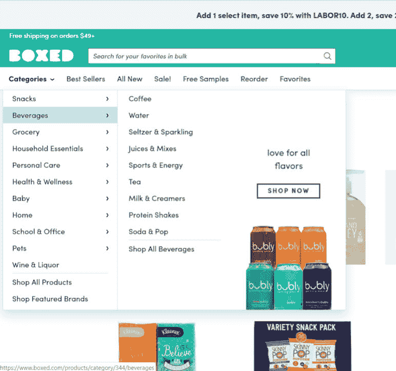
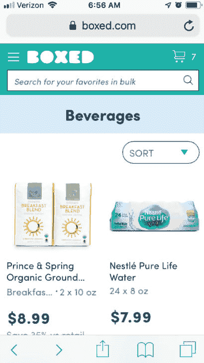
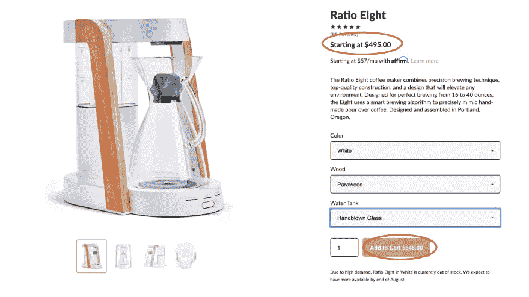

# 电子商务网站设计:漂亮、实用的销售网站

> 原文:[https://dev . to/ramotion dev/ecommerce-website-design-beautiful-usable-web-sites-that-sell-32ba](https://dev.to/ramotiondev/ecommerce-website-design-beautiful-usable-web-sites-that-sell-32ba)

## 电子商务网页设计有什么特别之处？

电子商务网站最终需要执行销售交易。一个伟大的电子商务网站需要做的不仅仅是购物车。你的网站需要在设计和可用性上有竞争力，而你的商店必须在选择和价格上有竞争力。你的网站不仅仅是一个店面，还是一个教育网站，一个潜在的社交媒体网站，也是你的品牌/公司的代表。

这篇文章将帮助你考虑你的电子商务网站的设计和可用性问题，并确定自己动手的方法是否适合你(想想 Shopify)，或者雇佣一个经验丰富的网站设计工作室是否能更好地满足你的需求。[去一家中介公司](https://www.ramotion.com/agency/web-design/)了解一下他们做什么以及他们能提供什么帮助。

## 品牌和个性

你的网上商店应该以各种方式反映你的品牌个性，从配色方案到内容语调。其中一个主要功能是营销网站，特别是如果你唯一的销售渠道是你的网站。有经验的代理可以帮助你建立你的品牌，并持续有效地应用到你的网站上。

网上购物者有很多选择。一个独特的品牌可以通过取悦潜在客户来帮助你脱颖而出。说他们的语言，使用明亮的颜色，保持网站简洁明快。

## 导航、搜索和分类

电子商务网站在很大程度上依赖于客户能够找到并选择他们想要或需要的产品。尼尔森/诺曼集团称，“我们研究中的参与者表示，在网上购物时，他们感到焦虑，不知所措……”

你销售的产品越多，拥有强大的导航和搜索选项就越重要。例如，不常见商品提供了多种导航选项。他们想确保如果你没有特定的产品，你仍然可以购买。下面的例子显示了 uncommongoods.com 如何帮助你浏览礼物。他们对自己的产品采用复杂的分类法，允许他们为不同的场合、价格或接受者提出建议。

[T2】](https://res.cloudinary.com/practicaldev/image/fetch/s--g-KixmXm--/c_limit%2Cf_auto%2Cfl_progressive%2Cq_auto%2Cw_880/https://thepracticaldev.s3.amazonaws.com/i/l02glkynzrpiazq53444.jpg)

###### 图 1:UncommonGoods.com

如果你提供多种格式或频道，你应该考虑移动版本和应用程序的导航选项。Boxed.com 为类别和子类别提供嵌套导航，如图所示。但是，当您浏览他们的移动网站时，您可以导航到类别，但不能导航到子类别。

[T2】](https://res.cloudinary.com/practicaldev/image/fetch/s--M9kVvOIL--/c_limit%2Cf_auto%2Cfl_progressive%2Cq_auto%2Cw_880/https://thepracticaldev.s3.amazonaws.com/i/ng0xf2vn8pah8q9yi8pf.jpg)

###### 图 2:Boxed.com-完整站点

[T2】](https://res.cloudinary.com/practicaldev/image/fetch/s--1Pn1qjFS--/c_limit%2Cf_auto%2Cfl_progressive%2Cq_auto%2Cw_880/https://thepracticaldev.s3.amazonaws.com/i/v63ra3ajztdha8rud3yk.jpg)

###### 图 3:Boxed.com 移动

## 产品页面

一旦你的客户发现潜在的产品，他们想要尽可能多的信息。他们需要能够比较和查看产品，就像亲自查看一样，并且能够轻松地看到所有可用的选项。图像应该清晰明了。提供多种视图和缩放选项。当用户选择不同的购买选项时，你应该考虑更新图片。

如果像价格这样的重要信息根据选择而变化，它应该是非常清楚的。下面的例子在主要信息中显示了基本价格，但是在购买按钮中隐藏了更新的价格，很难阅读。

[T2】](https://res.cloudinary.com/practicaldev/image/fetch/s--JpWaPfFW--/c_limit%2Cf_auto%2Cfl_progressive%2Cq_auto%2Cw_880/https://thepracticaldev.s3.amazonaws.com/i/lnpmqeaf5fh3onlckv35.png)

###### 图 4:咖啡的比例

与语调一样，为按钮或任何“行动号召”选择的文本也需要仔细考虑。Hubspot 建议为已知用户定制 CTA。但是，您应该避免在用户经常浏览的文本中嵌入价格等动态内容。保持常见的在线模式有助于快速移动的用户，所以像“添加到购物车”这样的简单文本效果最好。

许多在线零售商都包含分享和评论等社交元素。这有助于客户比较产品，对他们的选择充满信心，并有助于推广您的网站/产品。产品页面上的相关商品或“经常一起购买”推荐可以帮助增加总购买量。

## 购物车

小型零售商选择开箱即用解决方案的最大原因之一是能够轻松设置购物车和采购流程。但是，您的客户群可能需要独特的选项。例如，Nielsen / Norman group 建议，如果您计划进行国际运输，应包括在其他国家更广泛使用的支付选项。

你的购物车应该是容易和显而易见的。未能关注你的销售漏斗的用户体验会导致销售损失。功能需要包括一个简单的方法来修改数量，查看运输选项，添加折扣代码，并输入支付选项。保持简洁，最好是一页纸。并不是所有的顾客都想建立一个长的个人资料或账户来快速购物，允许顾客结账时不提供他们的生活故事。

## 摘要

无论你决定使用电子商务平台还是聘请设计机构来创建你的网站，你都希望遵循可用性和营销方面的最佳实践，以确保你吸引并留住你的客户。让他们灵活，易于导航，并有一个简短的结帐过程，以确保您将他们留在您的网站上，并在未来购买时返回。