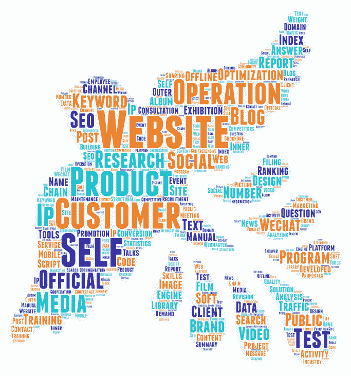

# That is, state service (StaaS) and social network.

> [https://dev . to/丹麦语 001/staas-2c6p](https://dev.to/tanmer001/staas-2c6p)

[T2】](https://res.cloudinary.com/practicaldev/image/fetch/s--OkVUQrcE--/c_limit%2Cf_auto%2Cfl_progressive%2Cq_auto%2Cw_880/https://thepracticaldev.s3.amazonaws.com/i/8ruuoali1q30y44gnl5b.png)

### 寻求地位的猴子

"It is a universally accepted truth that a person with a small amount of wealth must lack more social capital."

So, Jane Austen wrote, or she thought, if she recorded our present age (instead, we have Taylor Lorenz and thank God).

Let's start with two principles:

* Man is a status-seeking monkey.

People seek the most effective way to maximize social capital.

* Status-Seeking Monkey will also be the name of my independent band, if I learn to play guitar and start a band.

I start with these two human observations, because few people will dispute them, but I rarely see social networks, some of the largest and fastest-growing companies in the history of the world, analyzing their status or social capital.

This is partly a measurement problem. Numbers provide legitimacy and credibility. We have a long-term way to calculate and measure financial capital and its flow. The whole website, newspaper section and a large number of organizations will accurately report the price and change of currency.

We have no such method to measure the value and flow of social capital, at least in terms of accuracy or precision. The main body of research is broad and meager. If we had a better measure besides the number of users, this work and many other contents would be full of charts and graphs, adding a sense of wisdom to the analysis. There will be some annual reports called "Social State" that are similar to Meeker's Internet Trend Report, or maybe a 50-page subsection of her annual report.

Nevertheless, the social capital generated by most social media networks we study far exceeds the actual financial capital, especially in the early stage; Almost all of these companies have internalized a popular truth in Silicon Valley, that is, in the early days, companies should delay revenue generation and adopt rapid network expansion instead. Society has a lot to say about why social networks lose heat, stall, and sometimes even disappear completely. Moreover, although we may not be able to quantify social capital, as highly coordinated social creatures, we can feel it.

In many ways, social capital is the main indicator of financial capital, so its nature is subject to stricter scrutiny. It is not only a good investment or business practice, but also the analysis of social capital dynamics can help explain various online behaviors, otherwise these behaviors seem unreasonable.

In the past few years, analytical software as a service (SaaS) business has made great progress. Not so much on social networks. Before Paul Romer's thesis on endogenous technological change, the analysis of social network still made me feel like the theory of economic growth. However, if we regard them as SaaS businesses, we can begin to unravel the mystery of social networks, but they provide status, not software. This article deeply explores what I call state as a service (StaaS) business.

Think of this article as a series of strong assumptions; If you can't access data types that I'm not even sure exist, it's hard to be sure. As usual, my wisdom readers will be added or delayed as usual.

### Traditional network effect model of social network

One of the basic lessons of successful social networks is that when there are few users, they must attract people first. Usually, this is done through some form of single-user utility.

This is a classic social cold start problem. The answer to the traditional egg question can actually be answered: first a chicken, then another chicken, then another chicken, and so on. The reason why the problem is more difficult is why the first chicken came here when there were no other chickens, and why other chickens followed.

The second basic lesson is that social networks must have strong network effects, so that as more and more users join, the network enters the flywheel of positive growth. The compound value of positive network effects leads to the growth of hockey sticks, making the dollar sign possible. The eyes of investors and employees. Chris Chris Dixon wrote, "Come for this tool and stay in the network" is perhaps the most memorable motto.

Even before social networking, we formulated Metcalfe's Law on telecommunications networks:

The value of telecommunications is directly proportional to the square of the number of users connected to the system (n 2).

This is completely transplanted to social networks. It is intuitive, and it includes attractive mathematical formulas that explain why the growth curve of social networks bends sharply at the ankle of the classic growth S curve.

But digging deeper and leaving many problems. Why do some large social networks suddenly disappear or lose to new small networks? Why can't some new social networks with excellent single-player tools be transformed into networks, while others with seemingly boring purposes have made a leap forward? Why do some networks sometimes lose value when adding more users? What determines why different networks fail with different user groups? Why do some networks easily cross international borders, while others are locked in specific countries? Why, if Metcalfe's law is established, the cloning of many other social networking functions of Facebook fails, while some succeed, such as Instagram stories?

Many of these explanations are explained together by the social capital theory. How we analyze social networks should include studying the accumulation of social capital assets by social networks and the nature and structure of their state games. In other words, how do these companies intentionally or unintentionally take advantage of the fact that people seek status as monkeys and always try to seek more things in the most effective way?

In Nicki Minaj's words, "If I'm fake, I won't notice because my followers aren't."